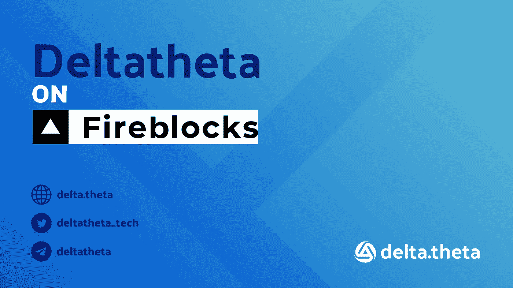

# 关于防火砖的 delta.theta:“用你过去的方式交易波动”

> 原文：<https://medium.com/coinmonks/delta-theta-on-fireblocks-trade-volatility-the-way-you-used-to-55ea0857d16b?source=collection_archive---------45----------------------->

delta.theta 如何用 Fireblocks 为加密期权市场上的机构客户创造足够的价值？

delta.theta 首席执行官 Danil Zatologin:我们为交易者推出了期权协议。任何交易者都可以用传统的方式交易波动最大的传统期权。由于 Fireblocks，我们可以向机构客户提供我们的协议。

**客户端**。δθ-分散选项协议。通过 delta.theta，你可以用任何代币买卖美式期权。δθ支持以太坊、BSC 和多边形网络。

**挑战**

加密货币期权是 DeFi 内部最热门的趋势之一，近年来，DeFi 在创造新产品和解决方案方面取得了重大飞跃。但是这些解决方案对传统交易者和机构客户有多大用处和相关性呢？

交易商希望交易加密货币的期权，因为这个市场的波动性很大，相应地，与传统市场相比，这是获得更高回报的好机会。然而，当面对现有的协议时，他们不了解其创新程度:在大多数现有的分散平台上，没有单独出售期权的完全可能性，没有发出限价单的可能性，没有对所出售期权的安全性和流动性的完全交易者控制。

**解决方案**

Delta.theta 是一种期权协议，其结合了分布式分类帐在交易基础设施方面的所有优点，并且其逻辑以简单和直接的方式为传统交易者和机构客户构建:

*   美式期权
*   你可以买卖期权
*   非托管运行机制。用户直接通过 web3 钱包与平台的智能合约进行交互，无需使用任何内部账户。Deltatheta 无法获得交易者的资金
*   您可以在任何成交、到期日和溢价时下单限价和市价单
*   订单/流动性进入订单簿。不需要将交易令牌化或将资金发送到集合流动性池
*   只能销售完全覆盖的期权
*   内置永久性流动性激励计划(LIP)的可用性。该计划提供了通过对分散贷款协议内出售的期权进行抵押来产生额外回报的可能性(并非对所有资产类别都有效)。
*   除了 BTC 和瑞士联邦理工学院之外，美国运输部、AAVE、BNB、wMatic、EGLD、DLTA 和 HAPI 目前也可以交易。可以在 3 小时内添加新令牌
*   delta.theta 平台支持三大区块链的交易:以太坊、BSC 和 Polygon
*   场外交易台→[https://t.me/deltatheta_TradingGroup](https://t.me/deltatheta_TradingGroup)
*   所有交易在相关区块链(以太坊、BSC 或 Polygon)内的链上进行
*   3 项审核通过

有了 delta.theta，任何交易者都可以像以前一样在 crypto 中交易最不稳定的工具。借助 Fireblocks，我们能够为机构客户提供简单而独特的协议。

“像以前一样交易波动”

> 加入 Coinmonks [电报频道](https://t.me/coincodecap)和 [Youtube 频道](https://www.youtube.com/c/coinmonks/videos)了解加密交易和投资

# 另外，阅读

*   [阿联酋 5 大最佳加密交易所](https://coincodecap.com/best-crypto-exchanges-in-uae) | [SimpleSwap 点评](https://coincodecap.com/simpleswap-review)
*   购买 Dogecoin 的 7 种最佳方式
*   [最佳期货交易信号](https://coincodecap.com/futures-trading-signals) | [流动性交易所评论](https://coincodecap.com/liquid-exchange-review)
*   [火币加密交易信号](https://coincodecap.com/huobi-crypto-trading-signals) | [Swapzone 审查](/coinmonks/swapzone-review-crypto-exchange-data-aggregator-e0ad78e55ed7)
*   最佳[密码交易机器人](https://coincodecap.com/best-crypto-trading-bots) | [购买索拉纳](https://coincodecap.com/buy-solana) | [矩阵导出评论](https://coincodecap.com/matrixport-review)