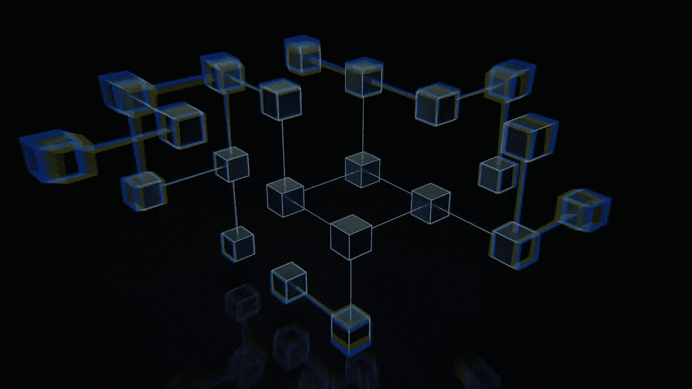

# 区块链的民主化——权力下放意味着什么

> 原文：<https://medium.com/coinmonks/democratization-of-the-blockchain-what-decentralization-is-all-about-91bcdc2fe9b1?source=collection_archive---------26----------------------->

Blockchain

当你听到“区块链”这个词时，根据你对这个概念的了解程度，你可能会想到[“比特币”](https://en.m.wikipedia.org/wiki/Bitcoin)或者“去中心化”如果这是你的回答，你不会错，但后者会更合适。

区块链如今更受欢迎，因为它已经与某种形式的中央集权独立联系在一起。

区块链确保您可以直接完成交易和处理数据，而无需第三方的帮助或影响。

很明显，区块链的 [USP](https://en.m.wikipedia.org/wiki/Unique_selling_proposition) 就是它的分权；没有一个权力机构能够控制或影响发生在它身上的事情。

然而，由于这些交易的合法性仍然需要被验证，因此必须有某人、某事或某个权威机构继续验证区块链上的交易。

我们刚才说区块链不受任何人控制，那么发生了什么变化呢？人们是否仍然需要批准或验证旨在不受控制的区块链交易？如果人们仍能影响区块链，他们难道不能操纵数据吗？

你可能会开始怀疑到底发生了什么。不要太麻烦，我保证区块链的分权概念非常简单，随着你的进步，你会发现这一点。

去中心化的想法是，更多的人可以参与数据验证，就像在民主系统中一样，而不是简单地由一个单一的权威机构来决定如何表示数据。

区块链仍处于初级阶段，因此我们将继续使用这种“人工验证”的方法，直到有一种不同的方法在没有任何人工输入的情况下验证区块链上的交易(我不知道这是否会发生以及何时发生)。

重要的是要记住，虽然中央集权机构通常只有一个控制机构，拥有大部分权力和决策权，但区块链上的权力是由多个人/多台计算机共享的([节点](https://coinmarketcap.com/alexandria/article/what-is-a-node))。这样，完整性得到验证，分散性得以保留。你可能想对区块链提出的去中心化提出质疑，但至少有理由断言，来自全球各地的一群不相关的个人将比一个完全控制所有数据并有能力根据需要修改数据的单一机构更准确、更诚实地核实数据。

建立一种方法来确保合法数据保持有效并排除无效数据是至关重要的，因为我们不能仅仅依靠“信任随机个体”来构建跨越金融、教育、技术甚至医疗行业的计划/区块链项目共识机制是核实区块链数据的过程。

Consensus mechanisms

区块链上的数据完整性通过共识机制得到保证。虽然已经引入了许多共识机制，但只有两个真正脱颖而出，成为使用最广泛的机制。这些共识机制是“工作证明”和“利益证明”共识机制。

在区块链上验证数据的第一种方法是工作证明共识机制。这是比特币使用的数据验证技术。这需要矿工(验证数据的人)解决复杂的数学问题的能力，第一个解决这些问题的人将赢得验证区块中数据的权利。使用这种方法来验证数据是非常昂贵的，因为它需要来自[矿工](https://intellipaat.com/blog/tutorial/blockchain-tutorial/what-is-bitcoin-mining/)的大量计算能力。任何错误地验证数据的人都会被验证系统开除，并没收他们花在计算能力上的钱。即使有 51%的 T2 攻击，攻击者也不会得到足够的回报。你可能会同意这种系统会让分权保持活力，因为一个理智的人不想失去他们的投资。

利益一致的证明与工作一致的证明略有不同。要成为一个验证者，你必须做一些事情，顾名思义。在验证加密货币的交易的情况下，利益一致机制的证明将要求验证者对该加密货币的一些数量进行利益相关，以便具有验证其交易的选项。被选择验证交易的可能性是随机确定的，并且个人验证者对加密货币下注越多，这种可能性就越大。在错误验证的情况下，验证者可能会失去他的加密货币。

目前使用的所有其他共识方法都要求挖掘器或验证器在成为节点之前在网络中有某种利害关系。这是为了确保区块链的真正有效性。如果他们参与适当的数据验证，他们会得到补偿，考虑到他们可能已经投入的金钱和时间，这通常代表着可观的投资回报(ROI)。

如果你已经做到了这一步，可以肯定地说，区块链是有效民主的，因为它需要几个链参与者的贡献才能保持运作。这种去中心化可以为我们实现更多，我们将在未来探索它们。

> 加入 Coinmonks [电报频道](https://t.me/coincodecap)和 [Youtube 频道](https://www.youtube.com/c/coinmonks/videos)了解加密交易和投资

# 另外，阅读

*   [Bookmap 点评](https://coincodecap.com/bookmap-review-2021-best-trading-software) | [美国 5 大最佳加密交易所](https://coincodecap.com/crypto-exchange-usa)
*   [加密交易机器人](/coinmonks/crypto-trading-bot-c2ffce8acb2a) | [硬币门评论](https://coincodecap.com/coingate-review)
*   最佳加密[硬件钱包](/coinmonks/hardware-wallets-dfa1211730c6) | [Bitbns 评论](/coinmonks/bitbns-review-38256a07e161)
*   [新加坡十大最佳加密交易所](https://coincodecap.com/crypto-exchange-in-singapore) | [购买 AXS](https://coincodecap.com/buy-axs-token)
*   [红狗赌场评论](https://coincodecap.com/red-dog-casino-review) | [Swyftx 评论](https://coincodecap.com/swyftx-review)
*   [投资印度的最佳密码](https://coincodecap.com/best-crypto-to-invest-in-india-in-2021)|[WazirX P2P](https://coincodecap.com/wazirx-p2p)|[Hi Dollar Review](https://coincodecap.com/hi-dollar-review)