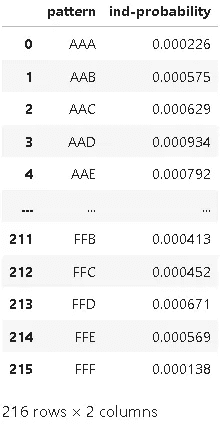

# 揭秘市场模式 SP500，EDA，贝叶斯引擎，密码学等等

> 原文：<https://medium.com/coinmonks/demystifying-market-patterns-sp500-eda-bayes-engine-cryptography-and-much-more-9e70968de34b?source=collection_archive---------3----------------------->


# 要处理的主题

*   下载 S&P500 的历史价格
*   探索性数据分析
*   字符串编码模式、组合分析、过滤和优化。
*   正态分布:价格范围的计算
*   链式生成器类
*   S&P500 模式概率分析导论
*   独立随机事件的概率链
*   相依事件链的条件概率和贝叶斯定理
*   贝叶斯引擎:开发启发式和统计引擎
*   S&P500 经典图案和烛台分析
*   定论

# 介绍

下面的研究旨在对市场模式进行频率主义和贝叶斯分析，这些经常在文章中被提及，在互联网上被认为有利可图的交易系统中被提及，甚至在这方面的书籍中也被提及。我不想诋毁或侮辱任何人，而是想阐明这个问题，这个问题有许多“信徒”关于什么是或可能是市场，另一方面，很多人提到利用它们的特定价格模式将保证有利可图和可操作的交易，而实际发生的是另一回事。市场本质上是随机的，本研究将通过实验测试其数学本质，任何人都可以在其他市场和/或工具上进行实验，在这种情况下忽略统计工具是一个严重的错误，在我看来，这是让许多人相信这些模式的原因，好像它是静态的，必须在所有市场中重复……事实上不是这样，进行适当的分析可以看出这是如何随着各种因素(时间框架、工具、周期范围)而变化的。

# 必要的库

```
**import** pandas **as** pd
**import** numpy **as** np
**import** matplotlib.pyplot **as** plt
**import** seaborn **as** sns
```

下载市场数据

```
!pip install yfinance
```

然后

```
**import** yfinance **as** yf
```

# 下载 S&P500 的历史价格

```
*# name of the symbol by which yahoo-finance identifies the S&P500*
ticker_sp500 **=** yf**.**Ticker('^GSPC')
df_data **=** ticker_sp500**.**history(period**=**'1d', start**=**'2018-1-1', end**=**'2020-12-31')
df_data**.**drop(["Volume", "Dividends", "Stock Splits"], axis**=**1, inplace**=True**)df_data
```


# EDA —探索性数据分析

让我们直观地查看一下 S&P500 的历史价格

```
plt**.**subplots(figsize**=**(12, 4))
sns**.**lineplot(data**=**df_data, x**=**df_data**.**index, y**=**'Close')
plt**.**show()
```


在对模式序列进行分类之前，我们需要正确区分它们，为此我们将创建一个函数，该函数能够获得烛台主体大小的“增量”(由它们各自的价格形成)，这将由每个价格的最大值和最小值来确定。

Delta 是指烛台模式的差异(或距离)，在本例中是从其最小值到最大值。

**δ型函数**

```
**def** get_candle_type(price):
  **if** price["Close"] **>** price["Open"] : **return** "bullish"
  **if** price["Close"] **<** price["Open"] : **return** "bearish"
  *#if price["Close"] == price["Open"] : return "undefined"*
  **return** "undefined"

**def** set_candle_type(row):
  type_ **=** row["Type"]
  **if** type_ **is** "bullish":
    **return** row["Delta"]
  **if** type_ **is** "bearish":
    **return** **-**row["Delta"]

  **return** **None**

df_candles **=** pd**.**DataFrame()
df_candles["Delta"] **=** df_data["High"] **-** df_data["Low"]
df_candles["Type"]  **=** df_data**.**apply(**lambda** row: get_candle_type(row), axis**=**1)
df_candles["Delta"] **=** df_candles**.**apply(**lambda** row: set_candle_type(row), axis**=**1)
df_candles**.**dropna(axis**=**1)
df_candles
```


*三角洲分布*

```
plt**.**subplots(figsize**=**(9,5))
sns**.**histplot(df_candles["Delta"])
plt**.**show()
```


*用图表检查哪种情绪主导市场；看涨还是看跌？*

```
sns**.**countplot(data**=**df_candles, x**=**'Type')
plt**.**show()
```


*离群值*

```
plt**.**subplots(figsize**=**(9, 4))
sns**.**boxplot(data**=**df_candles["Delta"], orient**=**'h', color**=**'white')
sns**.**swarmplot(data**=**df_candles["Delta"], size**=**3, orient**=**'h', color**=**'blue')
plt**.**show()
```


*我们来分析一下分布的相关数据。*

```
total_candles **=** df_candles**.**shape[0]
bullish_candles **=** df_candles["Type"][df_candles["Type"]**==**'bullish']**.**count()
bearish_candles **=** total_candles **-** bullish_candles

bullish_percent **=** np**.**round(bullish_candles**/**total_candles*****100,2)
bearish_percent **=** np**.**round(bearish_candles**/**total_candles*****100,2)

pd**.**DataFrame(data**=**{
    'Mean': [df_candles["Delta"]**.**mean()],
    'Std':  [df_candles["Delta"]**.**std()],
    'Skew': [df_candles["Delta"]**.**skew()],
    'Total-bullish':[bullish_candles],
    'Bullish(%)':[np**.**round(bullish_percent,2)],
    'Total-bearish':[bearish_candles],
    'Bearish(%)':[np**.**round(bearish_percent,2)],
    }, index**=**['Info'])**.**transpose()
```


关于最引人注目的特征的结论是:

*   这些值来自准正态分布。
*   它是足够对称的。一般规则是，如果偏斜度在(-0.5，0.5)之间，则分布是准对称的。
*   异常值的存在

# 字符串中的编码模式、组合分析、过滤和优化。

现在，真正的挑战开始了，最终的目标是创建一个函数，能够在一系列烛台上生成概率，这些概率将由所分析的市场的价格频率决定。但首先我们必须问自己:我们在研究什么样的蜡烛？，我们称之为序列？，用这个词靠谱吗？，其特征是否可靠，对波动是否稳健？，有没有可能找到一种我们可以依赖的模式来进行预测？。

在我们的分析中，我们将更多地着眼于后者，也许在我们摆脱旧的观念时会加入新的观念。

**第一步:等级确定标准。**

要实现的第一个目标是生成一系列范围，告诉我们要研究的每个烛台的大小(即其主体)，通过这一点，我们打算创建一个标准，该标准能够确定根据时间序列选择什么是合适的烛台大小(这应该适用于任何时间范围内的任何资产)。 因为它们都是连续的值，所以每一个都是不同的，我们必须能够产生一系列的最小-最大区间，否则一个精确的值将不会重复两次，这是概率定律的一个性质。

此外，每个市场都有不同的动态因素(如波动性、平均历史价格等..)因此，如果条件不准确，这种分析将受到严重影响，因此，如果我们将分析扩展到过去的数据，并且上述因素由于不同的原因(危机、周期、基本面等)而发生变化，范围将因具有不同的价格分布而变化，甚至在市场本身内也是如此..).

回想一下，我们从历史市场价格形成正态分布这一事实出发，因此我们将使用标准化公式，该公式允许我们使用其均值和标准差来选择区间，我将简要解释为什么会出现这种情况，现在让我们来看看数学公式:


其中:

*   z(z 得分) :临界值，取决于分布中选择的间隔。
*   x:要清除的项，它将给出我们正在寻找的区间的数值。
*   mu:人口平均数。
*   sigma:总体的标准偏差。

为了选择 z 值，我们将查看一个预先计算的表。原因很简单，我们将提出一个恒定的区间，从这个区间开始，我们将采用不同的体型或价格增量。在这种情况下，我将采用 20%的间隔(即每个体型允许 20%的噪声或变化，这是可接受的误差)，让我们来看看这个例子中的表格片段。


也就是说，从 20%的间隔开始(如果我们看表中的红框，对应的 z 值是 0.53)，所取的连续值将根据该度量增加，对于该示例，所产生的范围将是 20%、40%、60%等。使用该公式，我们将不会依赖于固定值，由此我们将问题推广到任何市场或时间范围。

现在我们只需要选择一个停止标准，即取 20%的间隔，多少个值可以作为分布中的最大值。为此，我将使用 2.5 个标准差，因此范围的数量将由我们允许的偏差决定，如果我们增加蜡烛的范围(比如 40%)，这些数量将会减少，因为接受值更大。

**我们来写函数:**

```
*# z_critical_value = 0.53 -> valor critico del 20.194% en la tabla*
**def** get_candles_body_range(mean, std_dev, total_devs**=**2.5, z_score **=** 0.53):
  *# standarization*
  *# z = (x - mean)/ std_dev*
  *# despejamos la formula*
  x **=** z_score*****std_dev **+** mean
  *# el punto de origen es la media*
  i **=** mean
  intervals_ **=** []
  **while** i **<** std_dev*****total_devs:
    intervals_**.**append(i)
    *# nos movemos hacia la derecha de la distribucion, partiendo desde el lado derecho de la misma*
    i**+=** x

  neg_intervals **=** []
  n_intervals **=** len(intervals_)
  **for** i **in** range(n_intervals **-** 1, 0, **-**1):
    neg_intervals**.**append(**-**intervals_[i])

  **return** neg_intervals **+** intervals_

bodies **=** get_candles_body_range(df_candles["Delta"]**.**mean(), df_candles["Delta"]**.**std())
total_ranges **=** len(bodies)
print(bodies)
print("total ranges:",total_ranges)
```

*输出:*

*[-97，2956171，-73，553169632，-48，34933830934，-24，35655，-0，24，45，48。48667 . 486586866667*

可以看出，我们没有对函数进行积分以获得 z 的值，并基于此计算 X 的每次迭代，而是计算一次 20%的范围，从那里开始，X 的所有增量将是一致的(基于公式的初始值)。

与使用由 z 确定的区间(整合高斯概率函数)相比，这将为我们提供更多的范围，因为这些范围将增加到 100%，这对应于分布的右尾。按照相反的逻辑，对于分布的左尾，它们将最终为 0%(因为它们将是负值)。

需要记住的另一个重要细节是，我们分两部分计算范围；首先是肯定的，然后是否定的(对称的)，最后这些生成的列表被合并成一个包含所有范围的列表...

在可选的*价格范围计算*部分将给出更详细的解释。

正如在开始提到的，公式被清除是标准化的，用它我们得到 X(它代表一个观察值),从而确定给出我们范围的数值区间。我们还应该提到，这些可以是负面的，因为它们对应于熊市蜡烛！现在，我们需要一个函数来根据计算出的范围生成区间。

备注:*当我们完成我们的研究时，该公式将被修改以概括任何类型的区间，而无需查看预先计算的 z 表，目前我们这样做是出于学习目的。*

**区间编码**。

下一步将是对生成的范围进行编码或加密，以便以更简单的方式形成烛台模式，我将创建一个算法，该算法只为每个不同的连续值生成字母，尽管符号系统是无关紧要的。

```
**def** encrypt(bodies):
  letters **=** ['A','B','C','D','E','F','G','H','I','J','K','L','M','N','O','P','Q','R','S','T','U','V','W','X','Y','Z']

  n_letters **=** len(letters)
  n_bodies**=** len(bodies)
  i **=** 0
  idx**=** 0
  level **=** 1
  code **=** {}
  **while** idx **<** n_bodies:
    **if** i **>=** n_letters:
      i **=** 0
      level**+=** 1
    c **=** ''
    **for** _ **in** range(level):
      c**+=** letters[i]
    code[c] **=** bodies[idx]
    i**+=** 1
    idx**+=** 1

  **return** code

encripted_bodies **=** encrypt(bodies)
print(encripted_bodies)
```

*输出:*

*{'A': -97.43731612956171，' B ':-73.052175555316963，' C': -48.6670349，38309，34，' D ':-24.288894359655，' E ':-0.105406*

在这一点上，我们需要一个函数，能够将范围转换成区间，这样我们就可以形成成对的低点和高点。通过这种方式，我们将能够对它们进行置换，以创建代表不同类型烛台主体的序列，即根据我们的估计，市场可以产生的价格范围的不同组合。

从计算的角度来看，这不是一个简单的问题，事实上，它是*随重复*而变化，并且在组合学中被研究。因此，随着字符串变得越来越长，计算成本将呈指数增长，让我们理解以下内容；我们要寻找的是评估*区间或参数组合的所有现有可能性*，这是一个蛮力问题。在为这项任务编写函数之前，我们将求助于数学表达式。

**重复变化**


形式定义:*取一个集合的元素可以形成的每个元组称为一个变异。在有限集合组合学中，经常需要知道 n 个元素的元组(元组中有或没有重复元素)中的 m 个元素的集合的变化数。n 元素元组中 m 元素集合重复的变化是一组 m 元素的不同 n 元素元组的数量。*

这听起来令人困惑，但是如果我们用一个例子来评估它，它会更简单，对于我们的第一个例子，我们将寻找偶数序列(2 个元素)。我们必须记住，我们总共有 X 个由函数 **get_candles_body** 生成的可能范围(记住，如果我们使用更多的标准差，这个值就会改变，这相当于说我们取更多的区间)。然后，按照公式，我们将有以下数量的区间可能的组合:

VR(9，2) = 9 = 81。

VR(m，n)的结果将是我们可以形成的可能的两个字母元素的数量。这些将代表烛台的偶数间隔，如:{AB，AC，AB，AA，BB，…}。

为了生成这些对或区间，我将使用 itertools 库，这将节省我们的工作和代码行。我们来写函数吧。

```
**from** itertools **import** product

**def** generate_minmax_intervals(letters):
  **return** [item **for** item **in** product(letters, repeat**=**2)]

minmax_intervals **=** generate_minmax_intervals(encripted_bodies**.**keys())
print(minmax_intervals[:15])
print("total intervals:", len(minmax_intervals))
```

*输出:*

*[('A '，' A '，(' A '，' B '，(' A '，' C '，(' A '，' D '，(' A '，' E '，(' A '，' G '，(' A '，' H '，(' A '，' I ')，(' B '，' A '，' B '，(' B '，' C '，(' B '，' D '，(' B '，' E '，(' B '，' F')]
总间隔:81*

对函数的结果进行“打印”，我们将能够评估形成的偶数组合的数量，这正是我们想要的。

在继续下一步之前，我必须说我们已经有条件从数学上理解其中的原因，我将重复一些我之前已经提到过的东西；

`we need even intervals because they represent the size of the body of each candlestick pattern to be studied regardless of how many candlesticks our future pattern chains have, although we may only be interested in evaluating the number of times a particular candlestick repeats, and by doing this we will get any study to do with patterns.`

另一方面，术语“最小值和最大值”指的是允许的“误差”，即我们的烛台开始的最小值和它的最大值有界。举例来说，如果我们说蜡烛是(20，80)的形式，这可以翻译如下:它的主体可以由在 20 <= X <= 80 units, with this we infer that any continuous value between that range is allowed, as an example if a price delta has a value of 70 this would be accepted because it is within that interval, however 10 or 90 not, so it would be rejected… this seems very obvious but I wanted to emphasize it for the last time. This reasoning also applies to negative intervals which will represent bearish candlesticks.

**间隔过滤**之间变化的距离形成

在生成最终将服务于我们研究其在市场中的频率的序列或链之前，我们必须推理如下；并不是所有的区间都是有效的，尽管我们可以用公式计算出所有可能的区间，但在这种情况下，说所有区间都对我们有用是不正确的。例如，蜡烛开始的最小值永远不可能是最大值，因此如果< B a candle interval allowed would be (A,B), but it could never be (B, A) because this is meaningless…

The criteria used will be as follows:

*   If the value is positive and MIN < MAX then the interval is accepted, otherwise it will be rejected and discarded. For the negative case the logic is the inverse.
*   If the value is negative and MAX > MIN，则该值被接受，否则被拒绝。回想一下，封闭区间符号是[MIN，MAX]。此外，该函数将采用一个我们不能忘记的额外参数，即存储我们在初始步骤中所做的编码信息的字典，它包含代表每个字母的连续值。

```
**def** filter(encripted_bodies, intervals):
  intervals_ **=** []
  **for** i **in** intervals:
    min_ **=** encripted_bodies[i[0]]
    max_ **=** encripted_bodies[i[1]]
    **if** min_ **>=** 0:
      **if** min_ **>=** max_:
        **continue**
    **else**:
      **if** max_ **<=** min_:
        **continue**

    intervals_**.**append(i)
  **return** intervals_

total_intervals **=** len(minmax_intervals)
minmax_intervals **=** filter(encripted_bodies, minmax_intervals)
print(minmax_intervals)
print("total intervals:", len(minmax_intervals))
```

*输出:*

*[('A '，' B ')，(' A '，' C ')，(' A '，' D ')，(' A '，' E ')，(' A '，' G '，(' A '，' H ')，(' A '，' I '，(' B '，' C ')，(' B '，' E ')，(' B '，' F ')，(' B '，' G '，(' B '，' H ')，(' B '，' I '，' C '，' E ')，(' C*

正如我们看到的，我们的函数在 Min 和 Max 条件中包含了 equal，这是因为我们还想过滤重复区间的值，例如；(A，A)，(B，B)等等。如果两边的间隔完全相同，这与寻找具有相同值的蜡烛体是一样的，例如，如果 A = 50，我们有(A，A ),那么等价的是(50，50 ),所以在市场中寻找的蜡烛值应该完全等于该值(这相当于说没有间隔，因为最小和最大值相等，逻辑允许的误差将是 0)。在连续的范围内，这实际上是不可能的，正如概率法则所证明的那样…

让我们看看我们通过过滤函数减少了多少间隔

```
print("filtered intervals:", np**.**abs(len(minmax_intervals)**-**total_intervals))
```

*输出:滤波间隔:45*

**链条编码**。

目前，我们只生成代表蜡烛体允许范围的间隔，现在我们只需形成由我们选择的长度决定的模式(即蜡烛链)。这是计算术语中最复杂的部分，虽然我们已经注意到了这一点，但现在是时候再次重复组合学中研究的公式了。让我们看看在给定总间隔数的情况下，我们可以形成多少个可能的烛台链的公式:


让我们看看每件事的含义:

*   VR(m，n):创建的总区间，例如{AA，BA，BB，AC，CC，…}，我们在之前的分析中看到过这个公式。
*   VR(t，k):给定可用间隔总数的所有可能链。

即使我们生成的间隔组合很小，这也会变得很快并且非常昂贵，幸运的是**过滤器**功能通过仅优化最相关的值在这方面帮助了我们。如果我们不使用这个函数，字符串的实际值将是巨大的。让我们看一个简单的例子:

```
**def** calculate_total_chains(chains_len, total_ranges):
  total_intervals **=** total_ranges******2
  **return** total_intervals******chains_len

calculate_total_chains(3, 9)
```

*输出:531441*

如果我们假设我们生成 9 个价格区间，这将给我们总共 81 个可能的区间(记住指数是 2，因为区间是偶数)，这样我们就可以形成市场模式的链或序列来研究，让我们进行以下计算。

通过增加烛台序列或链的长度，我们可以形成的烛台模式的数量是:

*   如果 X_chains=2 : 81 = 6561
*   如果 X_chains=3 : 81 = 531441
*   如果 X_chains=4 : 81⁴ = 43046721
*   如果 X_chainsc=5 : 81⁵ = 3486784401

也就是说，如果我们只有 81 个价格区间(最小，最大)，并且我们想要分析一个序列或 3 个烛台模式的链，例如:{(AA，AB，BC)，(AB，AA，CC)等…}我们将得到总共 531441 个可能的组合！！！，极其贵！！！(更不用说长度为 4 和 5 的链了……)。

也就是说，如果我们没有使用**过滤器**函数优化间隔的数量，那么间隔的总数将是(I )^N_Chains，这将降低我们问题的复杂性。

**字符串生成器功能**

最后，我们能够为进一步的市场分析生成我们的字符串，对于最简单的例子，我将使用长度为 3 个模式的字符串。我们来写函数吧。

```
**def** generate_chains(intervals, chain_len):
  intervals_ **=** []
  chains **=** []
  **for** p **in** intervals:
    intervals_**.**append(str(p[0]**+**p[1]))

  **for** c **in** product(intervals_, repeat **=** chain_len):
    chains**.**append(c)
  **return** chains

chains **=** generate_chains(minmax_intervals, 3)
print(chains[:15])
print("total chains:", len(chains))
```

*输出:*

*[('AB '，' AB '，' AB '，(' AB '，' AB '，' AC ')，(' AB '，' AB '，' AD ')，(' AB '，' AB '，' AF ')，(' AB '，' AB '，' AG ')，(' AB '，' AB '，' AH ')，(' AB '，' AB '，' BC ')，(' AB '，' AB '，' BD ')，(' AB '，' AB '，' BE '，' AB '，' BF ')，(' AB '，' AB '，' AB '，' BG '，(' AB*

我们将在**链发生器课程**部分继续这项研究，在那里我们将形式化在课程中学到的概念，并添加继续我们的市场分析所必需的内容。

# 正态分布:价格范围的计算

这一节对于完成我们的研究是不必要的，有趣的是我们的函数所取的范围和区间的概念。让我们记住，毕竟这将用于组合和形成烛台区间，最终形成我们寻找的市场形态。

在上一节中，我们看到了 **get_candles_body_range** 函数，它是不完整的。现在，我们将使用 python scipy 模块来独立计算 z 得分，并对我们所取的任何区间推广我们的公式。

```
**import** scipy.stats **as** st

**def** get_candles_body_range_2(mean, std_dev, interval_percent**=**0.2, total_devs**=**2):
  *# standarization*
  *# z = (x - mean)/ std_dev*
  z_score **=** st**.**norm**.**ppf(0.5 **+** interval_percent**/**2)
  x **=** z_score*****std_dev **+** mean
  *# el punto de origen es la media*
  i **=** x
  intervals_ **=** []
  **while** i **<** std_dev*****total_devs:
    intervals_**.**append(i)
    i**+=** x

  neg_intervals **=** []
  n_intervals **=** len(intervals_)
  **for** i **in** range(n_intervals **-** 1, 0, **-**1):
    neg_intervals**.**append(**-**intervals_[i])

  **return** neg_intervals **+** intervals_

bodies **=** get_candles_body_range(df_candles["Delta"]**.**mean(), df_candles["Delta"]**.**std(), 0.2)
total_ranges **=** len(bodies)
print(bodies)
print("total ranges:",total_ranges)
```

输出:

```
[-0.10324626189983444]
total ranges: 1
```

如果我们查看该公式，我们还会观察到以下情况:

**ST . norm . PPF(0.5+*interval _ percent/2*)**

其中:

*   interval_percent/2:是我们选择的区间百分比，区间扩展将基于它的增量，它除以 2，因为分布从 0(左尾端)开始，到 1(右尾端)结束，所以如果我们选择 0.5 的区间，我们将到达分布的末端，计算将超限。
*   **0.5** 表示正态分布平均值的 z 得分(记住它被定义为 N(0，1))，所以我们从那里开始(添加我们的区间)，因为这个值的 z 是 0，这与我们分离公式时标准化分布的平均值有意义...

让我们做一个简单的测试。继续前面的例子，间隔将是 20%...

```
i **=** 0.2
x **=** 0
run **=** **True**
**while** run:
  **if** (0.5 **+** x) **>=** 1.0:
    *# nos acercamos al 1.0.*
    x**=** 0.49
    run **=** **False**
  print("z-score:{} interval-percent:{}"**.**format(st**.**norm**.**ppf(0.5 **+** x), 0.5**+**x))
  x**+=** i
```

输出:

```
z-score:0.0 interval-percent:0.5
z-score:0.5244005127080407 interval-percent:0.7
z-score:1.2815515655446004 interval-percent:0.9
z-score:2.3263478740408408 interval-percent:0.99
```

如我们所见，增量从 0.5 到 1.0(实际上我们使用了一个近似值，否则结果会是+Inf)，这些表示 20%、40%、60%等区间的 z 分数

负值的逻辑也差不多，来看看。

```
i **=** 0.2
x **=** 0.0
run **=** **True**
**while** run:
  **if** (0.5 **+** x) **<=** 0.0:
    *# nos acercamos al 0.0.*
    x**=** **-**0.49
    run **=** **False**
  print("z-score:{} interval-percent:{}"**.**format(st**.**norm**.**ppf(0.5 **+** x), 0.5 **+** x))
  x**-=** i
```

输出:

```
z-score:0.0 interval-percent:0.5
z-score:-0.5244005127080409 interval-percent:0.3
z-score:-1.2815515655446004 interval-percent:0.09999999999999998
z-score:-2.3263478740408408 interval-percent:0.010000000000000009
```

完全相同…只是区间从-20%减少到-20%并且 z 分数现在有一个负号。

# 链式生成器类

在关于*编码模式的章节中…* 我们研究并推理了所有的元素，如果我们想要在任何类型的市场中生成烛台序列或链，无论其条件或时间框架如何。我们看到了范围、区间的含义，通过编码和优化，我们最终得出了稳健的组合分析。然而，这不是全部，为了完成我们的研究，我们必须能够解码这些序列，并使用它们，以便我们可以计算这些模式在市场上的频率。

在下文中，我们将概括我们在一个类中所看到的，这个类完成了所有这些，并且还具有解码和预测功能

```
**import** scipy.stats **as** st
**from** itertools **import** product

**class** PatternsChainsGenerator:
  **def** __init__(self, df, body_interval**=**0.4, n_std**=**2):
    self**.**__x **=** **None**
    self**.**__body_ranges **=** self**.**__generate_candles_body_range(df, body_interval, n_std)
    self**.**__body_ranges_dict **=** **None**
    self**.**__body_intervals_n **=** **None**
    self**.**__chains_n **=** **None**
    self**.**__body_intervals **=** **None**
    self**.**__body_intervals_optimized **=** **None**
    self**.**__chains **=** **None**

  **def** __generate_candles_body_range(self, df, interval_percent, n_std):
    *# standarization*
    *# z = (x - mean)/ std_dev*
    **def** standarization(z_score, mean, std_dev):
      **return** z_score*****std_dev **+** mean

    mean      **=** df**.**mean()
    std_dev   **=** df**.**std()
    z_score   **=** st**.**norm**.**ppf(0.5 **+** interval_percent**/**2)
    self**.**__x  **=** standarization(z_score, mean, std_dev)
    pos_intervals_x **=** []
    x **=** 0
    **while** x **<** std_dev*****n_std:
      pos_intervals_x**.**append( x )
      x**+=** self**.**__x

    neg_intervals_x **=** []
    n_intervals **=** len(pos_intervals_x)
    **for** i **in** range(n_intervals **-** 1, 0, **-**1):
      neg_intervals_x**.**append(**-**pos_intervals_x[i])

    **return** neg_intervals_x **+** pos_intervals_x

  **def** get_interval_increment(self):
    **return** self**.**__x

  **def** __encrypt_body_ranges(self):
    letters **=** ['A','B','C','D','E','F','G','H','I','J','K','L','M','N','O','P','Q','R','S','T','U','V','W','X','Y','Z']

    n_letters **=** len(letters)
    n_bodies**=** len(self**.**__body_ranges)
    i **=** idx**=** 0
    level **=** 1
    code **=** {}
    **while** idx **<** n_bodies:
      **if** i **>=** n_letters:
        i **=** 0
        level**+=** 1
      c **=** ''
      **for** _ **in** range(level):
        c**+=** letters[i]
      code[c] **=** self**.**__body_ranges[idx]
      i**+=** 1
      idx**+=** 1

    **return** code

  **def** __generate_minmax_intervals(self, letters):
    **return** [item **for** item **in** product(letters, repeat**=**2)]

  **def** __filter(self, encripted_bodies_dict, intervals):
    intervals_ **=** []
    **for** i **in** intervals:
      *# desencriptamos*
      min_ **=** encripted_bodies_dict[i[0]]
      max_ **=** encripted_bodies_dict[i[1]]
      **if** min_ **>=** 0:
        **if** min_ **>=** max_:
          **continue**
      **else**:
        **if** max_ **<=** min_:
          **continue**

      intervals_**.**append(i)
    **return** intervals_

  **def** __join_intervals(self, body_intervals):
    body_intervals_ **=** []
    **for** i **in** body_intervals:
      body_intervals_**.**append(str(i[0]**+**i[1]))
    **return** body_intervals_

  **def** __generate_chains(self, body_intervals_cod, chain_len):
    chains **=** []
    **for** c **in** product(body_intervals_cod, repeat **=** chain_len):
      chains**.**append(c)
    **return** chains

  **def** __decrypt(self, body_ranges_dict, chains, chain_len):
    decrypted_chain **=** []
    **for** c **in** chains:
      chain **=** []
      **for** l **in** range(chain_len):
        interval **=** c[l]
        chain**.**append((body_ranges_dict[interval[0]],body_ranges_dict[interval[1]]))
      decrypted_chain**.**append(chain)
    **return** decrypted_chain

  **def** predict(self, chain_len):
    self**.**__body_ranges_dict **=** self**.**__encrypt_body_ranges()
    minmax_intervals **=** self**.**__generate_minmax_intervals(self**.**__body_ranges_dict)
    self**.**__body_intervals **=** self**.**__filter(self**.**__body_ranges_dict, minmax_intervals)
    self**.**__body_intervals_n **=** len(self**.**__body_intervals)
    self**.**__body_intervals_optimized **=** np**.**abs(self**.**__body_intervals_n **-** len(minmax_intervals))

    body_intervals_joined **=** self**.**__join_intervals(self**.**__body_intervals)

    self**.**__chains **=** self**.**__generate_chains(body_intervals_joined, chain_len)
    self**.**__chains_n **=** len(self**.**__chains)
    **return** self**.**__decrypt(self**.**__body_ranges_dict, self**.**__chains, chain_len)

  **def** info(self):
    **return** pd**.**DataFrame(data**=**{'total-intervals':[self**.**__body_intervals_n], 'total-chains':[self**.**__chains_n], 'total-intervals-optimized':[self**.**__body_intervals_optimized]}, index**=**['info'])**.**transpose()
  **def** get_intervals(self):
    **return** pd**.**DataFrame(data**=**{'Min':[min_[0] **for** min_ **in** self**.**__body_intervals], 'Max':[max_[1] **for** max_ **in** self**.**__body_intervals]})
  **def** get_chains(self):
    **return** self**.**__chains
  **def** get_ranges_dict(self):
    **return** self**.**__body_ranges_dict
```

作为附加步骤，我们将存储 X 的值，它是间隔的增量值。这个值非常重要，在下一节中，我将解释为什么以及如何使用它。现在让我们继续。

```
p_candles **=** PatternsChainsGenerator(df_candles["Delta"])
p_chains **=** p_candles**.**predict(chain_len**=**3)
```

让我们看看所有可能的德尔塔价格范围。

```
p_chains[:15]
```

输出:

```
[[(-72.37925720290649, -48.25283813527099),
  (-72.37925720290649, -48.25283813527099),
  (-72.37925720290649, -48.25283813527099)],
 [(-72.37925720290649, -48.25283813527099),
  (-72.37925720290649, -48.25283813527099),
  (-72.37925720290649, -24.126419067635496)],
 [(-72.37925720290649, -48.25283813527099),
  (-72.37925720290649, -48.25283813527099),
  (-72.37925720290649, 0)],
 [(-72.37925720290649, -48.25283813527099),
  (-72.37925720290649, -48.25283813527099),
  (-72.37925720290649, 24.126419067635496)],
 [(-72.37925720290649, -48.25283813527099),
  (-72.37925720290649, -48.25283813527099),
  (-72.37925720290649, 48.25283813527099)],
 [(-72.37925720290649, -48.25283813527099),
  (-72.37925720290649, -48.25283813527099),
  (-72.37925720290649, 72.37925720290649)],
 [(-72.37925720290649, -48.25283813527099),
  (-72.37925720290649, -48.25283813527099),
  (-48.25283813527099, -24.126419067635496)],
 [(-72.37925720290649, -48.25283813527099),
  (-72.37925720290649, -48.25283813527099),
  (-48.25283813527099, 0)],
 [(-72.37925720290649, -48.25283813527099),
  (-72.37925720290649, -48.25283813527099),
  (-48.25283813527099, 24.126419067635496)],
 [(-72.37925720290649, -48.25283813527099),
  (-72.37925720290649, -48.25283813527099),
  (-48.25283813527099, 48.25283813527099)],
 [(-72.37925720290649, -48.25283813527099),
  (-72.37925720290649, -48.25283813527099),
  (-48.25283813527099, 72.37925720290649)],
 [(-72.37925720290649, -48.25283813527099),
  (-72.37925720290649, -48.25283813527099),
  (-24.126419067635496, 0)],
 [(-72.37925720290649, -48.25283813527099),
  (-72.37925720290649, -48.25283813527099),
  (-24.126419067635496, 24.126419067635496)],
 [(-72.37925720290649, -48.25283813527099),
  (-72.37925720290649, -48.25283813527099),
  (-24.126419067635496, 48.25283813527099)],
 [(-72.37925720290649, -48.25283813527099),
  (-72.37925720290649, -48.25283813527099),
  (-24.126419067635496, 72.37925720290649)]]
```

让我们看看所有可能的编码区间(代表每个烛台模式的最小-最大值的区间)

```
p_candles**.**get_intervals()
```


解码范围列表，这些用于形成 delta 价格区间。

```
p_candles**.**get_ranges_dict()
```

输出:

```
{'A': -72.37925720290649,
 'B': -48.25283813527099,
 'C': -24.126419067635496,
 'D': 0,
 'E': 24.126419067635496,
 'F': 48.25283813527099,
 'G': 72.37925720290649}
```

让我们看看所有可能形成的字符串，这是在第一步中看到的相同信息，但没有解码

```
pd**.**DataFrame(data**=**p_candles**.**get_chains())
```


如果我们检查基本信息，我们还可以观察总字符串组合的数量(应用过滤函数和优化等间隔)。还有用于创建这些字符串的总间隔，即在应用优化后用于形成它们的排列的总间隔，最后我们看到这个优化的量是多少。

```
p_candles**.**info()
```


对于只有长度=3 的字符串，可能的组合是巨大的，这已经预料到找到一个特定的字符串是多么不可能(即使我们试图最大化一个模式序列)。

尽管进行了优化，但我们发现这仍然不够，因此我们将利用概率和数学定律以更有效的方式进行计算，所有这些都将在下一节介绍！。

# S&P500 模式概率分析导论。

从这一刻起，我们能够执行必要的例行程序来研究市场。我们将补充到目前为止看到的一切，创建一个新的类，这将是我们研究市场模式的基础，这将允许我们使用*拉普拉斯*规则计算频率或概率，并从那里我们将分类我们可以创建的形成矩阵的不同模式链。

**拉普拉斯概率法则**


这相当于计算给定事件的*数量超过*观察数量或总事件*。*

除了在字典中存储模式类型及其频率的函数之外，我们将在我们的类中实现它。

```
**def** compute_patterns_probs(df_candles, body_interval**=**0.4, n_std**=**2):
  **def** is_bound(value, interval):
    **return** (value **>=** interval[0] **and** value **<=** interval[1])
  **def** laplace_rule(matches, observations):
    **return** matches**/**len(observations)

  bodies **=** df_candles**.**values
  patterns **=** PatternsChainsGenerator(df_candles)
  patterns_intervals **=** patterns**.**predict(chain_len**=**1)
  intervals_dict **=** {}
  **for** p **in** patterns_intervals:
    pattern_interval **=** p[0]
    matches **=** 0
    **for** b **in** bodies:
      **if** is_bound(b, pattern_interval):
        matches**+=** 1

    intervals_dict[pattern_interval] **=** laplace_rule(matches, bodies)

  **return** intervals_dict
```

正如我们所见，嵌套循环计算由**模式链生成器**的函数 *predict* 生成的每个模式的频率，这些间隔将用于对这些模式进行分类，给定所有先前计算的市场主体(价格增量)，该任务将由主循环负责。我们还注意到，使用的参数是长度为 1 的字符串，因此生成的字符串将具有一个间隔，这将允许我们单独研究每个模式及其特征以及其频率或概率。

让我们通过将分析开始时创建的数据帧作为参数来测试这个函数。

```
compute_patterns_probs(df_candles["Delta"])
```

输出:

```
{(-72.37925720290649, -48.25283813527099): 0.060927152317880796,
 (-72.37925720290649, -24.126419067635496): 0.21589403973509932,
 (-72.37925720290649, 0): 0.38543046357615895,
 (-72.37925720290649, 24.126419067635496): 0.6370860927152318,
 (-72.37925720290649, 48.25283813527099): 0.8503311258278146,
 (-72.37925720290649, 72.37925720290649): 0.9019867549668874,
 (-48.25283813527099, -24.126419067635496): 0.15496688741721854,
 (-48.25283813527099, 0): 0.32450331125827814,
 (-48.25283813527099, 24.126419067635496): 0.5761589403973509,
 (-48.25283813527099, 48.25283813527099): 0.7894039735099337,
 (-48.25283813527099, 72.37925720290649): 0.8410596026490066,
 (-24.126419067635496, 0): 0.1695364238410596,
 (-24.126419067635496, 24.126419067635496): 0.42119205298013246,
 (-24.126419067635496, 48.25283813527099): 0.6344370860927152,
 (-24.126419067635496, 72.37925720290649): 0.686092715231788,
 (0, 24.126419067635496): 0.25165562913907286,
 (0, 48.25283813527099): 0.4649006622516556,
 (0, 72.37925720290649): 0.5165562913907285,
 (24.126419067635496, 48.25283813527099): 0.21324503311258278,
 (24.126419067635496, 72.37925720290649): 0.26490066225165565,
 (48.25283813527099, 72.37925720290649): 0.051655629139072845}
```

这很有趣，我们可以观察到形成接受模式的某些间隔实际上具有非常高的频率，范围从几乎 70%到 90%，记住所使用的间隔是 20%(即，根据标准化公式的计算，40%/2)。

正是在这里，我们必须作出修改，这些价值观不是随便的。事实上，人们可能会错误地认为我们面前的是模式的圣杯，并因此假设一个专家交易系统，我们将证明这并不容易…**而我们离它还很远**。

为了理解上述内容，我们必须强调(并重复)以下几点:*模式只不过是一个接受区间，所以我们定义了它，并基于这个概念创建了一个标准，允许我们根据价格比率的值来接受值。为此我们使用了“误差”的概念，因为毕竟这是间隔所象征的。*

因此，具有高概率的值只不过是过度开放的区间，甚至范围如此之广，以至于它们接受正值和负值。为了解决这个问题，我们需要另一个过滤函数来消除那些跨越一定间隙的间隔，这将在下面和它的类一起被提出。

**模式验证类的实现**。

```
**class** PatternsEngine(PatternsChainsGenerator):
  **def** __init__(self, df_candles, body_interval**=**0.4, n_std**=**2):
    PatternsChainsGenerator**.**__init__(self, df_candles, body_interval, n_std)
    self**.**__df_candles **=** df_candles

  **def** __compute_patterns_probs(self):
    **def** is_bound(value, interval):
      **return** (value **>=** interval[0] **and** value **<=** interval[1])
    **def** laplace_rule(matches, observations):
      **return** matches**/**len(observations)

    bodies **=** self**.**__df_candles**.**values
    patterns_intervals **=** self**.**predict(chain_len**=**1)
    intervals_dict **=** {}
    **for** p **in** patterns_intervals:
      pattern_interval **=** p[0]
      matches **=** 0
      **for** b **in** bodies:
        **if** is_bound(b, pattern_interval):
          matches**+=** 1

      intervals_dict[pattern_interval] **=** laplace_rule(matches, bodies)

    **return** intervals_dict

  **def** compute(self):
    patterns_probs **=** self**.**__compute_patterns_probs()
    x_increment **=** self**.**get_interval_increment()
    valid_patterns_probs **=** {}
    **for** p **in** patterns_probs**.**keys():
      *# si el delta de la vela esta dentro del rango de aceptacion...*
      **if** np**.**abs(p[0] **-** p[1]) **<=** x_increment:
        valid_patterns_probs[p] **=** patterns_probs[p]
    **return** valid_patterns_probs

pse **=** PatternsEngine(df_candles["Delta"])
patterns **=** pse**.**compute()
patterns
```

输出:

```
{(-72.37925720290649, -48.25283813527099): 0.060927152317880796,
 (-48.25283813527099, -24.126419067635496): 0.15496688741721854,
 (-24.126419067635496, 0): 0.1695364238410596,
 (0, 24.126419067635496): 0.25165562913907286,
 (24.126419067635496, 48.25283813527099): 0.21324503311258278,
 (48.25283813527099, 72.37925720290649): 0.051655629139072845}
```

我们看到我们的类如何调用一个额外的函数(在*编码模式*部分实现)，这是 **get_interval_increment** ，它返回每个生成的间隔的增量值。回想一下，这是在前面的步骤中使用标准化函数计算的。

现在这是有意义的，因为我们可以看到概率急剧下降(当减少间隔的距离)…这是预料中的，现在我们知道为什么了。让我们在数据框架中对这些信息进行分类。

```
df_patterns **=** pd**.**DataFrame(data**=**patterns**.**keys())
df_patterns **=** df_patterns**.**rename(columns**=**{0: "Min", 1: "Max"})
df_patterns['Prob'] **=** patterns**.**values()
df_patterns**.**sort_values(by**=**'Prob', ascending**=False**, inplace**=True**, ignore_index**=True**)
df_patterns
```


让我们根据找到的最佳概率画一个图

```
plt**.**subplots(figsize**=**(8, 5))
sns**.**barplot(data**=**df_patterns, x**=**df_patterns**.**index, y**=**'Prob')
plt**.**show()
```


正如我们所看到的，这个图表为我们计算多少概率提供了一个直观的参考，X 轴代表总间隔，Y 轴代表频率或概率。

# 独立随机事件的概率链

为了能够完全模拟市场中的概率链，我们必须首先了解一些关于概率的概念，这些概念在我们的搜索中起着基本的作用，并且有一些重要的东西要告诉我们，所以让我们从独立事件的概率的定义开始。

`It is said that random events are independent of each other when the probability of each of them is not influenced by the occurrence or not of the other, i.e. the events are not related in any way. In probability theory this rule is expressed as follows:`


例如给定 Ai={{A1，A2，…，An}如果这些是独立的，那么它们的联合概率(事件的交集)就是概率的乘积。

只有两个事件，这个简单的规则被总结为(这是它通常是如何研究


将这一理论带到市场上，我们会说 A 和 B 代表某个烛台模式(此时它们的特征是不相关的)，那么如果我们想知道一系列事件或模式事件的概率是多少，我们必须首先分别计算它们中每一个的概率，然后逐链相乘以获得它们各自的概率。这很容易付诸实施，大的缺陷如下；作为独立的事件，序列的顺序将是不相关的，因此计算 AAB、ABA 或 BAA 类型的链是相同的(其中每个字母代表不同的蜡烛图)，因为乘法的顺序是可交换的，使用我们将具有的例子中事件的交集的属性；

P(AAB)= P(BAA)= P(A)xP(A)xP(B)= P(B)xP(A)xP(A)。

`Due to the studies done so far we were able to prove that this is not true, the order for our model is fundamental since each chain will have a different likelihood ratio and therefore if we base our calculations on the independence of events we should ignore such order. As a result, apparently different chains will have the same probability of occurrence in common, and as said before this makes no real sense in markets. However, it is not all a lie, because we do not have a theory that necessarily affirms or refutes that the closing of a price A implies the formation of a future price B, and in fact thanks to the Markovian property we can treat the market as a stochastic process without memory, therefore an event A does not necessarily imply an event B. We will discuss this in the section on the probability of dependent events, however it must be exposed the great flaw of modeling the market only by applying this form.`

**对区间进行编码，计算概率矩阵。**

第一步将是对间隔进行编码(循环使用我们已经创建的一些函数),以便形成独立事件的链。

```
**def** encrypt_intervals(patterns_dict):
  letters **=** ['A','B','C','D','E','F','G','H','I','J','K','L','M','N','O','P','Q','R','S','T','U','V','W','X','Y','Z']

  n_letters **=** len(letters)
  n_bodies**=** len(bodies)
  i **=** 0
  level **=** 1
  code **=** {}
  **for** p **in** patterns_dict**.**values():
    **if** i **>=** n_letters:
      i **=** 0
      level**+=** 1
    c **=** ''
    **for** _ **in** range(level): c**+=** letters[i]
    code[c] **=** p
    i**+=** 1

  **return** code

pse **=** PatternsEngine(df_candles["Delta"])
patterns **=** pse**.**compute()
encoded_patterns **=** encrypt_intervals(patterns)
encoded_patterns
```

输出:

```
{'A': 0.060927152317880796,
 'B': 0.15496688741721854,
 'C': 0.1695364238410596,
 'D': 0.25165562913907286,
 'E': 0.21324503311258278,
 'F': 0.051655629139072845}
```

这个函数为我们提供了一个按字母排序的概率字典，字母代表我们将用来生成概率字符串的“编码”值。让我们使用组合学并将结果存储在 pandas 数据框中(只是为了更好的视觉效果)。

```
**def** encoded_pattern_chains(encoded_patterns, chain_len):
  **return** pd**.**DataFrame(data**=**[item **for** item **in** product(encoded_patterns**.**keys(), repeat**=**chain_len)])

enconded_chains **=** encoded_pattern_chains(encoded_patterns, 3)
enconded_chains
```


最后，我们可以生成序列或事件的概率矩阵。让我们在一个类中实现所有这些功能和解码器功能。

```
**class** IEChains():
  **def** __init__(self, patterns):
    self**.**__patterns_dict **=** patterns

  **def** __encrypt_intervals(self):
    letters **=** ['A','B','C','D','E','F','G','H','I','J','K','L','M','N','O','P','Q','R','S','T','U','V','W','X','Y','Z']

    n_letters **=** len(letters)
    n_bodies**=** len(bodies)
    i **=** 0
    level **=** 1
    code **=** {}
    **for** p **in** self**.**__patterns_dict**.**values():
      **if** i **>=** n_letters:
        i **=** 0
        level**+=** 1
      c **=** ''
      **for** _ **in** range(level): c**+=** letters[i]
      code[c] **=** p
      i**+=** 1

    **return** code

  **def** __encoded_pattern_chains(self, encoded_patterns, chains_len):
    **return** [item **for** item **in** product(encoded_patterns**.**keys(), repeat**=**chains_len)]

  **def** predict(self, chains_len):
    enc_patterns **=** self**.**__encrypt_intervals()
    enc_patterns_chains **=** self**.**__encoded_pattern_chains(enc_patterns, chains_len)
    patts_names **=** []
    probs_ **=** []
    **for** p **in** enc_patterns_chains:
      name **=** ''
      probs **=** 1
      **for** n **in** p:
        name**+=** n
        probs***=** enc_patterns[n]
      patts_names**.**append(name)
      probs_**.**append(probs)

    **return** pd**.**DataFrame(data**=**{'pattern':patts_names, 'ind-probability':probs_})
```

让我们编译该类，并用单个字符串长度参数 3 构建对象(如我们的示例所示)。

```
ind_events_chains**=** IEChains(patterns)
chain_len **=** 3
df_ipatterns **=** ind_events_chains**.**predict(chain_len)
df_ipatterns
```



正如我们可以看到的，我们的新类在一个数据帧中返回模式链以及它们各自的联合概率。我们把这个标出来，看看有没有相关的特征。

```
plt**.**subplots(figsize**=**(10,5))
sns**.**lineplot(data**=**df_ipatterns, x**=**df_ipatterns**.**index, y**=**'ind-probability')
plt**.**show()
```


不出所料，这种可能性太弱，不足为信。而且，它们的增量很小，总是在低位震荡。

最后一个有趣的图形是它的分布。

```
plt**.**subplots(figsize**=**(8,4))
sns**.**histplot(data**=**df_ipatterns, x**=**'ind-probability', kde**=True**)
plt**.**show()
```


```
df_ipatterns**.**describe()
```


让我们证明事件相交的概率忽略了我们的模式链的顺序。

```
df_ipatterns[(df_ipatterns['pattern']**==**'AAB') **|** (df_ipatterns['pattern']**==**'ABA') **|** (df_ipatterns['pattern']**==**'BAA')]
```


这就是我们在开始时所说的，正如我们所看到的，它被证明了。由于市场的性质，独立事件的概率不足以结束我们的研究…虽然每个价格都独立于前一个价格，但我们必须将订单作为一个额外的步骤来考虑。

**结论**

平均值和分布都是不相关的，因此我们得出以下结论:如果我们想在这些模式的基础上建立一个系统，我们必须仔细分析和思考以上所有的问题。要明白，在现实世界中，我们账户的可用资金和我们交易的时间框架都存在风险(因为如果我们的账户不支持这种价差，在长期时间尺度上建立交易系统就没有意义……)，这种模式将基于最后所说的，如果形成它们的区间过大，使我们相信我们正面临一个世纪的发现，而事实上它们并不正确地代表市场的平均价格区间，那么这种模式将更加失败。

一个专家系统如果不能正确地对它试图利用的模式顺序进行分类，那么这个系统注定会失败，如果我们继续这种想法，我们已经知道将来会有什么样的结果。因此，我们不应该相信任何声称找到了市场模式圣杯的人，他们是骗子，数学是我们寻找圣杯的见证人和伟大的老师。

# 相依事件链的条件概率和贝叶斯定理

在上一节中，我们讨论了独立事件以及如何使用概率和组合学来模拟这种事件链，我们也展示了单独使用这种理论的危险。在下文中，我们将完成缺失的数学概念和定义，以便总结我们对市场模式效率的分析，以及它们在理论交易系统中使用的方便程度，让我们从相关事件的条件概率的定义开始，然后进行解释。


这是已知两个相关事件概率的规则的最简单形式，读作“*给定 B 的概率*”。下面的树形图解释了这一点，我们将继续解释。


换句话说，我们寻找的是一个有序的事件序列，因此我们可以抽象地表示所有可能的概率“链”(相关事件)。然而，这还不是全部，因为在市场中不仅有两种价格模式，而且由于这个方案，我们设法简化了基本模型，现在我们只需要推广条件概率的概念。

**贝叶斯定理**


总而言之:

```
Bayes' theorem allows to relate the conditional probabilities of an event A given an event B with the probability of B given A.
In this way the formula described above generalizes the events regardless of their number, the denominator is the total probability of the events we are looking for.
In other words, with this formula we can know the probability of the occurrence of a hypothesis 'A' given that we observe evidence 'B'.
This does not tell us the probability of the events themselves, but how likely it is that one will occur given that the first one was observed.
```

现在我们明白了这一点，为了正确地模拟市场，我们必须补充最后一个概念，让我们看看马尔可夫性质


这个性质告诉我们，不需要知道所有的过去(历史数据)来解释未来，有市场当前的收盘价就足够了。这是相关的，因为通过这种方式，我们可以说事件是独立的，因为价格(或价格区间)不会影响下一个价格的形成，所以我们将有一个更简单的模型，因为这意味着市场没有记忆。

考虑到这一点，我们现在可以使用贝叶斯定理和全概率定律来编写计算模式链概率的函数。

**事件链的贝叶斯函数:条件概率**

```
**def** conditional_prob(chain, probs_dict):
  p **=** 1
  **for** c **in** chain:
    p***=** probs_dict[c]
  **return** p

probs_dict **=** {'A':0.5, 'B':0.5}
chain **=** ['A', 'B']
conditional_prob(chain, probs_dict)
```

这给了我们 0.25 作为输出。

正如我们可以看到的，第一个函数计算联合概率，该示例处理由两个可能事件 A 和 B 及其相关概率(执行计算所必需的)组成的简单链。

**事件链的贝叶斯函数:全概率法则**

```
**def** total_prob_secs(sec, probs_dict):
  l **=** len(sec)
  last **=** sec[**-**1]
  secs **=** []
  **for** item **in** product(probs_dict**.**keys(), repeat**=**l):
    *# agregamos el item solo si el final de la cadena tiene el evento correspondiente*
    *# por ejemplo si buscamos "A|B" solo las que terminen en B seran agregadas*
    **if** item[**-**1] **is** last:
      secs**.**append(item)

  **return** secs

**def** total_prob(secs, probs_dict):
  total_prob **=** 0
  **for** s **in** secs:
    p **=** 1
    **for** i **in** s: p***=** probs_dict[i]
    total_prob**+=** p

  **return** total_prob

probs_dict **=** {'A':0.5, 'B':0.5}
chain **=** ['A', 'B']
total_secs **=** total_prob_secs(chain, probs_dict)

print("total possible sequences/paths:{}"**.**format(total_secs))
print("total probability:{}"**.**format( total_prob(total_secs, probs_dict) ))
```

输出:

```
total possible sequences/paths:[('A', 'B'), ('B', 'B')]
total probability:0.5
```

这是公式的分母，对应的是总概率。给定要计算的事件序列，我们需要首先获得所有可能的路径序列，最后我们相乘并应用求和(每个链的每次迭代)。

将这些放在一起，我将调用最后一个函数 **Bayes** 。

```
**def** Bayes(sec, probs_dict):
  **def** conditional_prob(sec, probs_dict):
    p **=** 1
    **for** s **in** sec:
      p***=** probs_dict[s]
    **return** p

  **def** total_prob_secs(sec, probs_dict):
    l **=** len(sec)
    last **=** sec[**-**1]
    secs **=** []
    **for** item **in** product(probs_dict**.**keys(), repeat**=**l):
      **if** item[**-**1] **is** last:
        secs**.**append(item)

    **return** secs

  **def** total_prob(secs, probs_dict):
    total_prob **=** 0
    **for** s **in** secs:
      p **=** 1
      **for** i **in** s:
        p***=** probs_dict[i]
      total_prob**+=** p

    **return** total_prob

  **return** conditional_prob(sec, probs_dict) **/** total_prob(total_prob_secs(sec, probs_dict), probs_dict)

print('Prob A|B:', Bayes(['A', 'B'], {'A':0.5, 'B':0.5, 'C':0.1}))
print('Prob A|B,C:', Bayes(['A', 'B', 'C'], {'A':0.5, 'B':0.5, 'C':0.1}))
```

输出:

```
Prob A|B: 0.45454545454545453
Prob A|B,C: 0.20661157024793386
```

注意:传递给函数的参数读作' A '给定' B '，给定' C '。也就是说，它尊重公式的顺序。

利用我们所学的一切，让我们实现一个我们称之为 **DEChains** 的类，此时我们将回收一些已经创建的函数和类。请记住，价格范围的生成是强制性的，这是由类**pattern engine**完成的，它将计算长度为 1 的链中模式的概率(正如我们在*链生成器类*一节中看到的)，这些将用于利用组合学形成所有可能的序列。同时，每个模式都有一个隐含的关联区间，该区间是编码的，如果需要可以获得，这是非常重要的，因为如果我们想为自己(而不是函数本身)创建自定义区间，我们必须将这样的参数传递给类。

记住**pattern engine**继承了基类**patterns chain generator**的方法，它执行在*编码模式*一节中解释和测试的计算，也就是说；组成每根蜡烛线(每种模式)的区间或增量，以及使用 N 个偏差得出的总范围。

```
**class** DEChains():
  **def** __init__(self, df_candles):
    pse **=** PatternsEngine(df_candles)
    self**.**__patterns **=** pse**.**compute()
    self**.**__ep_dict **=** **None**

  **def** __encrypt_probs(self, patterns_dict):
    letters **=** ['A','B','C','D','E','F','G','H','I','J','K','L','M','N','O','P','Q','R','S','T','U','V','W','X','Y','Z']

    n_letters **=** len(letters)
    n_bodies**=** len(bodies)
    i **=** 0
    level **=** 1
    code **=** {}
    **for** p **in** patterns_dict**.**values():
      **if** i **>=** n_letters:
        i **=** 0
        level**+=** 1
      c **=** ''
      **for** _ **in** range(level): c**+=** letters[i]
      code[c] **=** p
      i**+=** 1
    **return** code

  **def** __bayes(self, sec, probs_dict):
    **def** conditional_prob(sec, probs_dict):
      p **=** 1
      **for** s **in** sec:
        p***=** probs_dict[s]
      **return** p

    **def** total_prob_secs(sec, probs_dict):
      l **=** len(sec)
      last **=** sec[**-**1]
      secs **=** []
      **for** item **in** product(probs_dict**.**keys(), repeat**=**l):
        *# agregamos el item solo si el final de la cadena tiene el evento correspondiente*
        *# por ejemplo si buscamos "A|B" solo las que terminen en B seran agregadas*
        **if** item[**-**1] **is** last:
          secs**.**append(item)

      **return** secs

    **def** total_prob(secs, probs_dict):
      total_prob **=** 0
      **for** s **in** secs:
        p **=** 1
        **for** i **in** s:
          p***=** probs_dict[i]
        total_prob**+=** p

      **return** total_prob

    **return** conditional_prob(sec, probs_dict) **/** total_prob(total_prob_secs(sec, probs_dict), probs_dict)

  **def** predict_chain(self, chain):
    self**.**__ep_dict **=** self**.**__encrypt_probs(self**.**__patterns)
    **return** self**.**__bayes(chain, self**.**__ep_dict)

  **def** predict_chains(self, chains_len):
    prob_dict **=** self**.**__encrypt_probs(self**.**__patterns)
    chains **=** [item **for** item **in** product(prob_dict, repeat**=**chains_len)]
    probs **=** []
    **for** c **in** chains:
      probs**.**append(self**.**__bayes(c, prob_dict))
    df **=** pd**.**DataFrame(data**=**chains)
    df["Probability"] **=** probs
    **return** df

  **def** total_posible_chains(self): **return** len([item **for** item **in** product(self**.**__ep_dict**.**keys(), repeat**=**chains_len)])

  **def** get_prob_matrix(self):
    **return** pd**.**DataFrame(data**=**self**.**__encrypt_probs(self**.**__patterns)**.**items(), columns**=**['Pattern', 'Probability'])
```

作为第一个基本示例，我们创建该类的对象并计算一个条件概率字符串，传递的唯一参数将表示 A|B，c 类型的事件。

也就是说，假设模式 B 发生，模式 C 先发生，模式 A 的概率(考虑顺序)。

```
de_chains **=** DEChains(df_candles["Delta"])
de_chains**.**predict_chain(['A','B','C'])
```

给我们的输出是:0 . 15860 . 368686868615

让我们把计算变得更复杂，让我们计算长度=3 的所有可能的模式链。

```
df_chains **=** de_chains**.**predict_chains(3)
df_chains**.**head()
```


让我们绘制不同的可能概率链及其各自的分布，我们将对长度为:2、3 和 4 的链重复这些复杂的计算。

```
**def** plot_chains(df_chains):
  _, axs **=** plt**.**subplots(figsize**=**(12, 7), ncols**=**2, nrows**=**3)
  l **=** len(df_chains)
  **for** i **in** range(l):
    c **=** df_chains[i]
    sns**.**lineplot(data**=**c, x**=**c**.**index, y**=**'Probability', ax**=**axs[i][0])
    sns**.**histplot(data**=**c['Probability'], kde**=True**,  ax**=**axs[i][1])
  plt**.**tight_layout()
  plt**.**show()

df_chains_ **=** []
**for** i **in** [2, 3, 4]:
  df_chains_**.**append(de_chains**.**predict_chains(i))

plot_chains(df_chains_)
```


可以看出，随着链长度的增长，它们的概率急剧下降。

以下是市场上分类的所有模式的概率矩阵。

```
de_chains**.**get_prob_matrix()
```


**结论**

随着我们的事件链或模式变得越来越大，我们看到概率越来越低，这是意料之中的，因为随机统计警告我们这一点；事件序列越大(趋于+无穷大)，它重复自身的概率越来越接近 0。

# 贝叶斯引擎:开发启发式和统计引擎

这一节将实现到目前为止学到的所有内容(主要是在最后两节中)，除此之外，我们还将优化到目前为止未完成的内容。另一方面，某些函数被丢弃(在我们的最终统计引擎中没有使用)的事实并不意味着它们没有用，它们只是在当时帮助我们理解我们应该做什么的一种支持。

除了补充独立事件的概率研究之外，我们还将创新新的函数，以便能够创建自定义的模式特征。最后一个类将被称为 **BayesEngine** 。

```
**import** scipy.stats **as** st
**from** itertools **import** product

**class** BayesEngine:
  **def** __init__(self, df_body):
    self**.**__df_body **=** df_body**.**values
    self**.**__mean**=** df_body**.**mean()
    self**.**__std **=** df_body**.**std()

  **def** __bayes(self, sec, probs_dict):
    **def** conditional_prob(sec, probs_dict):
      p **=** 1
      **for** s **in** sec:
        p***=** probs_dict[s]
      **return** p

    **def** total_prob_secs(sec, probs_dict):
      l **=** len(sec)
      last **=** sec[**-**1]
      secs **=** []
      **for** item **in** product(probs_dict**.**keys(), repeat**=**l):
        *# agregamos el item solo si el final de la cadena tiene el evento correspondiente*
        *# por ejemplo si buscamos "A|B" solo las que terminen en B seran agregadas*
        **if** item[**-**1] **is** last:
          secs**.**append(item)

      **return** secs

    **def** total_prob(secs, probs_dict):
      total_prob **=** 0
      **for** s **in** secs:
        p **=** 1
        **for** i **in** s:
          p***=** probs_dict[i]
        total_prob**+=** p

      **return** total_prob

    tp **=** total_prob(total_prob_secs(sec, probs_dict), probs_dict)
    **if** tp **==** 0:
      **return** np**.**inf
    **return** conditional_prob(sec, probs_dict) **/** tp

  **def** __generate_candles_body_range(self, interval_percent, n_std):
    *# standarization*
    *# z = (x - mean)/ std_dev*
    **def** standarization(z_score, mean, std_dev):
      **return** z_score*****std_dev **+** mean

    mean      **=** self**.**__mean
    std_dev   **=** self**.**__std
    z_score   **=** st**.**norm**.**ppf(0.5 **+** (interval_percent**/**2))
    x_step    **=** standarization(z_score, mean, std_dev)
    pos_ranges_x **=** []
    x **=** 0
    **while** x **<** std_dev*****n_std:
      pos_ranges_x**.**append( x )
      x**+=** x_step

    neg_ranges_x **=** []
    n_intervals **=** len(pos_ranges_x)
    **for** i **in** range(n_intervals **-** 1, 0, **-**1):
      neg_ranges_x**.**append(**-**pos_ranges_x[i])

    **return** neg_ranges_x **+** pos_ranges_x, x_step

  **def** __encrypt(self, values):
    letters **=** ['A','B','C','D','E','F','G','H','I','J','K','L','M','N','O','P','Q','R','S','T','U','V','W','X','Y','Z']

    n_letters **=** len(letters)
    i **=** idx**=** 0
    level **=** 1
    code **=** {}
    **for** v **in** values:
      **if** i **>=** n_letters:
        i **=** 0
        level**+=** 1
      c **=** ''
      **for** _ **in** range(level):
        c**+=** letters[i]
      code[c] **=** v
      i**+=** 1

    **return** code

  **def** __filter_bad_intervals(self, encripted_bodies_dict, intervals):
    intervals_ **=** []
    **for** i **in** intervals:
      *# desencriptamos*
      min_ **=** encripted_bodies_dict[i[0]]
      max_ **=** encripted_bodies_dict[i[1]]
      **if** min_ **>=** 0:
        **if** min_ **>=** max_:
          **continue**
      **else**:
        **if** max_ **<=** min_:
          **continue**

      intervals_**.**append(i)
    **return** intervals_

  **def** __decrypt(self, body_ranges_dict, intervals):
    decrypted_chain **=** []
    **for** i **in** intervals:
      decrypted_chain**.**append((body_ranges_dict[i[0]], body_ranges_dict[i[1]]))
    **return** decrypted_chain

  **def** __filter_excessive_intervals(self, intervals, max_dist):
    valid_patterns_probs **=** []
    **for** p **in** intervals:
      **if** np**.**abs(p[0] **-** p[1]) **<=** max_dist:
        valid_patterns_probs**.**append(p)
    **return** valid_patterns_probs

  **def** __joint_prob(self, chain, probs_dict):
    j **=** 1
    **for** c **in** chain:
      j***=** probs_dict[c]
    **return** j

  **def** generate_patterns_intervals(self, interval_percent, n_std, filter_excess**=True**):
    body_ranges, x_range_step **=** self**.**__generate_candles_body_range(interval_percent, n_std)
    body_ranges_dict **=** self**.**__encrypt(body_ranges)

    _minmax_intervals **=** [item **for** item **in** product(body_ranges_dict**.**keys(), repeat**=**2)]
    body_intervals **=** self**.**__filter_bad_intervals(body_ranges_dict, _minmax_intervals)

    intervals **=** self**.**__decrypt(body_ranges_dict, body_intervals)
    **if** filter_excess **is** **True**:
      **return** self**.**__filter_excessive_intervals(intervals, x_range_step)
    **else**:
      **return** intervals

  **def** predict_pattern(self, interval):
    **def** is_bound(value, interval):
      **return** (value **>=** interval[0] **and** value **<=** interval[1])
    **def** laplace_rule(matches, observations):
      **return** matches**/**len(observations)

    matches **=** 0
    **for** b **in** self**.**__df_body:
      **if** is_bound(b, interval):
        matches**+=** 1
    **return** laplace_rule(matches, self**.**__df_body)

  **def** predict_patterns(self, interval_percent, n_std, filter_excess**=True**):
    patterns_intervals **=** self**.**generate_patterns_intervals(interval_percent, n_std, filter_excess)
    intervals_dict **=** {}
    **for** p **in** patterns_intervals:
      intervals_dict[p] **=** self**.**predict_pattern(p)

    **return** intervals_dict

  **def** get_predicted_patterns(self, interval_percent, n_std, filter_excess**=True**):
    *# predecimos individualmente cada patron de precio generado*
    patterns_dict **=** self**.**predict_patterns(interval_percent, n_std, filter_excess)
    *# formamos un diccionario con las probabilidades calculadas codificadas en letras*
    patterns_probs_dict **=** self**.**__encrypt(patterns_dict**.**values())
    **return** patterns_probs_dict

  **def** generate_chains(self, chain_len, interval_percent, n_std, filter_excess**=True**):
    patterns_probs_dict **=** self**.**get_predicted_patterns(interval_percent, n_std, filter_excess)
    chains **=** [item **for** item **in** product(patterns_probs_dict**.**keys(), repeat**=**chain_len)]
    **return** chains, patterns_probs_dict

  **def** predict_chains(self, chain_len, interval_percent, n_std, filter_excess**=True**):
    chains, patterns_probs_dict **=** self**.**generate_chains(chain_len, interval_percent, n_std, filter_excess)
    probs **=** []
    patterns **=** []
    ind_probs **=** []
    **for** c **in** chains:
      chain **=** ''
      **for** i **in** range(chain_len):
        chain**+=** str(c[i])
      patterns**.**append(chain)
      probs**.**append(self**.**__bayes(c, patterns_probs_dict))
      ind_probs**.**append(self**.**__joint_prob(c, patterns_probs_dict))
    **return** pd**.**DataFrame(data**=**{'Pattern':patterns, 'Bayes-prob':probs, "Ind-prob":ind_probs})

  **def** predict_chain(self, chain, interval_percent, n_std, filter_excess**=True**):
    patterns_probs_dict **=** self**.**get_predicted_patterns(interval_percent, n_std, filter_excess)
    **return** self**.**__bayes(chain, patterns_probs_dict), self**.**__joint_prob(chain, patterns_probs_dict)

  **def** predict_custom_chain(self, delta_intervals_chain):
    *#def standarization(interval_percent):*
      *#x = st.norm.ppf(0.5 + interval_percent)*self.__std + self.__mean*
      *#return x*
    probs **=** []
    *#intervals = []*
    **for** c **in** delta_intervals_chain:
      *#interval = (standarization(c[0]), standarization(c[1]))*
      *#intervals.append(interval)*
      pattern_prob **=** self**.**predict_pattern(c)
      *#if pattern_prob == 0:*
        *#return None, None, None*
      probs**.**append(pattern_prob)
    *# codificamos las probabilidades en un diccionario(i.e Char:Probability)*
    probs_dict **=** self**.**__encrypt(probs)
    pattern **=** [p **for** p **in** probs_dict**.**keys()]

    **return** self**.**__bayes(pattern, probs_dict), self**.**__joint_prob(pattern, probs_dict), probs_dict*#, intervals*
```

一旦类被编译，我们就创建对象

```
be **=** BayesEngine(df_candles["Delta"])
```

让我们使用 40%的接受区间生成一组模式，因为我们知道烛台主体的大小或模式将增加 N 倍，但增量或距离(区间之间)将始终保持不变。n 代表产生这些范围的标准偏差的数量，在本例中，我们取 3.5。

```
interval **=** 0.4
n_std **=** 3.5
be**.**generate_patterns_intervals(interval, n_std)
```


使用上面生成的间隔(代表我们的模式),让我们看看在 S&P500 发生的概率是多少。回想一下，这可以带到任何市场。

```
be**.**predict_patterns(interval, n_std)
```


现在我们来计算一下长度=3 可以形成的所有可能的模式组合(这就是我们在概念上所说的链)。除此之外，让我们看看组成字符串的每个模式的个别概率(这不应该与字符串本身的概率相混淆)，字典将它的值存储在所使用的字母中。

```
chains, patterns_probs_dict**=** be**.**generate_chains(3, interval, n_std)
print("Patterns-chains:{}"**.**format(chains[:100]))
print("Patterns-probas-dict:{}"**.**format(patterns_probs_dict))
```


如果我们只想要在市场上分析(和编码)的单个模式的列表。

```
be**.**get_predicted_patterns(interval, n_std)
```


计算单个模式链的概率；回想一下，计算两个概率:贝叶斯概率(链应该读作 A|B，C)和事件交集的联合概率(链应该读作 A&B&C)。

```
bayes_prob, chain_prob **=** be**.**predict_chain(['A','B','C'], interval, n_std)
print("Conditional-probability:",bayes_prob)
print("Chain/Joint-probability:",chain_prob)
```

输出:

```
Conditional-probability: 8.671522719389527e-05
Chain/Joint-probability: 3.1229024171415748e-06
```

让我们计算给定自定义间隔的模式链的概率。

回想一下，这些数字代表基于 S&P500 指数价格分布的公认烛台主体尺寸，因此这些值对于该市场是固定的，如果您想将相同的模式链应用于其他市场，您应该对其概率分布进行相应的统计分析，以选择适当的值(或使用带有百分比区间的**预测链**函数)。

```
bayes_prob, joint_prob, prob_dict **=** be**.**predict_custom_chain([(0,40), (40,60), (60,80)])
print("Probability A|B:",bayes_prob)
print("Joint Probability:",joint_prob)
print("Probability-dict:",prob_dict)
```

输出:

```
Probability A|B: 0.12393526678416918
Joint Probability: 0.0007638307951521819
Probability-dict: {'A': 0.4198675496688742, 'B': 0.08079470198675497, 'C': 0.022516556291390728}
```

在这一点上，有些事情我必须重复；使用*条件概率*和*贝叶斯定理*计算模式链及其概率。因此，高概率并不意味着模式是可靠的，而是简单地说，以这种顺序排列的模式比以另一种顺序排列的模式更有可能发生(例如，给定 A|B，C 的顺序，一个模式可能具有高概率，而在 B|C，A 中看到的概率可能非常低)，这可以帮助我们了解市场中此类事件是否有任何偏好或因果关系。除此之外，我们还获得了事件交集的*联合概率*，如前所述，这是独立事件的概率，与顺序无关(在示例中，您可以看到在链中找到任何模式集的概率几乎为零)。

继续这个例子，我们将计算长度=3 的所有可能的链。

```
be**.**predict_chains(3, interval, n_std)
```


让我们画出概率分布图

```
fig, axs **=** plt**.**subplots(figsize**=**(10, 4), ncols**=**2)
tmp **=** be**.**predict_chains(3, interval, n_std)
sns**.**histplot(data**=**tmp["Bayes-prob"], kde**=True**, ax**=**axs[0], color**=**'blue')
sns**.**histplot(data**=**tmp["Ind-prob"], kde**=True**, ax**=**axs[1], color**=**'green')
plt**.**tight_layout()
plt**.**show()
```


正如我们所说的，随着链长度的增长，它们的概率急剧下降，即使我们保持两个模式的链，概率仍然是罕见的…当我们运行相同的分析，分别查看每个模式(及其特征)时，我们也看到了这一点，因此可以预期，即使是最“著名”的市场模式也是随机出现的(并不是在所有市场中以相同的方式出现)，在最后一节中会有更多。

# S&P500 上的经典图案和烛台分析。最后部分

是时候使用我们的贝叶斯引擎来测试在互联网和书籍上的任何材料中发现的最常见的模式了。它们到处都在扩散，并警告我们它们在“价格行动”中有多么重要，因为许多人表示，学习它们将足以保证对市场的走势有一个良好的解读，因此能够做出可靠的预测，创造出成为真正价格解读大师的幻觉。这个前提的最大缺陷是，我们事先知道模式在每个市场都有独特的特征(除了时间尺度)，如果我们忽略这一点，接受最常见的视觉分析，我们将注定失败，这要感谢本文中进行的统计研究，经验证明了这一点，以及当这些序列增长时，它们的概率几乎为零或可以忽略不计。 这使得它们在市场上很少见…利用蛮力并寻找所有组合来最大化最佳概率链仍然远远低于被认为是可靠的，并因此被使用(更是如此，以此为基础设计交易系统)。

接下来，我们将回顾我们在第一阶段看到的内容，并分析更多的时间市场数据，我还将展示一些经典的烛台模式图像，并在我们的贝叶斯统计引擎中使用它们(根据估计),看看它能告诉我们什么。

*我们来加载 2015 年初到 2021 年初的数据。*

```
ticker_sp500 **=** yf**.**Ticker('^GSPC')
df_data **=** ticker_sp500**.**history(period**=**'1d', start**=**'2015-1-1', end**=**'2021-1-1')
df_data**.**drop(["Volume", "Dividends", "Stock Splits"], axis**=**1, inplace**=True**)
df_data**.**head()
```


烛台主体生成器功能；我们的统计引擎将使用这些来计算市场中模式链的概率。

```
**def** generate_deltas_from_prices(df):
  **def** get_candle_type(price):
    **if** price["Close"] **>** price["Open"] : **return** "bullish"
    **if** price["Close"] **<** price["Open"] : **return** "bearish"
    *#if price["Close"] == price["Open"] : return "undefined"*
    **return** "undefined"

  **def** set_candle_type(row):
    type_ **=** row["Type"]
    **if** type_ **is** "bullish":
      **return** row["Delta"]
    **if** type_ **is** "bearish":
      **return** **-**row["Delta"]

    **return** **None**

  df_candles **=** pd**.**DataFrame()
  df_candles["Delta"] **=** df["High"] **-** df["Low"]
  df_candles["Type"]  **=** df**.**apply(**lambda** row: get_candle_type(row), axis**=**1)
  df_candles["Delta"] **=** df_candles**.**apply(**lambda** row: set_candle_type(row), axis**=**1)
  df_candles**.**dropna(axis**=**1)
  **return** df_candles

df_candles **=** generate_deltas_from_prices(df_data)
df_candles**.**head()
```


时标价格增量图

```
plt**.**subplots(figsize**=**(10,4))
sns**.**scatterplot(data**=**df_candles, x**=**df_candles**.**index, y**=**'Delta', size**=**2)
plt**.**show()
```


概率分布

```
plt**.**subplots(figsize**=**(8,4))
sns**.**histplot(data**=**df_candles["Delta"], kde**=True**)
plt**.**show()
```


为了有一个更好的视觉辅助，我们寻找价格主体聚集最多的地方。

```
sns**.**boxplot(data**=**df_candles, x**=**'Delta', color**=**'white')
sns**.**swarmplot(data**=**df_candles, x**=**'Delta', size**=**3)
plt**.**show()
```


正如你所看到的，没有烛台模式或价格在 0 左右，这是有意义的，因为不可能存在零烛台主体，请记住，我们把主体作为高和低之间的差异。

现在我们可以创建类**的对象 BayesEngine** ，这将用于研究最“经典”的市场模式。

```
bayes **=** BayesEngine(df_candles["Delta"])
```

**模式一。** : **原见**


**看淡哈拉米。**

```
bayes_prob, joint_prob, patterns_dict**=** bayes**.**predict_custom_chain([(**-**40, **-**20), (10, 20)])
print("Chain probability:",joint_prob)
print("Conditional probability:",bayes_prob)
print("Patterns probability:", patterns_dict)
```

输出:

```
Chain probability: 0.029341414668780146
Conditional probability: 0.39697542533081287
Patterns probability: {'A': 0.13898080741230973, 'B': 0.21111846459298478}
```

看跌的哈拉米[大区间]

```
bayes_prob, joint_prob, patterns_dict**=** bayes**.**predict_custom_chain([(**-**60, **-**40), (20, 30)])
print("Chain probability:",joint_prob)
print("Conditional probability:",bayes_prob)
print("Patterns probability:", patterns_dict)
```

*输出*:

```
Chain probability: 0.006764424662556212
Conditional probability: 0.2826086956521739
Patterns probability: {'A': 0.05162144275314361, 'B': 0.13103904698874919}
```

**看涨 Harami。**

```
bayes_prob, joint_prob, patterns_dict**=** bayes**.**predict_custom_chain([(10, 20), (**-**40, **-**20)])
print("Chain probability:",joint_prob)
print("Conditional probability:",bayes_prob)
print("Patterns probability:", patterns_dict)
```

*输出*:

```
Chain probability: 0.029341414668780146
Conditional probability: 0.6030245746691871
Patterns probability: {'A': 0.21111846459298478, 'B': 0.13898080741230973}
```

看涨 Harami[大区间]

```
bayes_prob, joint_prob, patterns_dict**=** bayes**.**predict_custom_chain([(20, 30), (**-**60, **-**40)])
print("Chain probability:",joint_prob)
print("Conditional probability:",bayes_prob)
print("Patterns probability:", patterns_dict)
```

*输出*:

```
Chain probability: 0.006764424662556212
Conditional probability: 0.7173913043478262
Patterns probability: {'A': 0.13103904698874919, 'B': 0.05162144275314361}
```

**模式 2。:锤子**


**多头锤**

```
bayes_prob, joint_prob, patterns_dict**=** bayes**.**predict_custom_chain([(**-**25, **-**15), (**-**25, **-**15), (**-**25, **-**15), (25, 35)])
print("Chain probability:",joint_prob)
print("Conditional probability:",bayes_prob)
print("Patterns probability:", patterns_dict)
```

*输出*:

```
Chain probability: 0.00017463579029711873
Conditional probability: 0.017803928014609338
Patterns probability: {'A': 0.12045003309066843, 'B': 0.12045003309066843, 'C': 0.12045003309066843, 'D': 0.099933818663137}
```

多头锤[大间隔]

```
bayes_prob, joint_prob, patterns_dict**=** bayes**.**predict_custom_chain([(**-**35, **-**25), (**-**35, **-**25), (**-**35, **-**25), (35, 45)])
print("Chain probability:",joint_prob)
print("Conditional probability:",bayes_prob)
print("Patterns probability:", patterns_dict)*Output*:Chain probability: 0.006764424662556212
Conditional probability: 0.2826086956521739
Patterns probability: {'A': 0.05162144275314361, 'B': 0.13103904698874919}
```

*输出*:

```
Chain probability: 1.3252192384898398e-05
Conditional probability: 0.022405470127043168
Patterns probability: {'A': 0.07015221707478492, 'B': 0.07015221707478492, 'C': 0.07015221707478492, 'D': 0.03838517538054269}
```

**多头倒锤**

```
bayes_prob, joint_prob, patterns_dict**=** bayes**.**predict_custom_chain([(**-**25, **-**15), (**-**25, **-**15), (**-**25, **-**15), (**-**40, **-**35)])
print("Chain probability:",joint_prob)
print("Conditional probability:",bayes_prob)
print("Patterns probability:", patterns_dict)
```

输出:

```
Chain probability: 3.8165437614602106e-05
Conditional probability: 0.031058356651824607
Patterns probability: {'A': 0.12045003309066843, 'B': 0.12045003309066843, 'C': 0.12045003309066843, 'D': 0.02183984116479153}
```

看涨倒锤[大间隔]

```
bayes_prob, joint_prob, patterns_dict**=** bayes**.**predict_custom_chain([(**-**35, **-**25), (**-**35, **-**25), (**-**35, **-**25), (**-**50, **-**40)])
print("Chain probability:",joint_prob)
print("Conditional probability:",bayes_prob)
print("Patterns probability:", patterns_dict
```

输出:

```
Chain probability: 1.188127593128822e-05
Conditional probability: 0.02351323712317139
Patterns probability: {'A': 0.07015221707478492, 'B': 0.07015221707478492, 'C': 0.07015221707478492, 'D': 0.03441429516876241}
```

**模式 3。:拍摄开始&吊人**


**流星**

```
bayes_prob, joint_prob, patterns_dict**=** bayes**.**predict_custom_chain([(15, 20), (15, 20), (15, 20), (**-**30, **-**25)])
print("Chain probability:",joint_prob)
print("Conditional probability:",bayes_prob)
print("Patterns probability:", patterns_dict)
```

*输出:*

```
Chain probability: 1.927752330323179e-05
Conditional probability: 0.024586359762573114
Patterns probability: {'A': 0.0814030443414957, 'B': 0.0814030443414957, 'C': 0.0814030443414957, 'D': 0.0357379219060225}
```

流星[大间隔]

```
bayes_prob, joint_prob, patterns_dict**=** bayes**.**predict_custom_chain([(25, 30), (25, 30), (25, 30), (**-**40, **-**35)])
print("Chain probability:",joint_prob)
print("Conditional probability:",bayes_prob)
print("Patterns probability:", patterns_dict)
```

*输出*:

```
Chain probability: 5.777916819389241e-06
Conditional probability: 0.026833676033651898
Patterns probability: {'A': 0.0641958967571145, 'B': 0.0641958967571145, 'C': 0.0641958967571145, 'D': 0.02183984116479153}
```

**吊人**

```
bayes_prob, joint_prob, patterns_dict**=** bayes**.**predict_custom_chain([(15, 20), (15, 20), (15, 20), (25, 30)])
print("Chain probability:",joint_prob)
print("Conditional probability:",bayes_prob)
print("Patterns probability:", patterns_dict)
```

*输出:*

```
Chain probability: 3.462814371136081e-05
Conditional probability: 0.01838897761993377
Patterns probability: {'A': 0.0814030443414957, 'B': 0.0814030443414957, 'C': 0.0814030443414957, 'D': 0.0641958967571145
```

绞刑[大间歇]

```
bayes_prob, joint_prob, patterns_dict**=** bayes**.**predict_custom_chain([(25, 30), (25, 30), (25, 30), (35, 40)])
print("Chain probability:",joint_prob)
print("Conditional probability:",bayes_prob)
print("Patterns probability:", patterns_dict)
```

*输出*:

```
Chain probability: 4.9024748770575376e-06
Conditional probability: 0.028115327946338378
Patterns probability: {'A': 0.0641958967571145, 'B': 0.0641958967571145, 'C': 0.0641958967571145, 'D': 0.018530774321641297}
```

**赞助人 4。:吞噬**


**看涨吞没**

```
bayes_prob, joint_prob, patterns_dict**=** bayes**.**predict_custom_chain([(**-**15, 0), (**-**15, 0), (0, 40)])
print("Chain probability:",joint_prob)
print("Conditional probability:",bayes_prob)
print("Patterns probability:", patterns_dict)
```

*输出*:

```
Chain probability: 0.010580027859045786
Conditional probability: 0.03937851614007792
Patterns probability: {'A': 0.15155526141628062, 'B': 0.15155526141628062, 'C': 0.46062210456651226}
```

看涨吞没[大区间]

```
bayes_prob, joint_prob, patterns_dict**=** bayes**.**predict_custom_chain([(**-**30, **-**15), (**-**30, **-**15), (0, 40)])
print("Chain probability:",joint_prob)
print("Conditional probability:",bayes_prob)
print("Patterns probability:", patterns_dict)
```

*输出*:

```
Chain probability: 0.011236727591720487
Conditional probability: 0.04082613998874086
Patterns probability: {'A': 0.15618795499669094, 'B': 0.15618795499669094, 'C': 0.46062210456651226}
```

**熊市吞没**

```
bayes_prob, joint_prob, patterns_dict**=** bayes**.**predict_custom_chain([(0, 15), (0, 15), (0, 40)])
print("Chain probability:",joint_prob)
print("Conditional probability:",bayes_prob)
print("Patterns probability:", patterns_dict)
```

*输出*:

```
Chain probability: 0.017320127603806593
Conditional probability: 0.052234710293247916
Patterns probability: {'A': 0.19391131700860356, 'B': 0.19391131700860356, 'C': 0.46062210456651226}
```

看涨吞没[大区间]

```
bayes_prob, joint_prob, patterns_dict**=** bayes**.**predict_custom_chain([(15, 30), (15, 30), (10, 40)])
print("Chain probability:",joint_prob)
print("Conditional probability:",bayes_prob)
print("Patterns probability:", patterns_dict)
```

*输出*:

```
Chain probability: 0.01789136575717544
Conditional probability: 0.0669062211662893
Patterns probability: {'A': 0.21244209133024486, 'B': 0.21244209133024486, 'C': 0.39642620780939775}
```

**模式 5。:三名白人士兵**


```
bayes_prob, joint_prob, patterns_dict**=** bayes**.**predict_custom_chain([(15, 30), (15, 30), (15, 30)])
print("Chain probability:",joint_prob)
print("Conditional probability:",bayes_prob)
print("Patterns probability:", patterns_dict)
```

*输出*:

```
Chain probability: 0.009587860447501362
Conditional probability: 0.11111111111111113
Patterns probability: {'A': 0.21244209133024486, 'B': 0.21244209133024486, 'C': 0.21244209133024486}
```

三名白人士兵[大间歇]

```
bayes_prob, joint_prob, patterns_dict**=** bayes**.**predict_custom_chain([(40, 60), (40, 60), (40, 60)])
print("Chain probability:",joint_prob)
print("Conditional probability:",bayes_prob)
print("Patterns probability:", patterns_dict)
```

*输出*:

```
Chain probability: 0.00012228984573783025
Conditional probability: 0.1111111111111111
Patterns probability: {'A': 0.04963600264725347, 'B': 0.04963600264725347, 'C': 0.04963600264725347}
```

**模式 6。:三只黑乌鸦**


```
bayes_prob, joint_prob, patterns_dict**=** bayes**.**predict_custom_chain([(15, 30), (15, 30), (15, 30)])
print("Chain probability:",joint_prob)
print("Conditional probability:",bayes_prob)
print("Patterns probability:", patterns_dict)
```

*输出*:

```
Chain probability: 0.009587860447501362
Conditional probability: 0.11111111111111113
Patterns probability: {'A': 0.21244209133024486, 'B': 0.21244209133024486, 'C': 0.21244209133024486}
```

三只黑乌鸦[大间歇]

```
bayes_prob, joint_prob, patterns_dict**=** bayes**.**predict_custom_chain([(30, 45), (30, 45), (30, 45)])
print("Chain probability:",joint_prob)
print("Conditional probability:",bayes_prob)
print("Patterns probability:", patterns_dict)
```

*输出*:

```
Chain probability: 0.000407249608042094
Conditional probability: 0.11111111111111113
Patterns probability: {'A': 0.07412309728656519, 'B': 0.07412309728656519, 'C': 0.07412309728656519}
```

# 定论

在我们的市场研究中，我们发现了一些工具和方法来帮助我们回答我们一直在寻找的问题，毕竟在我看来，这个问题已经不存在了；按照以下模式交易市场是否有利可图？显然，答案是一个响亮的不。从统计学上讲，有足够的证据证明这一点是错误的，随着我们寻找更具雄心的烛台，可能性会降低，因此用它们来制造一个交易系统注定会失败。总会有专家说，他们找到了“价格行动”的关键，实际发生的是，某些模式的出现是因为它们有一个明显的频率，而不是因为它们必须出现……任何人都可以在更长的时间内，甚至在不同的时间框架和市场中重复同样的研究(比如 FOREX)， 即便如此，也没有什么能保证我们找到至少在长期内可以利用的模式，更不用说在大型价格链的情况下，市场的随机性质向我们展示了，并且概率定律是清楚的:当我们在时间上延长一个序列时，同样的事情在未来发生的几率相当低(数学上趋向于 0)。

一切都没有失去，因为有不同的方法来过滤市场的(高斯)噪声，使用机器学习和深度学习，有可能以最佳方式调整系统，这是随着时间的推移，一个有利可图和可维护的专家交易系统的前进方向，保持所有风险和可量化的指标。最后我想说:不能测量的就不能量化，不能量化的就成为不确定性。