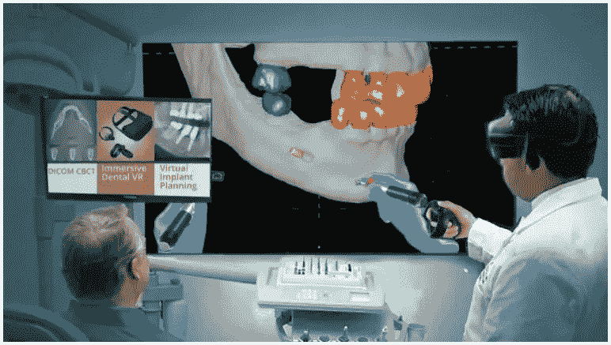

# 元宇宙的牙科:第一个购买土地进行虚拟实践的牙医

> 原文：<https://medium.com/coinmonks/dentistry-in-the-metaverse-first-dentist-to-buy-land-for-virtual-practice-1c3fc14bf728?source=collection_archive---------25----------------------->

元宇宙的牙科:一家英国牙科诊所连锁店已经决定他们需要在元宇宙开展业务。

牙科设计工作室是第一个宣布在元宇宙牙科品牌。英国牙科集团在英国有 15 个真正的办公室，现在还有一个在沙盒里。

在牙科元宇宙，患者可以坐在牙科椅子上，获得咨询，享受虚拟程序，与工作人员交谈，并观看口腔卫生视频。

用户可以创建自己的头像，甚至可以定制自己的外观，精确到牙齿。

## 牙科和教育

这听起来更像是无聊的娱乐，而不是元宇宙的实际应用。但是这里有一个有趣的教育机会。

牙科网络说，牙科课程和讲座可以在网上进行。利用元宇宙，区域手术室现在可以吸引国际观众。

> 杰夫·舍雷尔博士是联合创始人。“在牙科设计工作室，我们一直对技术感兴趣，并试图在任何有利于患者的领域进行创新。随着越来越多的人开始将元宇宙作为一种社交互动形式，我们产生了创建元宇宙牙科实践小组的想法，为患者提供一种体验牙医的新方式。非常紧张的病人和儿童现在可以在自己舒适的家中看到牙医是什么样的，为他们将来的就诊做准备。通过虚拟现实的魔力，他们可以坐在牙科椅子上，激活教他们如何更好地护理牙齿的互动内容。”

## 牙医的好处

舍雷尔博士说，牙医可以从在元宇宙经营中受益。

> “在这个世界上，牙医可以创造各种机会来建立品牌意识和广告。他们可能会提供 NFT，提供真实世界的会员津贴，如免费获得牙科保健师，或未来的元宇宙津贴，如化身配件，价格折扣，或忠诚卡。能够参观诊所并了解更多牙科知识将鼓励恐惧症患者熟悉环境，减少他们的恐惧，使他们更有可能接受所需的治疗。”

与此同时，另一家名为 Immersive Touch 的公司正在使用虚拟现实来练习牙科手术，然后在现实生活中进行手术。

📰 ***订阅*** [***斐波那契***](/@unclefibonacci) ***我来保持最新***