# 将子图部署到任何 EVM

> 原文：<https://medium.com/coinmonks/deploy-subgraphs-to-any-evm-aaaccc3559f?source=collection_archive---------0----------------------->

## 使用 Docker、图、图节点和 OpenZepplin 子图

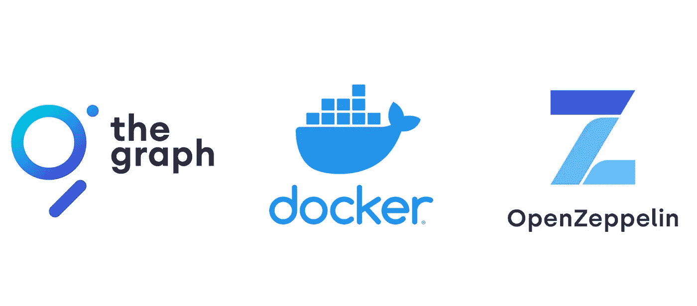

# 介绍

该图支持以太坊、xDAI、BSC 等多种网络。本文将解释如何用定制的网络 RPC 构建一个子图。

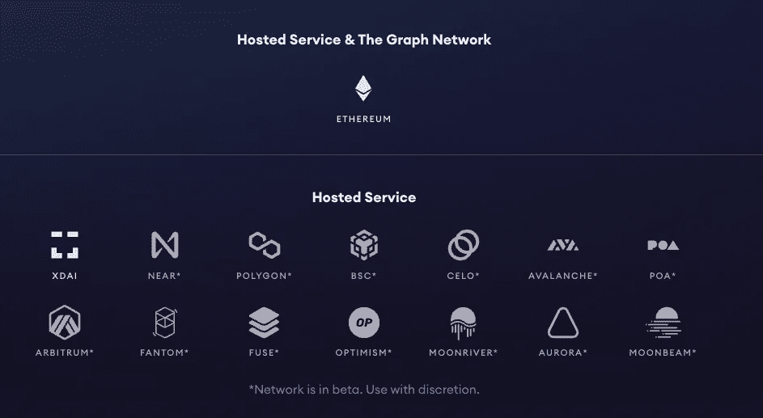

# 设置本地节点

使用 Docker 运行本地图节点，并通过 RPC 将其连接到区块链。

```
git clone [https://github.com/graphprotocol/graph-node/](https://github.com/graphprotocol/graph-node/)
```

打开`docker-compose.yml`位于:

```
graph-node/docker/docker-compose.yml
```

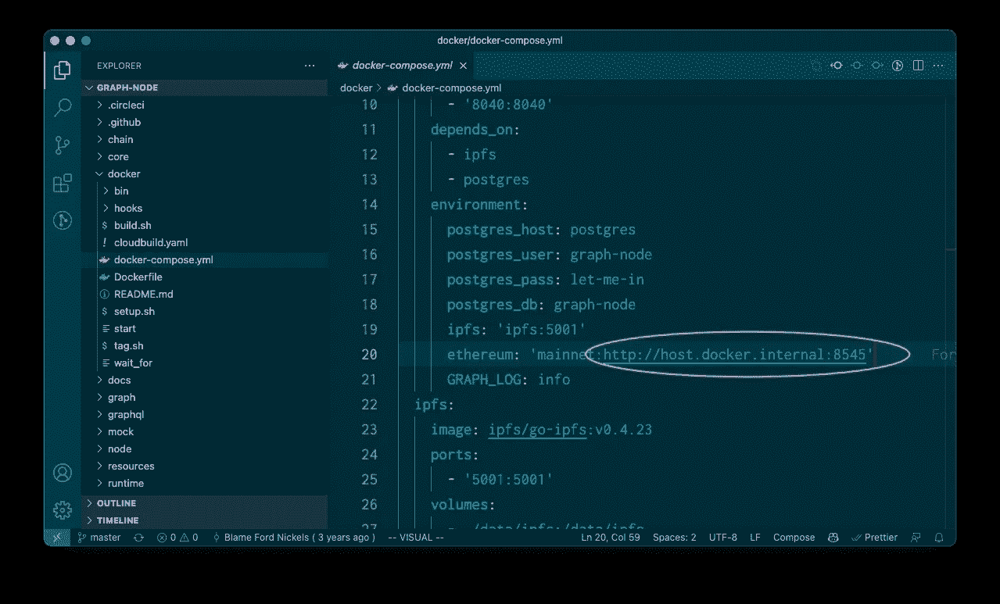

用您的 RPC url 替换`http://host.docker.internal:8545`。默认连接到本地以太坊节点。

注:保留`mainnet:`

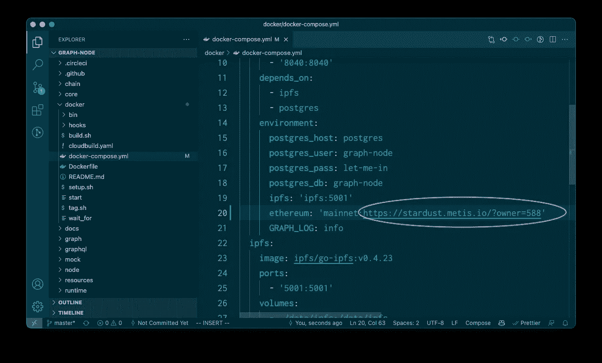

转到`graph-node/docker`并运行

```
./setup.sh
```

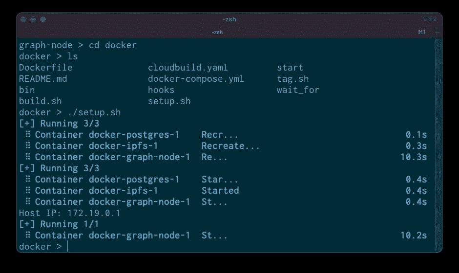

```
docker-compose up
```

日志将显示当前块头。您可以将其与块管理器中的内容进行比较。

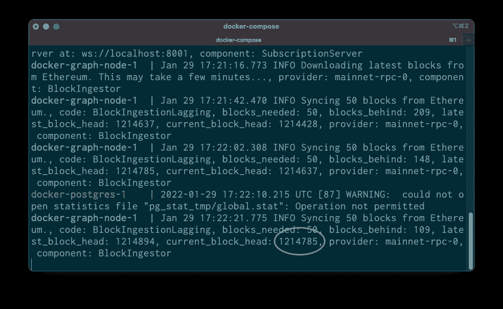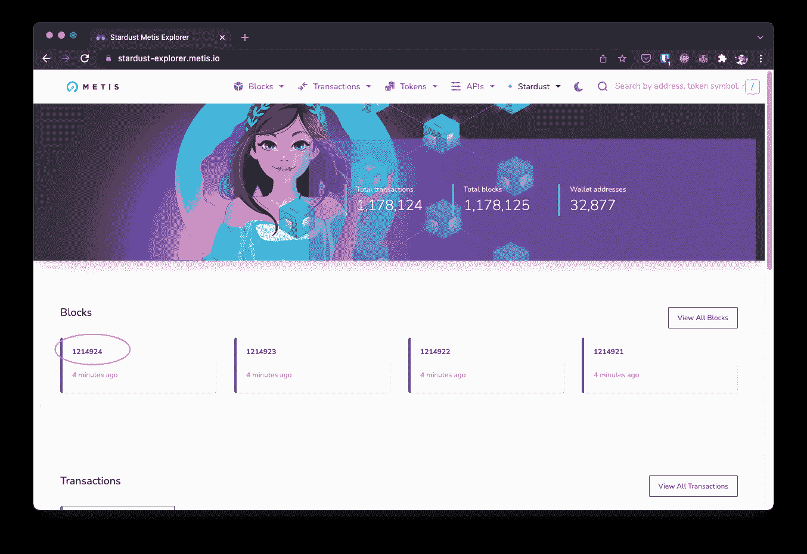

close enough

您的子图正在本地运行，并连接到正确的区块链。接下来，创建一个契约来索引。

# 将合同部署到索引

这个例子将使用 OpenZepplin 的 ERC-1155 合同。`mint`有一个公共函数

```
// SPDX-License-Identifier: GPL-3.0 pragma solidity >0.8.0;import "[@openzeppelin/contracts](http://twitter.com/openzeppelin/contracts)/token/ERC1155/ERC1155.sol";contract My1155 is ERC1155 { constructor() ERC1155("") {
    _mint(msg.sender, 0, 1, ""); // mint 1 on deploy
  } function mint() public {
      _mint(msg.sender, 0, 1, "");
  }}
```

部署并获取合同地址

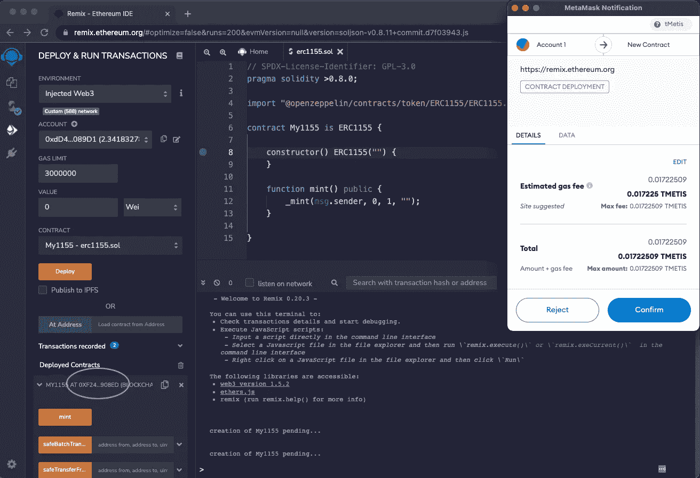

查看合同地址和块的块浏览器。子图将从这个约定地址索引事件。


# 使用 OpenZepplin 设置子图

这个例子将使用 OpenZepplin 的子图。这使得 ERC-20、ERC-721 和 ERC-1155 等合约的指数化变得容易。

[https://docs.openzeppelin.com/subgraphs/0.1.x/](https://docs.openzeppelin.com/subgraphs/0.1.x/)

```
mkdir custom-subgraph
cd custom-subgraph
npm i @openzeppelin/subgraphs
mkdir configs
touch configs/config.json
```

在`config.json`添加和更换

*   `address`:已部署的合同地址
*   `startBlock`:已部署的合同区块

注:保留`mainnet`

```
{
  "output": "generated/sample.",
  "chain": "mainnet",
  "datasources": [{ "address": "0xf248a9c50d0db54ea53b6ce0ca0e8d5861b908ed", "startBlock": [121812](https://stardust-explorer.metis.io/block/1218129)8, "module": ["erc1155", "ownable", "accesscontrol"] }]
}
```

编制

```
npx graph-compiler --config configs/config.json --include node_modules/@openzeppelin/subgraphs/src/datasources --export-schema --export-subgraph
```

这应该会生成一个`graphql`和`yaml`文件。

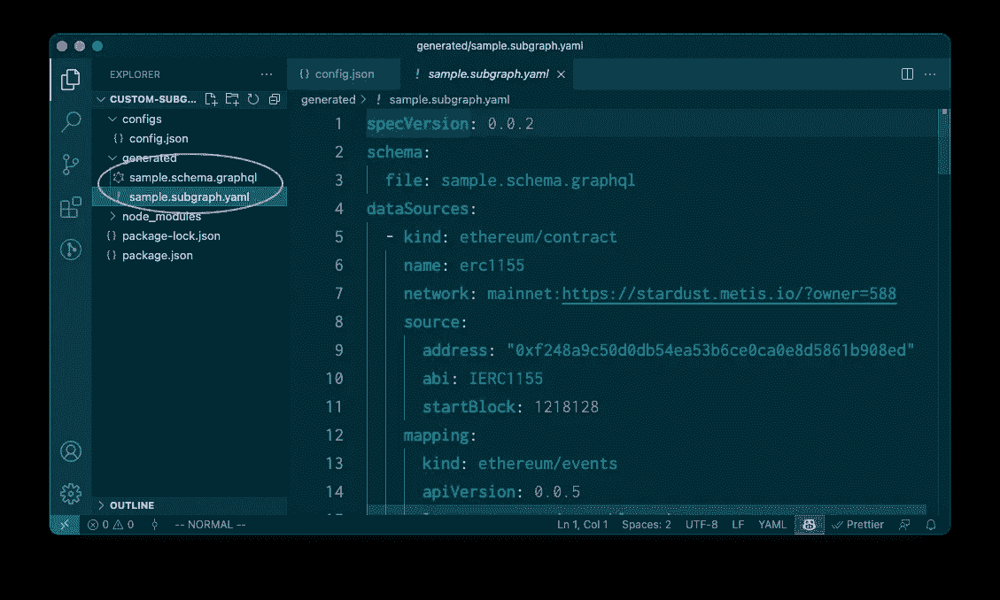

创建子图

```
graph create generated/sample --node [http://127.0.0.1:8020](http://127.0.0.1:8020)
```

部署子图

```
graph deploy --ipfs [http://localhost:5001](http://localhost:5001) --node [http://localhost:8020](http://localhost:8020) generated/sample ./generated/sample.subgraph.yaml
```

一旦完成，请访问[http://localhost:8000/subgraphs/name/generated/sample](http://localhost:8000/subgraphs/name/generated/sample)

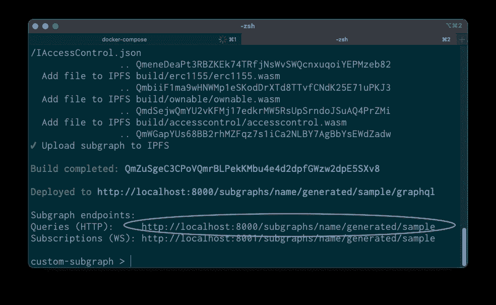

测试查询

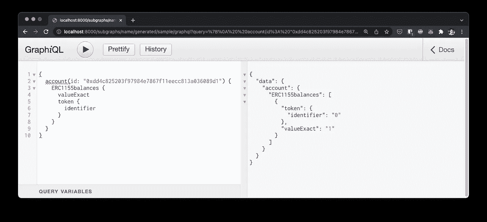

# 庆祝🎉🎉🎉

这种方法可以部署在任何专用服务器上。


Photo by [Adam Whitlock](https://unsplash.com/@adam_whitlock?utm_source=medium&utm_medium=referral) on [Unsplash](https://unsplash.com?utm_source=medium&utm_medium=referral)

> 加入 Coinmonks [电报频道](https://t.me/coincodecap)和 [Youtube 频道](https://www.youtube.com/c/coinmonks/videos)了解加密交易和投资

## 另外，阅读

*   [3 商业评论](/coinmonks/3commas-review-an-excellent-crypto-trading-bot-2020-1313a58bec92) | [Pionex 评论](https://coincodecap.com/pionex-review-exchange-with-crypto-trading-bot) | [Coinrule 评论](/coinmonks/coinrule-review-2021-a-beginner-friendly-crypto-trading-bot-daf0504848ba)
*   [莱杰 vs Ngrave](/coinmonks/ledger-vs-ngrave-zero-7e40f0c1d694) | [莱杰 nano s vs x](/coinmonks/ledger-nano-s-vs-x-battery-hardware-price-storage-59a6663fe3b0) | [币安评论](/coinmonks/binance-review-ee10d3bf3b6e)
*   [Bybit Exchange 评论](/coinmonks/bybit-exchange-review-dbd570019b71) | [Bityard 评论](https://coincodecap.com/bityard-reivew) | [Jet-Bot 评论](https://coincodecap.com/jet-bot-review)
*   [AscendEx Staking](https://coincodecap.com/ascendex-staking)|[Bot Ocean Review](https://coincodecap.com/bot-ocean-review)|[最佳比特币钱包](https://coincodecap.com/bitcoin-wallets-india)
*   [Bitget 回顾](https://coincodecap.com/bitget-review) | [双子星 vs BlockFi](https://coincodecap.com/gemini-vs-blockfi) | [OKEx 期货交易](https://coincodecap.com/okex-futures-trading)
*   [美国最佳加密交易机器人](https://coincodecap.com/crypto-trading-bots-in-the-us) | [经常性回顾](https://coincodecap.com/changelly-review)
*   [在印度利用加密套利赚取被动收入](https://coincodecap.com/crypto-arbitrage-in-india)
*   [霍比审核](https://coincodecap.com/huobi-review) | [OKEx 保证金交易](https://coincodecap.com/okex-margin-trading) | [期货交易](https://coincodecap.com/futures-trading)
*   [麻雀交换评论](https://coincodecap.com/sparrow-exchange-review) | [纳什交换评论](https://coincodecap.com/nash-exchange-review)
*   最好的[加密税务软件](/coinmonks/best-crypto-tax-tool-for-my-money-72d4b430816b) | [硬币追踪评论](/coinmonks/cointracking-review-a-reliable-cryptocurrency-tax-software-5114e3eb5737)