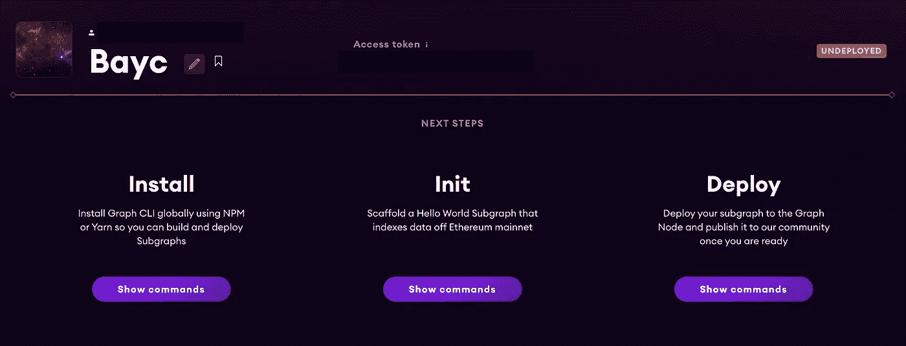
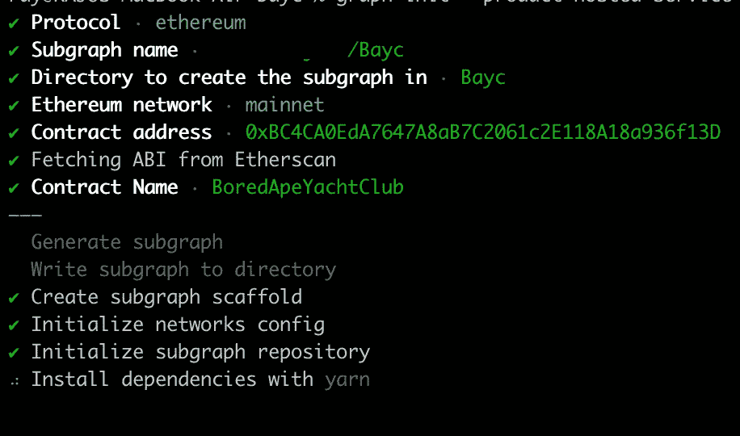
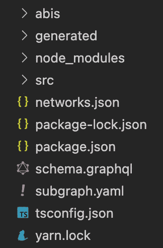
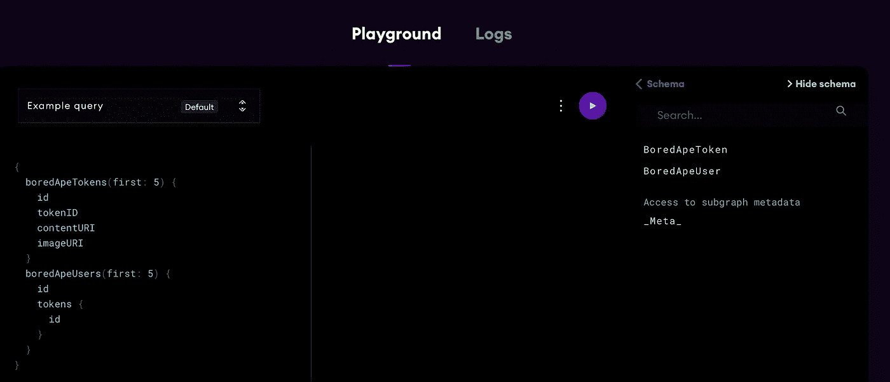

# 使用图协议部署和查询子图

> 原文：<https://medium.com/coinmonks/deploying-and-querying-subgraph-using-the-graph-protocol-826a05db30ac?source=collection_archive---------7----------------------->


Photo by [Shubham Dhage](https://unsplash.com/@theshubhamdhage?utm_source=medium&utm_medium=referral) on [Unsplash](https://unsplash.com?utm_source=medium&utm_medium=referral)

在本帖中，我们将揭示图是什么，以及我们如何使用它在它的[托管服务](https://thegraph.com/hosted-service/)上部署子图。首先让我们了解一下查询层。

## 查询层

虽然区块链和存储网络是堆栈的关键组件，但数据很少以可以在应用程序中直接使用的格式存储。在获取数据之前，应用程序需要对数据进行过滤、排序、分页、分组和连接。用户不喜欢查看微调器并等待屏幕加载。

如今，团队正在构建集中式索引服务器。这些服务器从以太坊获取数据，存储在数据库中，并通过 API 公开。这是脆弱的，因为用户需要信任这些团队来继续正确地操作这些服务器。这些项目可能会停业，出于战略原因修改数据，被收购，或者只是犯错误。突然间，我们离 web2 的起点不远了。

> 交易新手？试试[密码交易机器人](/coinmonks/crypto-trading-bot-c2ffce8acb2a)或者[复制交易](/coinmonks/top-10-crypto-copy-trading-platforms-for-beginners-d0c37c7d698c)

## 满足-图表

该图通过一个分散式协议解决了这一问题，该协议可以索引并实现高性能、高效的区块链数据查询，而无需您启动自己的集中式索引器，从长远来看，这可能很难维护。这些 API(*索引的“子图”*)可以用标准的 GraphQL API 进行查询。今天，有一个托管服务和一个具有相同功能的分散式协议。两者都由图节点的开源实现支持。

我们将部署和查询**无聊猿亚奇俱乐部** (BAYC) NFT 合同。合同地址为:[*0x BC 4c A0 EDA 7647 A8 ab 7 c 2061 C2 e 118 a18 a 936 f13 d*](https://etherscan.io/token/0xbc4ca0eda7647a8ab7c2061c2e118a18a936f13d)

## 托管服务设置

1.  去[https://thegraph.com/hosted-service/](https://thegraph.com/hosted-service/)注册托管服务。
2.  进入[仪表板](https://thegraph.com/hosted-service/dashboard)，点击*“添加子图”*，根据需要填写必要的项目详情。



After filling up relevant fields

转到您的 CLI，使用`mkdir graph-projects && cd graph-projects`创建一个新目录。安装`graph-cli`工具，然后使用`graph init`命令初始化基于托管服务的图形:

```
npm install @graphprotocol/graph-cli -g
graph init --product hosted-service <GITHUB_USER>/<SUBGRAPH_NAME>
```

*   `GITHUB_USER`:您的组织或 GitHub 用户的名称
*   `SUBGRAPH_NAME`:你想给你的子图起的名字(例如“Bayc ”)

接下来，您将看到许多需要在 CLI 中提供的选项/配置。只需按照下图所示填写配置字段，然后等待安装完成。



CLI after init command

您现在可以看到正在创建的`Bayc`目录，这也是您的子图名称。用`cd Bayc`进入那个目录，然后执行`npm init -y`初始化 package.json。



Directory structure (now)

## 什么是子图？

> 子图定义了图将从区块链中索引哪些数据，以及它将如何存储这些数据。一旦它被部署，它将形成区块链数据全局图的一部分，您可以使用 GraphQL 来检索它。子图定义由几个文件组成:

*   `subgraph.yaml`:包含子图清单的 YAML 文件(例如，要查询哪个区块链，合同地址等)。)
*   `schema.graphql`:GraphQL 模式，定义了为子图存储什么数据，以及如何通过 graph QL 查询它
*   `AssemblyScript Mappings` : [AssemblyScript](https://github.com/AssemblyScript/assemblyscript) (类似于 typescript，但更严格)代码，将事件数据转换为模式中定义的实体(例如本教程中的`bored-ape-yatch-club.ts`)
*   *遗憾的是，async/await 尚未在 AssemblyAcript 中实现*

## 创建子图清单

我们将从建立我们的`subgraph.yaml`文件开始。Graph auto 使用预定义的值为您创建 yaml。我们将关注的是**转会事件**为我们的 BAYC smartcontract。删除`eventHandlers:`中的其他事件，复制/粘贴相关字段。

我们增加了`startBlock`不允许索引器从 genesis 开始索引。因为那会很费时间。12287507 块包括区块链以太坊的 BAYC 合同创建代码。

```
event: Transfer(indexed address, indexed address, indexed uint256)              handler: handleTransfer
```

`datasources.mapping.eventHandlers.handler`

`dataSources.mapping.entities`由定义数据源将哪些实体写入存储的条目组成。`schema.graphql`为每个实体定义模式。(稍后将详细介绍)

`dataSources.mapping.abis`由源契约的 ABI 文件和您在映射中与之交互的任何其他智能契约组成。

`file: ./bored-ape-yatch-club.ts`具有中定义的所有映射器功能。yaml 文件来处理业务逻辑，以便您的子图查询可以返回响应。我们将在本教程的后面填充这个 *handleTransfer()* mapper 函数。

## 定义子图模式

现在，我们的 YAML 配置已经完成。我们需要定义我们的`schema.graphql`实体定义。每一个查询都是针对我们的子图索引的实体和我们将要在子图模式中定义的数据模型进行的。将实体字段视为数据对象，您将得到响应。我们将在 YAML 文件中使用上述实体名称。

定义很简单！只要确保用`@entity`关键字注释每种类型。然后在你的实体中添加你希望你的子图查询的字段，例如，tokenID，contentURI，baseURI，甚至是 traits(traits 将从 IPFS 查询中获取，敬请关注！).

添加`@derivedFrom`字段被称为**反向查找。**这样做将在实体上创建一个*虚拟字段*,它是从在另一个实体上定义的关系中派生出来的。根据文件:

> 您可以通过只存储关系的一端并派生另一端来提高索引和查询性能。几乎在所有情况下，都不建议存储关系的双方。

通过在数组([]) 中引用*虚拟字段，派生字段也可以有**一对多关系**。这里(！)基本意思是*不可空字段*。在这种情况下，我们有不可空的**令牌**，它是从另一个实体字段即**所有者中派生出来的。**BoredApeTokens*中的 owner 字段应该引用 *BoredApeUser* 实体，以便维护关系/引用。

```
tokens: [BoredApeTokens!]! @derivedFrom(field: "owner")
```

在图中，我们还可以通过启用全文搜索查询，使用文本搜索输入来过滤和排列实体。您可以通过在 GraphQL 模式中包含带有`*fulltext*` 指令的`_Schema_`类型来添加全文查询。您可以选择在查询中对哪个实体进行`include`，以及该实体的具体`fields`。

```
type _Schema_  @fulltext(    
     name: "apeFilter"    
     language: en    
     algorithm: rank    
     include: [{    
          entity: "BoredApeToken"        
          fields: [{ name: "eyes" }, { name: "background" }]   
     }]  
)
```

## 编写映射

作为将响应(即区块链数据)转换为模式中定义的实体的业务逻辑，映射是必要的。在编写映射之前，有必要运行:

```
npm run codegen
```

对于`subgraph.yaml`中提到的 ABI 文件中的每一个智能契约，命令都会生成一个 AssemblyScript 类，帮助我们:

*   对实体字段的读写权限
*   一个 save()方法来写实体存储
*   类型安全的实体加载

另外，确保您已经在`eventHandlers:`内的 YAML 文件中声明了映射。在我们带有 Bayc 契约的示例子图中，`src/bored-ape-yacht-club.ts`包括智能契约的`Transfer`事件的映射处理程序定义。

这里是为`handleTransfer`映射处理器写的代码，它接受`Transfer`事件引用作为参数。

映射用`new BoredApeToken(event.params.tokenId.toString())`创建一个新的`BoredApeToken`实体。实体字段通过使用相应的*事件*参数对象来填充。变量`entityToken`代表这个实体实例，并具有相应的`id`值`event.params.tokenId.toString()`。

映射中的 ***load*** 处理程序访问 Graph 节点并试图加载一个已经存在的`BoredApeToken`。如果 BoredApeToken 尚不存在，则按需创建。在使用`entityToken.save()`将实体保存回节点的存储之前，它被更新以匹配新的事件参数。类似的情况也适用于我们模式中的其他实体`BoredApeUser`，但是因为派生字段是在查询时构建的，所以您不应该在映射中编写这样的代码，就像您在上面的代码中看到的那样。我们还没有在映射中为`BoredApeUser`模式中的**令牌**字段添加值。

通过使用 ipfs 散列，我们的子图将能够使用 ipfs.cat 和 ipfs.map 从 IPFS 读取相应的文件。在我们的例子中，我们使用 ipfs.cat 来获取 *bayc 契约元数据。*

```
let data = ipfs.cat(hash);      
if (!data) return;      
let value = json.fromBytes(data).toObject();
```

文件数据将作为`Bytes`返回，这通常需要进一步的处理。我们使用了`json.fromBytes(data)`,它将给定的 blob 数据转换成 json 表示。`toObject()`将 json 转换成对象格式，方便我们查询元数据。例如，如果我们想要来自元数据的图像字段，我们可以做类似`value.get("image")`的事情，如果我们想要来自元数据的属性字段(对象数组)，我们可以写- `value.get("attributes")` …然后我们可以做进一步的处理来填充我们的模式字段:

```
let attributes: JSONValue[] = [];        
let atts = value.get("attributes");        
if (atts) {          
   attributes = atts.toArray();        
} for (let i = 0; i < attributes.length; i++) {          
   let item = attributes[i].toObject();          
   let trait: string = "";          
   let t = item.get("trait_type");          
   if (t) {            
      trait = t.toString();          
   }          

   let value: string = "";          
   let v = item.get("value");          
   if (v) {            
      value = v.toString();          
   }  

   if (trait == "Mouth") {            
      entityToken.mouth = value;          
   } 

   if (trait == "Eyes") {            
      entityToken.eyes = value;          
   }
   ...
   ...
}...
entityToken.save();
```

映射部分就到此为止。现在我们所要做的就是将我们的代码部署到图中的**托管服务**。

首先，用`npm run build`构建代码，构建完成后，就该为图认证设置访问令牌了。进入您的 CLI，键入:

```
graph auth --product hosted-service <ACCESS_TOKEN>
```

其中<access_token>是您之前在项目仪表板中设置托管服务时获得的令牌字符串。</access_token>

成功完成后，是时候将您的代码部署到您的托管服务了:

```
graph deploy --product hosted-service <GITHUB_USER>/<SUBGRAPH NAME>
```



Playground after deployment (appears in dash)

就是这样，法国人！它现在被部署到您的托管服务的最新版本。

> 注:有时更新可能不可见，在这种情况下，您可以前往**？version=pending** route(只需将它附加在游乐场页面的末尾)

现在，您可以尝试操场和干涉您的子图查询。这只是关于如何部署/编写子图的基本概述。我建议您更多地将 GraphQL 作为一种语言来探索，并通过成为子图开发人员来尝试为 dapps 提取尽可能多的数据:)

下面是演示:[https://the graph . com/hosted-service/subgraph/gautamaraju 15/bayc-indexer](https://thegraph.com/hosted-service/subgraph/gautamraju15/bayc-indexer)(注意:sub graph 的名字是 bayc-indexer，因为它已经被我部署了)

干杯。