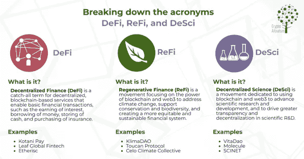

# DeSci——革新科学研究和资助的新 Web 3 运动

> 原文：<https://medium.com/coinmonks/desci-the-new-web-3-movement-to-revolutionize-scientific-research-funding-ae87685d8fa?source=collection_archive---------11----------------------->

DeSci — Science in Web3

根据区块链[市场研究未来报告](https://www.marketresearchfuture.com/sample_request/10746)，Web3 市场规模目前估值超过 63 亿美元，预计从 2023 年到 2030 年将以 44.6%的复合年增长率(CAGR)扩张。尽管许多行业和机构都在利用 Web 3 的出现来推动创新，但科学家们也在探索它的应用。

不久前，我在推特上与[进行了一次对话，内容是关于区块链和密码如何影响科学和科学界。以及科学如何融入新的 Web3 趋势。](https://twitter.com/SERGOMOSCOW)

今天，许多科学家已经部署了区块链工具，如智能合同、去中心化等。彻底改变科学界。这种利用区块链和 web 3 应用的运动被称为分散科学(DeSci)。虽然 DeSci 仍处于初级阶段，但它是两大运动的交汇点:

*   科学界寻求替代方法来资助他们的工作，不受限制地共享信息和数据。
*   一种基于加密的运动，旨在消除价值交换或交易中以利润为中心的中间人。

# 简史

多年来，为使研究结果和数据更容易为公众所用，人们付出了巨大的努力。

[开放科学](https://osf.io/)在这方面发挥了至关重要的作用。它的主要贡献是支持美国国立卫生研究院的禁令，要求所有的科学发现都必须不受限制地发表。然而，期刊对禁令的回应是确保科学家在他们的作品发表前得到报酬。这个障碍需要一个更具革命性的方法，因此诞生了分散化的科学革命。

# 什么是去中心化科学？

分散科学(DeSci)是最新的 Web 3 潜在革命运动，旨在利用区块链和 Web 3 等技术应用来解决科学研究中的一些重大问题。这些痛点包括研究结果不可用的障碍以及研究和科学过程中的其他瓶颈。

DeSci landscape

随着全球科学界对 DeSci 的全面接受，科学资助将发生巨大转变，知识将不再囤积在筒仓中。DeSci 的目标是从出版集团等追逐利润的中介手中夺取权力，并加强全球科学界的合作。

许多科学家很难获得合适的资助。这些科学家几乎 50%的时间都花在撰写研究提案上，成功的几率也没有保证。

对获取科学发现和数据的限制是困扰当今科学界的另一大痛点。尽管“科学”被誉为救命稻草，但人们需要获得许可才能访问其数据。DeSci 的首要任务是确保公众可以不受限制地获取这些科学数据。

基于科学的区块链倡议在 2021 年开始获得全球认可，这都要归功于新项目的兴起和扩散。

例子是 NFT 开放科学项目出售给 13 ETH 和 Dao 的爆炸式增长，Dao 是为了支持和帮助分散的科学研究而建立的。

此外，在 2021 年最后一个季度，在 LisCon 区块链活动期间举行了 DeSci 小组讨论。

当前分散的科学生态系统是不同 Dao 的互连。这些 Dao 中的每一个都是为特定的研究发现服务的。比如资金、同行评审、无限制访问等。然而，一些 Dao 是为特定的研究领域服务的，比如生物技术。生物技术 DAO 处于最前沿，如[分子](https://www.molecule.to/)、 [LabDAO](https://www.labdao.com/) 、 [VitaDAO](https://www.vitadao.com/) 、 [BioDAO](https://www.biodao.xyz/) 等。

# DeSci 将如何利用区块链和 Web3

# 智能合同支持的同行评审

虽然科学家开展同行评议是不收费的，但中介出版行业获利丰厚。随着智能合同的集成，DeSci 可以消除同行评审中的中介，从而使作者能够与同行评审者直接交互。

多年来，有证据表明政府干预和审查科学研究和发现。R.W. Newman 在《科学编辑委员会》上发表的一份报告指出，科学的政治化是一个热门话题，以至于出现在主流报纸的漫画中。

DeSci 利用区块链技术的分散属性进行数据存储，从而使其可以从全球各地访问。这将有助于减轻政府对科学数据的审查和把关。

# 区块链驱动的研究资助

通过利用分散式自主应用的创新特性，科学家们可以聚集在一起为他们的研究提供资金。

也有可能建立专门为科学服务的平台。他们还可以利用 DeFi 系统为科学研究创造可持续和有效的资助模式。

利用 NFTs 等适销产品的价值可以帮助资助研究，从而增强可持续的科学界。

# 没有单一实体支配所有权

开放科学的主要缺点是单一商业平台可能会“拥有”科学。然而，DeSci 的出现确保了独特的、专业化的社区处理指定的科学研究领域。

除了降低一个实体主宰科学的可能性，DeSci 还保护科学界免受快速发展的技术和其他新兴威胁的影响。

有了 DeSci，人们将拥有科学知识，而不是公司和政府。想象一下让社区设定疫苗价格的可能性，产生的大部分利润将被再投资于资助更多的研究。

这无疑将改善每个人的健康状况。

# 可核实的声誉

如今，科学家的“权威”和获得资助的能力取决于他们发表的论文数量。

有了 DeSci，这样的科学家可以通过执行一些研究目的的价值函数来获得 NFT。科学家可以培训和指导该领域的年轻专业人员，参与同行评审，并不受限制地共享数据。

NFTs 可以作为可证实的证据，表明科学家对科学做出了巨大的贡献。

# 结论

分散科学是一种相对“年轻”的趋势，它尝试新的技术工具来革新科学。在 DeSci 取得成功之前，需要将其工具纳入科学家日常活动的主流。

DeSci 的重点必须是为科学家提供他们在工作中高效和有效所需的所有必要工具。其他一切都是次要的。

如果您想了解有关道、、crypto、Play2Earn 和行业的最新动态和研究，并参加不同的加密比赛和活动 ***—*** [***请在 Twitter 上关注我。***](https://twitter.com/SERGOMOSCOW?ref=hackernoon.com)

*同时，如果你对 crypto 有任何疑问，或者你是 Crypto / GameFi /元宇宙/ NFT 项目，想了解更多关于* [*如何推广你的项目*](https://x10.agency/) *，你可以随时通过* [*电报(@baloyan)*](https://t.me/baloyan) 联系我

附:查看我以前在 HackerNoon 的文章:

*   [**理解道:基本解释**](https://hackernoon.com/understanding-dao-a-basic-explanation)
*   [**了解元宇宙:基本解释**](https://hackernoon.com/understanding-metaverse-a-basic-explanation)
*   [**play 2 learn 适合初学者:从哪里开始**](https://hackernoon.com/play2earn-for-beginners-where-to-start)
*   [**什么是 IGO(初始游戏发售)？**](https://hackernoon.com/what-is-an-igo-initial-game-offering-and-how-do-you-participate-in-it)
*   [**玩 2 赚:密码市场新趋势**](https://hackernoon.com/play-2-earn-a-new-trend-on-the-crypto-market)
*   [**NFT 营销推广终极指南**](https://hackernoon.com/the-ultimate-guide-to-nft-marketing-and-promotion-2jl33ky)
*   [**营销 DeFi 项目的终极清单**](https://hackernoon.com/the-ultimate-checklist-for-marketing-defi-projects-f71a3wod)