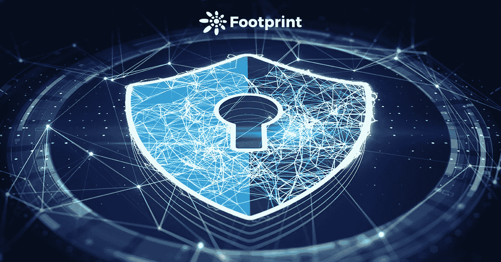

# 关于元宇宙的法律思考(二) :数据保护和隐私|足迹分析

> 原文：<https://medium.com/coinmonks/description-data-protection-and-privacy-is-another-issue-that-should-be-considered-in-metaverse-eafc0734742d?source=collection_archive---------11----------------------->

描述:数据保护和隐私是元宇宙项目中应该考虑的另一个问题。

2022 年 1 月 Helen@footprint.network

数据来源:[足迹分析](http://footprint.network)

在之前的*关于***(一):知识产权的法律思考中，*我们探讨了围绕知识产权(IP)的问题会如何发展。虽然这在很大程度上仍然是理论上的，但早期的元宇宙项目*已经*存在数据保护问题。*

*在本文中，我们将关注数据保护和隐私。*

# *数据和隐私侵犯*

*最近几个月，许多用户声称他们的 Roblox 账户在中国 youtube 网站 Bilibi 上被盗。据 RTrack 估计，截至 2021 年 4 月，Roblox 的月活跃用户数为 2.02 亿，其中超过 65%是 16 岁以下的儿童。*

*随着 Roblox 越来越受欢迎，它面临着黑客通过第三方浏览器扩展、泄露密码和未绑定电子邮件地址窃取帐户的问题。虽然 Roblox 在其官网上列出了找回被盗账号的步骤；并不是每个玩家都能幸运的找回自己的账号。*

*然而，即使玩家设法找回了账户，他们的道具和货币也往往早已不在了。*

*正如 Roblox 的这个问题所表明的那样，元宇宙已经存在许多隐私和数据安全问题，而且还可能出现更多问题。这些包括复杂的深度伪造，因为元宇宙服务提供商获取了更多的用户数据，包括生物特征、位置和银行信息。*

*因此，数据和隐私保护是监管机构和进入元宇宙的互联网公司的主要关注点。由于广告可能仍然是世界上最大的两家互联网公司脸书(现已更名为 Meta)和谷歌的主要收入来源，消费者的个人数据将很容易被滥用。*

# *个人信息保护立法概述*

*全球个人信息保护立法可以追溯到德国黑森州 1970 年的数据保护法。此后，瑞士(1973 年)、法国(1978 年)、挪威(1978 年)、芬兰(1978 年)、冰岛(1978 年)、奥地利(1978 年)、冰岛(1981 年)、爱尔兰(1988 年)、葡萄牙(1991 年)、比利时(1992 年)等国家的个人信息保护法也相继出现。*

*美国最早的关于数据和隐私的书面立法可以追溯到 1974 年的隐私法案(5 U.S.C. 552a)。自那时以来，还有许多其他值得注意的立法*

*   *消费者在线隐私法案*
*   *儿童在线隐私保护法案*
*   *电子通信隐私法案、金融服务现代化法案(GLBA)*
*   *健康保险流通与责任法案(HIPAA)*
*   *公平信用报告法案*

*由于元宇宙最明显的使用案例都围绕着在线游戏，所以仔细研究一下关于消费者保护和未成年人的法律是有意义的。*

# *个人信息*

*个人信息的处理包括个人信息的收集、存储、使用、处理、传输、提供、披露和删除。*

*《美国公平信用报告法案》( 15 U.S.C. 1681 及以下)。)保护消费者报告机构收集的个人财务信息。该法案将此类信息的获取权限限制在那些可以获取此类信息的人，随后的修正案简化了消费者获取和更正自身信息的过程。*

*在中国，个人信息的定义可以在 2021 年 11 月 1 日生效的《中华人民共和国个人信息保护法》中找到。“个人信息”是指以电子方式或其他方式记录的与可识别的自然人相关的各种信息，不包括匿名信息。*

# *儿童隐私保护法*

*《儿童在线隐私保护法》( 15 u . s . c . 6501–6506)允许父母控制从网上收集的关于其子女(13 岁以下)的信息。以儿童为目标或故意收集儿童个人信息的网站运营商必须公布隐私政策，在收集儿童信息之前征得父母同意，允许父母决定如何使用这些信息，并向父母提供选择不收集儿童信息的选项。*

# *关于元宇宙项目的法律思考*

*在元宇宙，信息数据，无论是由用户直接提供还是间接生成，如生物特征、位置和银行信息、消费习惯和游戏习惯，都是个人信息。*

*因此，元宇宙项目和参与者考虑以下因素是合理的。*

*   ***开发者***

*元宇宙的开发者在开发软件和硬件时必须设计隐私保护，这已经是虚拟和增强现实技术的一项要求。*

*例如，根据通用数据保护条例(GDPR)，谷歌眼镜有音频和视频符号，似乎让用户知道他们正在被记录。同时，游戏平台需要为未成年人设置游戏模式，避免未成年人信息隐私泄露。*

*关于法律责任，违反者显然不会仅仅因为他们在元宇宙或区块链就可以逍遥法外。美国商品期货交易委员会(CFTC)专员 Brian Quintenz 建议，如果可以明确预见智能合约代码将被美国人用来违反 CFTC 法规，那么智能合约的代码开发人员可能会被起诉。*

*《中华人民共和国网络安全法》第二十二条也规定，提供的网络服务或者产品存在恶意程序或者安全缺陷、漏洞的风险的，应当立即采取补救措施，否则由用户承担相应的法律责任。*

*   ***玩家***

*普通玩家必须保护他们的信息和隐私，以确保他们不容易通过创建复杂的密码、对他们的设备执行定期防病毒清理以及选择进入认证系统进行检索来被窃取。与 Roblox 玩家的情况一样，他们需要绑定自己的电子邮件地址，以证明自己是该帐户的所有者。*

*家长应在监护人明确同意的情况下，允许儿童或未成年人在游戏中处理未成年人的个人信息数据。*

***更多考虑***

*关于元宇宙和 NFT，我们提出了关于知识产权、、元宇宙数据保护的讨论。虽然分权是区块链的核心，但要为新的世界形式建立规则以避免冲突。在我们的现实世界中，会不会存在一个像法庭一样处理类似法律问题的道呢？还有更多的要考虑。*