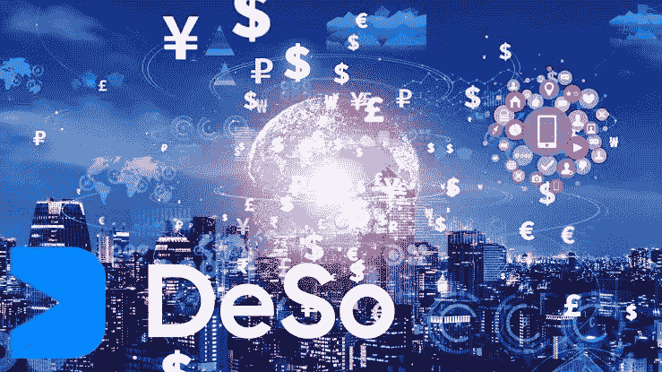

# Deso 加密——Deso 加密是什么？

> 原文：<https://medium.com/coinmonks/deso-crypto-what-is-deso-crypto-all-about-aeaf1c76c2e?source=collection_archive---------31----------------------->

Deso Crypto 区块链不仅资助传统的社交功能，如创建个人资料和帖子，还资助新颖的区块链本地功能，如社交令牌(创建者硬币)、小费和 NFTs。

这些特征开启了大量新的金钱支持产品领域，从社会 NFT 知识到有影响力的股票市场。这些组件使创作者能够更有效地将他们的内容货币化，并在 Deso 支持的应用程序上与他们的支持者建立联系。

因为 Deso 喜欢将社交数据作为一种大众工具，所以创建者不会被局限于少数几个集中式应用。DeSo 上的所有内容都被分类在一个分散的分类账上，并可以立即被一个庞大且不断增长的自主第三方应用系统访问，类似于以太坊区块链上的 Defi 应用。

# 什么是 Deso 加密？

Deso 是区块链的一个新类别，旨在加强 Web 3.0 去中心化的社会系统。自 2019 年诞生以来，Deso 旨在解决现有社交媒体中心化带来的困境。

Deso 可用于购买“社交代币”和 NFT，并为分散式社交应用程序创建个人资料和帖子。

它们是建立在新的第一层区块链上的 200 多个应用程序，第一个是 Diamond，Polygram，Prosperclout，Cloutavista，Pulse，Cloutfee，Flick，Nftz，Bithunt，CloutPunk，AfterParty，超新星，CloutCast，Moonbounce，Clubrooms 等

# 结论

Deso 在 24 小时的聊天中做得很好，为什么它从 40 美元的底价涨到了 90 美元以上，很多投资者喜欢这个项目的特点。同时，如果你期待投资这个项目。

这可能是一项不错的投资，但不是。我是一名金融顾问，所以不要把这当成投资建议，在冒险进入加密货币之前，一定要确保你了解加密货币的基础。

*加入我们的电报社区，获取加密新闻、加密宝石，支持&加密教程；*

电报链接:【https://t.me/+6ek5FpdVW89jNjE0 

> *加入 Coinmonks* [*电报频道*](https://t.me/coincodecap) *和* [*Youtube 频道*](https://www.youtube.com/c/coinmonks/videos) *了解加密交易和投资*

# 另外，阅读

*   [3 商业评论](/coinmonks/3commas-review-an-excellent-crypto-trading-bot-2020-1313a58bec92) | [Pionex 评论](https://coincodecap.com/pionex-review-exchange-with-crypto-trading-bot) | [Coinrule 评论](/coinmonks/coinrule-review-2021-a-beginner-friendly-crypto-trading-bot-daf0504848ba)
*   [莱杰 vs Ngrave](/coinmonks/ledger-vs-ngrave-zero-7e40f0c1d694) | [莱杰 nano s vs x](/coinmonks/ledger-nano-s-vs-x-battery-hardware-price-storage-59a6663fe3b0) | [币安评论](/coinmonks/binance-review-ee10d3bf3b6e)
*   [Bybit Exchange 评论](/coinmonks/bybit-exchange-review-dbd570019b71) | [Bityard 评论](https://coincodecap.com/bityard-reivew) | [Jet-Bot 评论](https://coincodecap.com/jet-bot-review)
*   [3 commas vs crypto hopper](/coinmonks/3commas-vs-pionex-vs-cryptohopper-best-crypto-bot-6a98d2baa203)|[赚取加密利息](/coinmonks/earn-crypto-interest-b10b810fdda3)
*   最好的比特币[硬件钱包](/coinmonks/hardware-wallets-dfa1211730c6) | [BitBox02 回顾](/coinmonks/bitbox02-review-your-swiss-bitcoin-hardware-wallet-c36c88fff29)