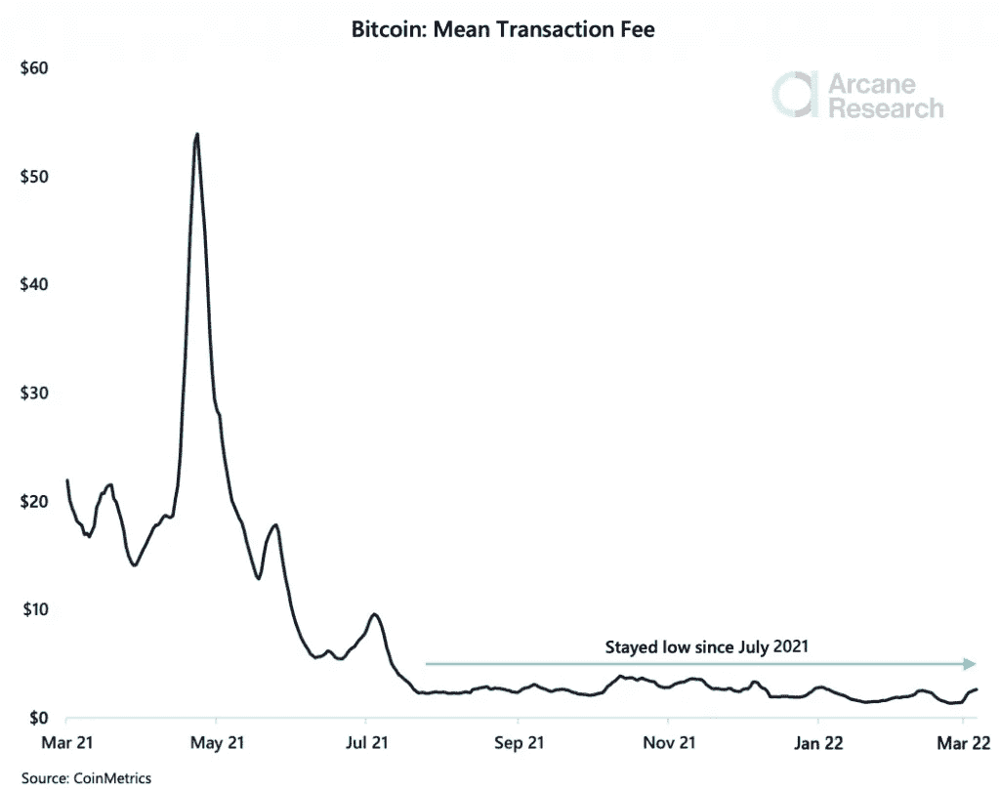
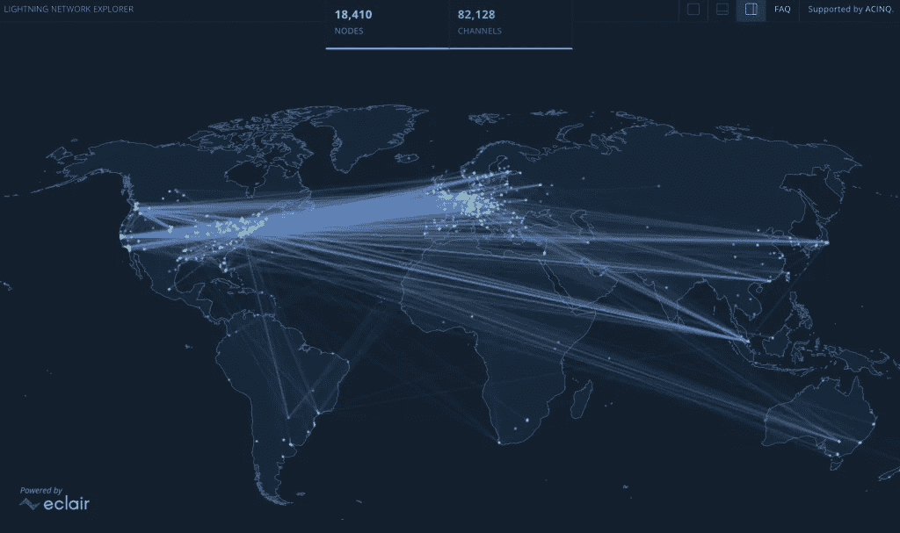

# 尽管交易费用略有上升，但比特币的交易成本仍然极低

> 原文：<https://medium.com/coinmonks/despite-a-slight-rise-in-transaction-fees-bitcoins-cost-of-exchange-remains-extremely-low-9298b8e36a30?source=collection_archive---------77----------------------->

**Visit our website:-** [**https://bitcoinsupports.com/**](https://bitcoinsupports.com/)

尽管本周价格飙升，但自 2021 年 7 月以来，将比特币从一个地址传输到另一个地址的成本一直保持在异常低的水平。

有没有一些聪送或者重组你的比特币(BTC)钱包？这样做变得越来越实惠。根据 Arcane Research 的研究，比特币的“交易费用自 2021 年 7 月以来一直很低，没有增长的迹象”。

**Visit our website:-** [**https://bitcoinsupports.com/**](https://bitcoinsupports.com/)

然而，上周交易费用有所增加。如图形末端的一个小凸起所示，mempool 的集群将“过去七天每天的平均交易费用增加到 691，000 美元，是上周二的三倍多。”尽管如此，交易费用的翻倍可以忽略不计:交易费用一直保持在很低的水平。在两天的时间里，矿工们通过 mempool 交易，保护了网络，同时保持交易成本低廉。

根据比特币书籍《第七财产》的作者埃里克·雅克(Eric Yakes)的说法，交易成本低有三种主要解释:Segwit 接受、哈希速率再分配以及近即时支付闪电网络等比特币第二层基础设施的激活。

**“2021 年 6 月，Segwit 在链上的交易比例大幅提升，从 50%提升至 70%，并持续提升至 80%以上，这将大幅提升网络的交易能力。”Yakes 在 2021 年 7 月表示，由于中国的禁令和哈希速率再分配，“网络难度已经触底，现在已经增加到 ATHs”。当与 Segwit 事务的增加相结合时:

**“散列率的这种恢复使得块的发现速度快于难度调整所能跟上的速度，从而比其他情况下更快地清除事务，降低了事务的成本。”然而，亚克斯确实指出，交易成本“不应该被期望无限期地持续下去。”最终，这完全取决于定价、哈希费率和难度，费用市场将达到平衡，减少竞争，增加交易成本。"

《天鹅比特币》主编 Tomer Strolight 指出了交易费用低的另一个原因:

**“我们现在拥有世界上最大的交易所批量交易。这表明他们在单笔交易中发出 100 次或更多的取款，而不是几年前令人发指的每次单独取款的做法。**

此外，因为闪电网络能够在区块链没有过载时打开“信道”,然后重复利用它们，所以每当有更快、更便宜的闪电交易可用时，它避免了链被阻塞。"****

**Visit our website:-** [**https://bitcoinsupports.com/**](https://bitcoinsupports.com/)

虽然这四个原因很重要，但神秘的研究论文指出，“很可能每天交易量的减少导致了更低的平均交易价格。”Yakes 认为，“交易费在短期内可能会增长，但有太多的趋势不利于交易费，我认为从长期来看，交易费将持续走低。”

**特罗默也热情洋溢地称赞道:**

“我真的相信，我们可以逐步增加网络的容量，以处理所有的世界贸易，而不会让区块链成为不可逾越的瓶颈。”这给 BTC 的帽子又添了一根羽毛:该系统继续成功扩展，使网络交易更加经济。

**访问我们的网站:-**[**https://bitcoinsupports.com/**](https://bitcoinsupports.com/)

**免责声明:以上为作者观点，不应视为投资建议。读者应该自己做研究。**