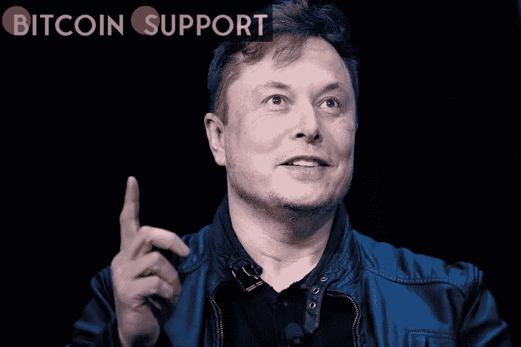
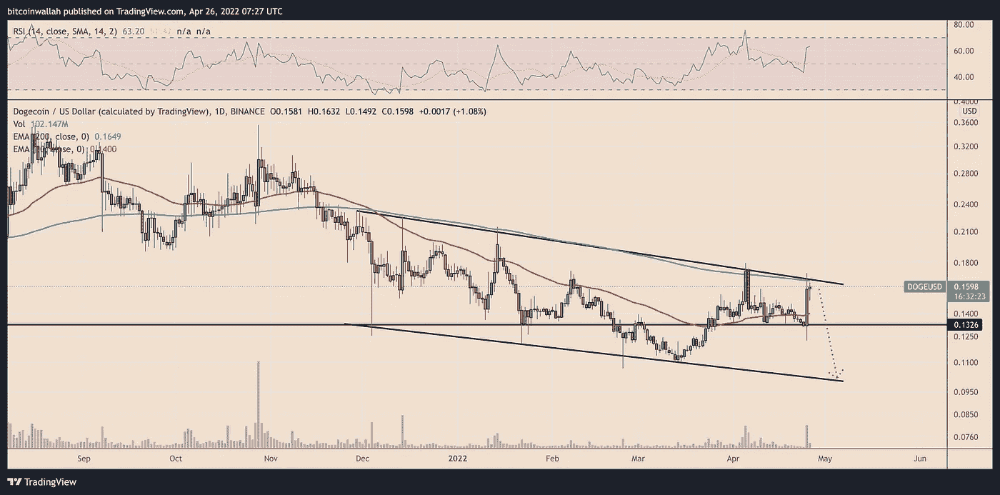
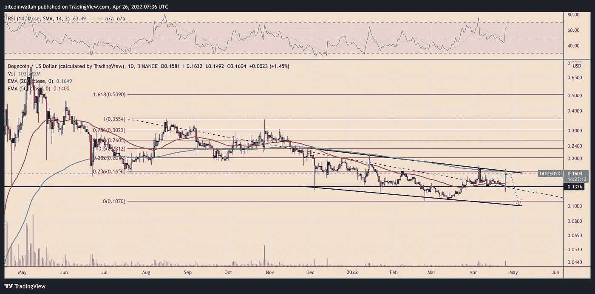

# 尽管埃隆·马斯克在推特上兴奋不已，但 Dogecoin 的价格面临 40%的逆转

> 原文：<https://medium.com/coinmonks/despite-elon-musks-twitter-excitement-the-dogecoin-price-faces-a-40-reversal-6784b034a1d4?source=collection_archive---------51----------------------->

**Visit our website for full blog:-**[**https://bitcoinsupports.com/**](https://bitcoinsupports.com/)

Elon Musk 以 440 亿美元收购 Twitter，使 Dogecoin 在过去 24 小时内增长了 25%，但抛售担忧仍然存在。在埃隆·马斯克以 440 亿美元收购 Twitter 后，Dogecoin (DOGE)的价值在过去 24 小时内飙升。在 4 月 25 日的峰值，Dogecoin 的交易价格为 0.17 美元，仍比 2021 年 5 月的创纪录高位低 77%。

**Dogecoin 是推特的原生货币。DOGE 的价格在 24 小时调整后上涨了约 25%，至 0.15 美元，这表明交易员将马斯克收购 Twitter 视为 Dogecoin 的一个看涨发展。

原因:马斯克对 DOGE 的长期支持，最近建议 Twitter 董事会开始接受该公司第一个订阅服务 Twitter Blue 的 meme-crypto。一年前，Twitter 宣布打算在 2023 年底前将其收入增加到 75 亿美元，这让人们希望马斯克的 100%所有权将使该公司能够通过额外的 DOGE 支付选项促进未来的销售。https://twitter.com/CryptoLimbo_/status/1518669053887361024 马斯克的特斯拉汽车公司在一月份开始接受 Dogecoin，而且仅仅是 DOGE。

**DOGE 价格回调的风险**

尽管如此，Dogecoin 在过去 24 小时的急速上涨之后，仍面临着暂时抛售的风险。在重新测试了作为阻力的多月向下倾斜趋势线后，DOGE 的价格开始下跌。有趣的是，这条线形成了一个下降的通道模式，表明 DOGE 可能会在 Q2 结束时再延长 35% -40%的回调，如下图所示。**

**Visit our website for full blog:-**[**https://bitcoinsupports.com/**](https://bitcoinsupports.com/)

抛售进入该通道较低趋势线的风险也仍然很大，因为 200 天指数移动平均线(200 天均线)波动接近 0.16 美元，这限制了 Dogecoin 自 2021 年 11 月以来的看涨尝试。

**Visit our website for full blog:-**[**https://bitcoinsupports.com/**](https://bitcoinsupports.com/)

另一方面，在通道的上趋势线和 200 天指数移动平均线之上的强劲向上延续将 DOGE 的价格定位于 0.20 美元的 Q2 测试。这个关键水平也与 0.382 斐波纳奇回撤线一致，该线是从斐波纳奇回撤图上的 0.35 美元的高点到 0.10 美元的低点形成的。

**访问我们的网站获取完整博客:-**[**https://bitcoinsupports.com/**](https://bitcoinsupports.com/)

**免责声明:以上为作者观点，不应视为投资建议。读者应该自己做研究。**

> 加入 Coinmonks [电报频道](https://t.me/coincodecap)和 [Youtube 频道](https://www.youtube.com/c/coinmonks/videos)了解加密交易和投资

# 另外，阅读

*   [印度最佳 P2P 加密交易所](https://coincodecap.com/p2p-crypto-exchanges-in-india) | [柴犬钱包](https://coincodecap.com/baby-shiba-inu-wallets)
*   [8 大加密附属计划](https://coincodecap.com/crypto-affiliate-programs) | [eToro vs 比特币基地](https://coincodecap.com/etoro-vs-coinbase)
*   [最佳以太坊钱包](https://coincodecap.com/best-ethereum-wallets) | [电报上的加密货币机器人](https://coincodecap.com/telegram-crypto-bots)
*   [交易杠杆代币的最佳交易所](https://coincodecap.com/leveraged-token-exchanges) | [购买 Floki](https://coincodecap.com/buy-floki-inu-token)
*   [3Commas 对 Pionex 对 Cryptohopper](https://coincodecap.com/3commas-vs-pionex-vs-cryptohopper) | [Bingbon 评论](https://coincodecap.com/bingbon-review)