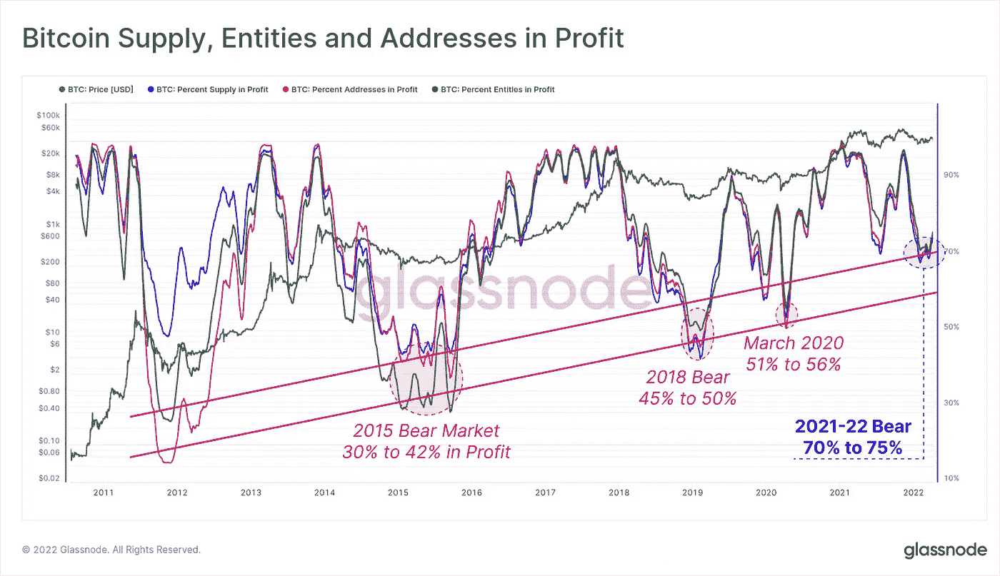
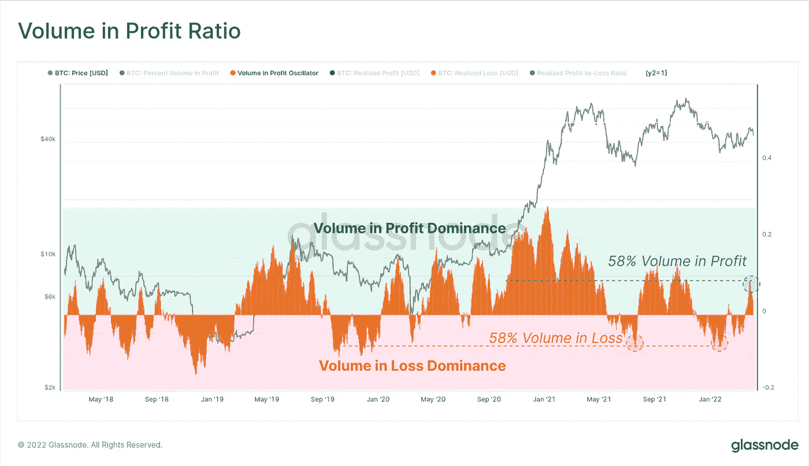

# 尽管市场下滑，超过四分之三的 BTC 地址继续盈利

> 原文：<https://medium.com/coinmonks/despite-market-drop-three-quarters-of-btc-addresses-remain-profitable-glassnode-97dfb7c91059?source=collection_archive---------38----------------------->

此外，Glassnode 的分析表明，高达 60%的交易量处于它所称的“利润支配地位”，长期投资者最有可能获利。

虽然比特币(BTC)的价格最近一直在下降，但区块链分析初创公司 Glassnode 的新数据表明，高达 75%的比特币地址是盈利的。

Glassnode 于 4 月 11 日周一发布的周链报告评估了可盈利的比特币钱包数量，发现约 70%至 75%的地址是可盈利的，明显高于 2018 年市场不景气期间 45%至 50%的地址。

Glassnode 专家在回应调查结果时表示，当前的熊市远没有过去的熊市那么可怕:

**“当前的熊市没有以前周期中最糟糕的时刻那么糟糕，只有 25%到 30%的市场处于未实现亏损状态。还有待观察，额外的卖方压力是否会推动市场走低，从而像以前的周期一样，将更大一部分市场拖入未实现的亏损。此外，调查显示，比特币的长期持有者——即持有时间超过 155 天的人——最不容易遭受损失。超过 67.5%的长期持有人有未实现的利润，然而只有 7.88%的短期持有人，即那些持有时间少于 155 天的人，有任何收益。

比特币目前交易价格低于 40000 美元，在此前的 24 小时内跌至 39000 美元，再次将该资产引入熊市。一些人预计比特币的未来路径将跌至 3 万美元，而其他人则认为交易商正在寻求将价格推高至 5 万美元以上。

此外，该研究称，比特币网络 58%的流量处于其所谓的“利润支配”状态，这一统计数据自 2021 年 12 月以来一直没有被强烈检测到。**

Glassnode 表示，熊市往往会经历长时间的负交易量，这种利润主导地位的转变可能表明情绪正在转变，对比特币的需求能够购买卖方。然而，Glassnode 认为，“考虑到价格的持续挣扎，这确实表明需求仍然有些不温不火，投资者正在从任何存在的市场力量中获利。”

研究人员表示，自 2 月中旬以来，该市场每日实现利润约为 1.33 万 BTC，而每日实现亏损已从 1 月份的约 2 万 BTC 降至上周的约 8300 BTC。

研究人员表示，尽管很大一部分地址和交易产生了收入，但比特币网络的用户总数以及交易量继续“萎靡不振”。

该网络目前每天处理约 225，000 笔交易，与 2018 年至 2019 年的疲软市场相当。虽然自 2021 年年中以来交易量大幅增加，但分析师表示，“这与牛市期间的兴奋周期相去甚远。”

**免责声明:以上为作者观点，不应视为投资建议。读者应该自己做研究。**

> *加入 Coinmonks* [*电报频道*](https://t.me/coincodecap) *和* [*Youtube 频道*](https://www.youtube.com/c/coinmonks/videos) *了解加密交易和投资*

# 另外，阅读

*   [3 商业评论](/coinmonks/3commas-review-an-excellent-crypto-trading-bot-2020-1313a58bec92) | [Pionex 评论](https://coincodecap.com/pionex-review-exchange-with-crypto-trading-bot) | [Coinrule 评论](/coinmonks/coinrule-review-2021-a-beginner-friendly-crypto-trading-bot-daf0504848ba)
*   [莱杰 vs n rave](/coinmonks/ledger-vs-ngrave-zero-7e40f0c1d694)|[莱杰 nano s vs x](/coinmonks/ledger-nano-s-vs-x-battery-hardware-price-storage-59a6663fe3b0) | [币安评论](/coinmonks/binance-review-ee10d3bf3b6e)
*   [Bybit Exchange 评论](/coinmonks/bybit-exchange-review-dbd570019b71) | [Bityard 评论](https://coincodecap.com/bityard-reivew) | [Jet-Bot 评论](https://coincodecap.com/jet-bot-review)
*   [3 commas vs Cryptohopper](/coinmonks/3commas-vs-pionex-vs-cryptohopper-best-crypto-bot-6a98d2baa203)|[赚取加密利息](/coinmonks/earn-crypto-interest-b10b810fdda3)
*   最好的比特币[硬件钱包](/coinmonks/hardware-wallets-dfa1211730c6) | [BitBox02 回顾](/coinmonks/bitbox02-review-your-swiss-bitcoin-hardware-wallet-c36c88fff29)