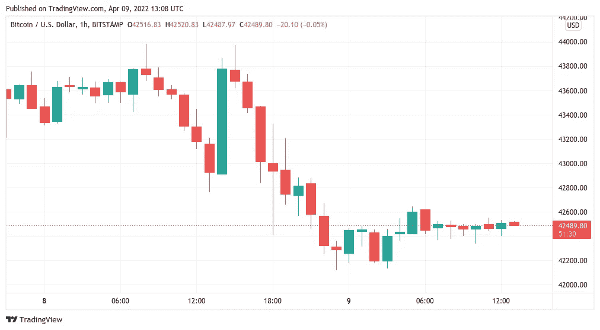
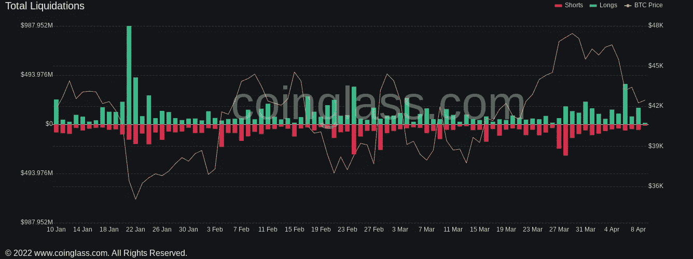
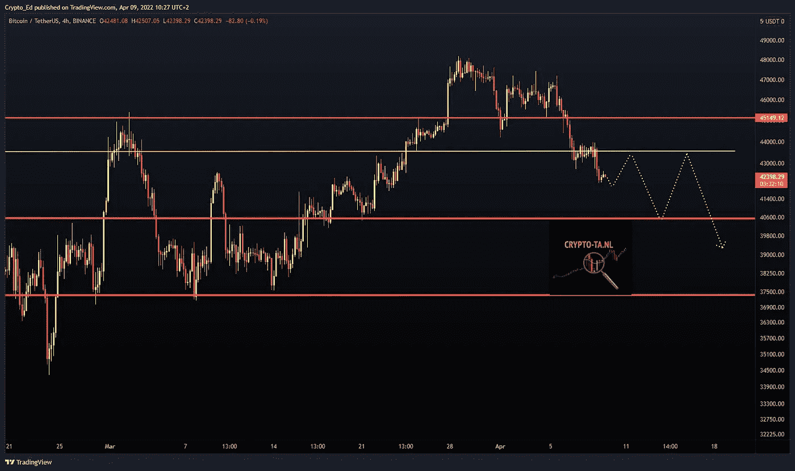

# 尽管有警告称比特币的价格可能会跌破 4 万美元，但比特币巨鲸仍在继续囤积

> 原文：<https://medium.com/coinmonks/despite-warnings-that-the-price-of-bitcoin-could-fall-below-40k-bitcoin-whales-continue-to-fill-a52efa0b552d?source=collection_archive---------47----------------------->

**Visit our website:-** [**https://bitcoinsupports.com/despite-warnings-that-the-price-of-bitcoin-could-fall-below-40k-bitcoin-whales-continue-to-fill-their-bags/**](https://bitcoinsupports.com/despite-warnings-that-the-price-of-bitcoin-could-fall-below-40k-bitcoin-whales-continue-to-fill-their-bags/)

Bitfinex 的大佬们并不是唯一将当前比特币价格视为购买机会的人。在多头未能引发周末的反弹后，比特币(BTC)在 4 月 9 日接近 42，000 美元。

**Visit our website:-** [**https://bitcoinsupports.com/despite-warnings-that-the-price-of-bitcoin-could-fall-below-40k-bitcoin-whales-continue-to-fill-their-bags/**](https://bitcoinsupports.com/despite-warnings-that-the-price-of-bitcoin-could-fall-below-40k-bitcoin-whales-continue-to-fill-their-bags/)

**比特币每周红烛上涨 10%**

随着周末的开始，TradingView 的数据显示，BTC/美元正在慢慢瓦解已经存在了几周的支撑位。在无数次尝试 43，000 美元后，这对组合最终放弃了，并在 Bitstamp 上跌至 42，131 美元，这是自 3 月 23 日以来的最低水平。根据连锁监测资源 Coinglass 的数据，截至本周六发稿的 24 小时内，交叉加密清算总额达到 2 亿美元。等待救援行动的多头感受到了痛苦。

**Visit our website:-** [**https://bitcoinsupports.com/despite-warnings-that-the-price-of-bitcoin-could-fall-below-40k-bitcoin-whales-continue-to-fill-their-bags/**](https://bitcoinsupports.com/despite-warnings-that-the-price-of-bitcoin-could-fall-below-40k-bitcoin-whales-continue-to-fill-their-bags/)

因此，交易员的短期前景无疑是暗淡的。知名评论员 Crypto Ed 预测将重新测试 40000 美元，但警告称比特币可能不会止步于此。他告诉推特粉丝:“我担心我们必须准备好更多的下跌，至少重新测试 40k，甚至更低，只要它不重新回到 44k 甚至更好的 45-46。”

**“就像我一周前说的，我不再相信那些上涨了。”一张支撑位在 40，000 美元至 37，500 美元之间的图表暗示了预期的多步下跌。**

**Visit our website:-** [**https://bitcoinsupports.com/despite-warnings-that-the-price-of-bitcoin-could-fall-below-40k-bitcoin-whales-continue-to-fill-their-bags/**](https://bitcoinsupports.com/despite-warnings-that-the-price-of-bitcoin-could-fall-below-40k-bitcoin-whales-continue-to-fill-their-bags/)

与此同时，连锁分析初创公司 Glassnode 的联合创始人 Yann Allemann 和 Jan Happel 强调了周末市场交易量下降导致波动的可能性。

[https://twitter.com/Negentropic_/status/1512571258478682115](https://twitter.com/Negentropic_/status/1512571258478682115)

与前一周形成鲜明对比的是，截至周日的比特币周蜡烛线显示亏损大致为 5000 美元，接近 10%。

**没有什么可以阻挡 Bitfinex**

尽管如此，并不是所有人都在寻求离开。最新统计数据显示，比特币巨鳄正忙着从卖家那里购买新的供应，比特币交易所 Bitfinex 的一些重大出价得到了满足。

[https://Twitter . com/CredibleCrypto/status/1512602436829171716](https://twitter.com/CredibleCrypto/status/1512602436829171716)

另一个匿名的大额钱包继续每隔一段时间购买价值数百万美元的 BTC，不受价格变动的影响，这种方法被称为美元成本平均法。

**访问我们的网站:-**[**https://bitcoinsupports . com/Duncan-warnings-the-price-of-bit coin-could-fall-below-40k-bit coin-whales-continue-to-fill-they-bags/**](https://bitcoinsupports.com/despite-warnings-that-the-price-of-bitcoin-could-fall-below-40k-bitcoin-whales-continue-to-fill-their-bags/)

**免责声明:以上为作者观点，不应视为投资建议。读者应该自己做研究。**

> 加入 Coinmonks [电报频道](https://t.me/coincodecap)和 [Youtube 频道](https://www.youtube.com/c/coinmonks/videos)了解加密交易和投资

# 另外，阅读

*   [Bookmap 评论](https://coincodecap.com/bookmap-review-2021-best-trading-software) | [美国 5 大最佳加密交易所](https://coincodecap.com/crypto-exchange-usa)
*   最佳加密[硬件钱包](/coinmonks/hardware-wallets-dfa1211730c6) | [Bitbns 评论](/coinmonks/bitbns-review-38256a07e161)
*   [新加坡十大最佳加密交易所](https://coincodecap.com/crypto-exchange-in-singapore) | [购买 AXS](https://coincodecap.com/buy-axs-token)
*   [红狗赌场评论](https://coincodecap.com/red-dog-casino-review) | [Swyftx 评论](https://coincodecap.com/swyftx-review) | [造币厂评论](https://coincodecap.com/coingate-review)
*   [投资印度的最佳密码](https://coincodecap.com/best-crypto-to-invest-in-india-in-2021)|[WazirX P2P](https://coincodecap.com/wazirx-p2p)|[Hi Dollar Review](https://coincodecap.com/hi-dollar-review)