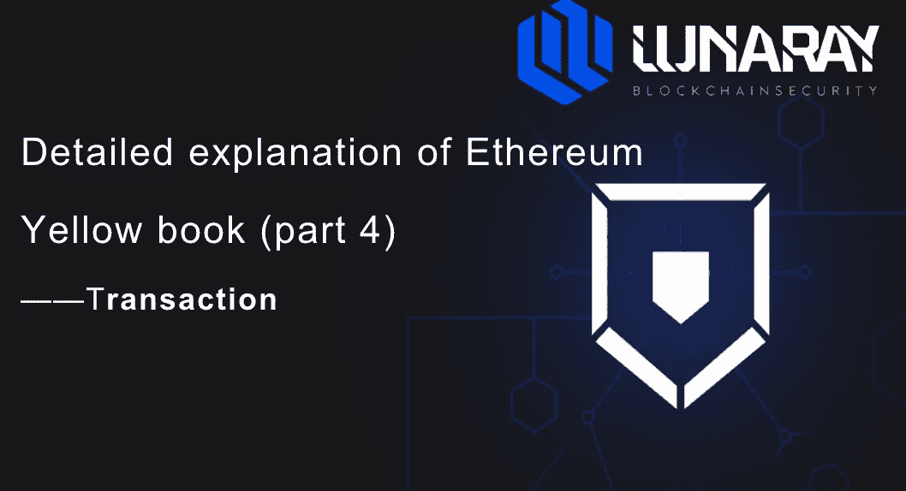
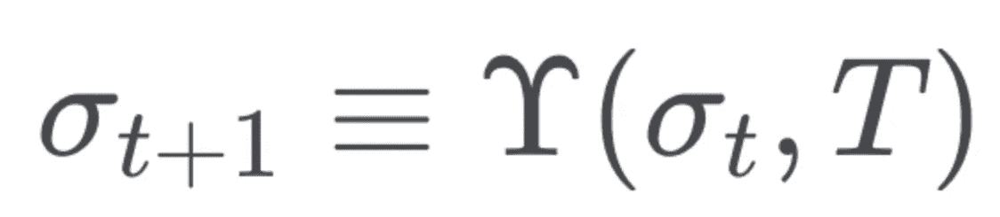

# 以太坊黄皮书详解(四)——交易

> 原文：<https://medium.com/coinmonks/detailed-explanation-of-ethereum-yellow-book-part-4-transaction-481fb378ad2e?source=collection_archive---------34----------------------->

> 以太坊如何进行交易？在本文中，我们将讨论事务验证规则，以及它们存在的原因；然后，我们将深入研究事务是如何执行的，以及节点在验证事务时采取的每一步。
> 
> 欢迎关注并与我们讨论
> 
> 作者:[support@lunaray.co](mailto:support@lunaray.co)

## 0x01 简介

简单地说，状态转换函数使用当前状态和事务作为输入来计算下一个状态。

## 0x02 交易验证

在执行事务之前，节点验证事务是否满足一些基本规则。如果连这些基本规则都不通过，节点就不会执行事务。

*   符合 RLP 编码格式
*   有合法签名
*   具有合法的 nonce(与交易发送方的当前 nonce 值相同)
*   执行交易的(内在成本)低于交易设置的 gas 限制的交易
*   发送者的账户余额大于或等于交易所需的预付款

还有一个规则，不是事务固有的规则——如果一系列准备打包成一个块的事务，加上这个事务，会使所有事务的总 gas 限制超过该块的 Gas 限制，那么那个事务就不能和那些事务一起打包成一个块。

*   **符合 RLP 编码格式**

RLP(递归长度前缀)是以太坊中序列化对象的编码方式；与其他方法一样，如果不根据 RLP 对对象进行编码，就无法对对象进行解码，也无法通过数据编码信息获得原始对象。该规则的目的是确保以太坊客户端在收到交易后，能够成功解码并执行交易。

*   **交易必须有合法签名**

假设你的以太坊账户里有很多以太，现在有人试图发起交易把你账户里的钱转到他自己的账户里，你怎么看？你肯定不想看到有人冒充你，偷你的钱，这就是为什么我们需要交易签名。以太坊使用非对称加密，确保只有实际控制人才能从账户发起交易。在以太坊上，账户地址由个人的**公钥**生成。当发送交易时，**私有密钥**用于签署交易，然后所有**节点**可以确定交易是否实际上由相关账户的私有密钥的所有者签署。没有合法签名的交易没有执行的意义，所以必须有合法签名是交易的固有规则之一。

*   **交易随机数和账户随机数必须匹配**

在以太坊中，账户 nonce 值代表账户发送的交易数量(在合约账户的情况下，nonce 值是指账户创建的合约数量)。如果没有 nonce，同一事务可能会被错误地执行多次(所谓的“重放攻击”)。以太坊强制交易随机数值与账户随机数值相匹配。这不仅可以防止重放攻击，还可以确保事务只执行和改变一次状态。

*   **交易的固有成本必须低于交易设定的气体上限**

每个事务都有与之相关的 gas 发送一个事务的成本由两部分组成:**固有成本**和**执行成本**。执行成本取决于事务需要运行多少**以太坊虚拟机** (EVM)资源，执行一个事务需要的操作越多，执行的成本就越高。固有成本由事务的**有效负载**决定，分为以下三个有效负载:

*   如果交易是为了创建智能合约，则有效负载是创建智能合约的 EVM 代码
*   如果事务要调用智能合约的函数，那么有效负载就是执行消息的输入数据
*   如果交易只是两个账户之间的转账，那么有效负载是空的
*   g 交易= 21，000 魏
*   Gtxcreate = 32，000 魏
*   Gtxdatazero = 4 魏
*   gtxdata 非零= 68 微

## 交易前

交易前=气限*气价+价值(交易的气限)

## 0x03 执行事务

验证完事务后，就该执行它了。在以太坊中，执行一个事务改变状态——几个事务打包成一个块，每个块相当于一个事务列表；当事务按顺序执行时，会输出一个新的合法状态。交易执行如下:

1.  将发件人帐户随机数值增加 1
2.  来自发送方账户的借记交易预付款(gasLimit * gasPrice)
3.  确定交易可用于执行的 gas 值(gasLimit 内在成本)
4.  执行事务中包含的操作(转移、调用或创建智能合约)
5.  通过**自毁**和**存储**功能向发送方退款
6.  将任何未使用的**气体**退还给交易的发送者
7.  将采矿收入转移至受益人账户(通常属于开采包含交易的区块的采矿者)

REF:https://ether eum . github . io/yellow paper/paper . pdf

> 加入 Coinmonks [电报频道](https://t.me/coincodecap)和 [Youtube 频道](https://www.youtube.com/c/coinmonks/videos)了解加密交易和投资

# 另外，阅读

*   [Godex.io 审核](/coinmonks/godex-io-review-7366086519fb) | [邀请审核](/coinmonks/invity-review-70f3030c0502) | [BitForex 审核](https://coincodecap.com/bitforex-review)
*   [最佳比特币保证金交易](/coinmonks/bitcoin-margin-trading-exchange-bcbfcbf7b8e3) | [萝莉点评](/coinmonks/lolli-review-e6ddc7895ad8) | [比特币保证金交易](https://coincodecap.com/bityard-margin-trading)
*   [创造并出售你的第一个 NFT](https://coincodecap.com/create-nft) | [密码交易机器人](https://coincodecap.com/best-crypto-trading-bots)
*   [如何在 CoinDCX 上购买柴犬(SHIB)币？](https://coincodecap.com/buy-shiba-coindcx)
*   [CBET 评论](https://coincodecap.com/cbet-casino-review) | [库科恩 vs 比特币基地](https://coincodecap.com/kucoin-vs-coinbase) | [拜比特 vs 比特币基地](https://coincodecap.com/bybit-vs-coinbase)
*   [折叠 App 回顾](https://coincodecap.com/fold-app-review) | [LocalBitcoins 回顾](/coinmonks/localbitcoins-review-6cc001c6ed56) | [Bybit vs 币安](https://coincodecap.com/bybit-binance-moonxbt)