# 用科学和数据确定比特币的价值

> 原文：<https://medium.com/coinmonks/determining-bitcoins-value-with-science-data-d514a7aee524?source=collection_archive---------4----------------------->

pixabay

# 技术价值

我们经常听说比特币的价值在于它的技术。在本文中，我们将深入探讨这个问题，并试图找出原因和方法:

*   为什么比特币如此成功
*   比特币的技术是如何让这一切发生的

# 今日比特币

在撰写本文时，比特币的市值略高于 8000 亿美元。根据 NYDIG 的 G. Cipolaro 和 E. Kochav 在 2022 年 1 月发表的一份研究报告，比特币的年支付交易量已经超过了美国运通。为避免误报此类数据，该报告修改并排除了经济价值有限的交易，如排除实体内交易(同一钱包内或由同一公司管理的地址之间的交易)。现在我们已经清除了它，看看下面的图表。

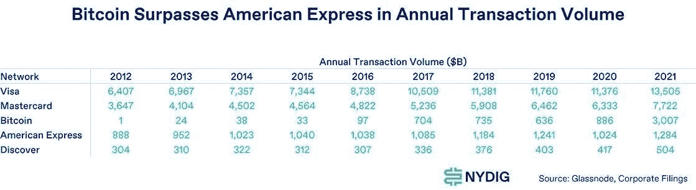

*图片来源:NYDIG 报告(LinkedIn)*

根据这项研究，比特币在 2021 年处理了 3.0T 美元的支付，超过了美国运通(1.3T 美元)和 Discover(0.5T 美元)等知名的卡网络。尽管这仍然低于 Visa 的 13.5 美元和 Mastercard 的 7.7 美元，但如果我们观察比特币与其他支付网络的交易量增长，我们可以看到，到 2021 年底，交易量在过去 5 年中每年增长约 100%(g . Cipolaro，E. Kochav，NYDIG，2022 年 1 月)。请看下图。

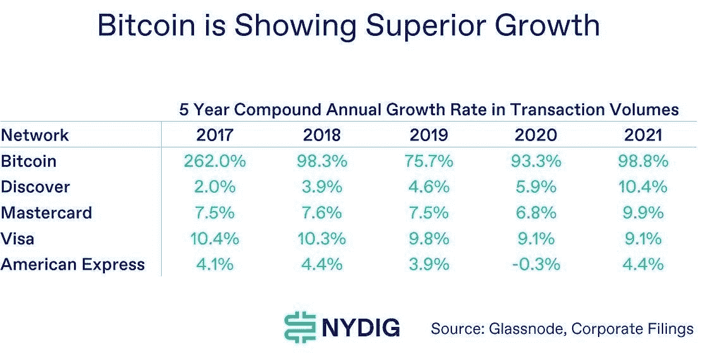

*图片来源:NYDIG 报告(LinkedIn)*

对于一个只有 13 年历史的支付网络来说，这是一个惊人的增长。对比一下信用卡网络的历史，Visa 于 1958 年推出，1976 年推出借记卡(《Visa 的历史》，visa.com，2022 年)，MasterCard 于 1966 年推出(《品牌历史》，mastercard.com，2022 年)，Amex 于 1958 年推出(《我们的历史》，americanexpress.com，2022 年)，它们都是支付领域最知名的品牌。

此外，根据开发新的链上测量和解决方案的区块链分析和情报提供商 Glassnode 的数据，截至 2021 年 12 月，比特币的每日活跃地址平均为 97 万个(《比特币:活跃地址的数量》，Glassnode.com，2022 年)。

基于上面提供的数据，我们可以事实上确定比特币的支付网络正在被积极使用，鉴于十年前只有几千个活跃的日常地址(《比特币:活跃地址的数量》，Glassnode.com，2022 年)，每天大约有 100 万用户每年结算的交易量超过美国运通，采用率令人震惊。

考虑到所有这些，我们可以使用梅特卡夫定律来计算比特币的价值。梅特卡夫定律建立在描述“n”个用户之间连接性的数学重言式基础上。随着越来越多的个人加入网络，他们对网络价值的贡献是非线性的:网络价值等于用户数量的平方。梅特卡夫定律已被经验证明能够对各种网络效应技术和业务进行估值(马杜雷拉、a .、登哈托格、f .、布曼、h .、巴肯、N. 2013)。

让我们考虑经验证据，并使用梅特卡夫定律计算比特币的价值。见下文:

**梅特卡夫定律:比特币 vs 互联网应用**

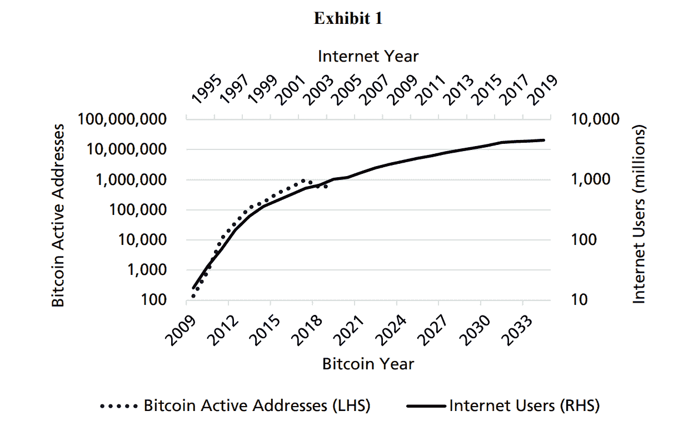

如图表 1 (T. Peterson，2019 年 3 月)所示，互联网是网络经济学研究的优秀教程。对于比特币来说，这是一个很好的类比，因为比特币需要互联网接入才能发挥作用。两者都在不同的国家得到了不同程度的接受，但随着时间的推移，两者的接受度都有所提高。

我们可以用等式(Metcalfe 值 V 如下:VV = AA nn(nn 1) / 2)对表 1 中的互联网用户数计算互联网的 Metcalfe 值。这与同一时期的道琼斯互联网综合指数完全一致，尽管事实上它是附表 2 中的独立价值衡量指标(T. Peterson，2019 年 3 月):

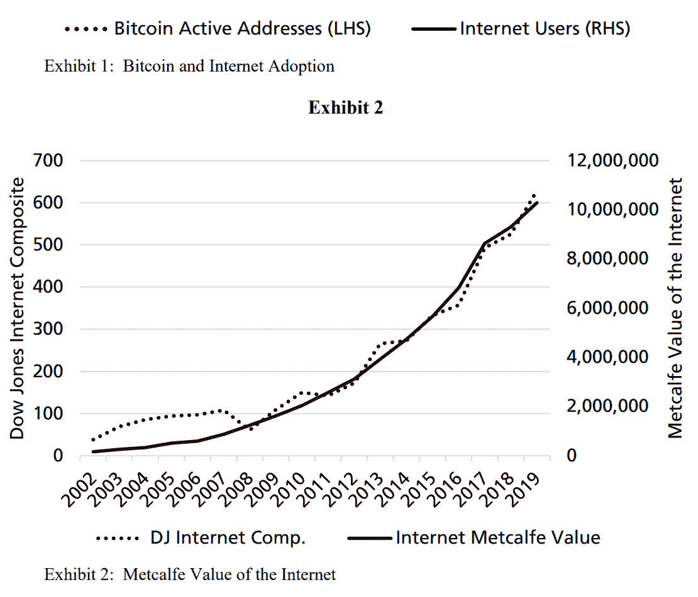

接下来，我们来看看一家具体的互联网公司:脸书(Meta)。与比特币相比，脸书是一个绝佳的候选者。每个数据系列的持续时间非常相似(10 年或更长)。两者都很有创新性，尽管并不完全独特(DigiCash 先于比特币，MySpace 先于脸书)。)两者在中国都受到禁止，并且都因其被收养而获得了很多关注(T. Peterson，2019 年 3 月):

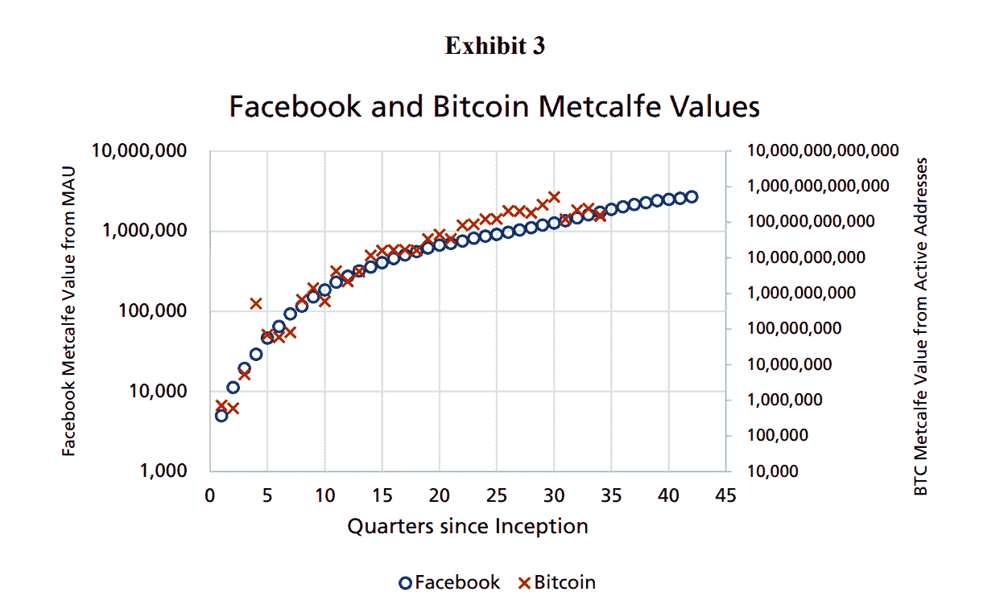

根据图表 3 中的计算，从中长期来看，比特币的价值似乎遵循梅特卡夫定律(类似于脸书)。

然而，接下来要回答的问题是为什么。比特币成功背后的秘密是什么？

# 为什么

比特币是会计 7000 年历史中第一个不可变的账本。在 5000 年的货币历史中，第一个不需要中央权力机构、不能被扣押或没收的防审查支付网络。

经济学家和历史学家认为，为什么一些物品被认为是货币商品，而另一些则不是，这可以在定义“好货币”的各种标准中找到解释。一件商品拥有的特征越多，它就越能发挥货币的功能，或者越有可能作为货币出现或被接受(“货币的起源”，卡尔·门格尔，1892)。

卡尔·门格尔在《货币的起源》一书中调查了人类历史上货币的流动性、稀缺性、可分性和持久性。让我们将这些特征与今天的交换价值(黄金和法币)和比特币进行比较，如下所示(富达数字资产报告，2022 年):

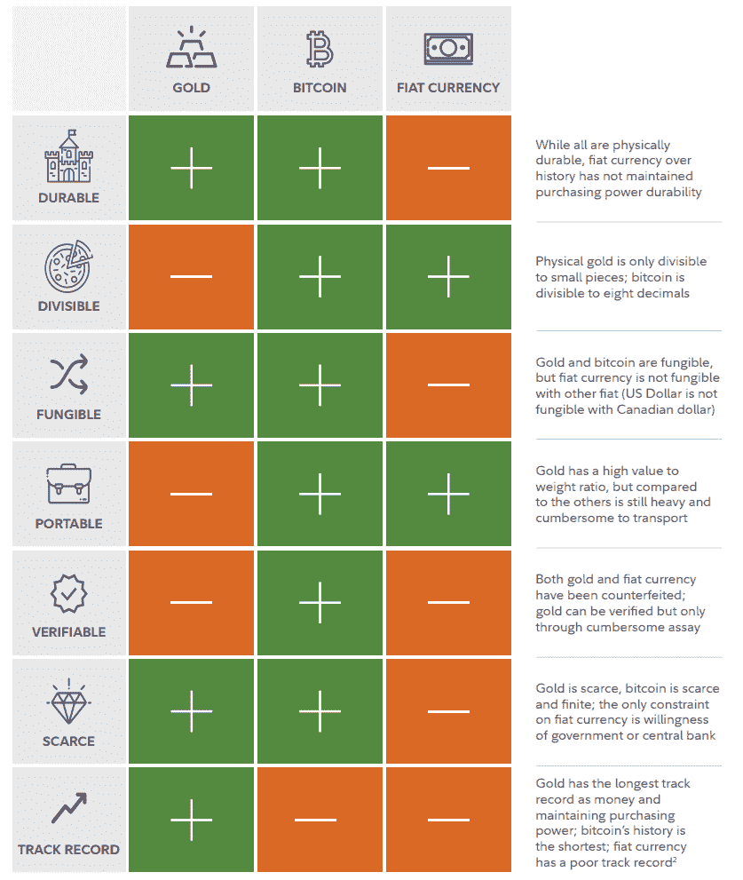

*图片来源:富达数字资产报告(2022)*

比特币显然将黄金的稀缺性和耐久性与便利性、存储性以及对法定货币运输便利性的改善结合在了一起。

此外，法定货币的记录令人沮丧，平均每 19 个月就会发生一次重大的货币危机(Krugman，1999，“货币危机”)。

此外，克鲁格曼强调历史上政府对货币市场的干预，一个例子是“竞争性贬值”。

> “在 1992 年至 1993 年的欧洲危机中，有一个竞争性贬值的因素:英镑贬值对法国的贸易和就业产生了不利影响……”

让我们看看货币历史上的两个主要挑战，正如克鲁格曼在《货币危机》中指出的那样，以及比特币如何应对它们:贬值和控制。

**贬值**

比特币品质中最重要的一个方面是其稀缺性。绝对不会超过 2100 万个比特币。与主权货币相比，比特币的货币政策可能被认为是最可信的。

与法币世界形成对比的是，在法币世界中，过度通胀是历史上经常发生的事情，导致了灾难性的经济崩溃(“货币危机”，克鲁格曼，1999 年)，比特币的通胀率约为 1.8%(富达数字资产报告，2022 年)。是的，随着越来越多的比特币被开采，比特币会经历通胀，但由于新比特币的数量每四年自动减少一半，比特币的通胀率也会随着时间的推移而降低。这是因为为了减少采矿支出，每块的奖励每四年减半，这意味着生产新的比特币变得越来越昂贵。随着时间的推移，每枚硬币都变得越来越值钱。相比之下，随着时间的推移，美元等货币不可避免地会失去购买价值。

**控制**

与菲亚特不同，由一个中央机构控制比特币网络几乎是不可能的。由于比特币是去中心化的，没有任何个人、机构或国家拥有或控制比特币网络或管理它的规则。必须明确指出的是，没有任何矿商财团或最大的比特币所有者财团能够决定网络的进程或修改其规则。这是因为每个提议的改变都必须得到网络参与者，即节点运营商的批准。

简单地说，节点控制着矿工。

节点操作员是任何运行比特币实现并存储整个区块链的计算机。任何人都可以成为节点运营商，建立一个比特币节点很简单，使用一台家用电脑就可以完成。所有节点都自由运行，并用于验证区块链事务是否有效。共识规则的任何改变都需要 95%的节点的批准，这使得单个组织改变比特币软件变得极其困难。目前全世界有超过 14，000 个活跃的完整节点，仅在去年节点数量就增加了约 30%(bit nodes，2022)。

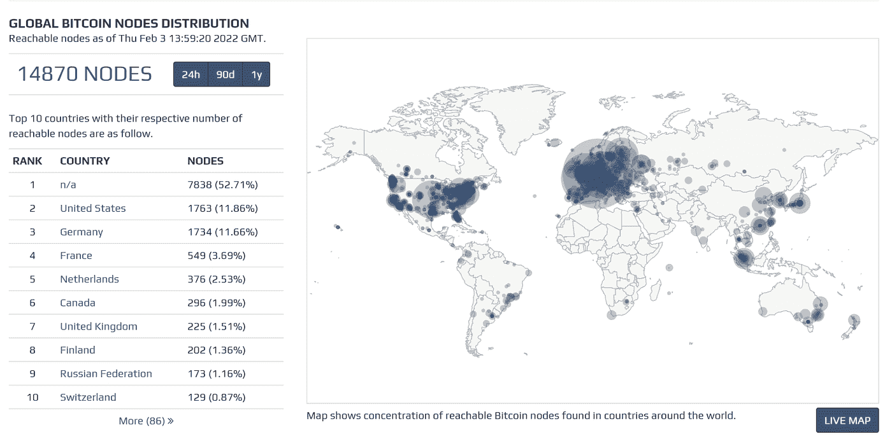

*图片来源:bitnodes.io*

此外，比特币有效地解决了双重花费问题，并为数字形式的货币提供了一个实用的解决方案，此前 DigiCash (D. Chaum，1982 年)和 E-Gold (H. White，2014 年)都曾尝试过，但都因不切实际而失败。比特币创造了世界上第一个去中心化的区块链，并为拜占庭将军问题提供了一个实用的解决方案(Lamport & Shostak，1982)。

下一个问题是，它是如何做到以上所有这些的？

# 怎么做

考虑开发一个不可信的系统，在这个系统中，你可以在不信任任何人的情况下进行支付，也不用担心你的资金被冻结或被黑客攻击，以及一个不可变的公共账本，不能被任何第三方修改、编辑或控制(比特币白皮书，中本聪，2008)。

但是我们怎么能相信这样的公共账目呢？如何阻止某人进入交易？我们如何确定所有这些交易都是发送者想要的呢？

**数字签名**

这里的概念是，类似于手写签名，用户应该能够在每笔交易旁边添加一些内容，以确认他/她已经看到并授权了该交易，并且其他任何人都不可能伪造该用户的数字签名。

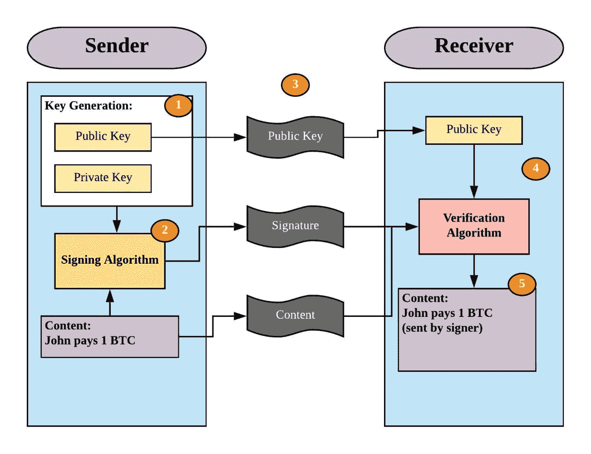

*图片来源:中*

但是数字签名怎么能被认为是安全的呢？其工作方式是每个用户生成一个私钥和一个公钥对。私钥是你自己保留的东西，因此它是私有的。数字签名看起来像一串 1 和 0，通常由 256 位数字组成。

例如，创建一个数字签名(对于每条消息，即交易，数字签名是不同的)需要一个依赖于消息和你的私人密钥的函数。私钥确保只有您可以生成签名，并且它依赖于消息的事实意味着没有人可以在另一条消息上伪造您的签名。

第二个功能是验证签名，这是公钥发挥作用的地方。它通过返回“真”或“假”来实现，这取决于签名是否是由与用于验证的公钥相链接的私钥创建的。

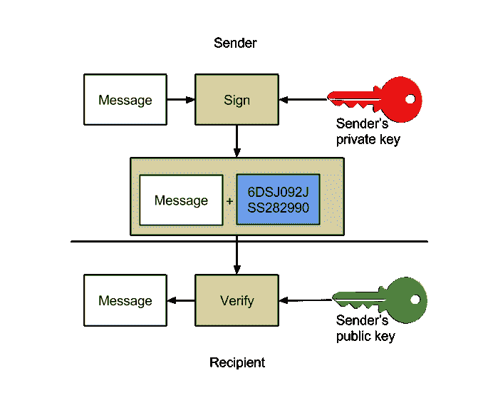

*图片来源:medium*

因此，当您验证针对特定消息的签名是合法的时，您可以确定某人创建该签名的唯一方式是他们将秘密密钥与您用来验证它的公共密钥相链接。否则，找到有效的签名是完全不可能的。例如，为了验证消息是合法的，以下情况适用:

验证(发件人消息+ 256 位签名+公钥)= TRUE。

运行每个潜在的特征码组合将花费大量时间:

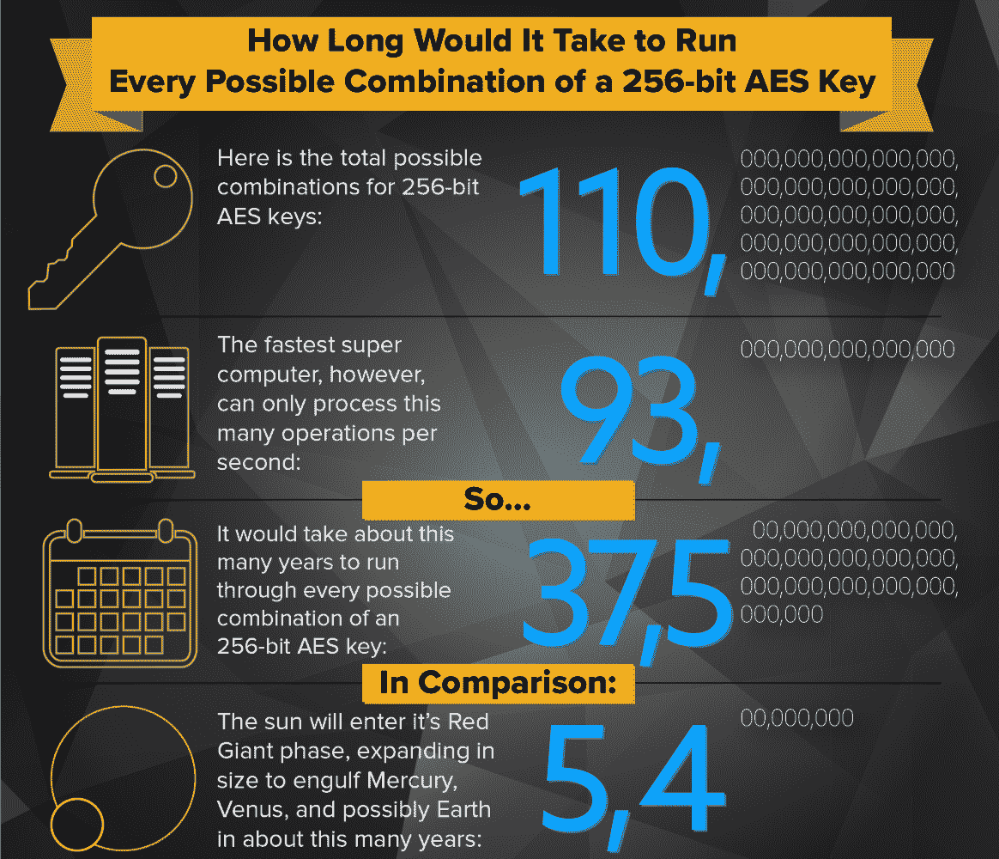

*图片来源:info.townsendsecurity.com*

此外，为了避免欺骗性地复制正确的消息/签名组合，每笔交易都有一个唯一的 id，与分类帐上的交易相关联。

**台账是分散的**

目前的系统和比特币的主要区别在于，比特币网络上的账本是去中心化的。本质上，每个人都有自己的分类账副本，当用户执行交易时，他们只需将这些交易广播到网络，以便其他用户听到并记录/更新他们自己的私人分类账上的新交易。

但是，我们如何让每个人都同意哪个版本的分类账是正确的呢？例如，如果 Bob 从 Alice 那里收到了 100 美元的交易，Bob 如何确定其他人也收到并相信了同样的交易，并且他将能够找到 Charlie 并在以后使用同样的 100 美元执行交易？

如果分类账是分散的，我们怎么能确定每个人都以同样的顺序记录同样的交易呢？如何才能达成共识？这也被称为拜占庭将军的问题(Lamport & Shostak，1982)。

**比特币的解决方案**

比特币提供的解决方案是，相信计算工作量最大的账本。如果我们使用计算“工作”作为信任的基础，那么欺诈交易和冲突分类账将需要不可行的计算量来实现。

这将我们引向工作证明，这是比特币网络确认和记录其分类账交易的方法。这也被称为“挖掘”，那些确认和添加广播交易的人被称为“矿工”

举个例子，

*   当事务发生时，它们被分组到一个块中进行挖掘。
*   然后，比特币的工作验证算法 SHA256 会为该区块生成一个哈希。
*   矿工们竞相成为第一个生成低于块散列的目标散列的人。
*   胜利者将获得将最新交易加入比特币网络的特权。他们还以新创造的硬币和交易费的形式获得比特币奖励。

请参见下面的简化示例:

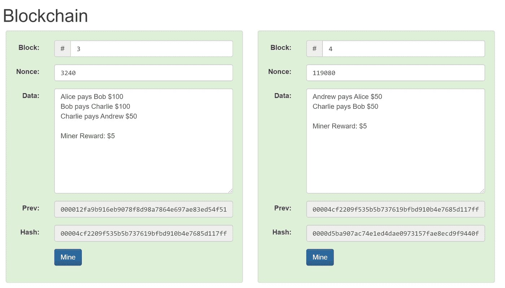

*图片来源:andersbrownworth.com/blockchain*

你有一个块，上面有前一个块的散列和一串数字，叫做‘nonce’。该块包含一个交易列表，以及对块验证器(通常称为挖掘器)的奖励。

然后挖掘器将散列整个块，在底部产生一个新的散列。因为哈希过程本质上是由计算机求解数学方程完成的“工作”，这意味着矿工必须投资采矿机器、这些机器的存储以及保持机器运行的电力。许多采矿企业额外支付精确的温度和湿度控制，以保持机器以最高效率运行。

当成功挖掘出一个散列数时，块挖掘者因验证该块而获得报酬，并且以比特币支付报酬。新的散列然后被放置在下一个块中，并且挖掘开始于该新块的散列和‘nonce’号。

**哈希算法**

工作证明要求矿工找到一个唯一的号码。

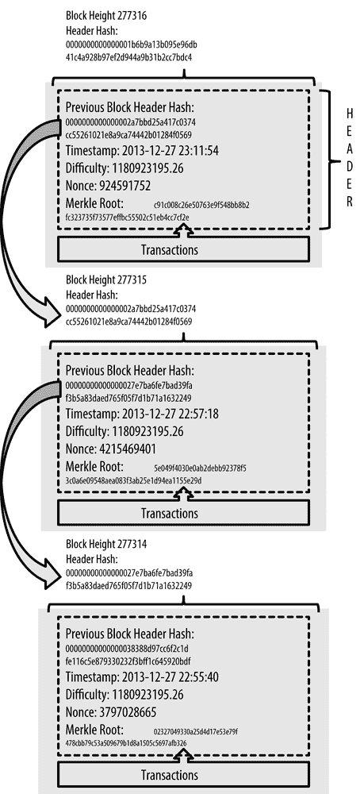

Image source: https://www.oreilly.com/library/view/mastering-bitcoin/9781491902639/ch07.html

挖掘器的目的是获取当前块的头，向其中添加一个称为 nonce 的随机数，并计算散列。哈希的数值必须小于目标值。

换句话说，我们必须获得人们希望添加到区块链的所有交易的列表，向该列表添加一组随机的数字和字母，然后计算所有这些的 SHA256，直到我们获得具有特定数量的零的输出。

让我们使用一个实际的例子:要获得奖励和开采一个区块，您必须使用 SHA256 加密算法找到结尾带有两个零的“hello”。

要做到这一点，从猜测和检查 1 开始，并从那里开始。

使用此链接进行测试:

emn178.github.io/online-tools/sha256.html

*所以你从“hello1”开始，一路向上，直到找到它。当你看到“hello1140”时，你已经完成了谜语，因为它显示了两个零。你的努力会得到回报，链条上也会增加一块。*

*查看最近的比特币区块，我们可以观察到，在格林威治时间 2022 年 2 月 8 日中午 12:00，一个名叫' Poolin '的矿工要计算 19 个零(blockchain.com/btc/blocks):*

*00000000000000000002f 5c 19 a 296 a 82 af 57921d 01637 e 81908 ef 649008693d*

*挖掘难度随着更多矿工加入网络(更多零)而增加，或者如果矿工以 10 分钟的平均块确认时间离开网络，则挖掘难度降低(更少零)。*

*前一个块中任何数量的任何改变都会使散列值完全无效。请看下面的例子，如果“Bob 向 Charlie 付款”被修改为 101 美元而不是原来的 100 美元，会发生什么情况。*

*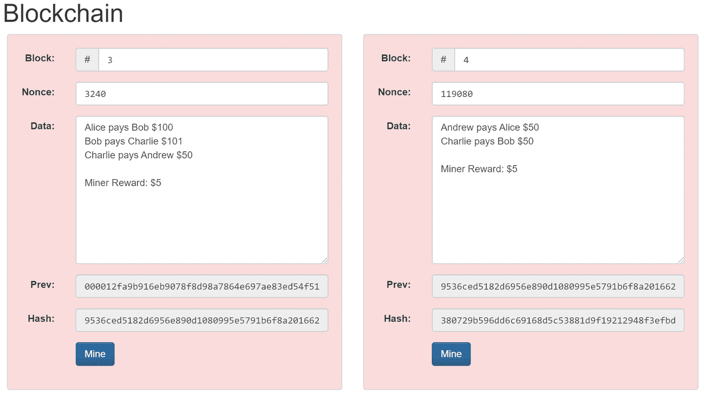*

*【andersbrownworth.com/blockchain】图片来源:T4*

*正如你所看到的，散列数字现在是无效的。因为散列值必须以一串零开始才合法，所以必须重复所有的工作，为每个块设计一个新的特殊数字，使它们的散列以零开始，并说服网络的 95%同意这样的修改。*

*比特币的网络可以被操纵用于任何未来交易的唯一方式，是只有有人设法获得 51%的开采权。然而，这样的攻击是非常不可能的。*

***51%攻击***

*51%攻击，也称为多数攻击，发生在单个个人或一组人控制了区块链上超过 50%的哈希能力时。成功的攻击者获得阻止新事务完成和重新排序新事务的权力。*

*虽然这在技术上是可能的，但对攻击者来说这将是极其昂贵的，因为攻击者将不得不花费大量的计算能力(电力和设备的成本)来实现 51%的 hashrate，并且攻击者的比特币挖掘设备(称为 ASICs)不能被重新利用并且昂贵，也将变得无用。即使恶意的矿工成功实施了攻击，比特币的价格也会暴跌，使他们刚刚窃取的比特币贬值。*

*本质上，由于“博弈论”的基础(R. Myerson，1991)，即游戏中的玩家是理性的，会试图使他们的收益最大化，为了攻击网络而产生大量的初始成本，而没有经济利益，这将使这种攻击变得非常不可能，实际上是不可能的。*

# *摘要*

*在 2008 年 10 月之前，没有任何数字形式的价值可以通过互联网直接与他人交易。*

*比特币通过阻止交易复制来解决重复支出的问题，因此当有人向你转移比特币时，它会一直留在你身边，直到你决定将它传递出去。*

*而且是完全点对点的。要接收比特币，你只需要一个比特币钱包，其他任何东西都不是数字化交易所必需的。没有订阅，没有注册费用，没有权限，最重要的是，没有第三方控制。*

*比特币做的和罐子上说的一模一样，而且做得很好。最终，是否使用它是而且一直是由人民决定的。正如中本聪所说，“20 年后，要么交易量非常大，要么没有交易量。”后者值得怀疑，根据目前的数据。*

**免责声明:本文包含的信息仅用于教育目的，不构成 Wheatstones 的任何形式的建议或推荐，也不打算供用户在做出(或避免做出)任何投资决定时依赖。**

## *参考资料:*

*Cipolaro，G. & Kochav，E (2022)比特币年交易额超过美国运通，NYDIG 研究周刊；*

*VISA (2022)签证历史，[https://www . VISA . co . uk/about-VISA/our _ business/History-of-VISA . html](https://www.visa.co.uk/about-visa/our_business/history-of-visa.html)*

*万事达卡(2022)品牌历史，[https://Brand . master card . com/Brand center/more-about-our-brands/Brand-History . html](https://brand.mastercard.com/brandcenter/more-about-our-brands/brand-history.html)*

*美国运通(2022)我们的历史，【https://about.americanexpress.com/our-history/default.aspx *

*Glassnode (2022)比特币:活跃地址数量，[https://studio.glassnode.com/metrics?a=BTC&m =地址。活动计数](https://studio.glassnode.com/metrics?a=BTC&m=addresses.ActiveCount)*

*a .马杜雷拉，f .登·哈托格，Bouwman，h .，Baken，N. (2013)梅特卡夫定律的实证验证:互联网使用模式如何随时间变化,《信息经济学政策》, 25(4)，246–256。*

*t . Peterson(2019)比特币像病毒一样传播，SSRN，第 7-10 页*

*k .门格尔(1892)货币的起源，威利代表皇家经济学会，《经济杂志》，第 2 卷，第 6 期，第 239-255 页*

*Kuiper，C. & Neureuter，J. (2022)比特币优先:为什么投资者需要将比特币与其他数字资产分开考虑。富达数字资产报告，第 4 页*

*克鲁格曼(1999)货币危机，国家经济研究局，芝加哥大学出版社，第 430-465 页。*

*Bitnodes (2022)全球比特币节点分布，[https://bitnodes.io/](https://bitnodes.io/)*

*Chaum D. (1983)不可追踪支付的盲签名。载于:Chaum D .，Rivest R.L .，Sherman A.T .(编辑)《密码学进展》。马萨诸塞州波士顿斯普林格。，第 199-203 页。*

*White，H. (2014)替代货币竞争令人不安的压制:自由美元和电子黄金的案例，卡托研究所，第 281-299 页。*

*Lamport，l .，Shostak，r .，Marshall，P. (1982)拜占庭将军问题，SRI 国际，ACM 编程语言和系统汇刊，第 4 卷，第 3 期，第 382-401 页。*

*中本聪(2008)比特币:点对点电子现金系统，[https://www.bitcoin.org。](https://www.bitcoin.org.)*

*迈尔森(1991)博弈论:冲突分析，哈佛大学出版社，第 1 页；*

> *加入 Coinmonks [电报频道](https://t.me/coincodecap)和 [Youtube 频道](https://www.youtube.com/c/coinmonks/videos)了解加密交易和投资*

## *也阅读*

* [## 杠杆代币[多头代币]终极指南

### 杠杆化令牌是具有杠杆化风险敞口的 ERC20 令牌，不考虑保证金、要求、管理…

medium.com](/coinmonks/leveraged-token-3f5257808b22)  [## 最佳加密交易所| 2022 年十大加密货币交易所| CoinCodeCap

### 哪一个是最好的加密交换？在本文中，我们将根据多种加密货币列出 10 大加密货币交易所

coincodecap.com](https://coincodecap.com/crypto-exchange)  [## 2022 年 2 月值得关注的三大游戏代币| CoinCodeCap

### 排名前 3 位的游戏也占交易总量的 85%以上。Defi 王国、Axie Infinity 和 Pegaxy…

coincodecap.com](https://coincodecap.com/top-3-gaming-tokens-to-look-out-for-in-february-2022)  [## 2022 年最佳加密交换平台| CoinCodeCap

### 随着时间的推移，我们大多数人将转向 dex 以获得更好的安全性和隐私。因此。在这里，我们将讨论…

coincodecap.com](https://coincodecap.com/best-swap-platforms)  [## 10 大最佳在线赌场|赢得并赢取免费 BTC 2022 | CoinCodeCap

### 接收、支付和赚取加密货币| |有各种各样的最佳在线赌场可供选择，有可能…

coincodecap.com](https://coincodecap.com/best-online-casinos)  [## 2021 年最佳加密借贷平台| 6 大比特币借贷平台

### 获得比特币和其他加密货币的最佳贷款利率

medium.com](/coinmonks/top-5-crypto-lending-platforms-in-2020-that-you-need-to-know-a1b675cec3fa)  [## 2021 年 6 大最佳硬件钱包|顶级加密硬件钱包[更新]

### 最好的加密货币硬件钱包是绝对必要的。我们将在 NGRAVE、Ledger Nano X 和…

medium.com](/coinmonks/the-best-cryptocurrency-hardware-wallets-of-2020-e28b1c124069)  [## 加密交易机器人——19 款最佳免费加密交易机器人

### 2022 年币安、比特币基地、库币和其他密码交易所的最佳密码交易机器人。四进制，位间隙…

medium.com](/coinmonks/crypto-trading-bot-c2ffce8acb2a)*