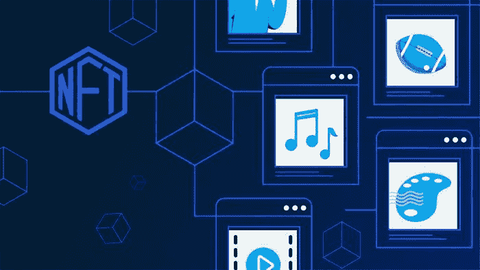
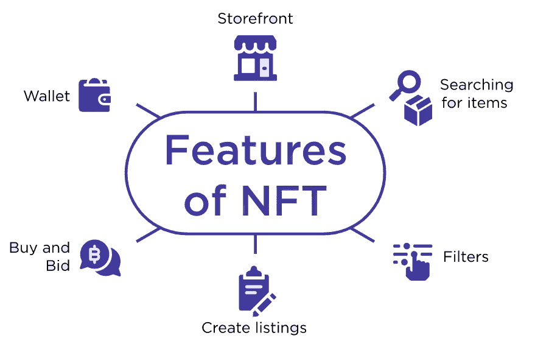
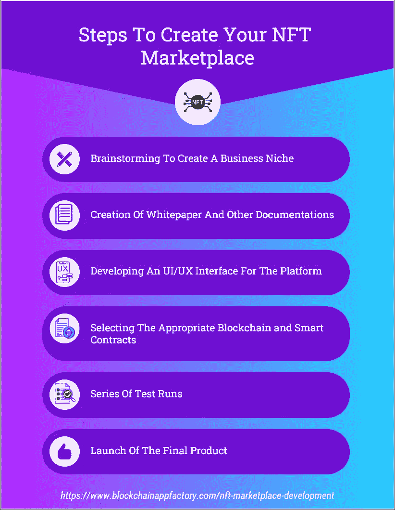
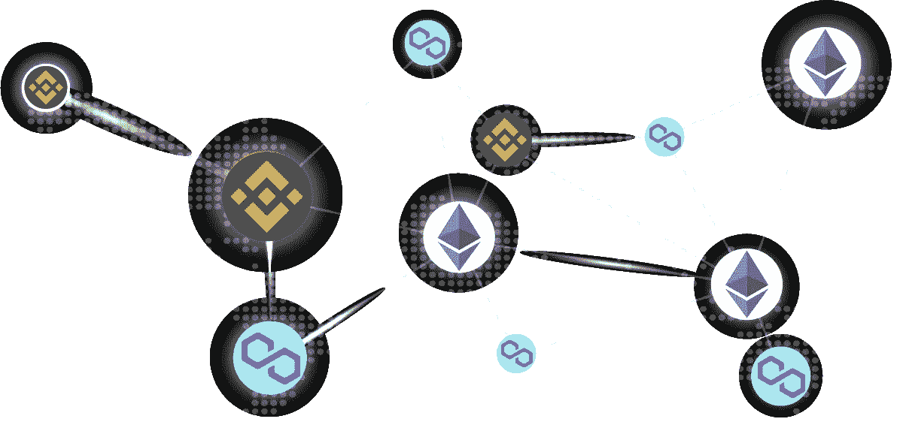

# 发展 NFT 市场——为什么它不会出错，不会落伍？

> 原文：<https://medium.com/coinmonks/developing-an-nft-marketplace-why-cant-it-go-wrong-and-out-of-trend-8debbaa86ceb?source=collection_archive---------38----------------------->

自从第一个不可替代代币(NFTs)出现以来，专家们一直在声明这些数字代币将改变未来的日常生活。基本上，NFT 是虚拟令牌，为它们支持的项目提供所有权和真实性的证明。

2021 年，由于早期采用者、创作者和名人的突然意识，全球 NFT 销售爆炸。但是，这里数不清的英雄是 NFT 市场，因为他们在促进价值数十亿美元的数百万笔交易中发挥了作用。这篇博客聚焦于*的 NFT 市场，并给出了一些为什么他们在任何情况下都不会失败的见解。*

## *什么是 NFT 市场？*

*NFT 市场是一个人们可以交易由不可替代代币支持的资产的平台。这些平台几乎出现在每一个区块链网络上，因为它们在将企业/创造者和追随者聚集在一起方面发挥了作用。虽然一些 NFT 市场专注于横向交易(*如 Opensea、Rarible 和 Solsea* )，但其他一些市场则专注于迎合垂直用户群(*如 SuperRare、Sorare、Decentraland 和 NBA Top Shot* )。NFT 市场出售艺术品、音乐、视频剪辑、游戏内资产等资产，以及元诗句中的土地。加密货币、稳定硬币和法定转账是当前的支付选项，尽管后两种很少出现。*

## *NFT 市场的工作流程*

*   *用户(买家/卖家)在平台上创建自己的账户，并链接加密钱包。*
*   *卖家为他们的资产创建 NFT，填写必要的细节并发送给管理员审核。*
*   *如果 NFT 满足所有的条件，管理员会协调并接受列表请求。*
*   *潜在买家可以查看 NFT 的资产，并在查看所有提供的信息后出价或报价。支付值从他们的钱包中取出并保留。*
*   *如果卖方喜欢这个报价或者截止日期到了，他们可以接受请求，NFTs 被转移给买方。付款被发放给卖方。*

## *NFT 市场的基本特征*

**

*   ***店面** —它显示 NFT 资产的所有细节，包括描述、定价和销售类型。*
*   ***搜索和过滤** —这些选项帮助用户通过高级编程引擎找到他们喜欢的 NFT 资产。*
*   ***列表门户** —通过提供足够信息的选项，帮助卖家列出他们的 NFT 待售资产。*
*   ***竞价门户** —它帮助买家竞价并了解 NFT 资产出售的当前状态。*
*   ***加密钱包**——它帮助用户存储他们的加密货币和 NFT 资产。*
*   ***评级和评论** —这些选项帮助 NFT 市场的新用户了解哪些 NFT 系列表现良好。*

* [## NFT 市场开发|不可替代代币市场|白标 NFT 市场|…

### NFT 市场的发展正在塑造即将到来的创业公司的未来，以在竞争中胜出。构建您自己的…

bit.ly](https://bit.ly/3xy6Fbz) 

## 发展 NFT 市场的步骤

*   首先，绘制 NFT 市场平台的平面图。这里的规划包括商业机会、目标利基、竞争对手、要使用的技术等等。
*   然后，通过创建提供良好用户体验的用户界面(UI)屏幕，在 NFT 市场开发中开展前端工作(UX)。
*   继续在 NFT 市场开发后端工作，在那里你建立所有与功能相关的功能，包括编程和区块链集成。
*   根据您的要求为平台和本机令牌创建智能合约。
*   广泛测试 NFT 市场平台的任何缺陷，并在发现错误时进行故障排除。使用多个测试案例来确保开发的 NFT 市场是完美的。
*   最后， [***推出 NFT 市场平台***](https://bit.ly/3xy6Fbz) 供公众使用。定期获得反馈，并在未来版本中实现有效点以保持更新。

## NFT 市场发展的好处

*   发展 NFT 市场的一个主要好处是，你可以在你的企业周围获得一个用户群，不管你是基于横向还是纵向业务。
*   此外，NFT 市场的发展有利于各种最终用户(创作者，销售者，粉丝和收藏家)，弥合了贸易光谱之间的差距。
*   开发一个 NFT 市场也降低了 NFT 新手创作者和收藏家的门槛，因为大作品通常都有卑微的起点。
*   此外，NFT 市场可以通过围绕该平台产生一个热情的社区来使风险企业受益。这甚至可以为社区参与至关重要的分散自治组织(DAO)铺平道路。

## 多链和跨链 NFT 市场-预览

在当前 NFT 资产全球销售蓬勃发展的时代，如果你想取得巨大成功，在单一区块链网络中的 NFT 市场平台不是一个可行的选择。这种思路导致了多链和跨链 NFT 市场的发展。

*   **多连锁 NFT 市场**是作为独立实体运作的平台，尽管所有东西都属于一家企业。当用户打算钻研一个新的区块链网络时，这个特性非常有用，而一致性可以帮助他们更好地适应环境。
*   **跨链 NFT 市场**是作为一个单一实体运作的平台，在区块链各地都有分支机构。在这里，您可以从一个主页轻松浏览多个区块链分部。这有助于获得更广泛的社区来有效利用不同的区块链。

## 为什么 NFT 市场的业务不会出错？

事后看来，NFT 市场类似于今天的电子商务网站，但出售完全不同的商品。随着对 NFTs 的热情与日俱增，支持社区的规模和地位也在增长。这种增长促进了对新 NFT 产品的需求，卖家/创作者需要平台在主舞台上展示他们的才华。这种必要性使得开发 NFT 市场成为一种冒险，可以在任何情况下在不稳定的 cryptos 世界中生存。需要 NFT 市场来弥合终端用户之间的差距，并使 NFTs 成为零售业务，这也意味着业务不能出错。

## 结论

因此，我们可以说，NFT 市场发展可以是一个理想的解决方案的企业家谁渴望融入热情的 NFT 社区。 [***发展一个 NFT 市场***](https://bit.ly/3xy6Fbz) 谈到一个长期经营的企业，也是一个不错的选择。如果你想开发一个 NFT 市场，有几家公司可以通过尽职调查帮助你。因此，非功能性金融交易将会继续存在，NFT 市场将会统治未来的世界！

> 加入 Coinmonks [Telegram group](https://t.me/joinchat/Trz8jaxd6xEsBI4p) 并了解加密交易和投资*