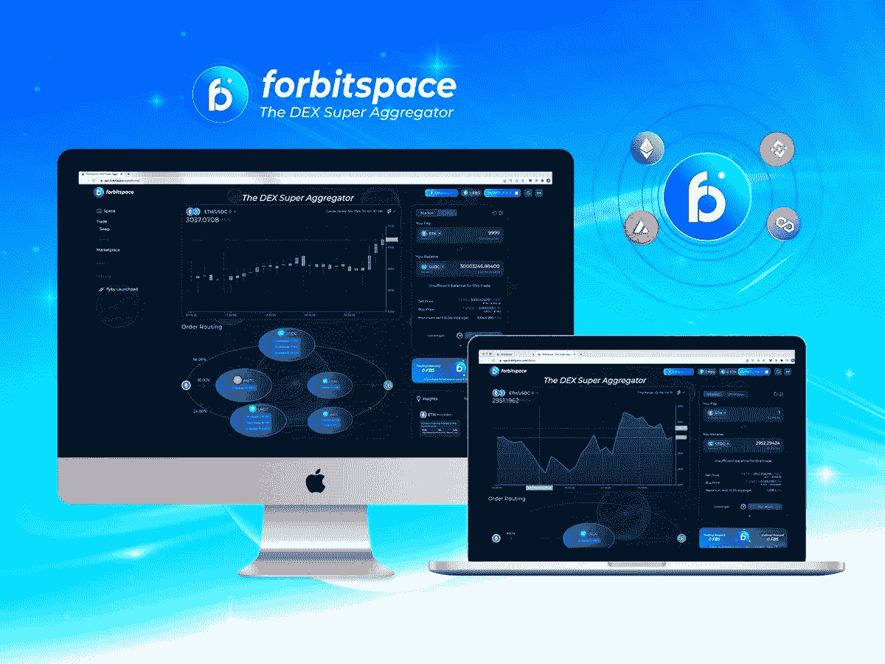
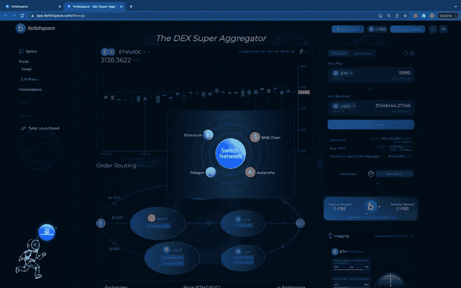
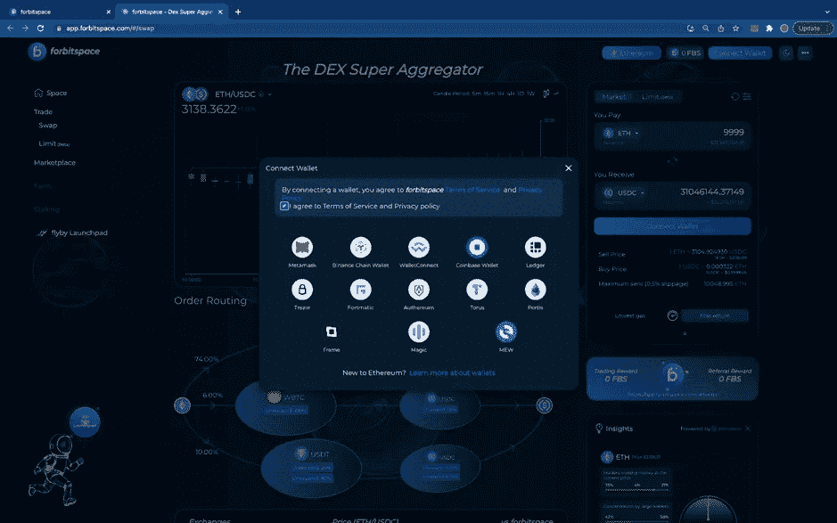
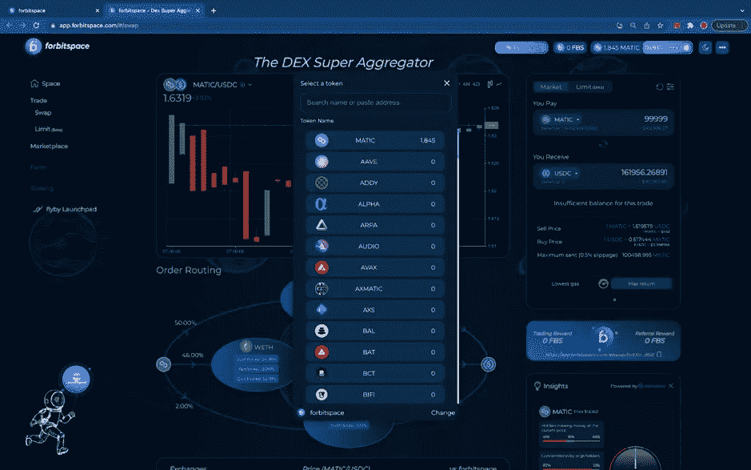
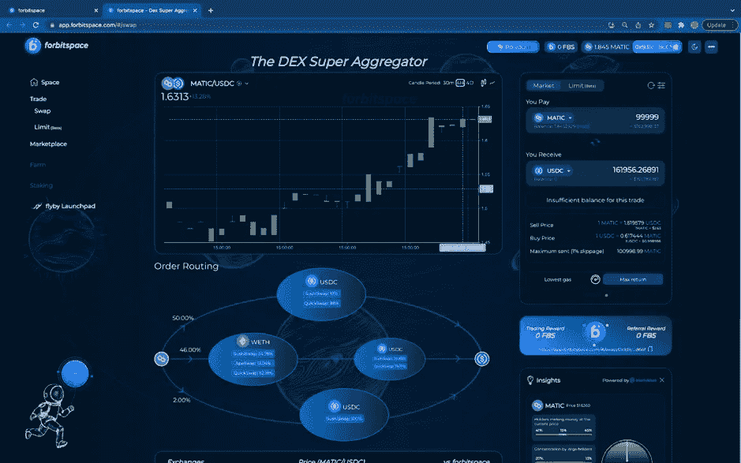
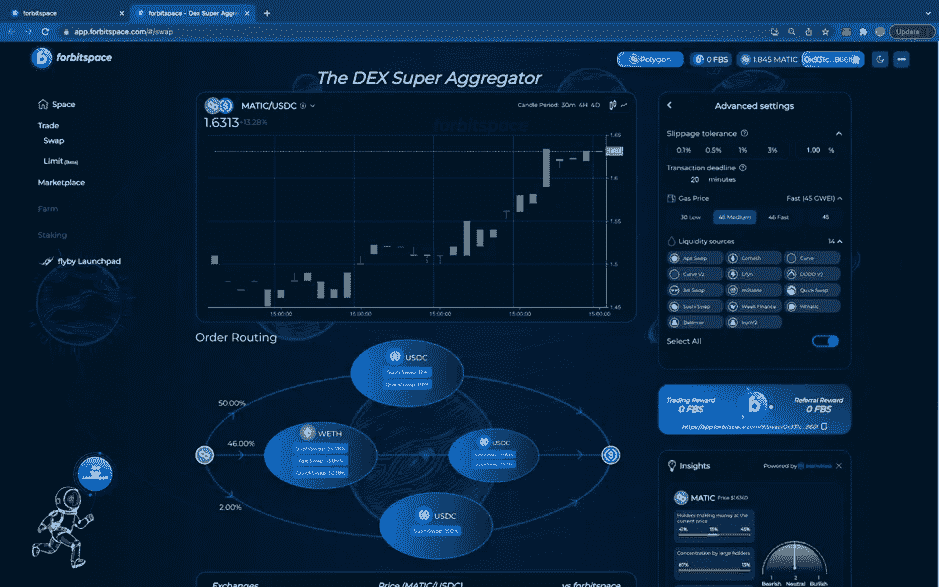
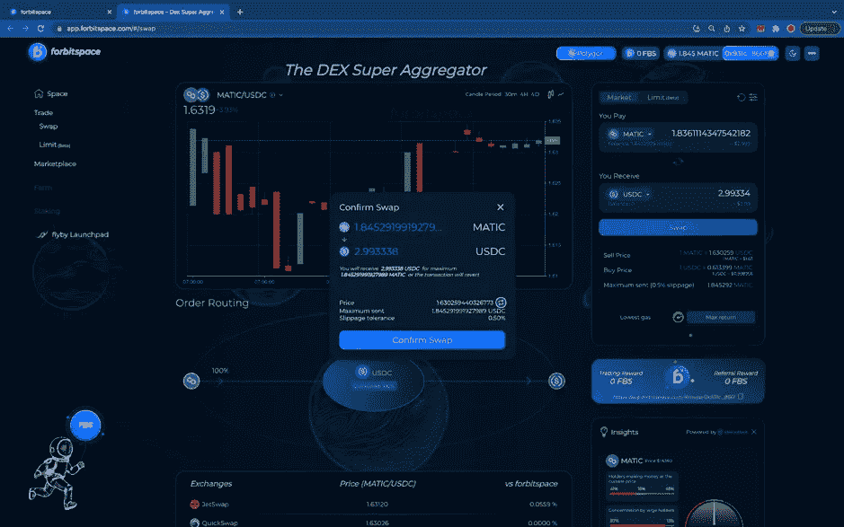

# 发展 Dapp！Dapp 更适合交易

> 原文：<https://medium.com/coinmonks/development-of-dapp-the-dapp-better-for-trading-c2cbb970f157?source=collection_archive---------46----------------------->

Dapps 越来越受欢迎了。之前大家都知道，Dapps 就是像经典应用一样工作的应用。但特别的是，它们运行在 mainnets 或特别分散的区块链上。

此外，Dapps 是使用开源代码的分散式应用程序。它们存储在区块链或对等节点上。由于 Dapp 的突出优势，这确保了用户信息的安全和保障。区块链的系统越来越多样化，有许多不同类型的 Dapps。通常是分散式交易所(dex)。

应用分散的区块链网络正在快速发展。这导致不同区块链的 Dapps 之间需要互操作性。让这一切快速、廉价地发生，并能被许多其他代币使用。

考虑到区块链空间应该是开放的，所有人都可以访问，它目前缺乏互操作性是广泛采用的一个主要障碍。幸运的是，有一些加密项目认识到了跨链交互的重要性，并且正在努力打破相关的障碍。一个这样的协议是 forbitspace DEX 超级聚合器。

考虑到区块链空间应该是开放的，所有人都可以访问，它目前缺乏互操作性是广泛采用的一个主要障碍。幸运的是，有一些加密项目认识到了跨链交互的重要性，并且正在努力打破相关的障碍。一个这样的协议是 forbitspace DEX 超级聚合器。

# **DEX 超级聚合器的主要特性**

特别是交易者可以通过以太坊、BNB 链、多边形和雪崩连接到更多的指数，轻松地从不同链上的主要指数获得流动性。这就是聚合协议的能力

此外，forbitspace 协议旨在从其他指数中聚集流动性。AMM 的 forbitswap 流动性协议将吸引流动性矿商。平台上的交易者可以为资金池提供流动性，并赚取更多 FBS 代币

我们通常知道交易者想以一个预定的价格卖出或买入，这个价格通常比市价更好。那么就经常使用限价单。forbitspace 是不收取任何费用的限价单协议之一。

大多数 DeFi 应用程序存在于以太坊网络上。然而，以太坊昂贵的交易费用让许多投资者远离了生态系统。这就是为什么 forbitspace 协议集成了其他几个区块链，包括 BNB 链(BSC)、多边形、雪崩

通常，做一笔交易(尤其是大交易量的交易)的成本经常被交易者放在天平上比较。交易者通常支付的费用包括服务交易费和在其他交易所交易产生的交易费。通常情况下，交易费用与直接使用 Uniswap 或 Curve 是一样的，甚至更低。除此之外，也有像 forbitspace 这样不收服务交易费的交易所。

forbitspace 是一个分散的超级聚合器，它利用区块链空间，提供一个多管齐下的生态系统来提高可扩展性和效率。这是一个可互操作的协议，它将几个区块链上分散的应用程序与跨网络交易的流动性和便利性结合在一起。这使得用户可以通过单一界面获得深度流动性和更好的定价。道在 forbitspace 上支持分散化的治理。它代表拥有 tokensHow 以在 DEX 超级聚合器上交易时的投票权

# 如何在 DEX 超级聚合上交易

一个界面简单易用，信息详实的交易平台，永远是交易者永远追求的地方。专注于这个问题的 DEX 交易所之一是 forbitspace。

这里有一个分步演示，告诉你如何开始交换空间:

***第一步:连接钱包***

*   *启动 App* *你可以选择直接从主页连接你的 ETH 钱包。*

***第二步—选择令牌***

一个界面简单易用，信息详实的交易平台，永远是交易者永远追求的地方。专注于这个问题的 DEX 交易所之一是 forbitspace。

***第三步—基础设置***

在下拉窗口中选择您拥有的硬币和您想要获得的硬币:

*您还可以在“最大回报”和“最低汽油成本”选项中进行选择*

***第四步—高级设置***

forbitspace 允许您进行更高级的设置。点击交换控制台右上角的“高级设置”按钮。

交易者也可以选择“滑点容差”比率:0.1 %，0.5%，1 %，3%，或者他们可以输入一个自定义的金额

***第五步——互换代币***

准备就绪后，您可以单击“交换”继续。

> 加入 Coinmonks [电报频道](https://t.me/coincodecap)和 [Youtube 频道](https://www.youtube.com/c/coinmonks/videos)了解加密交易和投资

# 另外，阅读

*   [有哪些交易信号？](https://coincodecap.com/trading-signal) | [Bitstamp vs 比特币基地](https://coincodecap.com/bitstamp-coinbase) | [买索拉纳](https://coincodecap.com/buy-solana)
*   [ProfitFarmers 回顾](https://coincodecap.com/profitfarmers-review) | [如何使用 Cornix 交易机器人](https://coincodecap.com/cornix-trading-bot)
*   [十大最佳加密货币博客](https://coincodecap.com/best-cryptocurrency-blogs) | [YouHodler 评论](https://coincodecap.com/youhodler-review)
*   [my constant Review](https://coincodecap.com/myconstant-review)|[8 款最佳摇摆交易机器人](https://coincodecap.com/best-swing-trading-bots)
*   [MXC 交易所评论](/coinmonks/mxc-exchange-review-3af0ec1cba8c) | [Pionex vs 币安](https://coincodecap.com/pionex-vs-binance) | [Pionex 套利机器人](https://coincodecap.com/pionex-arbitrage-bot)