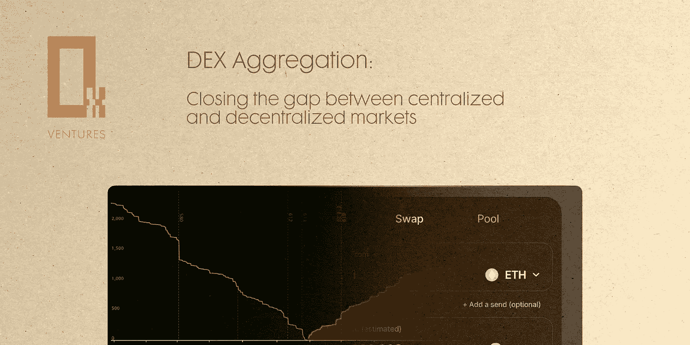
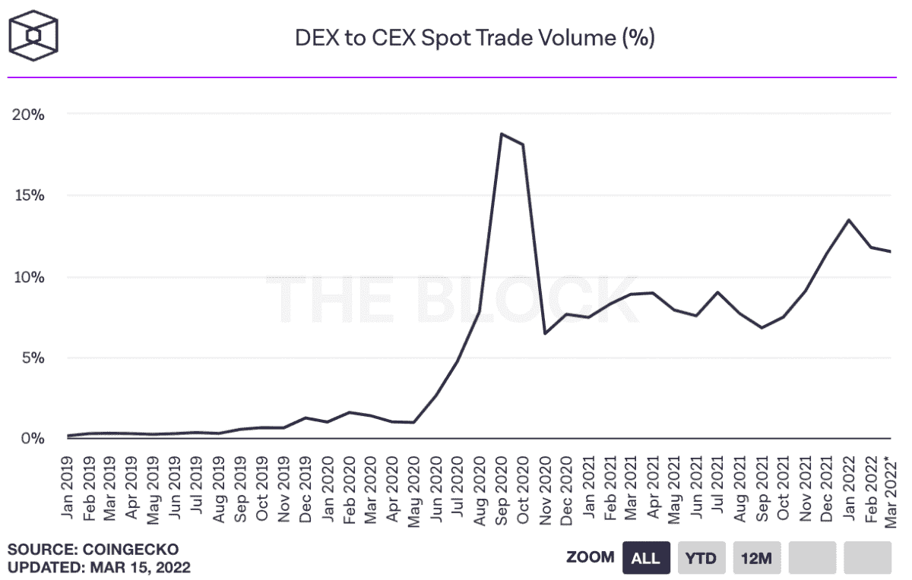
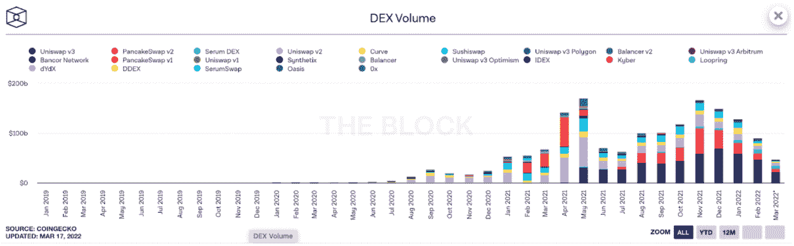
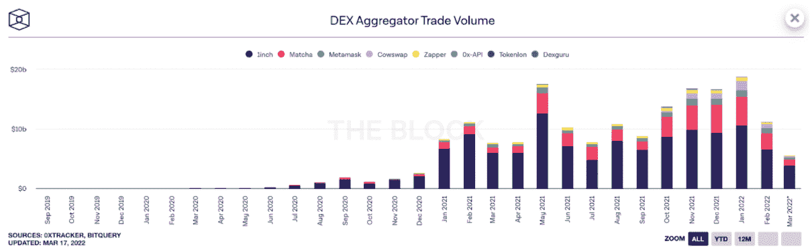
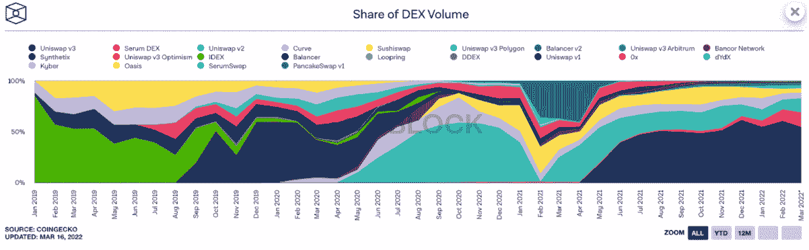
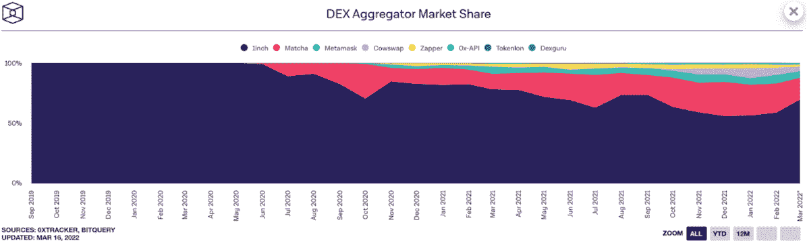
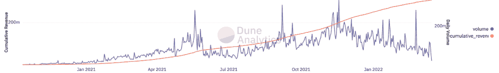
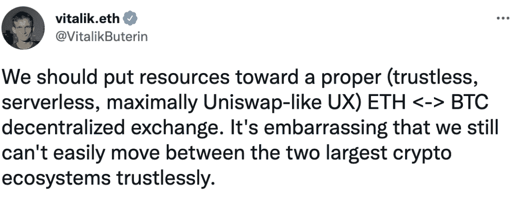
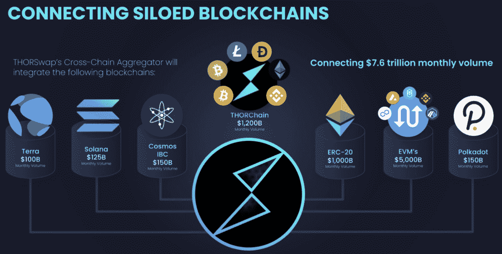
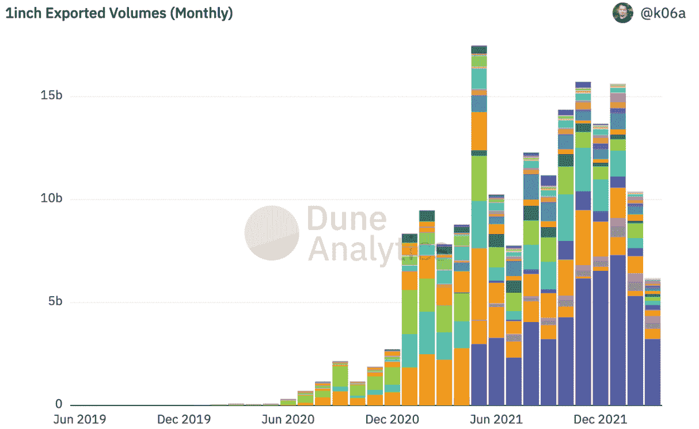

# DEX 聚合:弥合集中和分散做市之间的差距

> 原文：<https://medium.com/coinmonks/dex-aggregation-closing-the-gap-between-centralised-and-decentralised-market-making-d05b41cdc80?source=collection_archive---------5----------------------->

✍️ **作者:** [**菱形先生**](https://twitter.com/TheMrRhomboid)

想想当今最成功的公司，诸如亚马逊、谷歌和 Airbnb 之类的名字就会出现。这些公司将所有竞争对手甩在身后，但它们并不“拥有”自己提供的产品或服务。

亚马逊不拥有所提供的零售供应。

谷歌不拥有所提供的网站。

Airbnb 不拥有所提供的房地产。

本·汤普森在他的 [2015 帖子](https://stratechery.com/2015/aggregation-theory/)中详细解释了“聚合理论”的现象。在一个没有聚合器的世界里，每个终端用户都需要浏览不同的酒店、网站或零售店。公司为最终用户聚集这些资源，最终导致供应商和最终用户的生产率提高。

类似地，在分散式做市中，协议将交易者的流动性来源“聚集”到一个简单的用户界面中，从而提高流动性供应商和最终用户的生产率。

Source: [https://twitter.com/raydalio/status/1356739596231434240](https://twitter.com/raydalio/status/1356739596231434240)

随着加密市场的形成，CEXs 目前正在胜出。他们之所以胜出，是因为他们提供了比分散交易对手更好的交易体验。尽管集中化的实体显然有风险，但交易者似乎愿意承担这种风险，以换取更好的交易体验。

DEX 聚合商的目标是通过完善 UX，缩小集中和分散做市之间的差距，让最终用户从最佳交易体验中获利，只是这次是以分散的方式。

**聚合器的关键方面**

[根据 2020 年的一项调查](https://www.statista.com/statistics/670499/us-amazon-usage-reason/#:~:text=A%20January%202020%20survey%20revealed,them%20to%20purchase%20on%20Amazon.)，下面我们概述了亚马逊成为零售终端用户首选的主要原因:

1.  快速免费运输，例如交易便利
2.  商品选择广泛，例如“他们出售我需要的一切”
3.  最佳定价

类似地，我们可以按如下方式衡量 DEX 聚合器的价值:

1.  快速交易执行，例如交易便利
2.  广泛的令牌选择，例如多令牌暴露
3.  最佳定价

请注意，这些数字是根据重要性排序的。例如，我们将会看到，虽然低交易报价很重要，但交易便利性被认为*至少*同样重要。

**CEXs、DEX 的市场份额& DEX 聚合商**

下面的统计数据提供了一些关于 CEXs、DEX 和 DEX 聚合器性能的基本信息。

关于统计数据的评论如下:

*   数据来自[theblockcrypto.com](https://www.theblockcrypto.com/)
*   bot 和非 bot 贸易活动之间没有区别
*   鲸鱼和非鲸鱼的活动没有区别
*   数据截至 2022 年 2 月

在本文中，我们旨在提供一个关于加密交换中容量划分的概述，无关紧要的细节将被排除在外。

“DEX 对 CEX 现货交易量”——与 CEXs 相比，DEX 占据了 11%的现货交易量，2020 年 9 月是 DEX 交易量的峰值，攀升至 18%。尽管在 DEX 和 CEX 现货交易量部门之间显示出波动性，但自 2020 年 11 月以来，DEX 的市场份额正呈缓慢但稳定的上升趋势。

Source: [https://www.theblockcrypto.com/data/decentralized-finance/dex-non-custodial/dex-to-cex-spot-trade-volume](https://www.theblockcrypto.com/data/decentralized-finance/dex-non-custodial/dex-to-cex-spot-trade-volume)

“DEX 交易量的聚合器份额”— DEX 聚合器交易量占 120 亿美元，而总 DEX 交易量占 900 亿美元，结论是 DEX 聚合量占 DEX 交易量的 13%。回顾过去的表现，与 DEX 相比，DEX 聚合器的市场份额在 10%至 15%之间来回波动。

Source: [https://www.theblockcrypto.com/data/decentralized-finance/dex-non-custodial/dex-volume-monthly](https://www.theblockcrypto.com/data/decentralized-finance/dex-non-custodial/dex-volume-monthly)

Source: [https://www.theblockcrypto.com/data/decentralized-finance/dex-non-custodial/dex-aggregator-trade-volume](https://www.theblockcrypto.com/data/decentralized-finance/dex-non-custodial/dex-aggregator-trade-volume)

“DEX 卷份额”— Uniswap 占据了 70%的 DEX 卷份额(Uniswap v2 和 v3 合计),其最接近的竞争对手是以太坊链上的 Curve 和 Sushiswap。Serum DEX 领先于 Solana，而 Pancake 领先于 BNB 智能链。

Source: [https://www.theblockcrypto.com/data/decentralized-finance/dex-non-custodial/share-of-dex-volume-monthly](https://www.theblockcrypto.com/data/decentralized-finance/dex-non-custodial/share-of-dex-volume-monthly)

DEX aggregator 市场份额”1inch 占据 60%的市场份额，其最接近的两个竞争对手是 Matcha (25%的市场份额)和 Metamask (7%的市场份额)。

Source: [https://www.theblockcrypto.com/data/decentralized-finance/dex-non-custodial/dex-aggregator-market-share](https://www.theblockcrypto.com/data/decentralized-finance/dex-non-custodial/dex-aggregator-market-share)

根据上述统计数据，关键要点如下:

在 CEXs、DEX 和 DEX 聚合器之间注意到不均匀分布(例如[幂律分布](https://en.wikipedia.org/wiki/Power_law)，更具体地说:

*   CEXs 占据了 10-20%的现货交易市场份额；
*   与在 10-15%之间来回波动的 DEX 相比，DEX 聚合器市场份额；
*   与其他指数相比，Uniswap 占据了以太坊 70%的市场份额；
*   1inch 是最主要的以太坊指数聚合商，占据 60%的市场份额。

注意事项:

自 2020 年 9 月以来，Metamask 提供了一个本地交换功能，可以从多个 DEX 聚合器获得报价，为用户提供最佳的链上执行价格。通过这一举措，Metamask 成为了聚合器的聚合器——或者“元”聚合器([归功于德尔福数码](https://members.delphidigital.io/reports/metamask-revenues-dex-fee-competition-and-aggregator-wars))。

Metamask 收取的费用为每笔报价的 0.875%——按照 defi 的标准来看这是过高的——导致截至 2022 年 3 月的收入超过 3 亿美元。请注意，Metamask 的客户获取成本接近于零，因此相对于收入而言，成本几乎为零。因此，聚合的力量:meta mask——最受欢迎的以太坊钱包——将流动性资源聚合到其过高的用户群，最终导致过高的利润。

Source: [https://dune.xyz/queries/116250](https://dune.xyz/queries/116250)

一方面，这证明了当交易者决定在哪里执行互换时，互换费用——尽管重要——可能不是等式中最重要的因素(类似于亚马逊，他们经常提供*好的*价格，但不总是*最好的*价格)。

另一方面，问题仍然是 Metamask 能否通过这种商业模式向数百万用户聚集流动性，其规模相当于流行的 cex 和 dex。作为比较，[币安对每笔交易收取 0.1%的费用](https://www.binance.com/en/fee/schedule)，而 Uniswap 的费用[在 0.01% — 1%之间](https://docs.uniswap.org/protocol/concepts/V3-overview/fees)。

此外，与 Metamask 上的[鲸鱼存在相比，DEX aggregators](https://dune.xyz/queries/300820/571179) 上的[容量份额中的鲸鱼存在更多。我们使用 IOSG 提供的统计数据来验证这一点。](https://dune.xyz/queries/426331/812633)

## **缩小差距**

在本文的开始，我们概述了聚合器的关键方面——Amazon 作为现实世界的对比——这些方面是:快速便捷的交易执行、多令牌曝光和合理的定价。

从主观上来说，分散化的交易所在这三个方面的改进越多，最终用户的交易体验就越好，dex 赶上 cex 的可能性就越大。

下面我们将详述这些方面，以及我们正在关注的最新进展。

***快速便捷的交易执行***

1inch 是 DEX 聚合的领导者(截至 2022 年 2 月)，我们可以观察到该协议旨在不断改进，以提供更好的交易执行。

为了改善交易执行，我们必须首先验证哪些因素*会恶化*交易执行，导致分散融资中一些众所周知的障碍，包括但不限于:

1.  超前，导致报价与执行不一致时的滑点
2.  失败的交易，导致时间敏感型掉期交易受挫
3.  代币价格显示错误

1inch 旨在通过实施[虚拟费率来解决抢先攻击。](https://blog.1inch.io/how-1inch-protects-users-from-front-running-a51ec6e3c6d5#:~:text=Virtual%20rates%20are%20automatic%20features,1%20minute%20and%205%20minutes.)执行掉期交易后，掉期利率仅在相同方向的进一步掉期交易中发生变化。然而，如果一个人打算在这样的交易之后在相反的方向上执行互换，则利率在一段时间内“实际上”被调整，因此执行条件与先前的互换相匹配。因此，这防止了领先者进行“三明治攻击”，最终导致更高的价格准确性。

为了减少失败的交易，1inch 提供了一种改进，即部分和动态填充机制。提交掉期交易后，1inch 会汇总不同资源的流动性。如果协议上的比率发生不利变化，则可以取消路线的粒子分支，只有有利的分支得到满足(例如，订单部分*得到*满足)。

此外，动态填充允许在有利的分支机构之间分配不利分支机构的数量，从而使互换能够以公布的报价完全完成。

1inch 的[现货价格聚合器](https://blog.1inch.io/1inchs-spot-price-aggregator-an-overview-8eccf1e535f4#:~:text=What%20is%20the%20spot%20price,spot%20prices%20on%20multiple%20DEXes.)的出现是因为现有的价格信息服务并不支持 1inch 列出的所有令牌。他们的现货价格聚合工具包括直接与 dex 通信的智能合约，以便接收令牌的流动性加权现货价格。由于现货价格聚合器支持多个 dex，因此它显示在这些 dex 上交易的所有代币，从而更准确地显示所列代币的价格。

1inch 提供的其他功能是[零费用限价单](https://docs.1inch.io/docs/limit-order-protocol/introduction/)，这意味着当市场达到预定价格时交易就会执行——通常由更高级的交易者使用。其工作原理如下:用户发出限价订单，1inch 将订单添加到其中央数据库，然后这些订单可以由其他用户完成(包括 cex 和 Pathfinder 协议创建的订单)。限价订单的接受者在交易价值之外还支付了天然气成本，这使得对用户来说这是一个“零费用”订单。

[限价单的功能为分散做市带来了许多好处，例如:](https://messari.io/article/bundling-and-unbundling-1inch-by-1inch?utm_source=newsletter_middle&utm_medium=organic_email&utm_campaign=bundling_unbundling_1inch)

*   止损单，当价格达到一定限度时自动平仓
*   跟踪止损单，当价格上涨时，限价以固定的数量“跟踪”市场价格，而当价格下跌时，价格保持不变
*   拍卖，根据特定订单规模的最佳出价来设定价格

最重要的是，1inch 提供的第二版限价单促进了 ETH 的无气限价单，使 ETH 余额为零的用户能够交换令牌，降低了新用户的准入门槛，促进了分散式交换的采用。

很明显，1inch 正在通过提高 UX 来从 CEXs 手中夺取市场份额。然而，促进主流 DEX 采用的一个关键但重要的因素是无摩擦跨链互换的可能性，1inch 目前不提供这种可能性。

***多令牌曝光***

Source: [https://twitter.com/vitalikbuterin/status/1242553658195271681?lang=en](https://twitter.com/vitalikbuterin/status/1242553658195271681?lang=en)

人们在亚马逊上订购的一个主要原因很简单:他们收集了最广泛的商品。因此，就聚合而言，多令牌暴露是一个非常重要的元素。在存在许多链和代币的世界中，交易者自然希望能够跨链交易这些资产，这为提供无摩擦跨链代币互换的 DEX 聚合者带来了巨大的机会。

我们正在关注的这个领域的一个协议是 THORSwap。

Source: [https://twitter.com/THORSwap/status/1503844357438414851](https://twitter.com/THORSwap/status/1503844357438414851)

[THORSwap 已经使跨链原生 L1 互换成为可能](https://app.thorswap.finance/)，thor swap 将在概述的多个阶段中添加聚合，更具体地说，是从 V1 到 V5 的阶段，在完全执行后，它将覆盖几乎所有的跨链流动性。V1 阶段——支持以太坊长尾资产和 THORChain 上的原生资产之间的互换——已经完成，并通过了 Peckshield 的审计。

Phase V2 即将发布，支持以下改进:

*   Terra 聚合器，具有 Astroport 和 Terraswap 聚合功能，THORSwap 是 Terra 生态系统中的第一个聚合器。
*   使用 vTHOR 令牌的单边赌注，其中 75%的协议收入分配给 vTHOR 持有者。这将以“回购和分配”的形式发生，费用将用于在市场上购买 THOR，对代币产生购买压力，并分配(按比例)给 vTHOR 持有人。
*   新的 V2 接口为跨链交易提供了改进的 UX。

THORSwap 已经在我们之前的帖子中详细讨论过了，可以在这里找到[。](/@0xventures/thorswap-a-dex-to-rule-them-all-76800ced907c)

替代 L1 的崛起为 DEX 聚合器领域开辟了新的发展空间。[梅特卡夫定律](https://www.techopedia.com/definition/29066/metcalfes-law#:~:text=Metcalfe's%20Law%20is%20a%20concept,100%20(10%20*%2010).)指出，网络的价值与系统连接用户数量的平方成正比。第一个能够在一个简单的界面中连接不同区块链的用户的协议将受益于巨大的价值捕获。

***体面定价***

聚合的第三个重要因素是合理的定价。请注意，体面的定价并不一定意味着最好的定价，同样:亚马逊并不总是提供最好的价格，但他们能够占领整个零售市场，因为他们有巨大的护城河(正如我们在 Metamask 上看到的)。但定价仍然很关键，提供最佳价格的协议可能会受益于用户群的扩大。Uniswap 就是一个例子:

在实施了[智能订单路由器](https://uniswap.org/blog/auto-router)之后，Uniswap 开始执行跨不同池的交易，以便为用户提供尽可能好的价格。查看下面的统计数据，Uniswap 占通过 1inch 路由的流量的 60%,我们可以得出结论，当直接与 Uniswap 交互而不是使用 DEX 聚合器时，用户会在 40%的时间里损失价值。

Source: [https://dune.xyz/queries/16257/32751](https://dune.xyz/queries/16257/32751)

此外，由于聚合器的大多数智能订单路由机制在其计算中不包括 MEV 产生的滑点，当升级此智能订单逻辑时，我们可能会遇到大量交易被导出到无滑点的替代流动性来源。

其他流动性来源可能包括询价。特别是当与更便宜的链和卷相结合时，RFQ 可能能够更积极地报价，因为更快的块终结、更少的滑动和更低的气体，导致 DEX 流动性丧失。

Chainflip 通过 [JIT AMM](https://blog.chainflip.io/just-in-time-jit/) 将这种方法向前推进了一步。JIT AMM 背后的动机是颠倒抢先交易，激励专业做市商抢先交易，以便为最终用户提供最佳价格。

在传统的流动性供应中，只要交易发生在其流动性池内，每个流动性提供者都会从已完成的交易中受益。Uniswap v3 通过[集中流动性](https://docs.uniswap.org/protocol/concepts/V3-overview/concentrated-liquidity)更进一步，鼓励更积极的流动性供应。

JIT AMM 扩展了 Uniswap v3，因为只有为最终用户汇总最佳定价执行的做市商才能从交易费用中获益。集合交易是通过 CEXs、OTC 柜台还是衍生品市场进行并不重要——重要的是价格执行。

这种方法的缺点是协议不能预先保证执行价格，因为协议不知道获胜的做市商必须提供哪些定价条件。然而，用户前端的预测模型将告知用户其交易的可能结果。

提供解决方案的协议使汽油费不再是一个问题，加上新的流动性资源的聚合，预计将加强聚合者作为链上交易中关键部分的地位。

## **DEX 聚合的价值捕捉**

链上频谱变得越来越复杂，导致对聚合的更大需求，为最终用户消除了复杂性。

在 DEX 聚合广受欢迎的情况下，DEX 客户很可能不是从不与 DEX 本身互动的交易者，而是流动性提供者。因此，为了赢得这些指数的市场份额，它们必须专注于拥有自己的供应方。对于 dex 来说，拥有自己的供应面，一级流动性来源之间的竞争很可能会触底。

对于聚合层来说，UX 和创建忠诚的用户群才是最重要的。正如 Metamask 注意到的，一旦这个护城河建成，用户有时似乎愿意为方便支付额外的费用。

此外，更多的可扩展性解决方案和天然气成本的降低，将允许聚合商以可忽略不计的成本在各种流动性来源之间进行拆分，从而进一步增强最终用户的 UX。

就 DEX 聚合器的价值捕获而言，让我们快速计算一下，考虑截至 2022 年 2 月的数据:

*   月 CEX 交易量:7570 亿美元(占现货交易总量的 89%)
*   每月 DEX 交易量:900 亿美元(占现货交易总量的 11%)
*   每月指数聚集量:120 亿美元(占指数总量的 13%)

考虑接下来的 4 个场景:

*   场景 1:指数聚合者获得了指数现货交易量的 20%,而不是 13%。
*   情景 2: DEX 聚合器捕获 100%的 DEX 现货交易量，假设加班的 DEX 聚合器成为交易者的首选选项。
*   场景 3:假设有一个合适的幂律分割，DEX 聚合商占据了整个现货交易市场的 20%,而 80%的现货交易量仍然由 CEXs 控制。
*   场景 4: DEX 集合商占据了整个现货交易市场的 50%,这意味着集中和分散的做市商平分秋色。

看看最近 DEX 聚合器的进展速度，场景 1 是一个谨慎的预测，特别是考虑到随着时间的推移聚合越来越便宜的流动性资源的协议。DEX 聚合商获得 20%的 DEX 交易量意味着每月 180 亿美元的交易量，并为 DEX 聚合商空间增加 **150%** 。

从长远来看，场景 2 更有可能发生，这意味着聚合层将是现货交易的首选。这将意味着 DEX 聚合器每月 900 亿美元的交易量，导致 **750%** 的增长。

场景 3 假设 CEXs 失去阵地，精确幂律分割为 80/20，DEX 聚合器捕获 20%的现货交易量。这并非不可能，因为我们在 2020 年夏天看到了一个几乎类似的部门，DEX 对 CEX 的份额为 18%。对于 DEX 聚合商来说，这将意味着 **1412%** 的增长以及每月 1690 亿美元的现货交易量。

最后，考虑场景 4，我们将看到分散做市在与集中做市相同的水平上蓬勃发展。这意味着，dex 提供的交易体验与集中式交易平台相同(如果不是更好的话)。这种情况的发生，将导致每月 4240 亿美元的交易量，指数聚集空间增长 3529%。

作为旁注，请记住，这些交易量没有考虑下一轮长期牛市期间和之后的现货交易量。

最后，为了提供与 CEXs 相同的交易体验，无摩擦的跨链掉期对于 DEX 聚合商来说是绝对必要的。此外，便利的交易和低廉的费用可能也是吸引消费者的重要因素。一旦 DEX 聚合商提供了与 CEXs 类似(如果不是更好的话)的交易体验，再加上去中心化的好处，那么前景一片光明。

毕竟，在贸易的新时代，最终用户而不是经销商才是王道。

**披露:**

本文并未得到上述任何协议的支持。本文仅供参考，并非投资建议，因此不应作为投资决策的唯一依据。0xVentures 的成员已经投资了 THORSwap。本声明旨在披露任何利益冲突，并不建议购买上述任何代币。在相关的地方，直接引用和段落取自引用的来源。报告中的信息截至 2022 年 3 月 22 日。

**谁是 0x 冒然刀？**

我们是一个分散的自治组织(DAO ),投资和支持破坏行业的加密项目。在 0xVentures.org[找到我们的网站](https://0xventures.org/)

> 加入 Coinmonks [电报频道](https://t.me/coincodecap)和 [Youtube 频道](https://www.youtube.com/c/coinmonks/videos)了解加密交易和投资

# 另外，阅读

*   [Bookmap 评论](https://coincodecap.com/bookmap-review-2021-best-trading-software) | [美国 5 大最佳加密交易所](https://coincodecap.com/crypto-exchange-usa)
*   [如何在 FTX 交易所交易期货](https://coincodecap.com/ftx-futures-trading) | [OKEx vs 币安](https://coincodecap.com/okex-vs-binance)
*   [CoinLoan 评论](https://coincodecap.com/coinloan-review) | [YouHodler 评论](/coinmonks/youhodler-4-easy-ways-to-make-money-98969b9689f2) | [BlockFi 评论](https://coincodecap.com/blockfi-review)
*   [XT.COM 评论](https://coincodecap.com/profittradingapp-for-binance)币安评论 |
*   [SmithBot 评论](https://coincodecap.com/smithbot-review) | [4 款最佳免费开源交易机器人](https://coincodecap.com/free-open-source-trading-bots)