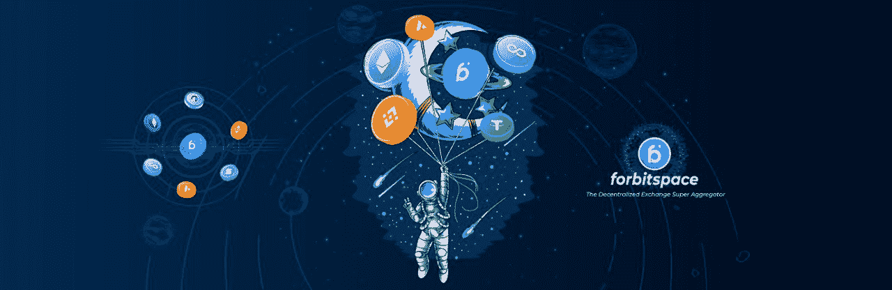

# DEX 超级聚合器—标志着 Web3 的明显进步

> 原文：<https://medium.com/coinmonks/dex-super-aggregator-mark-an-obvious-advance-of-web3-c2ccafdc0d1c?source=collection_archive---------57----------------------->

随着 DeFi 的爆炸式增长，越来越多的 dex 被推出，具有多种操作方法，允许用户在区块链网络上直接进行点对点交易。不需要经过任何中介组织，给贸易商带来了巨大的利润。

然而，这些 dex 缺乏灵活性，因为它们仅专门在网络上运行，并且单独开发一个或几个小协议。连接能力还是有难度的，那么当用户想要结合很多协议来投资和快速切换很多不同的网络时，有什么解决方案呢？

用户可能会寻找一个聚合器。他们帮助用户连接到多个区块链，他们可以挖掘和创建一个大型的多链生态系统。

至于协议平滑融合和网络间快速切换的解决方案，forbitspace——DEX 超级聚合器是做这件事的一颗闪亮的星星。

作为一个分散的超级聚合器，forbitspace 也是一个可互操作的协议，并挖掘区块链空间，建立一个多链生态系统，可以轻松地跨不同网络进行交易。这也是为什么 forbitspace 支持四大主网:以太坊、BNB 链、多边形、雪崩。

为了优化资金，交易者可以充分结合使用 forbitpace 功能，如聚合协议、限价单协议、流动性协议、多链整合、衍生协议、空间道。

特别是，用户可以利用深度流动性，并在一个界面上获得最佳价格，当在 forbitspace 上进行交易时，用户除了网络费之外不需要支付任何费用。

forbitspace 的发展是 Web3 的新篇章当连接多链、多钱包，甚至不同协议的能力不再是不可想象的时候，Web3 的未来就是这样，一切都是在没有任何许可的情况下连接的。

> 加入 Coinmonks [电报频道](https://t.me/coincodecap)和 [Youtube 频道](https://www.youtube.com/c/coinmonks/videos)了解加密交易和投资

# 另外，阅读

*   [3 商业评论](/coinmonks/3commas-review-an-excellent-crypto-trading-bot-2020-1313a58bec92) | [Pionex 评论](https://coincodecap.com/pionex-review-exchange-with-crypto-trading-bot) | [Coinrule 评论](/coinmonks/coinrule-review-2021-a-beginner-friendly-crypto-trading-bot-daf0504848ba)
*   [莱杰 vs n rave](/coinmonks/ledger-vs-ngrave-zero-7e40f0c1d694)|[莱杰 nano s vs x](/coinmonks/ledger-nano-s-vs-x-battery-hardware-price-storage-59a6663fe3b0) | [币安评论](/coinmonks/binance-review-ee10d3bf3b6e)
*   [Bybit 交易所评论](/coinmonks/bybit-exchange-review-dbd570019b71) | [Bityard 评论](https://coincodecap.com/bityard-reivew) | [Jet-Bot 评论](https://coincodecap.com/jet-bot-review)
*   [3 commas vs crypto hopper](/coinmonks/3commas-vs-pionex-vs-cryptohopper-best-crypto-bot-6a98d2baa203)|[赚取加密利息](/coinmonks/earn-crypto-interest-b10b810fdda3)
*   最好的比特币[硬件钱包](/coinmonks/hardware-wallets-dfa1211730c6) | [BitBox02 回顾](/coinmonks/bitbox02-review-your-swiss-bitcoin-hardware-wallet-c36c88fff29)