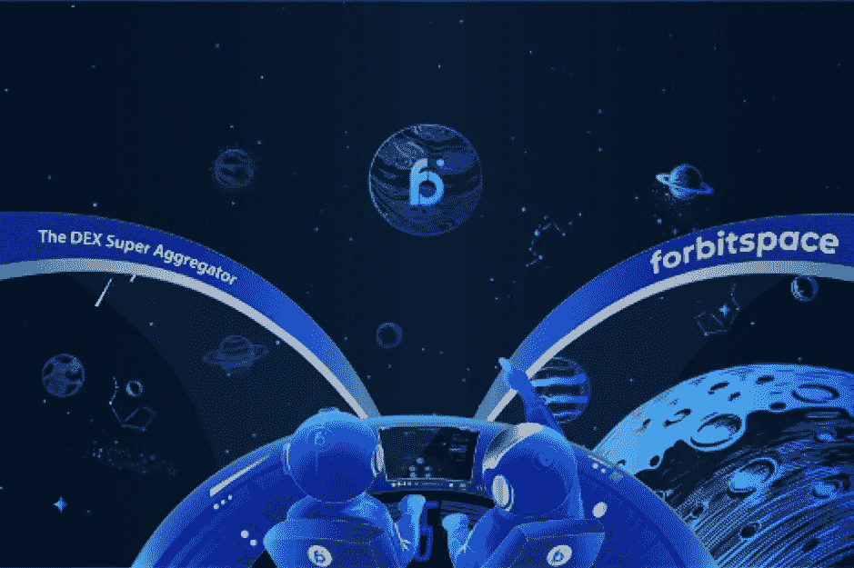
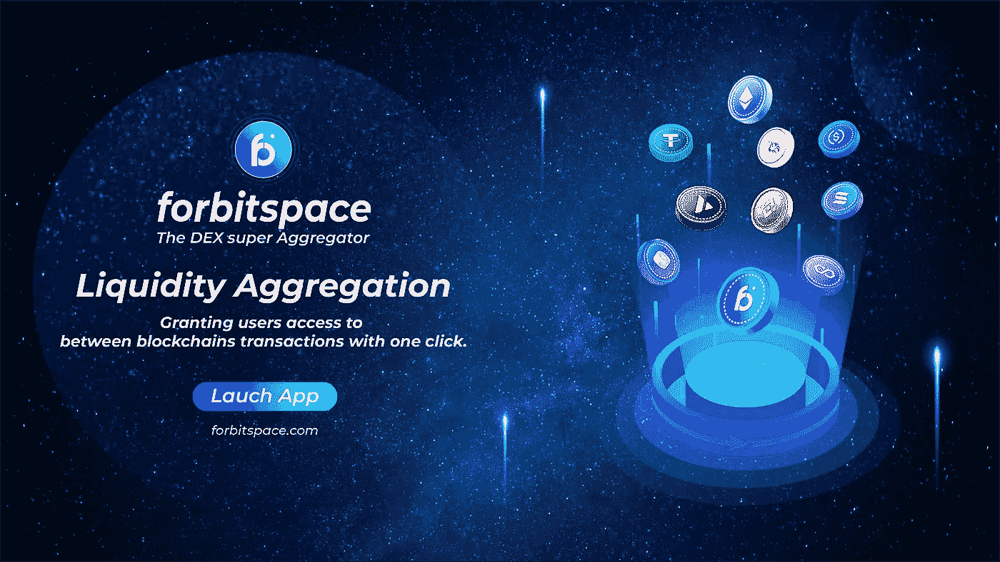

# DEX 超级聚合器将多个链中的 DApps 联合起来

> 原文：<https://medium.com/coinmonks/dex-super-aggregator-unites-dapps-across-multiple-chains-2f770e5404ca?source=collection_archive---------37----------------------->

随着分散金融(DeFi)市场的持续繁荣和扩张，新的解决方案不断涌现，以简化导航和改善用户体验。随着区块链网络及其相关的分散应用( [DApps](https://cointelegraph.com/defi-101/what-are-dapps-everything-there-is-to-know-about-decentralized-applications) )的快速增长。这就提出了互操作性的问题。如果以太坊上的用户想在币安智能链(BSC)或多边形链上使用 Dapps。做这件事没有又快又便宜的方法。相反，这个过程既费钱又费时。从那里不可能获得新的加密货币。

如果区块链空间是一个开放的空间，向所有人开放。它目前缺乏互操作性是广泛扩展和采用的主要障碍。幸运的是，有一些加密项目认识到了跨链交互的重要性，并且正在努力打破相关的障碍。最近的一项创新是推出了分散交易所(DEX)聚合器——将众多 DEX 统一在一个屋檐下的平台，允许用户在所有覆盖的平台上进行操作，而无需创建单独的账户和钱包。

DEX 聚合器的便利性是毋庸置疑的。用户可以在一个聚合器上注册并访问大量流动性池和交易，而不是拥有多个账户并在各种资源上进行操作。此外，这种聚合器上的用户友好和简单的价格比较确保了希望购买或出售加密资产的每个用户都将获得尽可能好的价格。

# 为什么 DeFi 的最终用户需要分散的交换聚合器？

**机会多。**用户希望以最有效的方式买卖加密货币。这包括工作速度、费率、费用、各种奖金、被动收入等。但是，他们不愿意自己监控所有 DeFi 服务的情况——这既昂贵、困难又不方便。此外，很难监控新项目的出现。交易所对所有市场进行监控。

**改善用户体验。** DeFi 解决方案已经证明，它们是传统金融的更好替代方案，因为需要一个开放、安全和透明的金融系统。

**更广泛的 DeFi 项目。一个普通的交易员一个人可以监控多少家交易所？五个？二十？一个聚合器可以方便地监控数百甚至数千个市场。**

**更多有用信息。**它既指市场，因为 DeFi 聚合器提供了比单独协议更完整的当前市场状况，也指提供商。

**滑移的消除。**当订单以低于预期的价格执行时，就会出现滑点。出现这种情况是因为流动性池中的流动性很小，dex 就是这种情况。DeFi 交易所有助于解决这一问题，因为它们将不同交易所的流动性整合到一个平台中。

# **多链未来 DEX“超级聚合器”**

区块链，如币安智能链，索拉纳，和第二层的解决方案，如多边形，雪崩，Arbitrum，和乐观主义正在迅速赶上和解决一些问题，伴随建设以太坊。与流行的说法相反，这些解决方案的实现不是为了“杀死以太坊”,而是为了提供一种构建 Web 3.0 的多链方法。随着开发商试图利用该技术的能力，区块链和区块链每天建设的项目数量正在上升。

DEX 超级聚合器可以促进和连接新的链，以增强用户体验。就像 ***forbitspace*** DEX 超级聚合器一样。这是一个全方位生态系统的方法，可以让任何人在任何地方加入任何平台，如以太坊、币安智能链、多边形、雪崩，并很快在 Arbitrum 和乐观网络上推出。通过连接他们的钱包，用户和交易者只需要一个与他们在 ***forbitspace*** 平台上的不同区块链网络兼容的钱包，就可以快速高效地在网络间交换资产。任何拥有智能手机和互联网连接的人都可以受益于 bitspace 的 DEX 超级聚合器提供的金融服务。交易几乎是即时的，成本也更低，这让它们成为任何希望涉足不同区块链的 DApps 的人的理想选择。为了向用户保证项目的可用性和安全性， ***forbitspace*** 与 CertiK 和 Hacken 等领先的审计公司合作。

# **DEX 超级聚合器如何深化流动性以减少滑点**

鉴于加密市场的波动性，滑点几乎无时无刻不在发生，让交易者付出了大量的额外费用。当交易量不足导致以高于最初预期的价格买入资产或以低于最初预期的价格卖出资产时，就会出现滑点。

将一笔交易分成不同指数的多个订单有助于挖掘流动性。从而最小化滑动的问题。已经做到这一点的 DEX 超级聚合器之一是用于 bitspace 的 ***。bitspace DEX 超级聚合器 ***的流动性*** 分散在 DEX 平台上，以增加 DEX 流动性，帮助防止订单滑点。***

其目的是在不同的区块链上构建 DEX Super Aggregator，使用户能够发现和访问数百项新资产，这是一个安全、易用的分散式交换、合同平台，是区块链行业中最快的智能平台，速度极快、成本极低且环保。