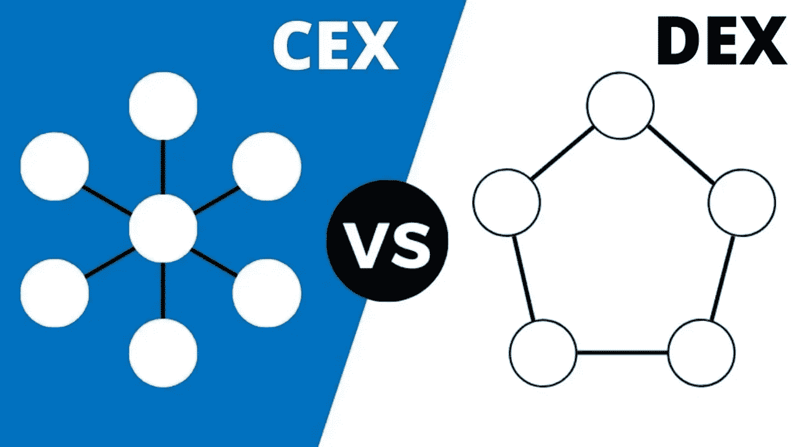

# 德克斯对 CEX。有什么区别？优点和缺点

> 原文：<https://medium.com/coinmonks/dex-vs-cex-what-is-the-difference-advantages-disadvantages-c6364045db16?source=collection_archive---------5----------------------->

如果你正在考虑购买或出售密码，你的第一站可能是交易所。

这些是大多数密码交易发生的数字市场。你可能听说过一些:币安、北海巨妖、Uniswap 等等。

大多数都是中央集权的，并使用类似于纽约证券交易所这样的传统机构的商业模式。但越来越多的人开始分散管理，并彻底反思交易所的运作方式。在这里，我们解释每种类型的优缺点。

**CEX——集中交易所**

一个集中的交易所，如币安、CEX.io、北海巨妖或 OKEx，有自己的订单簿。在这种情况下，每份订单都会被记录和验证。为了确保正确性，数据通过专用服务器进行内部交换，并经过集中的安全流程。

一般来说，交易所在监管机构的监督下运作，并有广泛的了解客户政策。与此同时，集中交易所根据适用法律积极打击欺诈者，以防止洗钱。

初学者尤其会使用这种类型的交易所，因为这种集中的结构提供了一个用户友好的平台，使得购买和管理数字货币变得特别容易。

CEX 背后是一家营利性公司。为了创造良好的用户体验，这些公司通常会提供广泛的支持服务。它们还允许用法定货币购买加密货币，通常具有广泛的交易对。集中交易有固定费用，在交易时产生。从概念上讲，加密交换的工作原理与任何其他交换相同。一个匹配算法调节供需，订单簿存储用户订单。

**DEX —分散式交换**

分散式交易所还提供了 CEX 的核心功能。这些包括订单簿或自动做市商、交易场所、匹配系统和安全功能。与集中式交易所不同的是，所有这些功能都是分散的。为此，DEX 不基于内部服务器和自己的 IT 基础设施，而是充当区块链上的分散式应用程序(dApp)。

分散式交易所的用户使用 Uniswap、Bisq 或 GDEX 等交易所主要是因为两个特点:匿名性和高安全性。

DEX 是匿名的，因为交易几乎不需要用户数据。通常，用户只需要一个公共地址就可以在一个分散的交易所进行交易。没有第三方(当局或金融监管机构)作为分散的应用程序对交易所进行监控或施加监管。它成功的另一个原因是它的高度安全性。虽然 CEX 用户不能控制他们的私钥，但是 DEX 不提供集成的热钱包，并且私钥仍然由用户持有。

**现在我们来谈谈 CEX 的优势**

**高交易量和高流动性**

由于 CEX 很有名，有很多活跃用户在买卖他们的资产，因此与 DEX 相比，它的交易量很高。高交易量对高流动性也有影响。流动性是指资产转换为现金或其他加密货币的能力。流动性很重要，原因有很多，因为它使加密交易所不那么容易受到市场操纵。

**法定加密货币交易，反之亦然**

集中式交易所支持法定货币加密，这使得人们开始他们的加密之旅更加容易，因为他们可以将他们的法定货币兑换成加密货币。

**高级功能**

CEX 不仅作为一个加密交易平台，还提供其他功能或特性，如保证金交易、加密衍生品交易、交易所赌注和保证金贷款。

**用户友好**

CEX 的用户界面很容易理解，即使是密码新手，过程和程序可以很快内化。CEX 还提供了对相应交易选项的简单易用的访问。

**快速交易**

CEXs 可以处理 2170 亿美元的交易，快速且几乎实时地处理每笔交易，帮助交易者在市场发生变化时无需等待即可直接做出反应。发生这种情况是因为 CEX 是由一个每秒钟可以处理数千个订单的中央组织公司处理的。

**CEX 的缺点**

**与 DEX 相比，黑客攻击的可能性**

CEX 机制是基于信任，因为 CEX 存储他们的用户加密资产，并集成了作为其系统一部分的钱包(保管服务)。这种机制超出了用户的控制。因此，用户必须充分信任交易所，他们的钱是安全的。这种情况也使 CEX 成为网络罪犯的主要目标。

**根据政府法规**

因为集中交易受监管机构、第三方提供商和法律法规的控制。因此，为了防止交易所洗钱，运营商需要收集大量的客户数据(KYC)。这种规律性与加密货币的基本理念相悖。

**不要忘记 DEX 的优势**

**高安全性免受黑客攻击**

有两个原因使得 dex 比 CEXs 更安全。首先，dex 使用非托管框架，用户可以完全控制他们的资产，因此黑客无法进入用户的钱包，除非他们自己暴露他们。黑客主要以交易所的中央数据库为目标，提取用户的私钥并提取他们的资金。第二，因为不需要身份验证过程，所以不会有泄露私人用户数据的风险。

**低价费**

大量的交易配对通过 dex 网络进行，使得 dex 的交易费用很低。

**没有来自任何第三方的欺诈**

不会有欺诈，因为没有集中的组织或第三方充当金融监管者或当局，作为一种去中心化的应用，对交易所进行监管或施加监管。

**德菲和 NFT 整合**

dex 使用智能合约，允许用户访问智能合约的世界和提供金融服务的 DApps，包括贷款和储蓄产品，以及 NFT 项目。

**提供多种代币**

任何人都可以铸造一个基于以太坊的代币，并为其创建一个流动性池。这个活动让 dex 提供了各种代币。

**不能被政府关闭**

由于没有包括政府在内的第三方的参与，DEXs 不受政府要求、法规或监控的约束，并且不能被政府关闭。

**DEX 的缺点**

**与 CEX 相比流动性较低**

相对而言，DEX 仍然是一个新概念，与 CEX 相比，交易者较少，因此 DEX 的流动性较低。然而，随着 DeFi 的增长，DEX 上的资产流动性迅速增加。

**有限的功能**

DEX 上的图形用户界面还是太复杂了，尤其是对新手来说。许多交易者无法使用限价单、保证金交易或止损等功能。尽管如此，大多数 DEX 都试图采用 CEX 已知的功能，因此在未来，DEX 将更加用户友好。

**做个总结:**

*   DEX 代表分散交换，而 CEX 代表集中交换。它们都是指加密用户可以无缝交换、购买和出售加密货币的平台。
*   CEX 提供的好处，如保证流动性，交换密码到菲亚特，易于使用，有必要关注安全性，缺乏用户完全所有权和缺乏匿名性。
*   DEX 提供对硬币的完全所有权和对私钥的控制，治理令牌和完全匿名的可能性，但是对于初学者来说学习和使用可能更复杂，不允许法定支付，可能具有有限的流动性。

> 加入 Coinmonks [电报频道](https://t.me/coincodecap)和 [Youtube 频道](https://www.youtube.com/c/coinmonks/videos)了解加密交易和投资

# 另外，阅读

*   [如何在 Uniswap 上交换加密？](https://coincodecap.com/swap-crypto-on-uniswap) | [A-Ads 审核](https://coincodecap.com/a-ads-review)
*   [加密货币储蓄账户](/coinmonks/cryptocurrency-savings-accounts-be3bc0feffbf) | [YoBit 评论](/coinmonks/yobit-review-175464162c62)
*   [Botsfolio vs nap bots vs Mudrex](/coinmonks/botsfolio-vs-napbots-vs-mudrex-c81344970c02)|[gate . io 交流回顾](/coinmonks/gate-io-exchange-review-61bf87b7078f)
*   [CoinFLEX 评论](https://coincodecap.com/coinflex-review) | [AEX 交易所评论](https://coincodecap.com/aex-exchange-review) | [UPbit 评论](https://coincodecap.com/upbit-review)
*   [AscendEx 保证金交易](https://coincodecap.com/ascendex-margin-trading) | [Bitfinex 赌注](https://coincodecap.com/bitfinex-staking) | [bitFlyer 审核](https://coincodecap.com/bitflyer-review)
*   [Bitget 回顾](https://coincodecap.com/bitget-review)|[Gemini vs block fi](https://coincodecap.com/gemini-vs-blockfi)cmd |[OKEx 期货交易](https://coincodecap.com/okex-futures-trading)