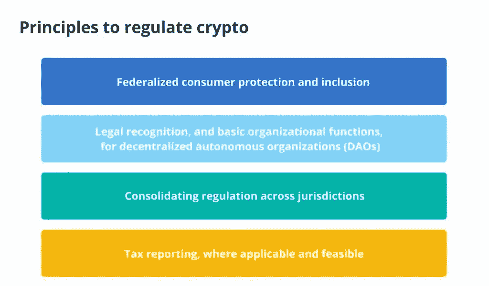
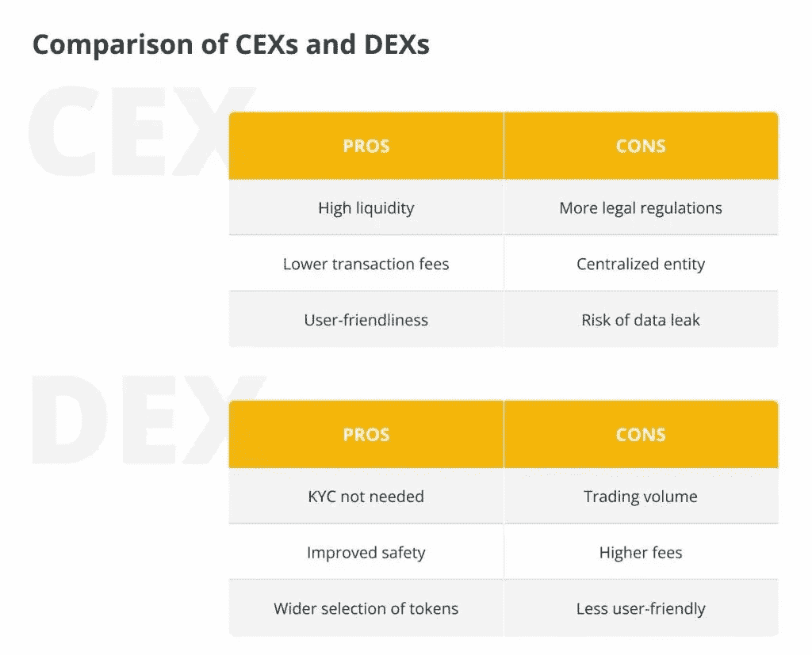

# 德克斯和 KYC:他们是天造地设的一对还是有可能？

> 原文：<https://medium.com/coinmonks/dexs-and-kyc-are-they-a-match-made-in-hell-or-are-they-a-viable-possibility-5e1e888e53f4?source=collection_archive---------47----------------------->

**Visit our website:-** [**https://bitcoinsupports.com/**](https://bitcoinsupports.com/)

在监管浪潮到来之前，分散的交易所必须想出如何改善他们的“了解你的客户”合规性。以色列连续创业者 Ariel Shapira 在他的每月加密技术专栏中分析了加密、分散金融和区块链空间中的发展技术，以及它们在创造 21 世纪经济中的责任。

近日，白宫发布行政命令，对加密货币进行监管。在大西洋彼岸，欧洲议员否决了一项法案，该法案可能会使工作证明网络处于严重危险之中。这些趋势应该敲响了大多数加密爱好者已经习惯的警钟:监管仍然在讨论中，尽管区块链社区现在比以往任何时候都更接受合规，但无疑会有一些令人不快的事情。

**Visit our website:-** [**https://bitcoinsupports.com/**](https://bitcoinsupports.com/)

了解你的客户(KYC)政策是不可避免地会出现在监管机构黑名单上的项目之一。在当今的生态系统中，这些协议可能随处可见。一些平台，通常是更集中的平台，以类似于传统金融机构的方式处理 KYC，至少包括身份检查。另一方面，其他的都是即插即用的，这意味着只要你有一个加密钱包，你就可以使用了。dex，即分散化交易所，是后一种方法的典型代表。当你使用智能合约时，你会与智能合约互动，为其流动性池提供动力，如 BNB 智能链上的 PancakeSwap 或 Cardano 上的 WingRiders。任何人都可以将他们的代币投入到资金池中，以获得资金池累计交易费的一定比例，任何人都可以在大多数情况下利用资金池交易他们的代币，而不需要像 KYC 那样做太多。这是一种在不同代币生态系统之间转移价值的方便、快捷和安全的方式，它还允许流动性提供商从该服务的持续运营中获利。

**合规需求将上升**

监管者可能会发现这种方法在区块链技术上过于宽松。他们可能期望从这样的过程中得到更多的 KYC，这几乎肯定会得到标准的回应:当涉及到 KYC 时，您确切地期望一段链上代码做什么？

在最基本的层面上，这是一个难题。根据一个流行的加密格言，“代码就是法律”，因此任何分散的应用程序的权力都受到其底层代码的内在约束。从技术和意识形态的角度来看，将 KYC 纳入这些能力是一项艰巨的任务。从前者来看，它意味着创建一个无所不包的数字 KYC 平台，可以在不需要人工干预的情况下处理工作。从后者的角度来看，它需要背离加密世界的一些关键理想和信念，这些理想和信念重视匿名和隐私。

**Visit our website:-** [**https://bitcoinsupports.com/**](https://bitcoinsupports.com/)

一些加密公司，如 Everest，已经在使用传统方法实现 eKYC。该公司还可以用假名证明每个用户的独特性和人性，这在这些痴迷于机器人的时代至关重要。将来，假名可能会成为 KYC 为区块链摇旗呐喊的口号。在一个系统中，一个值得信赖的第三方验证客户身份的合规性，并发布一个不会泄露客户数据的成功检查的密码安全证书，这可能成为密码纯化论者和监管者的共同基础。这种令牌将允许集中式和分散式交换在不了解用户身份的情况下验证用户的身份。重要的是，这样的解决方案将消除交易所维护用户个人信息的需要。为了对黑客有利，一个包含用户个人信息的中央数据库甚至不需要包括他们的财务信息或私人密钥，但是如果一个交易所想要好的 KYC，它必须建立这样一个数据库。这就形成了一个恶性循环，用户面临着真正的威胁，而交易所则承受着管理和维护这些记录的额外负担。

**【KYC】顺从分权？允许 AI 尝试去解决 KYC 的难题是另一个有趣的选择。这肯定需要一种多层方法，第一个模型处理文档扫描，并将结果传递给一个或多个后续模型来完成工作。虽然很难，但这不是不可想象的——至少只要我们不是在谈论智能合同中使用的类似内容。然而，离线实现可能仍然作为可信的第三方 KYC 提供者工作，允许交换按照所有适用的法规运行。本质上，KYC 遵循一个协议，就像许多其他过程一样。它有两个部分:输入(文件、财务报表和交易对手可能需要审查的其他信息)和输出(批准或拒绝)。这些过程中的许多容易被数字化，因为它们遵循与大多数计算机算法相同的逻辑。当然，开发一个能够适应多个司法管辖区的各种 KYC 法律的系统将是困难的，但这是完全可以实现的。不难想象，KYC 是一个重要问题的传统金融业务也看到了这样一个系统的价值，从而产生了一个十亿美元的市场。改进的 KYC 程序也可能导致用户界面的复兴，使普通投资者更容易接触到 dex。使用困难是密码领域的主要痛点之一，尤其是在迎合密码鉴赏家而不是新手的分散平台上。例如，在 Kirobo 的撤销按钮推出之前，加密用户没有办法知道他们是否将硬币传送到了正确的地址。随着充分的法规遵守，更多的主流消费者涌入，他们对更顺畅的密码购买和销售方法有更高的需求。

更具创造力的 dex 的开发团队，在创建项目时牢记 KYC 合规性，同时坚持去中心化的理念，无疑会脱颖而出——因此他们不妨现在就开始发明，为即将到来的潮流转变做准备。

**访问我们的网站:-**[**https://bitcoinsupports.com/**](https://bitcoinsupports.com/)

**免责声明:以上为作者观点，不应视为投资建议。读者应该自己做研究。****

> 加入 Coinmonks [电报频道](https://t.me/coincodecap)和 [Youtube 频道](https://www.youtube.com/c/coinmonks/videos)了解加密交易和投资

# 另外，阅读

*   [分散交易所](https://coincodecap.com/what-are-decentralized-exchanges) | [比特恩斯 FIP](https://coincodecap.com/bitbns-fip) | [宾邦评论](https://coincodecap.com/bingbon-review)
*   [用信用卡购买密码的 10 个最佳地点](https://coincodecap.com/buy-crypto-with-credit-card)
*   [加拿大最佳加密交易机器人](https://coincodecap.com/5-best-crypto-trading-bots-in-canada) | [Bybit vs 币安](https://coincodecap.com/bybit-binance-moonxbt)
*   [阿联酋 5 大最佳加密交易所](https://coincodecap.com/best-crypto-exchanges-in-uae) | [SimpleSwap 评论](https://coincodecap.com/simpleswap-review)
*   购买 Dogecoin 的 7 种最佳方式 | [ZebPay 评论](https://coincodecap.com/zebpay-review)
*   [最佳期货交易信号](https://coincodecap.com/futures-trading-signals) | [流动性交易所评论](https://coincodecap.com/liquid-exchange-review)