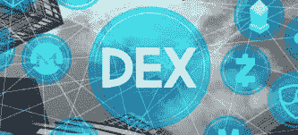
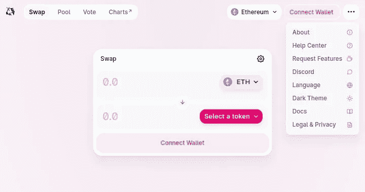
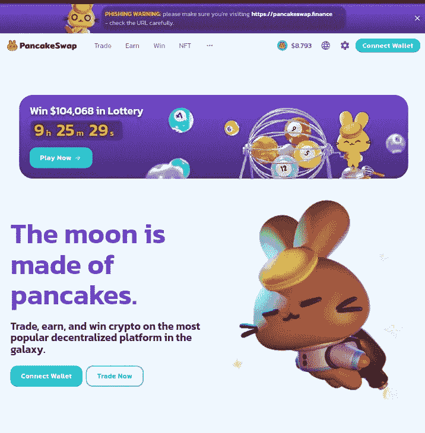
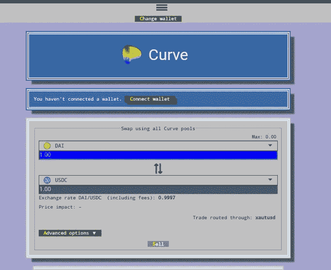
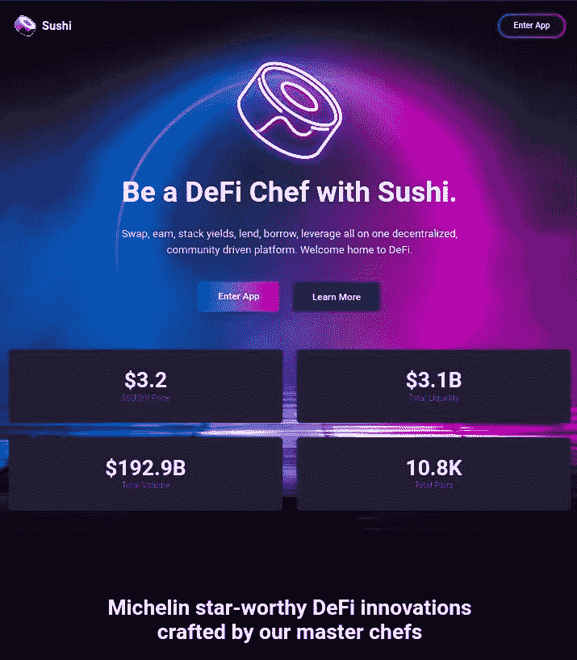
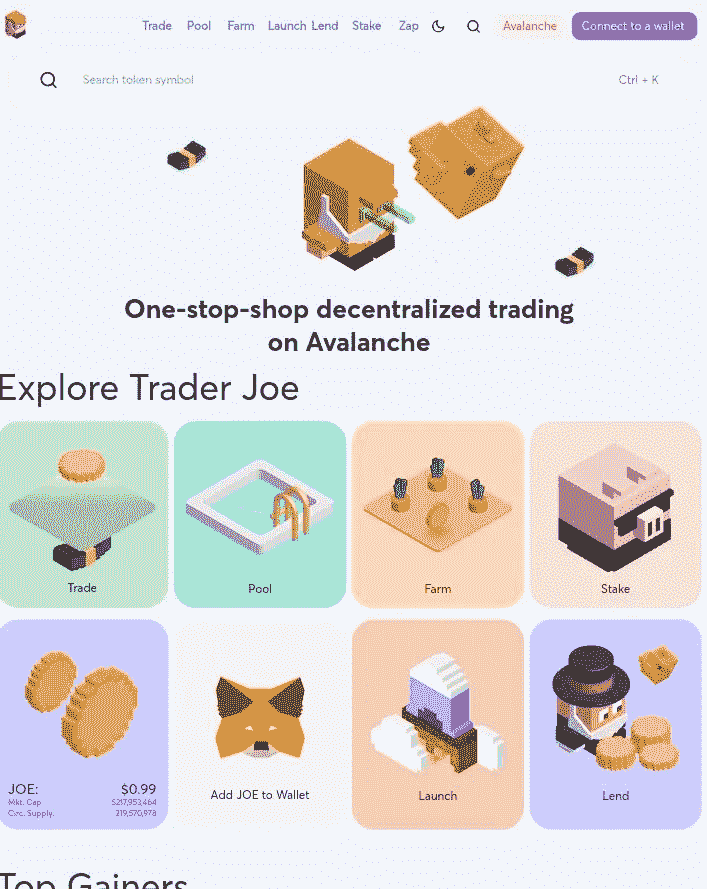
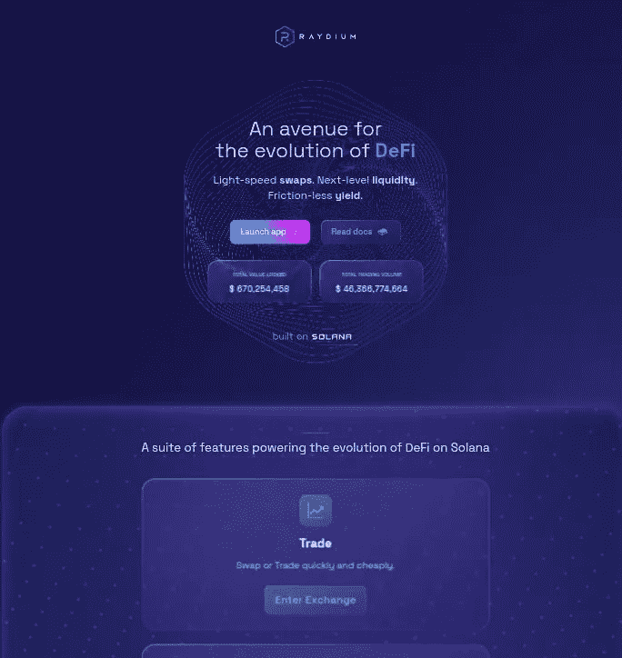
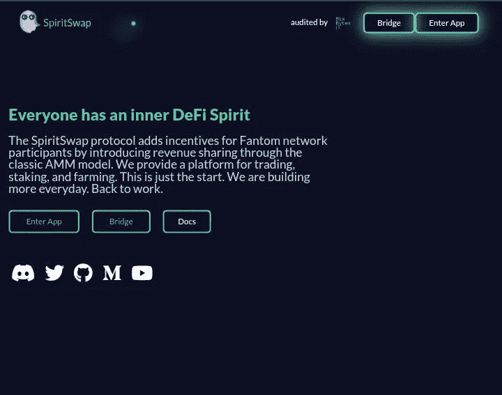

# 什么是 dex..？前 15 大分散交易平台

> 原文：<https://medium.com/coinmonks/dexs-top-15-decentralized-exchange-platforms-f1f31d863152?source=collection_archive---------30----------------------->

使用 dex，用户可以通过将他们的加密钱包连接到任何分散的交易平台，选择他们喜欢的加密交易对，输入金额，并进行交换，从而在不使用经纪人的情况下相互交易加密货币

# **什么是 DEX？**

分散式交易所是一个点对点市场，加密货币交易者可以在这里进行直接交易。

dex 使金融交易不受银行或其他第三方的影响，这是加密最重要的方面之一。最著名的 dex，如 Uniswap 和 Sushiswap，是基于以太坊区块链的，是一套不断发展的分散金融(DeFi)技术的一部分，允许用户直接从兼容的加密钱包访问各种金融服务..

流行的 dex 通常比它们的集中式对应物提供更广泛的数字资产。在某些情况下，无需集中监控或授权即可建立交易对。dex 的典型特征是降低费用和获得更多资产选择，但这些好处可能以流动性、安全性和可用性为代价。尽管如此，分散的加密货币交易所继续改善用户体验，构建可扩展的基础设施。

# DEX 如何工作..

与币安等集中式交易所不同，dex 不允许从法定账户到加密账户的转账；相反，他们用加密货币代币交换其他加密货币代币。通过一个集中的交易所，你可以将菲亚特交易为 crypto(反之亦然)或 crypto-crypto 对(例如，你的一些 Usdt 交易为 Xno)，更复杂的行为，如保证金交易或设置限价单，是经常可用的。然而，该交易所通过“订单簿”处理所有这些交易，该订单簿根据当前的买卖订单确定加密货币的价格，类似于纳斯达克等证券交易所的做法。

虽然集中式交易所保留对放在平台上的客户现金的托管，但分散式平台通常是非托管的，这意味着用户在 crypto DEX 平台上交易时保持对其私钥和资产的控制。在没有中央机构的情况下，dex 采用智能合同，在预先确定的条件下自动执行，并将每笔交易报告给区块链。这些不可信、安全的交易是数字资产市场的重要组成部分，它们正在开拓新的金融产品，以促进做市商和流动性。

另一方面，分散式交易所只不过是智能合约的集合。为了使交易更容易，并通过算法固定几种加密货币之间的价格，他们使用“流动性池”，投资者锁定资产以换取类似利息的回报。与存储在交易所自有数据库中的集中式交易所交易不同，DEX 交易在区块链上即时结算。

dex 通常采用开源代码设计，允许任何感兴趣的人了解它们是如何工作的。这也意味着开发人员可以修改当前的代码来创建新的竞争项目，因为 Uniswap 的代码已经被许多其他名为“swap”的索引所采用，如 Sushiswap 和 Pancakeswap。

下面是一个综合列表，列出了我在当今密码行业中最著名的 15 家分散式交易所(dex)以及它们目前的交易量

# **Uniswap (v3)**

shot of uniswap home

uni WAP(v3)是一款去中心化的加密货币交易应用。该交易所有超过 460 个硬币和 889 个交易对。
“高利差”是在常规交易所交易的非流动资产的一个关键问题，Uniswap 解决了这一难题，它允许任何人成为做市商。对于大额订单，Uniswap 有很多滑点，因为随着数量的增加，支付的价格也会上升。

据报告，Uniswap (v3)在过去 24 小时内的流量为 26，445.72 BTC。
0xa 0b 86991 c 6218 b 36 C1 d 19d 4 a 2e e9 EB 0 ce 3606 EB 48/0x c 02 AAA 39 b 223 Fe 8d 0 a 0 e 5 C4 f 27 EAD 9083 c 756 cc 2 是 Uniswap (v3)交易所最活跃的交易对。Uniswap (v3)成立于 2018 年。

请访问 [***UNISWAP***](https://app.uniswap.org/#/swap,) ，探索和了解有关 Uniswap (v3)交换的更多信息。

# **PancakeSwap (v2)**

PancakeSwap (v2)是一个完全去中心化的加密货币交易所。该交易所有 4272 个硬币和 5816 个交易对。PancakeSwap 是运行在 BSC 上的 SushiSwap 的一个分支，允许更便宜和更快的交易。

通过 PancakeSwap 还可以获得产量农业、彩票和初始农业产品。
过去 24 小时内，PancakeSwap (v2)的交易量已报告为 10，576.23。
0x bb 4 CDB 9 CBD 36 b 01 BD 1 CBE BF 2 de 08d 9173 BC 095 c/USDT 是泛欧掉期(v2)交易所最受欢迎的交易对。
PancakeSwap (v2)成立于 2020 年。

[***Pancakeswap***](https://pancakeswap.finance)了解更多关于 PancakeSwap (v2)交换的信息。

# 魔鬼

Orca 是一个加密货币交换平台，也是去中心化的。
Orca 上有 81 个硬币和 127 个交易对，
过去 24 小时 Orca 成交量据报为 3，894.03。索尔/USDC 是奥卡交易所最受欢迎的交易组合。

逆戟鲸交易所可在 [***逆戟鲸***](https://www.orca.so/) 获取更多信息。

# Biswap

加密货币交易所也是分散的。该交易所有 33 个硬币和 180 个交易对。据报告，Biswap 在过去 24 小时内的流量为 3，110.83。0x bb 4 CDB 9 CBD 36 b 01 BD 1 CBE BF 2 de 08d 9173 BC 095 c/0x e 9 e 7 ce a3 dedca 5984780 bafc 599 BD 69 add 087d 56 是 Biswap 上最活跃的交易对。Biswap 交换可以在[***bis WAP***](https://biswap.org/.)找到

# 幽灵战警

是一个分散的加密货币交易所。该交易所有 44 个硬币和 319 个交易对。据报道，在过去 24 小时内，SpookySwap 的交易量为 2，735.84。SpookySwap 交易所最活跃的交易对是 0x 04068 da 6 c 83 AFC fa 0 e 13 ba 15 a 6696662335 d5b 75/0x 21 be 370d 5312 f 44 CB 42 ce 377 BC 9 b 8 a 0 ce f1 a 4c 83。更多关于斯布克思 wap 交换的信息可以在 [***斯布克思 WAP***](https://spookyswap.finance/swap.) 找到

# 曲线金融

是一个分散的加密货币交易所。交易所里有 26 个硬币和 64 个交易对。曲线融资量在过去 24 小时内报告在₿2,577.28.曲线金融交易所最活跃的交易对是 ETH/STETH。
它是专为极其高效、低滑点稳定的硬币交易而设计的
低风险、低费用收入的流动性提供者，更多关于曲线金融交易所的信息可以在 [***曲线***](https://www.curve.fi.) 找到

# Sushiswap

这是一个去中心化的加密货币交易所。该交易所有 380 个硬币和 762 个交易对。SushiSwap 是一个分散的以太坊协议，提供自动化的流动性。这是一个分散的借贷市场和分散的交易所。它还允许创造收益工具和赌注衍生品。T2 和 SushiSwap 在 2020 年末宣布合并，他们将集中开发资源，但保留自己的代币和治理结构。
据报道，在过去 24 小时内，₿2,121.64.出现了大范围的飓风 Sushiswap 交易所最活跃的交易对是 0xa 0 b 86991 c 6218 b 36 C1 d 19d 4 a 2e EB 0 ce 3606 EB 48/0x c 02 AAA 39 b 223 Fe 8d 0 a 0 e 4c 4 f 27 EAD 9083 c 756 cc 2。Sushiswap 建立于 2020 年。更多关于寿司交换的信息可以在 [***寿司***](https://app.sushi.com/swap.) 找到

# 渗透

是为流动性提供者建立的自动做市商(AMM)协议。它是基于 Cosmos SDK 构建的，是第一个用于 IBC 令牌的 dex。

Serum 是一个去中心化交换(DEX)协议和生态系统，它为去中心化金融带来了前所未有的速度和低交易成本。它是建立在索拉纳，是完全没有许可的。生态系统合作伙伴可以与 Serum 的链上中央限价订单簿一起共享流动性，并为机构和零售用户提供基于市场的功能。

# 多多(理学学士)

是一个分散的加密货币交易所。交易所里有 25 个硬币和 105 个交易对。据报告，₿1,489.66.在过去 24 小时内出现渡渡鸟(BSC)量 Dodo (BSC)交易所上最活跃的交易对是 0x e 9 e 7 ce a3 dedca 5984780 bafc 599 BD 69 add 087d 56/0x55d 398326 f 99059 ff 77548524699027 b 3197955。Dodo (BSC)成立于 2021 年。有关 Dodo (BSC)交换的更多信息，请访问[***Dodo***](https://dodoex.io/.)

# 交易员乔

是一个分散的加密货币交易所。该交易所有 188 个硬币和 441 个交易对。据报道，过去 24 小时交易量在₿1,376.13.Trader Joe exchange 上最活跃的交易对是 0xa 7d 7079 b 0 fead 91 F3 e 65 f 86 e 8915 CB 59 C1 a4 c 664/0x b 31 f 66 aa a3 C1 e 785363 f 0875 a 1 b 74 e 27 b 85 FD 66 c 7。更多关于乔氏交易所的信息可以在 [***乔氏***](https://www.traderjoexyz.com/#/home.) 找到

# 索查恩

是一个分散的加密货币交易所。交易所里有 25 个硬币和 26 个交易对。据报道，在过去的 24 小时内，₿1,167.15.出现了海啸 THORChain 交易所最活跃的交易对是 BUSD/鲁恩。THORChain 成立于 2021 年。更多关于 THORChain exchange 的信息可以在[***thor chain***](https://app.thorswap.finance/.)找到

# 雷迪姆

是一个分散的加密货币交易所。该交易所有 401 个硬币和 1099 个交易对。据报道，在过去的 24 小时内，₿1,070.77.的辐射量为 Raydium exchange 上最活跃的交易对是 so 11111111111111111111111111111112/epjfwd D5 aufqssqem 2 qn 1 xzybapc 8 G4 weggkzwytdt 1v。更多关于镭锭交换的信息可以在 [**镭**](https://raydium.io/swap/.) 找到

# 军刀

是一个分散的加密货币交易所。交易所里有 37 个硬币和 81 个交易对。据报道，在过去的 24 小时内，₿975.91.的军刀数量 Saber 交易所最活跃的交易对是 es 9 vmfrzacermjrfr 4 H2 fyd 4 kconky 11 mcce 8 benwnyb/epjfwd 5 aufqssqem 2 qn 1 xzybapc 8g 4 weggkzwytdt 1v。更多关于军刀交换的信息可以在[https://app.saber.so/#/swap](https://app.saber.so/#/swap)找到。

# **SpiritSwap**

是一个 Fantom Opera 链分散交换(DEX)。Uniswap 恒定产品自动做市商是 spirit swap(AMM)设计的灵感来源。流动性提供者只需在 AMM 中存放一对代币，一种算法就会自动为这对代币生成市场。交易员可以毫不费力地在 AMM 兑换代币，并获得有保证的互换利率。SpiritSwap 对每笔掉期交易收取费用，这笔费用在流动性提供者和美元 SPIRIT stakers 之间分摊。

# 来源

[守宫](http://coingecko.com)

[货币市场上限](http://coinmarketcap.com)

[GEMINI.COM](http://gemni.com)

谢谢你读到这里

这是我的礼物:[点击此文本，以几乎零费用](https://nanswap.com/?ref=12268ZWPX3ZD)和快速交换您的代币

[ArtKit](https://medium.com/u/9fb564d799e7?source=post_page-----f1f31d863152--------------------------------) 是结合 Instagram、Opensea 和 Sand 元宇宙的特色新推出的 NFT 市场，探索 [**ARTKIT**](https://artkit.art/)

跟随 [Coinmonks 团队](https://medium.com/u/7fd682ed116d?source=post_page-----f1f31d863152--------------------------------)获取加密更新

> 加入 Coinmonks [电报频道](https://t.me/coincodecap)和 [Youtube 频道](https://www.youtube.com/c/coinmonks/videos)了解加密交易和投资

# 另外，阅读

*   [MoonXBT 副本交易](https://coincodecap.com/moonxbt-copy-trading) | [阿联酋的加密钱包](https://coincodecap.com/crypto-wallets-in-uae)
*   [MoonXBT vs Bybit vs 币安](https://coincodecap.com/bybit-binance-moonxbt) | [硬件钱包](/coinmonks/hardware-wallets-dfa1211730c6)
*   [雷米塔诺审查](https://coincodecap.com/remitano-review)|[1 英寸协议指南](https://coincodecap.com/1inch)
*   [十大最佳加密货币博客](https://coincodecap.com/best-cryptocurrency-blogs) | [YouHodler 评论](https://coincodecap.com/youhodler-review)
*   [KuCoin vs 币安](https://coincodecap.com/kucoin-vs-binance) | [Bitrue 点评](https://coincodecap.com/bitrue-review) | [Jet-Bot 点评](https://coincodecap.com/jet-bot-review)
*   [买 PancakeSwap(蛋糕)](https://coincodecap.com/buy-pancakeswap)|[matrix export Review](https://coincodecap.com/matrixport-review)