# DFI，一枚被低估的硬币？

> 原文：<https://medium.com/coinmonks/dfi-an-underrated-coin-7effca02ed3f?source=collection_archive---------11----------------------->

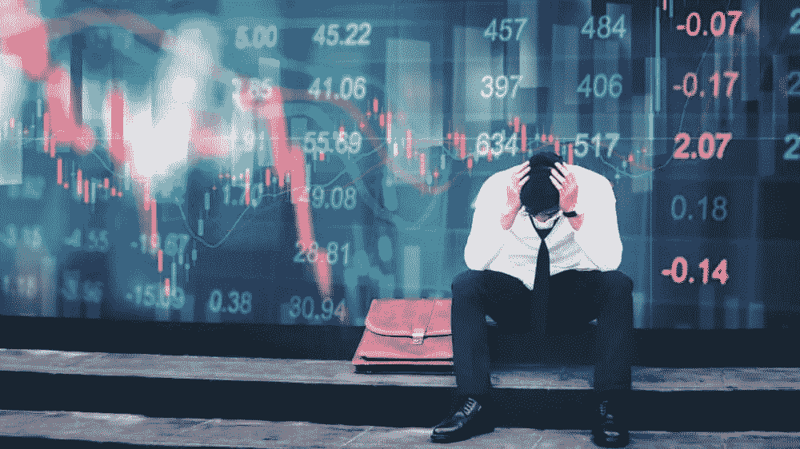

Image taken from The Motley Fool.

经过几天的绿色交易后，加密货币市场今天正在经历一些调整，可能受到加息和俄罗斯-乌克兰边境紧张局势的消息的影响。然而，我惊喜地发现，我的加密投资组合在这一动荡时期得到了相对较好的缓冲，因为我以 DFI 硬币形式持有的主要资产之一实际上表现相当好——这是我想在本文中简要分享的内容。

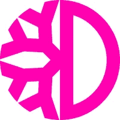

DFI

*免责声明:过去的业绩不是未来业绩的指标；在投资之前，一定要做好自己的研究。*

# 过去 24 小时的市场概况

大多数主流和趋势加密货币经历了相当大的抛售，在过去 24 小时内跌幅高达 29%。

以下图片是 12/2/22 世界协调时上午 6 点从 coingecko 拍摄的各种加密货币的价格快照。

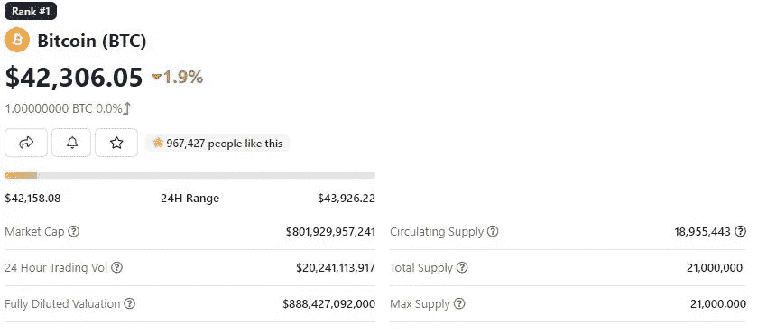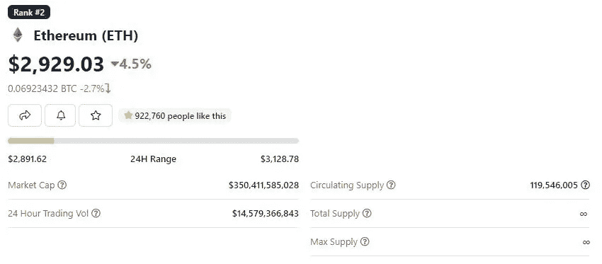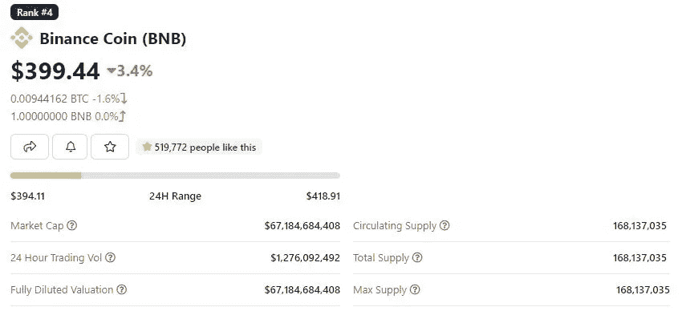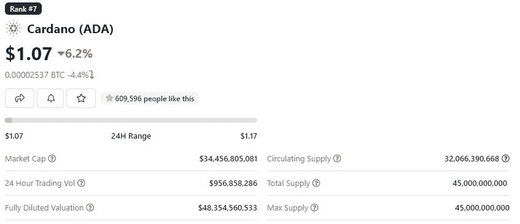

Mainstream coins

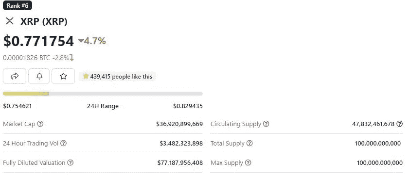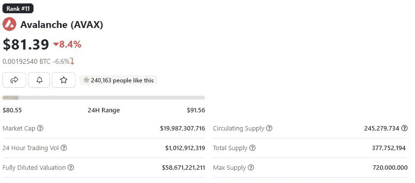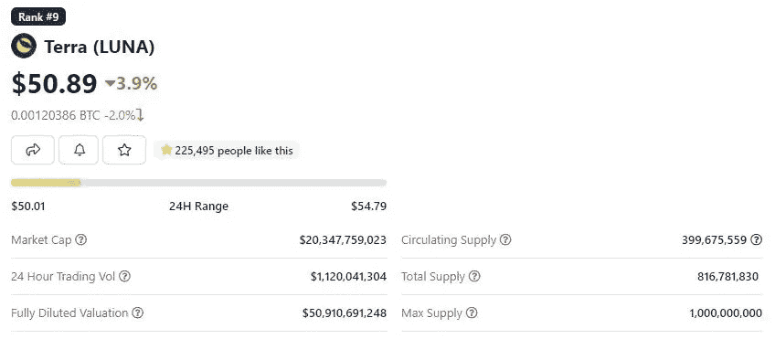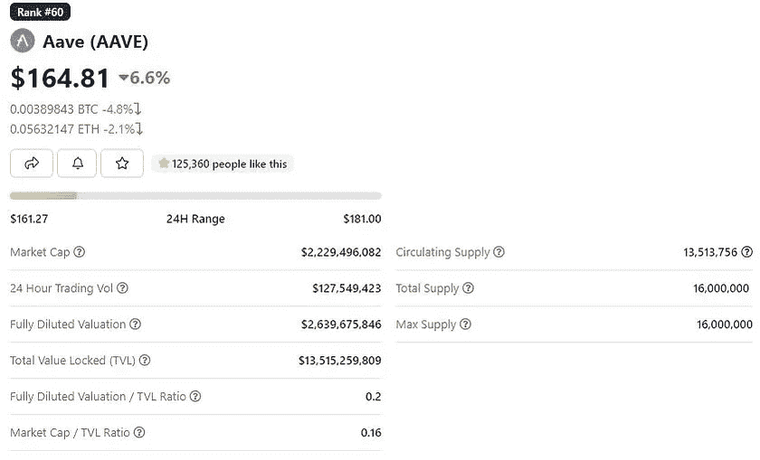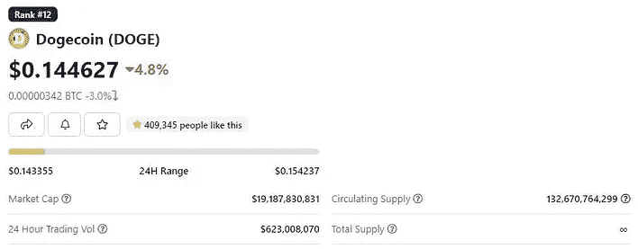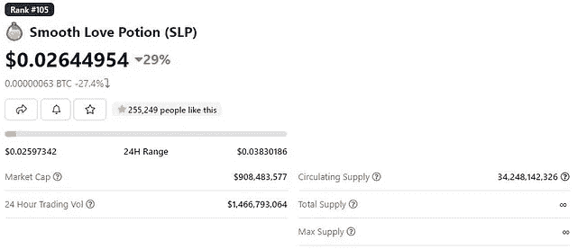

在这个动荡的时期，DFI 相对来说保持了冷静！

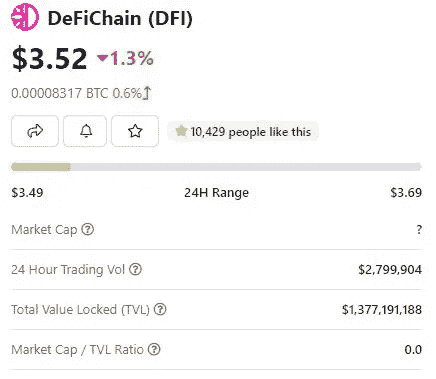

Taken from coingecko.

缩小一下，DFI 事实上自 2020 年 5 月 11 日 ICO 以来一直表现相当好，甚至在大多数时间里跑赢比特币！

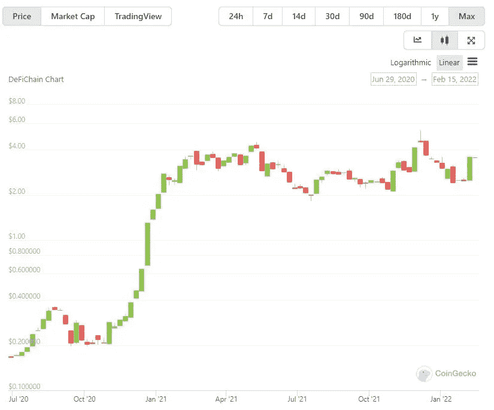

DFI price in USD, plotted in logarithmic scale, since launch. Image taken from coingecko.

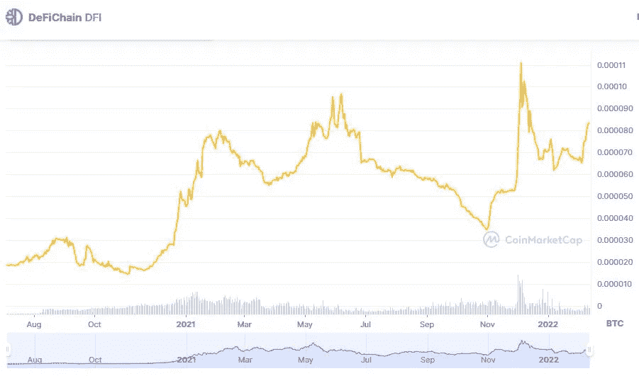

DFI/BTC price since DFI’s ICO. Image taken from coinmarketcap.

# 什么是 DFI？

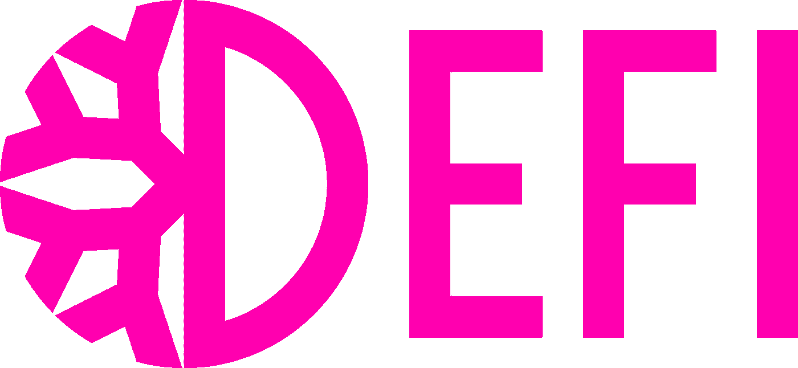

DFI coin

DFI 是 DeFiChain 的原生标志，于 2020 年 5 月 11 日推出。目前交易价格为 3.52 美元，实时市值为 1，062，782，669 美元。它的流通供应量为 300，511，840 DFI 硬币，最高面值为。供应 12 亿 DFI 硬币。

DeFiChain 是一个分散的区块链平台，旨在提供高效、透明的分散金融服务。它是作为比特币的软件分支构建的，为了安全起见，它通过 merkle root 锚定到比特币区块链。它提供了一系列令人兴奋的可能性，包括分散交易所、流动性挖掘、资产令牌化(分散资产)和贷款服务。即将推出的功能包括代币包装、定价神谕、股息分配等！

观看以下来自 DeFiChain youtube 频道的视频，全面了解 DeFiChain 及其众多令人兴奋的可能性！

# 如何成为 DeFiChain 社区的一员？

*   投资[Cake DeFi](https://cakedefi.com/?ref=677920)——一家总部位于新加坡的金融科技公司，在 DeFiChain 区块链提供最好的赌注、贷款和流动性挖掘服务。

*查看我之前的文章* [*蛋糕 DeFi*](https://cybery.medium.com/earn-delicious-passive-cash-flow-with-cake-defi-f01fce47e4c6)*[*用蛋糕 DeFi*](https://cybery.medium.com/how-to-earn-passive-income-with-cake-defi-a-tutorial-64abe4a01bec)*[*产生被动现金流教程投资分散资产*](https://cybery.medium.com/invest-in-tesla-google-apple-easily-with-decentralized-assets-cdfe4e58330b) *。***

*   **通过原生的 [defichain 钱包](https://defichain.com/downloads/)，可在 PC 和移动设备上使用。**
*   **加入 DeFiChain 活跃的[电报社区](https://t.me/defiblockchain)**

# **最后的想法**

**鉴于 DeFiChain 的许多潜力，足以说 DFI 一直是一种被低估的加密货币，值得一试。对此你有什么看法？欢迎在下面留下你的想法！**

**像往常一样，这不是财务建议！而只是我投资过的，觉得值得分享的投资平台。在投资前做好自己的研究，不要存你输不起的钱。下面有什么问题可以随时问我。**

***如果你喜欢这篇文章，* [*关注&订阅*](/@cybery) *！***

**查看以下值得信赖的平台！**

***🎁*[*honey gain*](https://r.honeygain.me/CYBER577DD)*一款被动收入应用，从你未使用的互联网带宽中赚钱。* [*免费获得 5 美元*](https://r.honeygain.me/CYBER577DD) *，无需投资。***

***🎁* [*蛋糕 Defi*](https://cakedefi.com/?ref=677920) *一站式投资平台，以高达 200%的年利率烘焙被动现金流！* [*在 DFI 用 50 美元存款获得 30 美元*](https://cakedefi.com/?ref=677920) *。***

***🎁* [*Nexo*](https://nexo.io/ref/hce5cfdt5o?src=web-link) *世界上最先进、受监管的数字资产机构，在 200 多个司法管辖区提供 40 多种法定货币的即时加密贷款、每日资产收益、兑换和服务。* [*用 100 美元存款获得 25 美元*](https://nexo.io/ref/hce5cfdt5o?src=web-link) *。***

***🎁* [*摄氏度*](https://celsiusnetwork.app.link/174094633e) *一个金融科技平台，提供带息储蓄账户、借贷，以及用数字和法定资产进行支付。* [*在 BTC 获得 50 美元*](https://celsiusnetwork.app.link/174094633e) *与 400 美元存款。***

***🎁*[*Hodlnaut*](https://www.hodlnaut.com/join/RTbHxuJMX)*一个稳健的新加坡加密借贷平台，成立于 2019 年，从你闲置的加密货币中产生被动现金流。* [*获得 30 美元*](https://www.hodlnaut.com/join/RTbHxuJMX) *在 USDC 拥有 1000 美元存款。***

***🎁*[*BlockFi*](https://blockfi.com/?ref=a16e37fd)*一种加密货币兑换和钱包。* [*用 100 美元存款获得 10 美元*](https://blockfi.com/?ref=a16e37fd) *。***

***🎁* [*库币*](https://www.kucoin.com/land/register/r/rJH29LZ) *最大的加密货币交易所之一。***

***🎁* [*火币*](https://www.huobi.com/en-us/topic/double-invite/register/?invite_code=5t5jb) *最大的加密货币交易所之一。***

***🎁*[*MEXC*](https://m.mexc.com/auth/signup?inviteCode=1NAJC)*最大的加密货币交易所之一。***

***🎁*[*Crypto.com*](https://read.cash/@TraderFX/10-tips-to-maximize-earnings-on-honeygain-an-effortless-free-passive-income-app-68535728#bad-link)*一款基于新加坡的加密货币兑换 app。* [*获得 25 美元*](https://crypto.com/app/fcbsjmf5pb) *在 CRO 赌一张红宝石牌。***

***针对马来西亚投资者***

***🎁***获得 6 个月免费投资！****

***🎁Wahed code 'KENLIE1' RM10 注册奖金***

***🎁Capbay P2P 代码' 8879c6' RM100 注册奖金***

***接我* [*中*](https://cybery.medium.com/)*|*[*read . cash*](https://read.cash/r/TraderFX)*|*[*Youtube*](https://www.youtube.com/c/SmartInvestingChannel)*|*[*电报*](https://t.me/kkkk289)|[推特](https://twitter.com/cybertraderfx)*|*T60**

> **加入 Coinmonks [电报频道](https://t.me/coincodecap)和 [Youtube 频道](https://www.youtube.com/c/coinmonks/videos)了解加密交易和投资**

# **另外，阅读**

*   **[Bookmap 点评](https://coincodecap.com/bookmap-review-2021-best-trading-software) | [美国 5 大最佳加密交易所](https://coincodecap.com/crypto-exchange-usa)**
*   **最佳加密[硬件钱包](/coinmonks/hardware-wallets-dfa1211730c6) | [Bitbns 评论](/coinmonks/bitbns-review-38256a07e161)**
*   **[新加坡十大最佳加密交易所](https://coincodecap.com/crypto-exchange-in-singapore) | [购买 AXS](https://coincodecap.com/buy-axs-token)**
*   **[红狗赌场评论](https://coincodecap.com/red-dog-casino-review) | [Swyftx 评论](https://coincodecap.com/swyftx-review) | [造币厂评论](https://coincodecap.com/coingate-review)**
*   **[投资印度的最佳密码](https://coincodecap.com/best-crypto-to-invest-in-india-in-2021)|[WazirX P2P](https://coincodecap.com/wazirx-p2p)|[Hi Dollar Review](https://coincodecap.com/hi-dollar-review)**