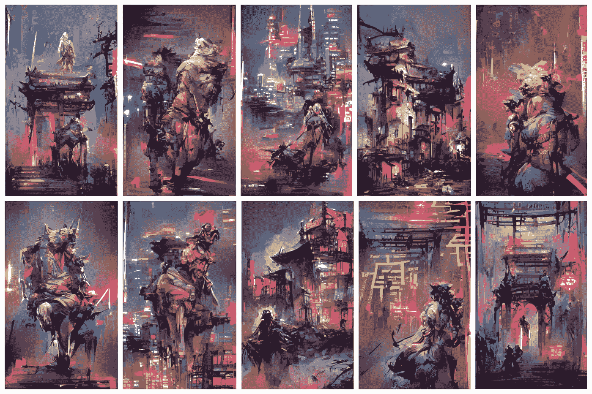
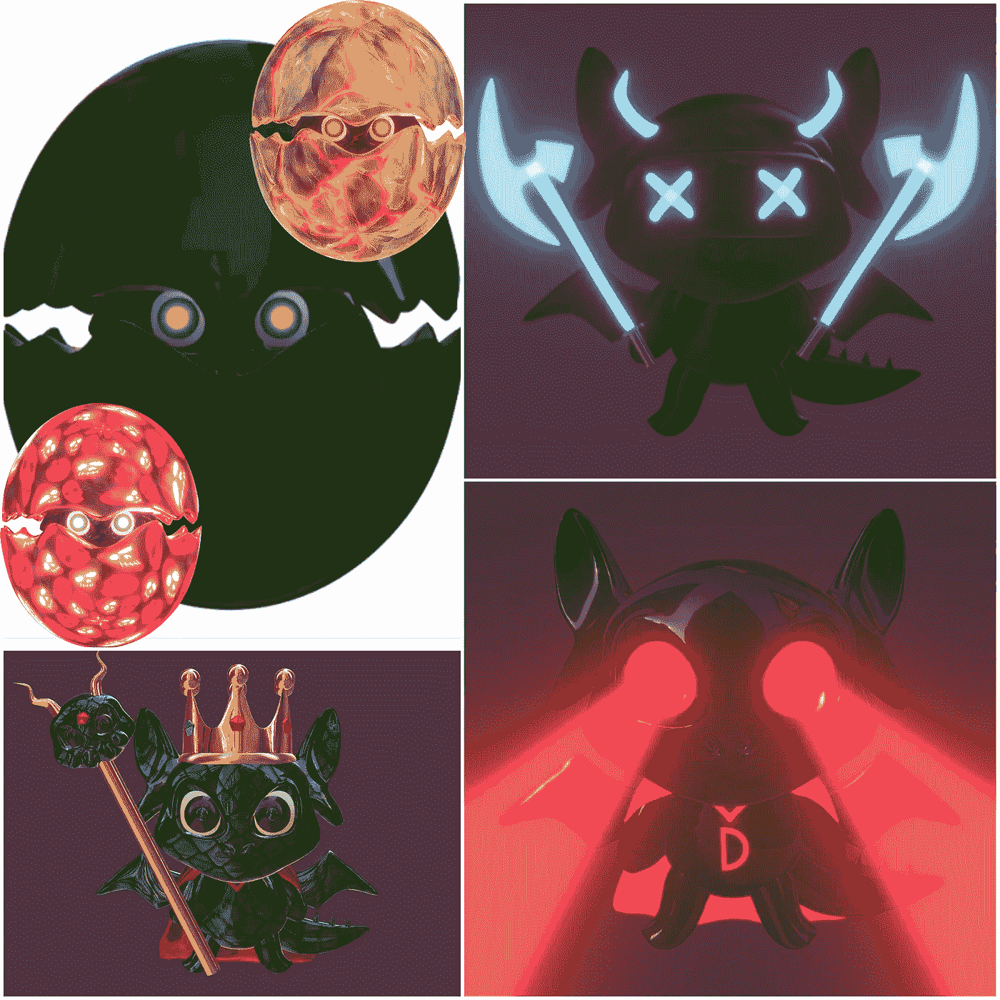
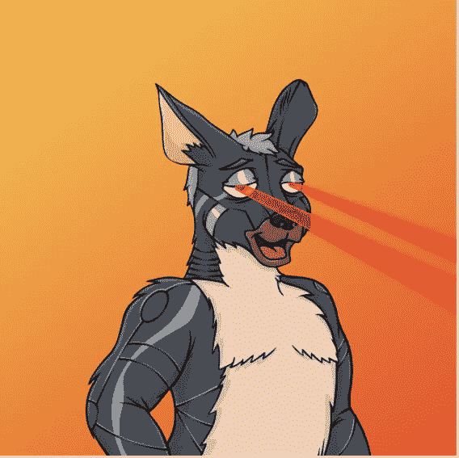
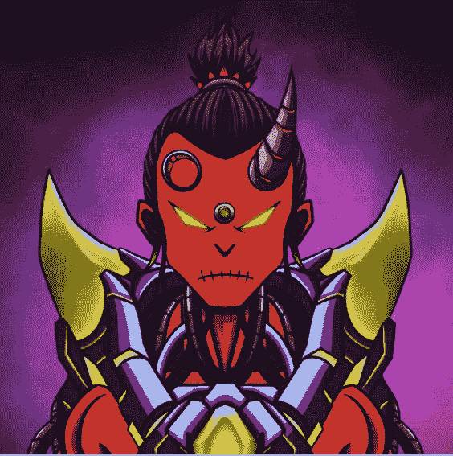

# 未经雕琢的钻石:是时候欣赏 NFT 的印度群岛了

> 原文：<https://medium.com/coinmonks/diamonds-in-the-rough-its-time-to-appreciate-the-indies-in-nft-land-374f0f55a6cf?source=collection_archive---------40----------------------->

我刚刚开始写关于 NFTs 的文章。为什么？因为这是一个爆炸式增长的生态系统，看到角色，甚至是派系的展现让我着迷。你是霍德勒钻石手吗？你是脚蹼，纸手吗？

这些术语对于 NFT 圈子内的人来说是熟悉的，但为了圈外人的利益，他们指的是那些因为长期致力于项目而持有项目 NFT 的人(霍德勒/钻石手)，或者是那些在市场上涨时在铸造后快速卖出的人(鳍手/纸手)。

它们只是随着非母语教学成为主流，成千上万甚至成千上万的人不得不快速学习的一些新语言。

但对我来说，我越来越担心我对 NFTs 最初目的的看法，当然也是我参与其中的原因正在消失。我想成为奖励艺术家和天才的一份子。我把它视为一个空间，在这里，拥有真正技能和能力的独立艺术家(印度人)最终可以在更大的范围内得到认可，而不仅仅是在他们的客厅或一群朋友中。我想支持印度队…

然而，NFT 项目已迅速成为一个营销和潜在的赚钱机器。这个领域正变得专业化，这让我感到担忧，因为独立艺术家的平台正在缩小。我们应该庆祝这些更安静的声音，但我们迷失在雄心壮志、巨额预算和重大承诺的喧嚣中。这些承诺是否会实现还有待观察，当然有些已经实现了，但我觉得这对印度群岛有些不利。

所以，我想花一点时间来赞美那些独立艺术家，他们的能力、创造力和承诺给我留下了深刻的印象，我觉得他们应该得到比我所能提供的更广泛的赞赏。欢迎在下面评论任何在 NFT 引起你注意的独立艺术家。

坦白说，我至少拥有这两位艺术家的一幅 NFT 作品。但这证明了我的观点，对吗？我购买不是因为我希望赚大钱，而是因为我欣赏艺术。

排名不分先后，我想和你们分享一下:

[NFTDad](https://twitter.com/JoshMas58797926)

[巴贝拉科](https://twitter.com/zolacryptonft)

[阿德米娅](https://twitter.com/Adotmiah)

[Zap7](https://twitter.com/zap7seven)

**NFTDad**

你可以在这里查看 NFTDad 在 Crypto.com 的收藏[https://crypto.com/nft/profile/jmason360](https://crypto.com/nft/profile/jmason360)

一位多产的艺术家，他的风格因其原创性、主题/关注领域和创造力而真正吸引了我。尝试不同风格但始终保持艺术和设计品质的人。

这件艺术品有一种特别古典的风格，这让我想起了我父亲的作品。这是它吸引我的原因之一。我被带回到第一次看到父亲的艺术的时候。它让我回忆起。

我特别喜欢 MetaCity 系列，这也是我购买整套第一版系列的原因:

**巴贝拉科**

你可以在这里查看 BabyDraco 在 OpenSea 上的收藏:【https://opensea.io/collection/baby-draco 

这是一个似乎从不睡觉的艺术家。总是在可爱干净的 BabyDraco 系列中加入新的设计，一系列多种伪装和风格的龙和龙蛋。NFT 价格实惠，每次购买可以免费获得一个鸡蛋。

这些设计有趣，甚至大胆，极具收藏价值。我可以在商品上看到它们，也可以很容易地把 BabyDraco 想象成游戏或卡通系列中的一个角色。

这是我抓到的:

**阿德米娅**

你可以在这里查看阿多米娅在 Crypto.com 的收藏:[https://crypto.com/nft/profile/anharmiah](https://crypto.com/nft/profile/anharmiah)

又一个似乎每天有 30 个小时的艺术家。我不知道 ADotMiah 是如何生产出如此多的作品，同时还能发布如此高质量和创意的艺术和设计。我喜欢着火的人系列，我买了一个袋鼠王国 NFT(因为我和澳洲的联系)，每次我检查都有新的系列。

据我所知，没有哪位艺术家比他更兼收并蓄，推出与之前的作品完全不同的作品。我感觉有一个冒险的艺术家在测试，尝试，可能会失败，但总是学习和产生最终的结果，只是着迷。

这是我得到的:

着火的男人#1

 [## Crypto.com·NFT |着火的男人

### 我收集了一些动画艺术作品，把自己描绘成一个着火的人

crypto.com](https://crypto.com/nft/collection/9758d8765eda35f1c9c4eebcb51306bb?tab=ownership) 

**Zap7**

你可以在 Crypto.com 这里[https://crypto.com/nft/profile/kingm2p](https://crypto.com/nft/profile/kingm2p)在基金会这里[https://foundation.app/@ZAP7](https://foundation.app/@ZAP7)在 OpenSea 这里[https://opensea.io/collection/cyberdemon](https://opensea.io/collection/cyberdemon)查看 Zap7 系列

Zap7 的设计和艺术品有一种梦幻般的风格。我喜欢充满活力的 NFT 设计，它们将你带到一个充满神话和传奇、充满幻想的地方。观看 NFTs 就是逃离现实世界，超越到一个恶魔和黑暗的世界。

这是一位艺术家，他对每一个系列的热情都清楚地表现在每一个设计的创意和创建支持者社区的努力中。Zap7 孜孜不倦地通过 Twitter 吸引观众，同时也创造出令人惊叹的全新设计。

以下是我所知道的:

现在，如果有一件事是我们都同意的，那就是艺术是主观的。我真正欣赏的可能反映了你欣赏或不欣赏的。我明白了。所以，如果你正在读这篇文章(顺便谢谢你)，但你对着屏幕尖叫着说应该有另一位艺术家，请在下面的评论中留下他们的详细信息。

最重要的是，如果在独立 NFT 项目的盛宴中有什么真正吸引你的东西，如果有一位艺术家真正对你说……支持他们。这并不一定只是通过购买他们的作品，虽然这对于帮助他们继续前进非常重要，也可以通过 Twitter 或向你的朋友们赞美他们。这有助于建立他们的曝光率和发展他们的品牌。

独立值得信任，值得尊重，值得拥有观众。他们应该能够利用这种新发现的对非母语教学的欣赏，在大范围内切入并展示他们的才能。

谁和我在一起？