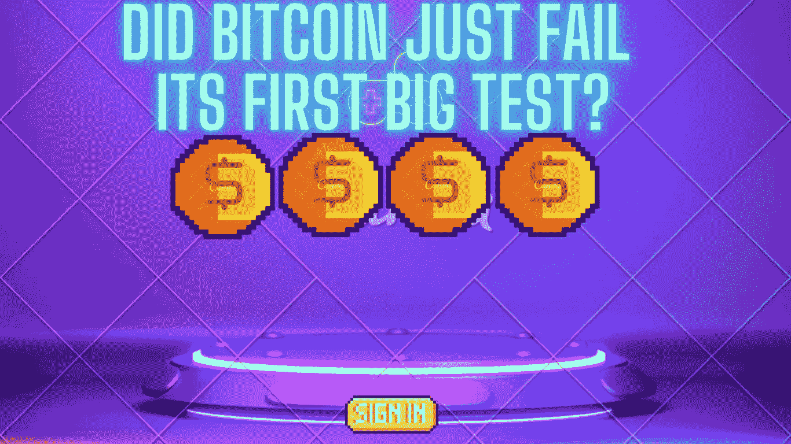
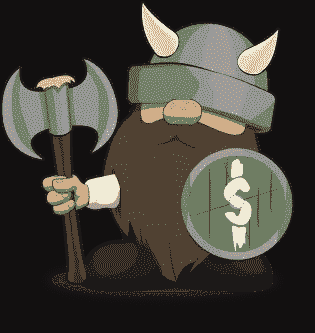

# 比特币刚刚是不是没有通过第一次大考？

> 原文：<https://medium.com/coinmonks/did-bitcoin-just-fail-its-first-big-test-2326080d9d05?source=collection_archive---------40----------------------->

让我们来评估一下当前的时刻:当我们退出 Covid 19 疫情中断时，通货膨胀太热了，我们正处于第三次世界大战的边缘。

我为什么要提这个？因为在我看来比特币根据这些信息应该已经破 100k 美元了。

主要的用例有两个方面:随着时间的推移，政府将不得不继续印钞。此外，世界上的独裁者可能会造成混乱，导致经济战争和政府冻结资产。

我不同情寡头，但如果他们能把自己的财富藏在无法从他们身上拿走的东西里，那不是很好吗？甚至在瑞士，大型游艇和房地产可以被没收，银行账户也可以被冻结。当形势危急时，政府可以介入并拿走所有这些东西。

美联储显然开始了最新一轮的加息，旨在减缓消费，提高借贷成本。这通常会抑制通胀，因为它会减缓消费和需求。这显然是通货膨胀正在升温的迹象。去给你还在开的冰柜车加满油。杰瑞的电动车一天比一天好看！

# 反驳论点

另一方面，比特币已经在 4 万美元关口徘徊了一段时间，或许这证明了美联储确实提高了利率。换句话说，政府正在采取积极措施管理和抑制通胀，这意味着 BTC 不需要暴涨。

# 规程

对于社区中的大多数人来说，最近政府提出的关于加密的法规似乎是一个受欢迎的消息。这意味着创造秩序，并帮助寡头和其他邪恶的行为者不能通过加密洗钱。

# 仍然是推测

在我看来，Crypto 仍然是高度投机性的，有时我认为我们会受到内部行动的影响。大型加密玩家似乎很早就进入了 NFT 或硬币，当我们其他人进入现场时，这些人正在提取现金。

因此，我必须诚实地说，它在我的整体投资组合中仍占相对较小的位置。学习很有趣，希望能获利，但仍有一种感觉，即一个秘密的冬天可能会突然出现，抹去估值。正如我们所知，没有办法讨论加密的内在价值。至少当我拥有 JNJ 的时候，我知道他们拥有专利、现金流机器，并且通常销售那些确实能拯救和改善人们生活的产品。实际的财务评估可以根据现金流、债务和资产来确定。

# 比特币和其他密码是失败了还是成功了？

一方面，许多严肃的硬币以非常高的估价交易。它们是大胆的新基础设施和无形资产类别不可或缺的一部分。作为投资者，你必须问资产产生了什么，它如何给客户和投资者增加价值？我们似乎仍在试图回答这些问题。

# 说“我拥有一些比特币”是什么意思？

当你拥有债券、股票、房地产、企业等。在许多方面，你可以很清楚地描述你所拥有的东西。你拥有一份当前或未来的利润。你拥有设备、不动产、值得信赖的品牌、专利工艺或产品等。当我们“拥有”比特币时，我们应该问自己拥有什么。

很明显，比特币和其他东西是成功了还是失败了还有待讨论。但我记得，我认为它是为通胀高企、政府/国家相互争斗的时刻而设计的。它应该超越这些争吵和人类的失败。也许是，也许不是。它没有形成陨石坑，但我预计它会上升更多。

也许事情已经够糟糕了，也许美联储正在成为一个有效的工具，也许俄罗斯政府最终将停止制造极端的波动性，因为制裁粉碎了他们？时间会证明一切，我只会持有我的 2-3%的密码。如果世界末日来临，希望它能换来罐头豆子、枪支和水。

如果你喜欢这篇文章，请考虑成为[金钱维京人高级会员](https://premium.moneyvikings.com/?page_id=9438)，代码**中等**，第一个月享受 50%的优惠。

或者加入[传媒](https://moneyvikings.medium.com/membership)帮助支持更多类似这样的励志文章。

> 加入 Coinmonks [电报频道](https://t.me/coincodecap)和 [Youtube 频道](https://www.youtube.com/c/coinmonks/videos)了解加密交易和投资

# 另外，阅读

*   [火币加密交易信号](https://coincodecap.com/huobi-crypto-trading-signals) | [Swapzone 审查](/coinmonks/swapzone-review-crypto-exchange-data-aggregator-e0ad78e55ed7)
*   最佳[密码交易机器人](https://coincodecap.com/best-crypto-trading-bots) | [购买索拉纳](https://coincodecap.com/buy-solana) | [矩阵导出评论](https://coincodecap.com/matrixport-review)
*   [Coldcard 评论](https://coincodecap.com/coldcard-review) | [BOXtradEX 评论](https://coincodecap.com/boxtradex-review)|[uni swap 指南](https://coincodecap.com/uniswap)
*   [比特币基地评论](/coinmonks/coinbase-review-6ef4e0f56064) | [德里比特评论](/coinmonks/deribit-review-options-fees-apis-and-testnet-2ca16c4bbdb2) | [FTX 评论](/coinmonks/ftx-crypto-exchange-review-53664ac1198f)
*   [Unocoin 评论](https://coincodecap.com/unocoin-review) | [最佳加密赌注硬币](https://coincodecap.com/best-crypto-staking-coins)