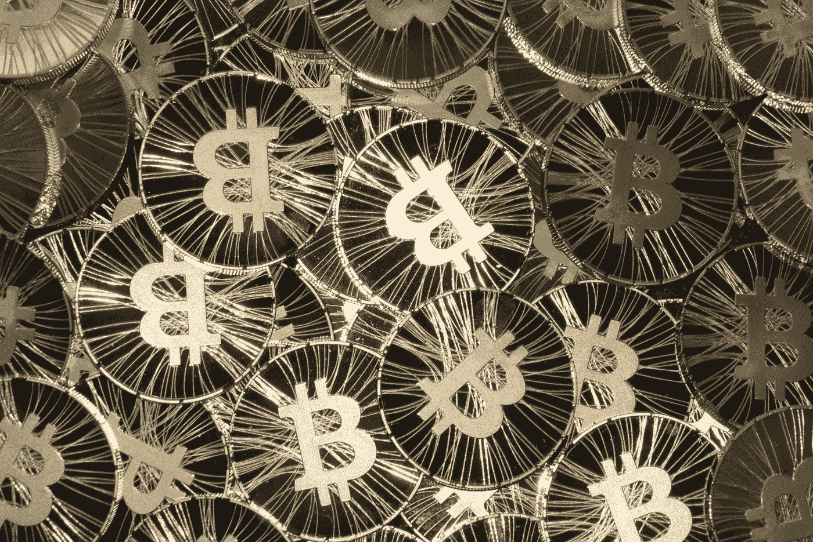
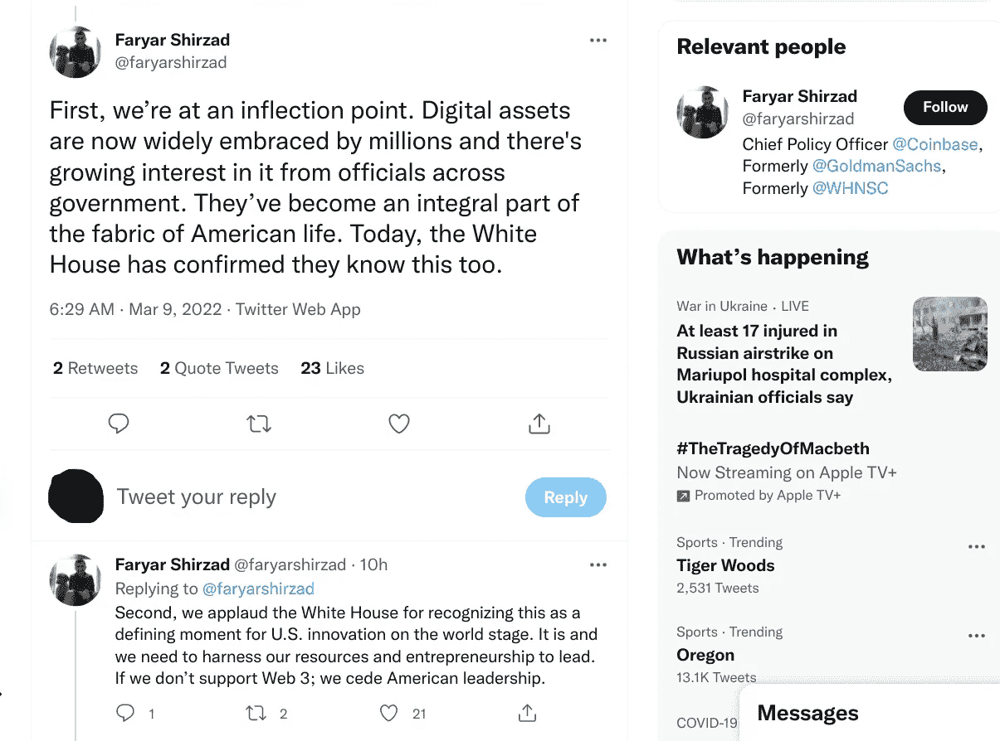
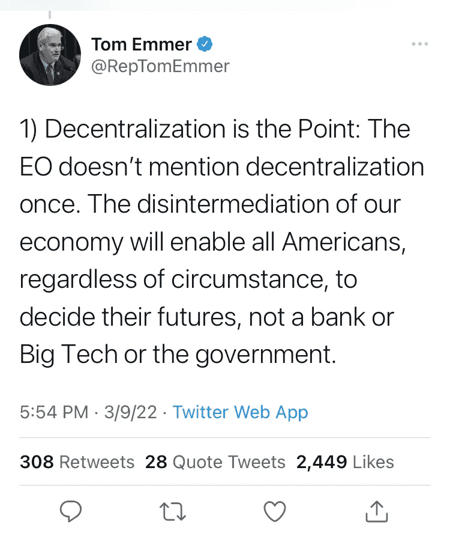

# 比特币刚刚达到临界质量了吗？

> 原文：<https://medium.com/coinmonks/did-bitcoin-just-hit-critical-mass-dfefa7161852?source=collection_archive---------32----------------------->

Image Credit: [Antana](https://www.flickr.com/photos/105644709@N08/10307460906)

## *拜登总统签署广泛的行政命令，为数字资产制定国家政策*

拜登政府[刚刚做了我一直预测它会做的事情](https://www.whitehouse.gov/briefing-room/statements-releases/2022/03/09/fact-sheet-president-biden-to-sign-executive-order-on-ensuring-responsible-innovation-in-digital-assets/)，宣布了一项广泛的全面计划，以控制和监管加密货币，探索其在推出央行发行的数字货币方面的选择，以及在数字资产方面将美国置于领导地位的机会。这个“命令”到底是什么意思？最重要的是，在我看来，这意味着加密货币终于达到了临界质量！以至于 [Mashable](https://mashable.com/article/biden-white-house-cryptocurrency-executive-order?taid=622905df7579d30001fe1e36&utm_campaign=trueAnthem%3A+Manual&utm_medium=trueAnthem&utm_source=twitter) 声称拜登总统签署行政命令是 FOMO 的结果！

嘿，我上周不是发表了一篇关于加密货币和 FOMO 的文章吗？

不幸的是，该行政命令还意味着，Web3、元宇宙、分散式货币、非功能性货币和加密货币将很快纳入政府监管。在我看来，这在某种程度上挫败了去中心化，但我可能会被说服放弃这一立场，因为我也愿意相信去中心化的世界是可能的。从某种意义上来说，这是一个悲剧，如此多的人最终不得不接受过去十年一直摆在他们面前的现实——对他们的比特币进行监管。派对已经结束了。

但也许新派对会一样酷？也许有一种方法可以创建一个受监管的元宇宙，同时又能让它感到权力分散？谁知道呢？加密行业实际上对这一消息反应相当好——事实上，比特币的价格已经上涨了 9%！甚至领先的加密出版物的首席政策官比特币基地也对行政命令做出了非常积极的回应，他在一系列推特上发布了这条消息。他也认识到，这种秩序源于临界质量，应该代表着加密的分水岭时刻。

根据白宫发布的新闻稿，“该命令在六个关键优先事项上制定了国家数字资产政策:消费者和投资者保护；金融稳定；非法融资；美国在全球金融体系和经济竞争力中的领导地位；金融包容性；和负责任的创新。”

事实上，这篇新闻稿比我想分享的要详细得多，所以我把它的要点贴在下面。如果你想要完整的故事，你必须点击新闻稿。

具体而言，该行政命令要求采取措施:

*   *保护美国消费者、投资者和企业*
*   *保护美国和全球金融稳定，降低系统性风险*
*   *减轻非法使用数字资产带来的非法金融和国家安全风险*
*   *提升美国在技术和经济竞争力方面的领导地位，以巩固美国在全球金融体系中的领导地位*
*   *促进公平获得安全和负担得起的金融服务*
*   *支持技术进步，确保负责任地开发和使用数字资产*
*   *探索美国中央银行数字货币(CBDC)*

不管你是否拥有 crypto，是否曾经购买过 NFT 或者在分散地拥有房产，这个消息让你感觉如何？我很想听听我的读者对这个话题的看法，只是因为这个命令可能会突然使一些人的加密货币合法化。它可能会杀死其他人。你站在哪一边？

至于我？我仍然持观望态度，FOMO 暂时在检查，原因如下:

表示“受到某种对待的人”:dividend | reverend