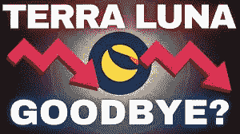

# 露娜是卖掉了 30 亿美元的 BTC 保护区，还是用来补偿隐鲸？

> 原文：<https://medium.com/coinmonks/did-luna-sell-its-3billion-btc-reserve-or-was-it-used-to-compensate-crypto-whales-ae56bafe51b4?source=collection_archive---------47----------------------->

突出

*   卢娜表示，在一次拯救 UST 的失败尝试中，它几乎耗尽了其储备的所有 BTC
*   尽管投入市场的硬币价值近 30 亿美元，但 BTC 价格保持稳定
*   有人猜测，BTC 并没有被出售，而是作为对大投资者的补偿。

## 在 LUNA 上周突然崩溃后，投资者一直在要求 LUNA Foundation Gate 澄清它是如何花掉基金会的 8 万比特币储备的。

截至上个月，价值约 30 亿美元的 BTC 储备由 LUNA Foundation Gate 储存，以支持其失败的稳定货币 UST，如果它与美元脱钩的话。

在最近的一系列推文中，Terra 的创始人 Do Kwon 试图向投资者保证，他解释说，几乎所有的保护区都是在拯救 UST 的失败尝试中出售的。除了 BTC，卢娜基金会守卫保护区还有其他密码。包括 BNB、泰瑟、USDC 和雪崩。Kwon 曾承诺在 UST 价值大幅下跌的情况下使用比特币。

在解释如何使用这笔储备时，Kwon 解释说，随着 UST 跌破 1 美元的目标，该基金会部署了 52，189 个比特币来“与交易对手进行交易”。该基金会表示，Terra 还直接出售了 33206 枚比特币，这是为捍卫盯住汇率制度所做的最后努力。

最终，储备金只剩下 313 BTC it $ 930 万。

不知何故，市场已经设法吸收了几乎全部 8 万 BTC，但随着波动性趋于平静，比特币在过去几天保持稳定。

然而，越来越多的人猜测，LFG 可能没有像早先认为的那样出售 BTC，储备被耗尽是为了给鲸鱼提供流动性补偿。

该报道尚未得到证实，但如果它被证明是真的，那么它可能会对市场产生真正的后果，因为最近的稳定可能会成为一个虚假的黎明。

首先，这可能意味着市场没有吸收 80，000 英镑，因此有可能稍后被抛售，这可能加剧抛售压力，并进一步伤害 BTC 价格。

其次，这也可能引发严重的治理问题，因为 LFG 方面所谓的利用外汇储备向大型投资者提供优惠待遇、让他们以散户投资者为代价实现软着陆的决定，可能构成金融犯罪。

如果这些猜测得到证实，这就好比公司董事会利用其应急基金来救助高管，而不是拯救公司免于破产。

目前，一切仍有待猜测，但 Kwon 和 LFG 需要迅速采取行动，向散户投资者保证，他们没有被用作 Terra 生存游戏中的一枚棋子。

与此同时，在过去几天，加密货币的总市值跌至 1 万亿美元，为 2021 年 1 月以来的最低水平，并小幅回升至 1.3 美元。分析师表示，随着一些稳定迹象逐渐恢复，美元可能会向 1.4-1.5 万亿美元的阻力区前进。

分析师继续密切关注市场，如果价格继续稳定几天，也许直到下周，这可能标志着危机最糟糕的时期可能已经过去，投资者的信心可能会恢复。

但如果市场领导者 BTC 跌破 28 000 美元的支撑位，那么比特币 20000 美元的预测可能会成为现实。

Joseph 是一名密码作家、分析师和交易员，致力于提供经过充分研究的教育内容，帮助密码交易员和投资者做出明智的决策。

> 加入 Coinmonks [电报频道](https://t.me/coincodecap)和 [Youtube 频道](https://www.youtube.com/c/coinmonks/videos)了解加密交易和投资

# 另外，阅读

*   [加密货币储蓄账户](/coinmonks/cryptocurrency-savings-accounts-be3bc0feffbf) | [YoBit 审核](/coinmonks/yobit-review-175464162c62)
*   [Botsfolio vs nap bots vs Mudrex](/coinmonks/botsfolio-vs-napbots-vs-mudrex-c81344970c02)|[gate . io 交流回顾](/coinmonks/gate-io-exchange-review-61bf87b7078f)
*   [CoinFLEX 评论](https://coincodecap.com/coinflex-review) | [AEX 交易所评论](https://coincodecap.com/aex-exchange-review) | [UPbit 评论](https://coincodecap.com/upbit-review)
*   [AscendEx 保证金交易](https://coincodecap.com/ascendex-margin-trading) | [Bitfinex 赌注](https://coincodecap.com/bitfinex-staking) | [bitFlyer 点评](https://coincodecap.com/bitflyer-review)
*   [Bitget 回顾](https://coincodecap.com/bitget-review)|[Gemini vs block fi](https://coincodecap.com/gemini-vs-blockfi)cmd |[OKEx 期货交易](https://coincodecap.com/okex-futures-trading)
*   [AscendEx Staking](https://coincodecap.com/ascendex-staking)|[Bot Ocean Review](https://coincodecap.com/bot-ocean-review)|[最佳比特币钱包](https://coincodecap.com/bitcoin-wallets-india)