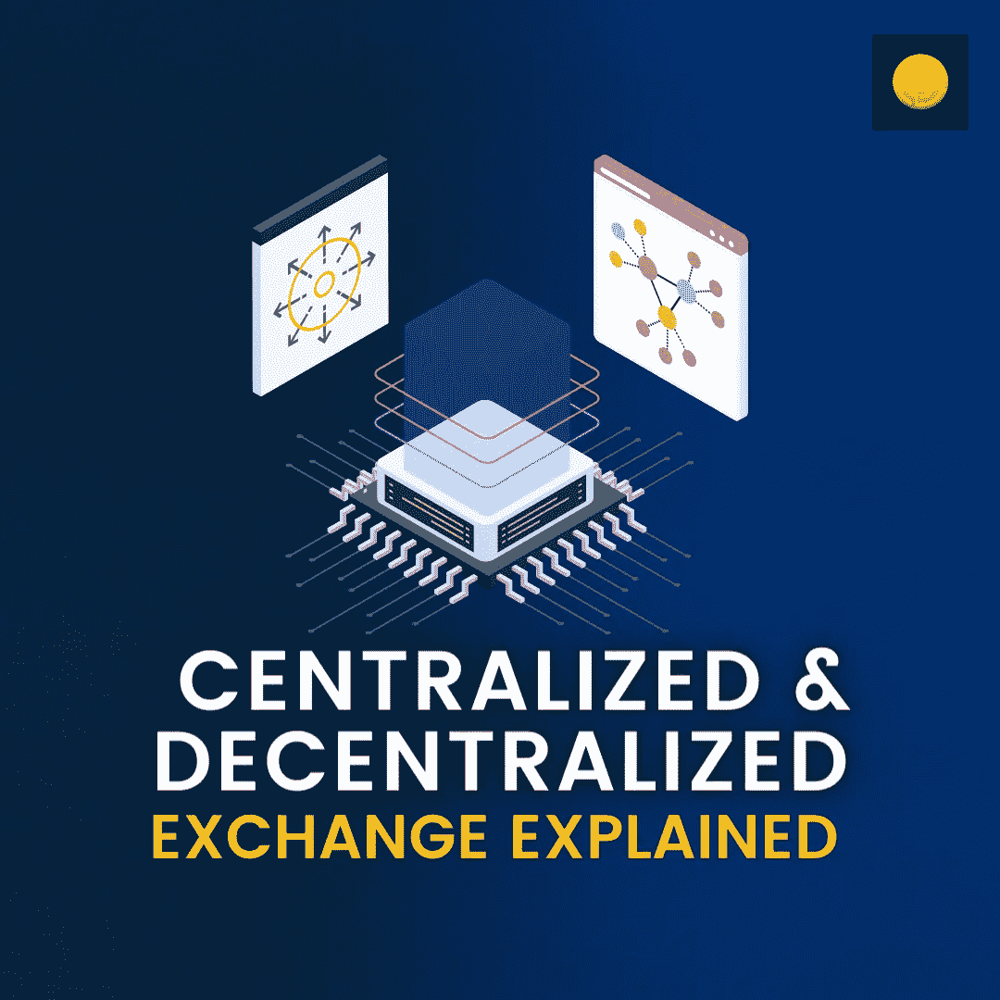

# 解释了集中式和分散式交换的区别

> 原文：<https://medium.com/coinmonks/difference-between-a-centralized-and-decentralized-exchange-explained-f0c0946f6a8?source=collection_archive---------46----------------------->

最近两年，crypto 火了。100%甚至高达 1000%的回报率将投资者从所有其他资产类别吸引到加密领域。然而，他们偶然发现了一件事，那就是进入正确的[密码交易所](https://www.coindhan.com/)进行交易。集中交易还是分散交易更有意义。在本文中，我们将讨论同样的问题，以便投资者可以采取正确的行动。

# 什么是集中式加密交换？

一个集中的[交换](https://www.coindhan.com/) (CEX)没有点对点的操作；也就是说，有第三方参与更新分类账和余额的状态。因此，人们可以很容易地说，集中交易所以托管的方式工作，它们遵循严格的 KYC 过程。

# 什么是去中心化交换？

分散式交易所(DEX)的工作方式很像集中式交易所；然而，它们只有一个基本的区别，那就是没有中介。因此，你不需要做 kyc，当你看 CEX 时，费用也相对较低。

**结论**

无论是集中交易还是分散交易，都有自己的方式让交易者受益。在 CEX，你有一个简化的体验，但他们是在国家的控制之下。例如，最近的乌克兰-俄罗斯危机迫使许多账户被冻结，顶级交易所计划停止运营。DEXes 通过去中心化给予了更多的独立性，但是他们还没有建立一个简单的生态系统的声誉。

> 加入 Coinmonks [电报频道](https://t.me/coincodecap)和 [Youtube 频道](https://www.youtube.com/c/coinmonks/videos)了解加密交易和投资

# 另外，阅读

*   [3 商业评论](/coinmonks/3commas-review-an-excellent-crypto-trading-bot-2020-1313a58bec92) | [Pionex 评论](https://coincodecap.com/pionex-review-exchange-with-crypto-trading-bot) | [Coinrule 评论](/coinmonks/coinrule-review-2021-a-beginner-friendly-crypto-trading-bot-daf0504848ba)
*   [莱杰 vs Ngrave](/coinmonks/ledger-vs-ngrave-zero-7e40f0c1d694) | [莱杰 nano s vs x](/coinmonks/ledger-nano-s-vs-x-battery-hardware-price-storage-59a6663fe3b0) | [币安评论](/coinmonks/binance-review-ee10d3bf3b6e)
*   [Bybit 交易所评论](/coinmonks/bybit-exchange-review-dbd570019b71) | [Bityard 评论](https://coincodecap.com/bityard-reivew) | [Jet-Bot 评论](https://coincodecap.com/jet-bot-review)
*   [3 commas vs crypto hopper](/coinmonks/3commas-vs-pionex-vs-cryptohopper-best-crypto-bot-6a98d2baa203)|[赚取加密利息](/coinmonks/earn-crypto-interest-b10b810fdda3)
*   最好的比特币[硬件钱包](/coinmonks/hardware-wallets-dfa1211730c6) | [BitBox02 回顾](/coinmonks/bitbox02-review-your-swiss-bitcoin-hardware-wallet-c36c88fff29)