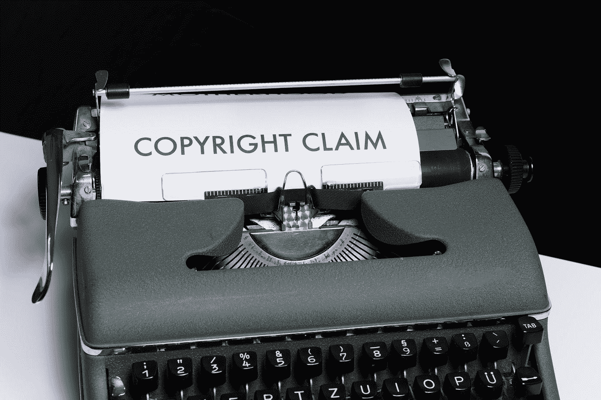

# NFT 与肖像权的区别

> 原文：<https://medium.com/coinmonks/difference-between-nft-and-image-rights-98d15d3a3d2e?source=collection_archive---------15----------------------->

## NFT 没有版权，除非…

Photo by [Markus Winkler](https://unsplash.com/@markuswinkler?utm_source=medium&utm_medium=referral) on [Unsplash](https://unsplash.com?utm_source=medium&utm_medium=referral)

这可能是困扰几乎每个创作者的问题，他们不愿意把他们的作品放到网上，因为害怕版权欺诈和侵犯权利。

谁能责怪他们呢？他们的恐惧和 7 月 4 日一样真实。

作为一名创作者，我想确保我的作品得到人们的认可，他们会购买和…