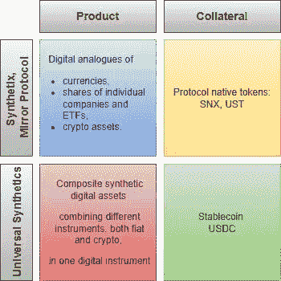
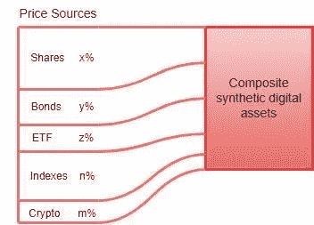
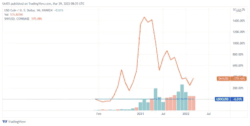
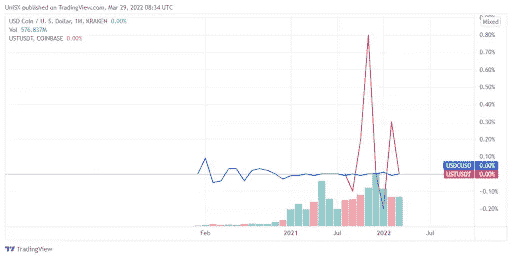

# 与 Synthetix 和 Mirror 协议的区别

> 原文：<https://medium.com/coinmonks/differences-from-synthetix-and-mirror-protocol-9b729ff0db90?source=collection_archive---------23----------------------->

*为什么万能合成体是针对合成体的？好吧，假设它不仅仅是另一个项目:差异主要在于合成资产的“设计”和使用的抵押品，以及项目所基于的 UMA 平台的优势，这最终为它创造了竞争优势。*

*Comparing Universal Synthetics with other projects*

## **产品**

在 Synthetix 和 Mirror Protocol 中，合成代币是货币、单个公司的股票和 ETF 以及其他加密资产的数字类似物，而 Universal Synthetics 生产的**合成数字资产**将不同的工具(法定工具和加密工具)结合在一个数字工具中:

*   复合合成数字资产可以是代表一个指数的若干股票的简单组合，也可以是不同种类资产的组合，例如股票、债券、交易所交易基金、股票指数和加密资产，它们实际上是一个投资组合；
*   使用 UMA 的乐观 Oracle 机制，复合合成数字资产的价格与实物资产的价格相关联；
*   通用合成合成数字资产是利用 UMA 金融合同模板构建的。USDC 马币被用作抵押品。

*Structure of a composite synthetic digital asset*

**抵押品**

Synthetix 和 Mirror Protocol 使用自己的令牌作为发行的合成令牌的抵押品:SNX(用于 Synthetix)和 UST(用于 Mirror Protocol)。环球合成公司用 USDC 的稳定硬币做抵押。

下面是 USDC 稳定币报价(两个图表上的蓝线)与 SNX 报价(橙线)和 UST 报价(紫线)的比较。

*Comparison of USDC and UST quotes*

*Comparison of USDC and SNX quotes*

显然，使用 USDC 作为抵押品可以创造一种更可持续的合成资产，不受抵押品令牌报价涨跌的影响。

因此，Universal Synthetics 与其他项目在合成资产和所用抵押品的“设计”方面的差异，以及该项目所基于的 UMA 平台的优势，创造了相对于其他项目的竞争优势，并使我们能够依赖用户的关注。

# [订阅关注我们当前和未来产品的所有新闻](/subscribe/@unisx)。

The curated series of articled created via ManyStories

> 加入 Coinmonks [电报频道](https://t.me/coincodecap)和 [Youtube 频道](https://www.youtube.com/c/coinmonks/videos)了解加密交易和投资

# 另外，阅读

*   [杠杆代币](/coinmonks/leveraged-token-3f5257808b22) | [最佳密码交易所](/coinmonks/crypto-exchange-dd2f9d6f3769) | [Paxful 点评](/coinmonks/paxful-review-4daf2354ab70)
*   [加密套利](/coinmonks/crypto-arbitrage-guide-how-to-make-money-as-a-beginner-62bfe5c868f6)指南| [如何做空比特币](/coinmonks/how-to-short-bitcoin-568a2d0b4ae5)
*   [币安期货交易](https://coincodecap.com/binance-futures-trading)|[3 commas vs Mudrex vs eToro](https://coincodecap.com/mudrex-3commas-etoro)
*   [如何购买 Monero](https://coincodecap.com/buy-monero) | [IDEX 评论](https://coincodecap.com/idex-review) | [BitKan 交易机器人](https://coincodecap.com/bitkan-trading-bot)
*   [尤霍德勒 vs 科恩洛 vs 霍德诺特](/coinmonks/youhodler-vs-coinloan-vs-hodlnaut-b1050acde55a) | [Cryptohopper vs 哈斯博特](https://coincodecap.com/cryptohopper-vs-haasbot)
*   [顶级付费加密货币和区块链课程](https://coincodecap.com/blockchain-courses)