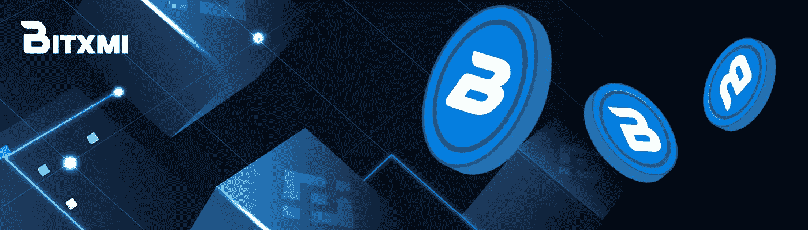

# 不同种类的加密货币

> 原文：<https://medium.com/coinmonks/different-kinds-of-cryptocurrencies-c935665d6bbc?source=collection_archive---------35----------------------->

Source: [https://news.bxmi.io/](https://news.bxmi.io/)

据估计，有超过 5000 种不同类型的加密货币。这些加密货币都属于三个主要类别之一:替代货币(Altcoin)、代币(Token)或比特币(Bitcoin)。

**加密货币分为三大类**:

**比特币**

Source: Unsplash.com

截至本文撰写时，比特币(BTC)仍是全球最有价值的加密货币，市值超过 1.4 万亿美元。比特币是一种全球点对点电子支付系统，允许各方直接互动，而不需要银行等中介。

这种创新的新货币于 2009 年首次推出，当时比特币白皮书(解释这种货币如何工作的文件)发表了。自推出以来，比特币网络从未经历过任何宕机，允许任何人随时转移价值。

比特币创始人使用的笔名中本聪仍然是个谜。此外，还不清楚 Nakamoto 代表的是一个人还是一起参与比特币项目的一群人。

比特币被广泛视为法定货币和黄金的数字投资替代品。像黄金一样，比特币是一种很好的价值储存手段，因为它可以像普通货币一样消费和储蓄。

**山寨币**

Source: Unsplash.com

自 2008 年比特币“开源”引入以来，又有数十种加密货币被创造出来。这些新硬币被称为“替代硬币”，是比特币的替代品。

虽然一些替代币的功能与比特币类似，但其他加密货币有各种应用。例如，可以使用以太坊(世界上第一个可编程的区块链)构建和部署去中心化应用(DApps)和智能合约。

后来在 2009 年，比特币网络上线。自推出以来，比特币网络从未经历过任何宕机，允许任何人随时转移价值。

所有的替代币，像比特币一样，都使用分布式账本技术在其网络上独立运行(DLT)。中本聪通过比特币向世界介绍的区块链技术是最受欢迎和最广泛使用的数字账本技术类别(DLT)。每种协议的底层编码都将替代硬币彼此区分开来，尽管它们都使用 DLT 标准。

**代币**

Source: Unsplash.com

与比特币和替代币不同，代币依赖于另一种加密货币的网络才能发挥作用。因此，它们没有分散式账本技术(DLT)或区块链，而是构建在现有加密货币的区块链之上。

因为您不必从零开始使用区块链，所以生成令牌要容易得多。如果你听说过“令牌化世界”这个说法，你就会知道令牌可以用来表示任何种类的资产。由于智能合约，股票、商品、法定货币、其他加密货币和房地产的“令牌化”版本现在已经可以使用了。就世界上还有什么可以“标记化”而言，我们可能刚刚开始触及表面。

**基于特征的加密货币分类**

Source: Unsplash.com

加密货币可以根据其特征分为四个不同的类别:

1.  **兑换令牌:**交易所生成的主要用于其交易平台和服务的加密货币是兑换令牌。币安币、霍比币和库币只是几个例子。
2.  **基于比特币协议的加密货币:**基于比特币协议的加密货币种类繁多，这也是它们如此流行的原因。流行的加密货币包括莱特币和比特币现金。
3.  **基于功能的加密货币:**以太坊是基于平台的加密货币中最知名的，由于其使用智能合约和去中心化应用程序，被广泛认为是仅次于比特币的第二大最有价值的加密货币。
4.  **Stablecoins:** 指试图通过将其价值与法定货币或其他资产的价值挂钩来维持恒定价格的加密货币(每开采一个代币，银行账户中就会存入一美元)。一些最受欢迎的加密货币，如 USDT，比其他货币波动性小。通过将它们与法定货币等稳定资产挂钩，价格波动性大大降低。Tether、Dai、USD Coin 和 Paxos 是一些最著名的例子。
5.  **cbdc:**是由中央银行发行或担保的数字货币。中国人民银行(PBoC)正在开发一种数字人民币，大多数国家计划在未来也这样做。

**代币和加密货币在哪些方面有区别？**

基本区别在于令牌没有自己的区块链。加密货币建立在区块链的基础上。第三方区块链用于令牌的创建和操作。

**基于用途的加密货币分类**

1.  **纯货币:**这些是充当商品和服务交换货币的货币。BTC 就是这样的加密货币之一；Ripple 是为跨境支付而打造的。，BCH(比特币现金)被创造出来，比比特币要快得多，也便宜得多。莱特币也是为了比 BTC 送得更快而建造的。
2.  **区块链平台:**这些加密货币充当具有智能合约功能的区块链平台，允许 Dapps 在其上运行。它们包括以太坊、EOS、CARDANO、Vechain、NEO 和 Stellar Lumen (XLM，专注于开发金融支付结构以促进国际交易)。
3.  **生态系统币:**他们的目的是加强和促进区块链空间的易用性。这些硬币包括 Nebulas (NAS)、Waves(允许开发者开发他们的令牌)、SALT(允许用户在使用他们的加密货币作为抵押品的同时套现贷款)、Chain Link(连接数字加密货币世界和现实世界的桥梁)、Ethos、Aion 等
4.  **隐私币:**这类硬币旨在通过隐藏特定比特币地址背后的身份，为交易提供完全或可选的隐私。它们包括:Monero、Zcash (ZEC)、XVG (Verge)、Bytecoin (BTN)、比特币私人(BTCP)、Komodo (KMD)、NAVCOIN (NAV)
5.  **加密货币兑换硬币:**这些硬币提供基于兑换和支付网络的解决方案，以增强用户体验。这些硬币包括 Cryptonex (CNXL)、QASH、KYBER、请求网络(REQ)、Bitshares (BTS)、Looping (LRC)、OX (zrx)
6.  **博彩游戏币:**他们专注于博彩业。例如 Storm Token(暴风)、Funfair(好玩)。
7.  **社交网络硬币:**社交网络需要安全和隐私，因为这些社交网络由一家中央公司运营，这使得信息和数据易受攻击。这些代币将破坏通常的社交网络，因为个人不仅会保护他们的数据，而且他们还会在使用这些社交网络时获利。这些加密货币包括 RDD Reddcoin，Steem (STEEM)，Mithril (MITH)
8.  **分散式数据存储币:**通常的云存储系统是高效的，但它容易受到系统故障和安全漏洞的影响。有了区块链技术，透明度和安全性就有了保证。

**你应该知道的流行加密货币**

**比特币现金:**比特币现金是一种加密货币，是一种支付网络，采用与比特币相同的技术。白皮书的作者表示，这种数字货币是比特币网络的一个分支。它的目标是确保实现创建支付机制的首要目标。目前有 1870 万种加密货币在流通，市值为 6.56 亿美元。

**Ripple (XPR):** 根据 Block Impulse 首席执行官 Carlos Callejo 和营销、电子商务和咨询专家 Vctor Ronco 的说法，Ripple 是银行的加密货币。这是因为许多组织使用 RippleNet，Ripple 的网络，因为它可以在 10 秒钟内完成金融交易。目前它的价值在 1 到 2 美元之间(0.98 到 1.31 欧元)，CoinMarketCap 估计有 460 亿枚这种硬币在流通。

**Tether (USDT):** 欧元或日元等传统货币支持每个新的 Tether 版本。由于许多人仍然对加密货币感到担忧，这种硬币的设计旨在使资产更加稳定，波动性更小，以打消公众的疑虑。虽然有多达 58，000，000，000 份在流通，但它现在的价格是 1 美元(或 0.8 美分左右)。

> 加入 Coinmonks [电报频道](https://t.me/coincodecap)和 [Youtube 频道](https://www.youtube.com/c/coinmonks/videos)了解加密交易和投资

# 另外，阅读

*   [如何在 Bitbns 上购买柴犬(SHIB)币？](https://coincodecap.com/buy-shiba-bitbns) | [购买 Floki](https://coincodecap.com/buy-floki-inu-token)
*   [CoinFLEX 评论](https://coincodecap.com/coinflex-review) | [AEX 交易所评论](https://coincodecap.com/aex-exchange-review) | [UPbit 评论](https://coincodecap.com/upbit-review)
*   [十大最佳加密货币博客](https://coincodecap.com/best-cryptocurrency-blogs) | [YouHodler 评论](https://coincodecap.com/youhodler-review)
*   [AscendEx 保证金交易](https://coincodecap.com/ascendex-margin-trading) | [Bitfinex 赌注](https://coincodecap.com/bitfinex-staking)
*   [最好的卡达诺钱包](https://coincodecap.com/best-cardano-wallets) | [Bingbon 副本交易](https://coincodecap.com/bingbon-copy-trading)