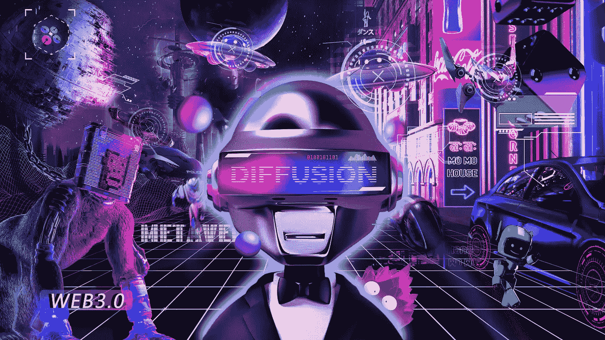

# 扩散道多元宇宙——数字空间中人类梦想的收集与实现

> 原文：<https://medium.com/coinmonks/diffusiondao-multiverse-the-collection-and-fruition-of-human-dreams-in-digital-space-8e7e305e3486?source=collection_archive---------39----------------------->

大爆炸之前发生了什么？多元宇宙理论——也被称为“泡沫宇宙”——可以追溯到大爆炸之前，并假设宇宙膨胀，只有一个结果，那就是我们的宇宙。根据大爆炸理论，它还产生了许多其他完全独立的宇宙。然而，这还没有得到证实，我们关于早期宇宙的理论有点模糊，我们正在等待一个比大爆炸更大的理论来正确解释一切。理论上，“泡沫宇宙”可能是这种解释的一部分。

每当一个新概念或新技术出现，总会引发改变世界的幻想。你可以把多元宇宙想象成各种宇宙的假想集合。基本上，多元宇宙是一个由不同虚拟世界组成的生态系统，分别具有不同的规律、特征和属性。

目前，我们生活在一个技术的多元宇宙中，有不同的网络游戏虚拟世界，所有虚拟世界正在成为娱乐和社交互动的核心中心。因此，很容易注意到在线游戏、大型多人在线角色扮演游戏或 MMORPGs 以及社交媒体平台已经是多元宇宙的一部分。

目前对多元宇宙的理解仍处于概念阶段，而对多元宇宙基础的科学解释在弦理论中显而易见，弦理论解释了最小的物质单元。弦理论意味着在最基本的层面上，所有的粒子基本上都是更小的弦的集合。该理论还指出，存在多个具有不同规则集的宇宙，每个宇宙都互不相同。有趣的是，弦理论无法解释我们的宇宙，除非假设今天存在其他宇宙。

从在梦中的显现到在物理空间的实现，你有没有想过，曾经触及你灵魂深处的破碎的梦，也能在多元宇宙中变成现实？

如果你是传统金融的资深玩家，你发达先进的金融大脑被集权金融机构的控制所限制，阻碍了你通往金融帝国梦想的自由之路。如果你来到多元宇宙，金融中心，那里的线条充满了数学符号，数学模型，金融公式，你会为此尖叫吗？

如果你是一个传统的魔兽世界在线游戏的上瘾者，你希望能够真正拥有游戏中的数字资产和你创造的东西的所有权。如果来到多元宇宙，玩家可以在不同世界之间自行转移。身份、资产、虚拟财产、货币等所有项目。可以变成多玩家互动游戏。这个游戏是基于 NFT 技术。玩家拥有数字土地后，可以在区块链上获得相应的信息。仅仅是想到你将会被砍掉的收入，你的脑内啡就在奔涌吗？

如果你是一个叛逆的年轻人，你很自我，那么在多元宇宙中，你来到自私的空间，成为另一个自我释放自己，在这里你可以自由的表达自己，关于人性，关于爱情，关于亲情。如果可以表达自己想要的，你会留在一个自私的空间里，把它当做灵魂的归宿吗？

如果你是一个有爱心的慈善家，你会关心温室效应、碳排放以及世界偏远角落无法提供食物和衣服的儿童等问题。至于慈善的想法，万一有一个叫绿色地球的多元宇宙和一个孩子的微笑，可以帮助你实现关于你的慈善的各种想法和想法。那么，你对慈善的发送和传播，会让这个真实的世界变成什么样子？

如果你是一个专注于比特币挖矿的大矿商，你日夜梦想拥有自己的算力世界，但受限于各国对矿产业的政策，你无法在现实世界中展现自己的实力。假设多元宇宙中有一个名为“我的计算力世界”的平行宇宙，可以帮助你实现你长久以来的挖矿愿望，让你一夜之间成为拥有数千台比特币阿瓦隆矿机的百万富翁，你会为此彻夜不眠吗？

微软游戏公司首席执行官菲尔·斯潘塞认为，每个人心中都有一个不同的元宇宙，他还认为，元宇宙真的只是一个人们已经玩了多年的虚拟空间。扩散道多元宇宙其实只是斯潘塞想法的实现，让每个人心中的元宇宙都可以通过扩散道实现。

让这个乌托邦变成现实，让你的眼睛在数字空间里自由遨游。扩散道多元宇宙是现实社会中人们的梦想在数字空间中的集合和实现。

“如果你有另一种生活，你会做什么选择”，引用道疯狂多元宇宙的哲学。

> 加入 Coinmonks [电报频道](https://t.me/coincodecap)和 [Youtube 频道](https://www.youtube.com/c/coinmonks/videos)了解加密交易和投资

# 另外，阅读

*   [WazirX vs coin dcx vs bit bns](/coinmonks/wazirx-vs-coindcx-vs-bitbns-149f4f19a2f1)|[block fi vs coin loan vs Nexo](/coinmonks/blockfi-vs-coinloan-vs-nexo-cb624635230d)
*   [本地比特币审核](/coinmonks/localbitcoins-review-6cc001c6ed56) | [加密货币储蓄账户](https://coincodecap.com/cryptocurrency-savings-accounts)
*   [什么是融资融券交易](https://coincodecap.com/margin-trading) | [成本平均法](https://coincodecap.com/dca)
*   [支持卡审核](https://coincodecap.com/uphold-card-review) | [信任钱包 vs 元掩码](https://coincodecap.com/trust-wallet-vs-metamask)
*   [Exness 回顾](https://coincodecap.com/exness-review)|[moon xbt Vs bit get Vs Bingbon](https://coincodecap.com/bingbon-vs-bitget-vs-moonxbt)
*   [如何开始用加密贷款赚取被动收入](https://coincodecap.com/passive-income-crypto-lending)