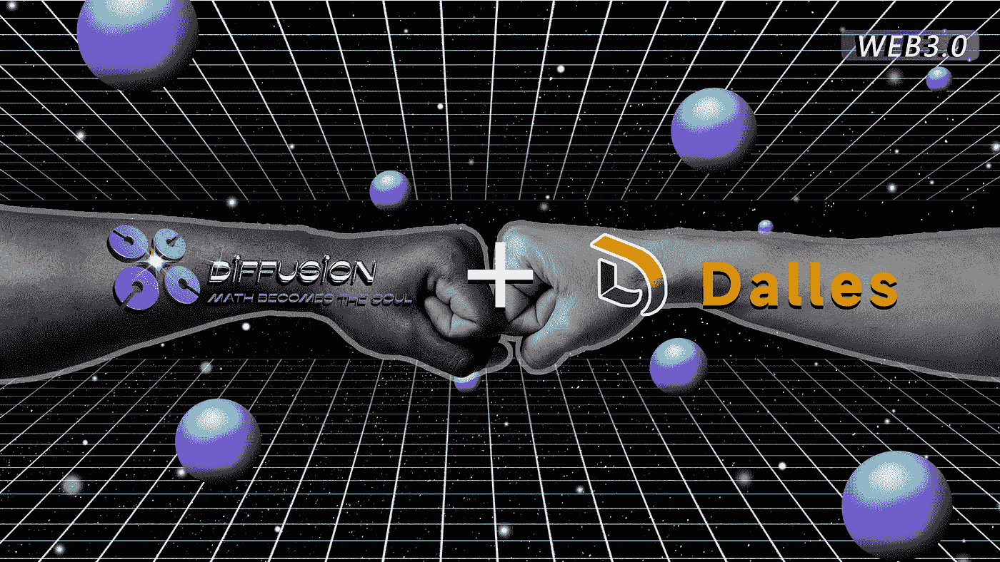
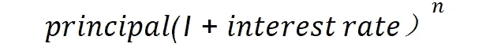
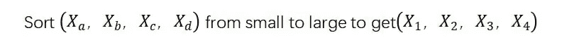

# 漫道的组织和核心业务展示

> 原文：<https://medium.com/coinmonks/diffusiondaos-organization-and-core-business-exposition-49437df8c8c?source=collection_archive---------26----------------------->

漫道的组织和核心业务展示

在我们的白皮书中，我们几乎涵盖了 DiffusionDAO 的每一个业务细节以及 shakehandDAO 设计背后的逻辑。为了简化并让每个人更容易理解，有必要对我们的核心业务进行系统而简明的阐述。

1、**资产定价公式:**DSGE(动态随机一般均衡)模型用于引导通货膨胀率和利率。对于具体使用的 DSGE 模型算法，我们建议您参考官方白皮书。

2、**中央金融协议:**中央金融协议持有硬币的唯一铸造权，仅通过出售储备债券和流动债券发行 DFS，是旨在构建 Web 3.0 的联合储备体系。由中央金融协议接收的每个数字资产都以内在最低价值提供给 DFS。

3、**平台的令牌类型:**

答:DFS(扩散):它是一个核心的生态系统令牌，由中央金融协议铸造和发行。

B: PDFS(私人扩散):生态系统早期的私募股权代币用于扩散道系统的代币发起融资。也是以最低成本参与扩散道生态系统的唯一途径。

C: DFSsl(扩散星光):在扩散道的定义中，这是一个用来提升扩散道注意力元素的奖励令牌。

D: CDFS (Create Diffusion): CDFS 是由中央财政协议的发展基金支付的一种象征性类型，将用于奖励对生态系统的发展做出贡献的 Web 3.0 本地人，包括但不限于对扩散道生态系统做出贡献的本地人，以及其贡献已被扩散道采纳的本地人。中央财政协议将发展资金的 15 %用于兑换 CDFS 代币。CDFS 的造币来自于个人扩散价值指数，这个指数来自于在道提议的生态系统内完成任务。第一阶段建议的任务是“出售中央财政协议发行的债券”。

4、**资产定价模型:**我们将以中央金融协议出售的债券形式吸收储备，这些储备将用于 DFS 的铸造。中央财政协议每收到一美元的无风险资产，就会铸造一个 DFS，债券的买方按照债券价格' X '购买债券，购买金额为' Y '，你就会得到' Y/X' (Y 除以 X)个 DFS。比如通过债券购买 DFS，此时债券价格为 100 USDT，用户花 10000 USDT 购买，债券到期后可以获得 100 个 DFS，协议铸造 10000 个 DFS，其中 9900 个由中央财政协议(CFA)保管。CFA 将根据 DSGE 模式调整这些 DFS 并将其分配给参与储蓄计划的用户。总的来说，这 9900 台 df 要在市场上全面铺货还需要很长时间。值得注意的是，这一比率是受 DSGE 模型指导并根据该模型波动的。

5、**储备协议和发展基金**

——一)

备付金协议中的资金来源来自债券的出售。从出售中获得的无风险资产由智能合同锁定，并且只能在 DFS 被销毁时(即当 DFS 的价格低于一美元时，然而基于模型设计，DFS 的价格不能低于一美元)进行再循环，并且储备协议是用于支持 DFS 的内在价值的重要部分。

-B)

发展基金来源于出售 DFS 债券过程中产生的协议利润。发展基金利润为 15 %，DFS 中产生的利润目前用于赎回 CDFS。

注:CDFS 的价格完全交给市场，灵活的价格区间能够最大程度地激活市场的自主程度。

6、1、**债券市场和储蓄市场、NFT 市场、沙坪坝市场和其他市场明细**

在扩散道的核心金融协议中:分为两大金融竞技场，一个是储蓄竞技场，一个是债券市场竞技场。

●债券市场:现有债券分为储备债券和流动性债券

:

储备债券可以通过稳定的货币购买获得。购买储备债券可以以低于二级市场的价格获得 DFS，但只能在债券到期后获得。同时，这里详细介绍一下债券发售后的中央财政协议。行为，当 DFS 市场价格为 XUSDT，贴现为 Z 时，那么 DFS 债券价格为(1-Z)*X，此时用户拿出 W USDT 买入债券。债券到期后，用户获得 W/( (1-Z)*X) DFS，此时协议产生销售利润，DAO 获得 0.1 (W/((1-Z)*X)) DFS，开发基金获得 0.15 (W/((1-Z)*X)) DFS，需要注意的是，协议铸币 W DFS，1 .25 W/((1-Z)*X) DFS 将对外流通，协议将保留 W-1 25w/。

**:**

流动债券可以通过购买 DFS 和 USDT 的 LP 获得。同样购买流动债券可以以低于二级市场的价格获得 DFS。LP 是有价格的。行为，当 DFS 市价为 XUSDT，贴现为 Z 时，那么 DFS LP 债券价格为(1-Z)*X，此时用户拿出一个由 W 个 USDT 和 N 个 DFS 组成的 LP 购买债券。此时 LP 的价格是 2W。债券到期后，用户得到 2W/((1-Z)*X) DFS。此时协议产生销售利润，道获得 0.1 (2W/((1-Z)*X)) DFS，发展基金获得 0.15 (2W/((1-Z)*X)) DFS，需要注意的是协议投 a

DFS DFS 需要注意的是

是协议确定的无风险资产的价值，即 DFS 等于 1 美元时 LP 的价值。当然，算法中不会出现这种情况。该协议将自动锁定 LP，这样 DFS 将继续拥有不可撤销且不断增加的流动性。此时将有 1.25 W/((1-Z)*X) DFS 对外流通，协议将

保留-1.25 * 2 W /((1-Z)*X)，保留的金额通过利息进行分配。随着 LP 债券销售的增加，DFS 的内在储备远远超过 1 美元。

●储蓄市场:储蓄业务将有两种储蓄产品，

“A)活期支票账户”:支票储蓄灵活，可随时支取。任何时候可以提取的金额是:

“B) Fixed Deposit account”: The interest rate of regular savings is much higher than that of current savings. Regular savings can still be accessed at any time, but if the savings need to be withdrawn in advance before the contract period, the system will charge X% of the principal as a handling fee. The amount that can be withdrawn is:

由于利息计算采用复利形式，具体利率在 DSGE 指导下调整。在协议准备金快速增长的情况下，DFS 前期很难保证目标通胀率，一季度将被迫成为通缩体系。预期 APY 为 7000 %左右，以抑制准备金协议的快速增长和 DFS 固有准备金的快速上升。

● NFT 交易市场:

扩散岛的 NFT 交易市场可以提供各种非交易品的买卖。同时，你还可以在这里获得代表身份象征的 NFT，也就是说你可以在这里体验社交 NFT 的魅力。

●沙克汉道组织市场是扩散道成为裙带关系的重要舞台，也是我们在 V2 版重点打造的星道组织。有关更多详情，请参阅白皮书。当然，如果你想成立自己的道组织，请在社区论坛告诉我们你的梦想和实践计划，我们将投票决定是否投资你，因为裙带关系要求每个人都要创造。

1、**不同代币的铸造方法:**

DFS:中央财政协议每收到一美元价值的无风险资产，(通过储备债券和流动债券吸收储备)，就铸造一个 DFS，所以理论上，DFS 的数量等于中央财政协议。收到的无风险资产量，但实际能流通的 DFS 量远小于这个值。这是因为判断 DFS 量的方法才是市场上真正的流通，只有两种方式，方法 1，通过债券铸造流通产生，方式 2，通过储蓄复利获得，进入流通。

PDFS:总发行量 150 万，ido 50 万，基金会购买 50 万，公募 50 万。

CDFS:这是扩散道的奖励令牌，也有社交属性。它来源于个人的扩散价值。对应 1:1 的扩散值，如果一个居民获得 X 个人扩散值，该居民可以到兑换页面兑换 X 枚 CDFS。CDFS 可以去和 DFS 交易。

DFSsl:将由关注指示器决定。mainnet 上线前的发布规则是 Telegram、Discord、Twitter、Medium 和 DiffusionDAO 会根据这个关注度指标发布液体代币。中位数的计算方法如下:

DFSsl 充当了一个经济的研磨代理，交付方式由社区提案决定。

道组织架构:由扩散道组织的全球公投决定扩散道的各项重大决策，如决定监管模式的更换、CDFS 的激励计划等。

1、**发展基金分配**

在债券创造中，发展基金将获得 25 %的股权，道组织将获得 10 %的 DFS，发展基金交易协议将获得 15 %的 DFS，即债券出售铸币 1 DFS，然后道组织将获得 0.1 DFS，发展基金获得 0.15 DFS，发展基金的 DFS 将由道组织的市值团队注入 CDFS 和 DFS 之间的交易对，为 CDFS 提供流动性。

当 mainnet 上线时，扩散将发布三种类型的社交 NFT 来标记它们的身份。道组织认为不同身份的居民会有不同的影响。需要注意的是，NFT 是一种身份的象征，也是一种利润。请谨慎转让或出售，因为你出售的是你的身份和受益权。

领主级:道组织认为持有睿智的居民有传播影响力的能力，但是随着熟悉度的减弱，影响力会降低，能够提供帮助的内容会变小，所以我们认为个人扩散值会在传播中衰减，每多一个其他居民，传播值就会衰减 50 %，影响力会无限降低。但是每次扩散都会激起一层新的涟漪。在涟漪的不断扩散中，扩散会无限延续下去，这是一种永久的、动态的影响力扩散。有身份的居民可以通过完成道提案的工作内容获得个人扩散值，从而获得 CDFS，个人扩散值可以和 1 : 1 兑换。获取利润

将军级:道组织认为持有将军的居民有传播影响力的能力，但是随着熟悉度的减弱，影响力会降低，能够帮助的内容会更小，所以我们认为在那里的个人扩散值会在扩散中衰减。每多一个居民，扩散值就衰减 50 %。但是，由于获得将军的 NFT 会非常困难，获得将军的 NFT 意味着对生态系统的贡献更多，所以将军的扩散值需要增加 20 %，也就是个人扩散值乘以 1.2。同样，持有将军的居民可以通过完成道提议的工作内容获得个人扩散值，从而获得，个人扩散值可以与 1 : 1 兑换。以获取利润。

获得 NFT 将军需要特殊的铸造行为，甚至扩散道本身也不能凭空产生。

众议员 level NFT:道组织认为持有成员的居民有传递影响力的能力，但是随着熟悉度的减弱，影响力会降低，能够帮助的内容会更小，所以我们认为个人在那里的扩散价值会在扩散中衰减。每多一个居民，扩散值就衰减 50 %。但由于成员获得 NFT 会非常困难，获得将军的 NFT 意味着对生态系统的贡献更大，因此将军的传播值需要增加 44 %，即个人传播值乘以 1.44。同样，持有将军的居民可以通过完成道提议的工作内容获得个人扩散值，从而获得，个人扩散值可以与 1 : 1 兑换。以获取利润。

国会议员 NFTs 的获得需要特殊的铸造行为。同样，即使是扩散道本身也不可能凭空产生。当然，成员产生是很少的，非常难得。

> 加入 Coinmonks [电报频道](https://t.me/coincodecap)和 [Youtube 频道](https://www.youtube.com/c/coinmonks/videos)了解加密交易和投资

# 另外，阅读

*   [CoinDCX 点评](/coinmonks/coindcx-review-8444db3621a2) | [加密保证金交易交易所](https://coincodecap.com/crypto-margin-trading-exchanges)
*   [红狗赌场评论](https://coincodecap.com/red-dog-casino-review) | [Swyftx 评论](https://coincodecap.com/swyftx-review) | [CoinGate 评论](https://coincodecap.com/coingate-review)
*   [Bookmap 评论](https://coincodecap.com/bookmap-review-2021-best-trading-software) | [美国 5 大最佳加密交易所](https://coincodecap.com/crypto-exchange-usa)
*   [如何在 FTX 交易所交易期货](https://coincodecap.com/ftx-futures-trading) | [OKEx vs 币安](https://coincodecap.com/okex-vs-binance)
*   [CoinLoan 评论](https://coincodecap.com/coinloan-review) | [YouHodler 评论](/coinmonks/youhodler-4-easy-ways-to-make-money-98969b9689f2) | [BlockFi 评论](https://coincodecap.com/blockfi-review)
*   [XT.COM 评论](https://coincodecap.com/profittradingapp-for-binance) | [币安评论](https://coincodecap.com/xt-com-review)