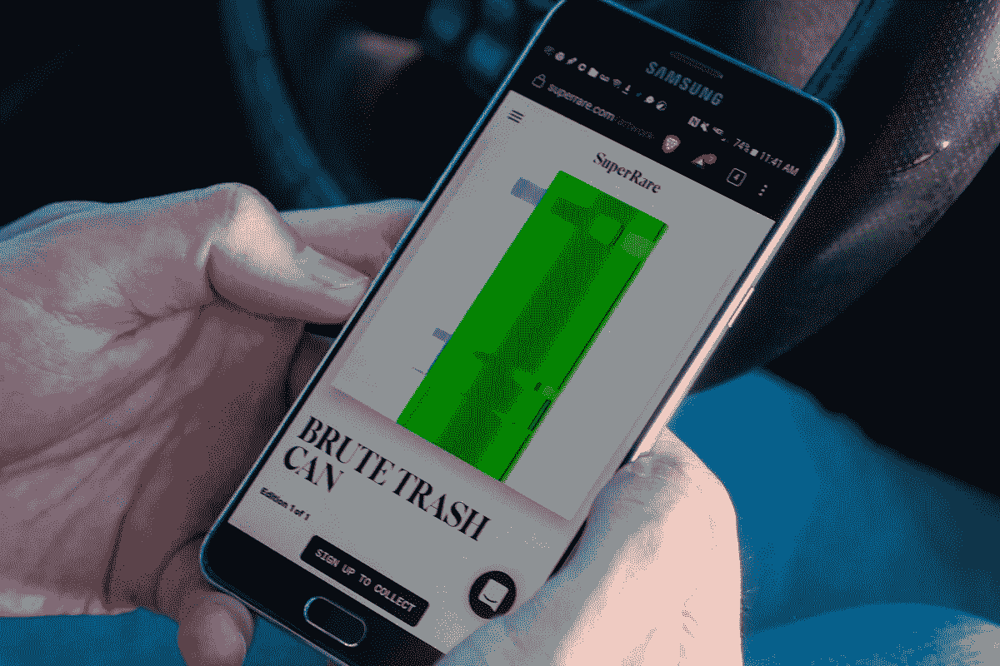
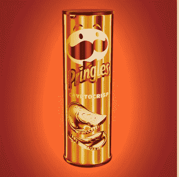
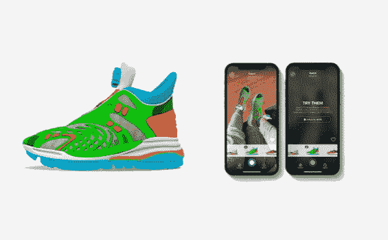
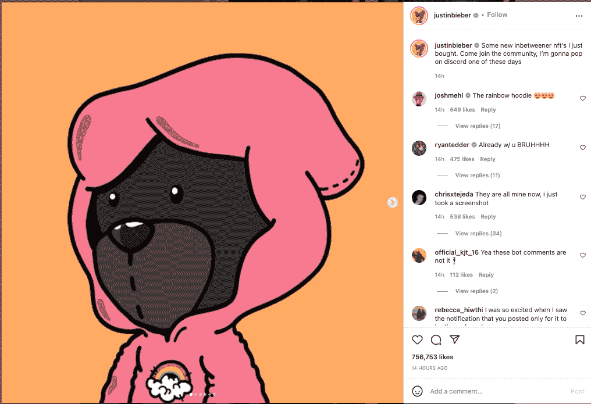
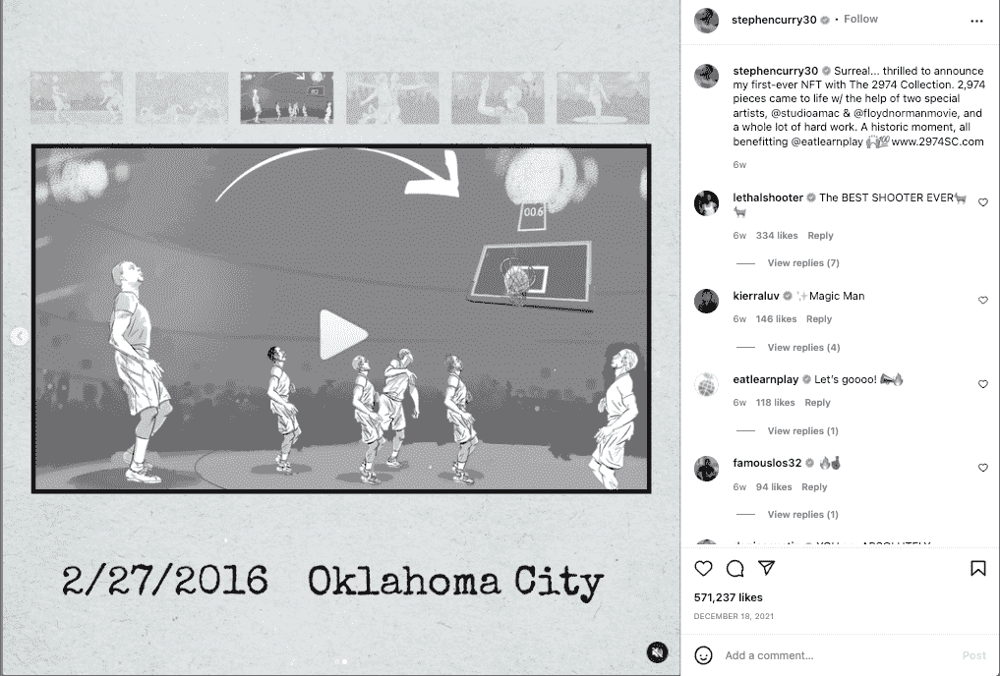

# 数字艺术品

> 原文：<https://medium.com/coinmonks/digital-artwork-e8d69df035fc?source=collection_archive---------69----------------------->

不可替代的代币或 NFT 现在很流行。随着任何事物都有可能成为 NFT，许多荒谬和高价销售的故事浮出水面。

什么是 NFT？

简而言之，NFT 利用区块链技术；更确切地说，它们是以太坊区块链的一部分。它们是区块链上的加密资产，具有唯一的标识码和元数据，使它们彼此唯一。与流行的加密货币不同，它们缺乏流动性，这意味着它们不能轻易交易或交换。NFT 的不可替代性、独一无二的性质和可验证的真实性证书使其极具吸引力，尤其是在数字艺术领域，许多人利用 NFT 背后的“炒作”进行荒谬的销售。

**荒谬的 NFTs**

例如，2022 年 2 月初，来自美国的艺术家[罗布内斯以 25.2 万美元的价格出售了一个垃圾桶*(他谷歌过)*的 NFT。](https://www.channelnewsasia.com/business/nft-artist-sold-trashcan-image-252000-2476316)

*该图描绘了一个带有闪光效果的塑料垃圾桶，给它一种迷幻的外观。* [*来源:YP*](https://www.scmp.com/yp/discover/news/global/article/3165659/nft-artist-who-sold-rubbish-bin-image-us252000)

不幸的是，尽管这是一个更极端的例子，但也有其他同样荒谬的商品被转化为可交易的非关税商品。事实上，许多知名公司已经开始追随这一趋势。

品客薯片是第一款 NFT ***口味*** 。有 50 多罐可用，一罐虚拟芯片的价格和一罐实际的品客薯片一样。

*来源:* [*稀有*](https://rarible.com/token/0xd07dc4262bcdbf85190c01c996b4c06a461d2430:322068:0x9b6d720354b24a47ed44d159a77accbb059dcf9e?tab=owners)

古驰也加入了 NFT 的潮流，推出了价格极其实惠的古驰·NFT 运动鞋[售价仅 12 美元，但缺点是你永远也穿不上它们。](https://hypebeast.com/2021/3/gucci-virtual-sneakers-twelve-usd-nft-news)

*来源:*[*inside book*](https://www.insidehook.com/daily_brief/art/nft-most-ridiculous-items)

撇开这些可笑的例子不谈，今天这篇文章想看看非艺术交易的盈利能力，特别是艺术界的非艺术交易。

**数字艺术**

NFT 艺术界利润丰厚；2021 年上半年有超过 19 万笔交易，价值超过 5 . 46 亿美元。[这些销售大多是由名人推动的，他们既买又卖自己的 NFT“形象”。](https://www.lifestyleasia.com/hk/culture/the-arts/celebrity-nfts-cryptocurrency-metaverse/) [介于两者之间的 NFT](https://www.inbetweeners.io/)已经被贾斯汀比伯、汤姆·赫兰德、史努比·道格等名人购买和推广

*来源:* [*Instagram*](https://www.instagram.com/p/CZhSMk9rwGY/)

NFT 在运动员中特别受欢迎。斯蒂芬·库里(Steph Curry)发布了自己的个人收藏，超过 2900 件 NFT，每件售价 333 美元。

*来源:*[*insta gram*](https://www.instagram.com/p/CXmPTJqh59x/)

**NFT 艺术品推广**

但是是什么导致了 NFT 作为数字艺术品的普及呢？它始于 NFT 破纪录的销售名为“日常生活”的数字艺术品。由著名数字艺术设计师“Beeple”创作的《最初的 5000 天》售价 6930 万美元。bee ple 自 2007 年以来每天都在制作 5000 件数字艺术品的拼贴画。这引发了艺术界对 NFT 的关注，因为其他艺术家开始看到 NFT 的盈利机会。

**繁荣还是萧条？**

随着公司表示有兴趣进入 NFT 空间，一个问题仍然是 NFT 的作品是否值得？尽管许多头条新闻描述这是相对常见的，但数字艺术品仍然是一种非常利基的产品。

对许多人来说，购买 NFT 艺术品类似于收集实物艺术品；购买这些数字艺术品是希望它们能增值，从而为所有者赚取可观的利润。很难确定数字艺术作品是否会继续存在，但是 NFT 在记录保存、艺术家的民主化访问和艺术领域的革命性变革方面的作用意味着无论未来的结果如何，它都留下了印记。

书写人:[利奈昂](https://medium.com/u/1e5ad3ffcbb9?source=post_page-----e8d69df035fc--------------------------------)

> 加入 Coinmonks [电报频道](https://t.me/coincodecap)和 [Youtube 频道](https://www.youtube.com/c/coinmonks/videos)了解加密交易和投资

# 另外，阅读

*   最佳[区块链分析](https://bitquery.io/blog/best-blockchain-analysis-tools-and-software)工具| [赚比特币](/coinmonks/earn-bitcoin-6e8bd3c592d9)
*   [Cloudbet 赌场评论](https://coincodecap.com/cloudbet-casino-review) | [点火赌场评论](https://coincodecap.com/ignition-casino-review)
*   [加密套利](/coinmonks/crypto-arbitrage-guide-how-to-make-money-as-a-beginner-62bfe5c868f6)指南| [如何做空比特币](/coinmonks/how-to-short-bitcoin-568a2d0b4ae5)
*   [如何在加拿大购买加密货币？](https://coincodecap.com/how-to-buy-cryptocurrency-in-canada)
*   [无聊猿游艇俱乐部(BAYC)回顾](https://coincodecap.com/bored-ape-yacht-club-bayc-review) | [拜比特 vs 比特币基地](https://coincodecap.com/bybit-vs-coinbase)
*   [5 款最佳加密交易终端](https://coincodecap.com/crypto-trading-terminals) | [最佳 DeFi 应用](https://coincodecap.com/best-defi-apps)