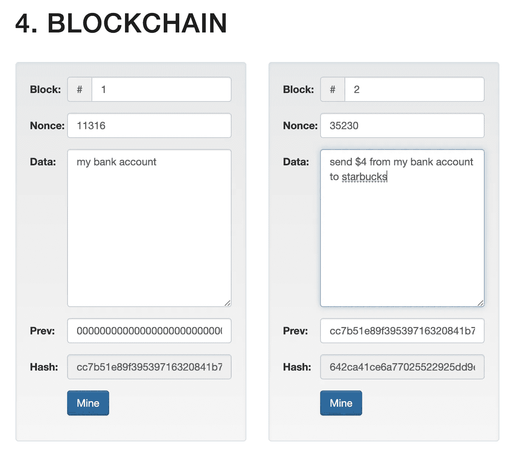

# 数字资产:快速指南

> 原文：<https://medium.com/coinmonks/digital-assets-a-quick-guide-efe9da9d2df9?source=collection_archive---------8----------------------->

## 米尔扎

了解数字资产

[A Bored Ape for sale (over $300K at the time of writing)](https://opensea.io/assets/0xbc4ca0eda7647a8ab7c2061c2e118a18a936f13d/8094)

## **论文**

DeFi、Crypto 和 Web 3.0 的整个生态系统都是围绕着一个核心命题构建的，即去中介化。这是“没有中间人”的委婉说法。我们目前的经济是建立在减少各方之间信息不对称的方式上的:你用信用卡买咖啡，信用卡公司告诉星巴克你是值得的，星巴克接受使用你的 VISA 卡。钱被转移了，你就有咖啡因了。

## **技术变革**

核心的核心，论文是区块链技术。简而言之，区块链为你不想让其他人知道的敏感信息增加了一层。例如，一个链中的块包含你的银行账号或你的加密钱包，它保存着你的资产(现金、艺术品、信用卡等)，如果你只是使用这些信息，它会立即被盗，你的资产会消失。进入密码术，这在你的信息之上增加了一层并且产生了一个唯一的代码(数字和字母的组合)。每个信息单元只有一个这样的代码。换句话说，如果您的敏感数据显示为“bob ”,那么只有一行这样的代码是该信息的附加层。这段代码就是所谓的“哈希”，看起来有点像这样:“kwrjgfbkYFR3874hd hbuj92…”

try this for yourself, click [here](http://blockchain.mit.edu/blockchain).

当这种数据的块形成时，它创建了一个块链；一个区块链。当你在一个使用区块链的平台上时，网络中的所有计算机都可以访问生成的散列；这就是所谓的分布式账本。网络或平台可以是无权限的，也可以是有权限的。这两个花哨的术语意味着要么网络不限制谁可以验证或进入网络，要么他们限制谁可以进入和参与。因此，一旦有了区块链，在一个分布式分类帐中，所有各方都可以比较散列，如果散列都一致，您的交易就可以进行了。然而，如果有人试图伪造交易，网络会立即捕捉到它——他们的区块链与其他区块链不匹配。当链形成时，下一个链(链 t+1)使用前一个链(t)的散列，该散列包括前一个链(t-1)的散列，因此，事务不能被伪造，因为它们不仅被链接，而且在每个后续事务中被验证。

这既是福也是祸；每增加一个区块链单位，大额交易需要的时间就越长。已经采取了一些措施来减少与这一问题有关的滞后:利害关系证明和闪电网络。在利害关系证明中，验证器是预先确定的-它们会因正确验证和更新区块链而获得奖励。然而，如果他们未能验证交易或条目，或进行任何其他此类恶作剧，他们将受到惩罚，失去他们的“股份”，即他们为验证网络而“提供”的抵押品。最后，lightning 网络的引入允许将交易从主区块链中取出，并在添加回主区块链之前在较小的系列中进行验证；从而减少滞后。

当人们讨论供应链中的区块链时，他们指出该技术能够实时识别供应链中的问题。一家餐厅的蔬菜由多家供应商提供，突然，这家餐厅爆发了大肠杆菌疫情。他们查看他们的区块链，看到 x 供应商的蔬菜在疫情爆发前一天到达，其他餐馆检查他们的区块链，看到同一供应商的蔬菜也在疫情爆发前一天到达。供应商已确定，来源受到限制。

另一个需要注意的重要事项是，交易一旦发出并获得批准，就不能收回，因为您不能撤销操作。

## **NFT**

NFT 是一种“不可替代的象征”——你可能想知道什么是可替代的。货币是可以互换的，每一美元都可以换成等值的美元。贝壳是可替换的，它们可以互换。不可替代意味着所讨论的资产是一种“独一无二”的稀有物品，不能兑换成价值相同或相似的东西。

NFT 本质上是一段数据，它证明你是某个项目的唯一所有者，例如艺术品、推文、图片、视频、元宇宙鞋、自拍等等。

实际上，这意味着你可以拥有杰夫·贝索斯的一条推文，数字化并出售你侄女在夏令营中画的一件艺术品，拥有一个奥巴马唱“感受它”的视频。你可以在二级市场上买卖这些物品。

这听起来可能很傻，但 NFT 已经引起了投资者的极大兴趣，售价高达数十万美元，有时高达数百万美元。人们经常说，“嗯，我不能碰它，它是不可触摸的”——我问他们:“你多久碰一次你祖母在客厅里的花瓶，或者你五年前挂起来的一件艺术品，那又怎么样？"

## **社交令牌**

社交代币是可以由杰出的内容创作者发行的代币或硬币；或者任何有追随者的人。在这种情况下，代币是可替代的，它们可以被买卖，并被视为一种货币形式。让我们假设一位杰出的作家比利发行了一枚众筹的$billy coin。他从追随者网络中筹集了 5 万美元；他们收到了 billy tokens，他的下一个项目获得了 5 万美元。作为对他们投资的回报，Billy 承诺每个代币持有者将获得总销售额的 2.5%。John 还向他的利益相关者提供对其内容的访问；私人聚会、信息传递等…

代币在二级市场买卖。因为上面提到的论点，以及 DeFi 的本质——内容的所有权被从三个大公司拿走，直接放在一个人和他们的社区手中。

## **有些担忧**

这些技术创新的出现在给社会带来巨大回报的同时，也带来了巨大的风险。这方面还有更多的内容。

> 加入 Coinmonks [电报频道](https://t.me/coincodecap)和 [Youtube 频道](https://www.youtube.com/c/coinmonks/videos)了解加密交易和投资

## 也阅读

 [## 杠杆代币[多头代币]终极指南

### 杠杆化令牌是具有杠杆化风险敞口的 ERC20 令牌，不考虑保证金、要求、管理…

medium.com](/coinmonks/leveraged-token-3f5257808b22)  [## 最佳加密交易所| 2021 年十大加密货币交易所

### 编辑描述

blog.coincodecap.com](https://blog.coincodecap.com/crypto-exchange)  [## 2021 年最佳加密交换平台| CoinCodeCap

### 如果我们看看今天的场景，许多加密货币交换平台提供了广泛的功能和深度…

blog.coincodecap.com](https://blog.coincodecap.com/best-swap-platforms)  [## 10 大最佳网上赌场[2021] |赢取免费 BTC | CoinCodeCap

### 编辑描述

blog.coincodecap.com](https://blog.coincodecap.com/best-online-casinos)  [## 2021 年最佳加密借贷平台| 6 大比特币借贷平台

### 获得比特币和其他加密货币的最佳贷款利率

medium.com](/coinmonks/top-5-crypto-lending-platforms-in-2020-that-you-need-to-know-a1b675cec3fa)  [## 2021 年 6 大最佳硬件钱包|顶级加密硬件钱包[更新]

### 最好的加密货币硬件钱包是绝对必要的。我们将在 NGRAVE、Ledger Nano X 和…

medium.com](/coinmonks/the-best-cryptocurrency-hardware-wallets-of-2020-e28b1c124069)  [## 2021 年最佳免费加密交易机器人

### 2021 年币安、比特币基地、库币和其他密码交易所的最佳密码交易机器人。四进制，位间隙…

medium.com](/coinmonks/crypto-trading-bot-c2ffce8acb2a)  [## 最佳 4 个加密交易信号电报通道

### 这是乏味的找到正确的加密交易信号提供商。因此，在本文中，我们将讨论最好的…

medium.com](/coinmonks/best-crypto-signals-telegram-5785cdbc4b2b)  [## 获取信号、交易机器人和套利

### 编辑描述

blog.coincodecap.com](https://blog.coincodecap.com/bitsgap-review)