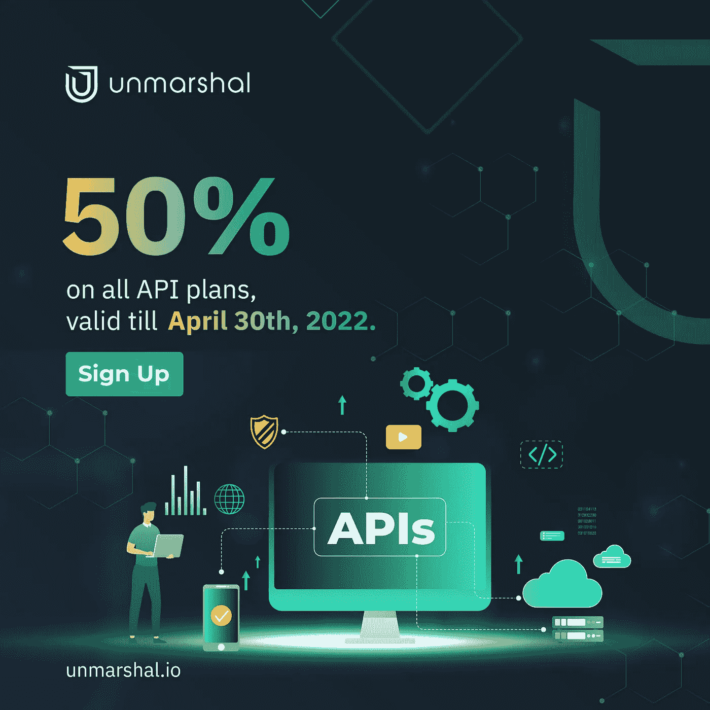

# 解组 API 计划的折扣

> 原文：<https://medium.com/coinmonks/discount-on-unmarshals-api-plans-266fe7912aec?source=collection_archive---------44----------------------->

到目前为止，Unmarshal 在他们的服务中做得非常好。除了索引数据之外，他们还包括了一个 API 端点来识别他们的 NFT 集合创建者，这是令人惊讶的。

为了庆祝成立一周年，Unmarshal 决定支持区块链空间的建设者。从 4 月 1 日到 4 月 30 日，Unmarshal 对他们所有的 API 计划打五折。

你所要做的就是注册。

## 步伐

*   **报名**:访问[**console . unmarshal . io**](http://console.unmarshal.io)**并创建账号。**
*   ****生成您的 API 密钥****
*   ****应用促销代码:**在您的仪表盘上，点击“升级”按钮，连接您的钱包并应用应用促销代码**‘hbd marsh 50’**，您就可以享受五折优惠了。**

****注意:**如果您面临任何与解组 API 集成的问题，您可以加入解组 discord 服务器，并在**开发人员配置单元频道中发布消息。**你也可以通过我们的电报组联系我们。如果需要自定义 API，在这里给我们写信: [***支持@unmarshal.io***](mailto:support@unmarshal.io) 。**

# **关于解组**

**Unmarshal 是一个多链数据网络，它有助于任何分散的应用程序无缝访问区块链上的数据。**

**迄今为止，他们已经增加了对以太坊、币安智能链、Polygon、Solana、XDC、Zilliqa 和 Celo 链的支持，使 dApp 开发者能够轻松访问链上数据。**

**更多详情请联系我们***info @ unmarshal . io .*****

**[**网站**](http://unmarshal.io/) **|** [**电报聊天**](https://t.me/Unmarshal_Chat) **|** [**电报公告**](https://t.me/joinchat/RRUIzbuhlA8-6Kjk) **|** [**推特**](https://twitter.com/unmarshal) **|** [**中**](https://medium.com/unmarshal-io)**

> **加入 Coinmonks [电报频道](https://t.me/coincodecap)和 [Youtube 频道](https://www.youtube.com/c/coinmonks/videos)了解加密交易和投资**

# **另外，阅读**

*   **[币安 vs FTX](https://coincodecap.com/binance-vs-ftx) | [最佳(SOL)索拉纳钱包](https://coincodecap.com/solana-wallets)**
*   **[如何在 Uniswap 上交换加密？](https://coincodecap.com/swap-crypto-on-uniswap) | [A-Ads 评论](https://coincodecap.com/a-ads-review)**
*   **[加密货币储蓄账户](/coinmonks/cryptocurrency-savings-accounts-be3bc0feffbf) | [YoBit 审核](/coinmonks/yobit-review-175464162c62)**
*   **[Botsfolio vs nap bots vs Mudrex](/coinmonks/botsfolio-vs-napbots-vs-mudrex-c81344970c02)|[gate . io 交流回顾](/coinmonks/gate-io-exchange-review-61bf87b7078f)**
*   **[CoinFLEX 评论](https://coincodecap.com/coinflex-review) | [AEX 交易所评论](https://coincodecap.com/aex-exchange-review) | [UPbit 评论](https://coincodecap.com/upbit-review)**