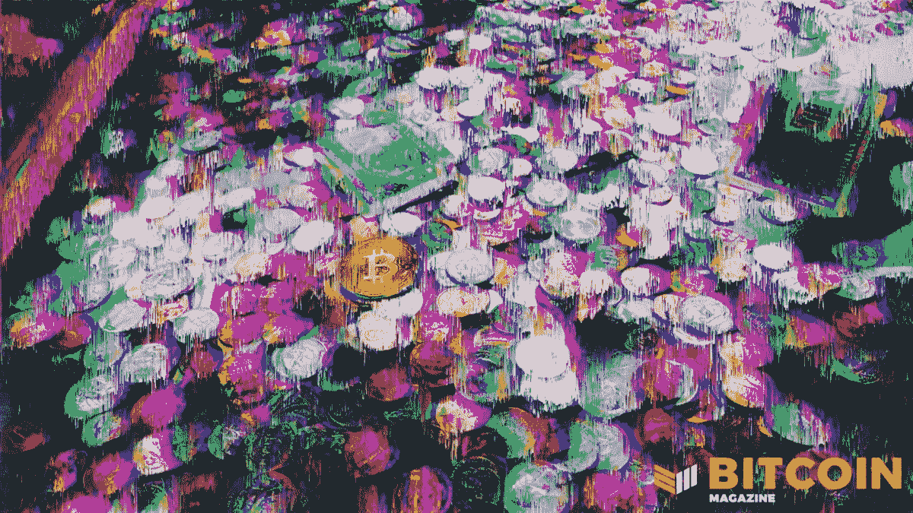
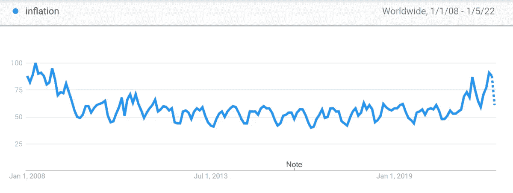
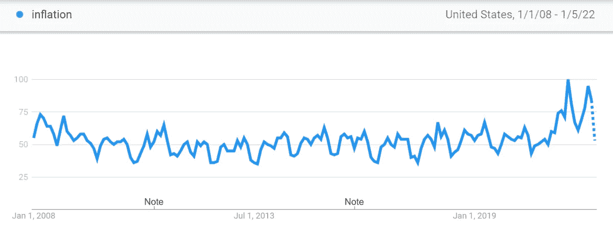

# 讨论 2021 年和 2022 年影响比特币的宏观经济趋势

> 原文：<https://medium.com/coinmonks/discussing-the-macroeconomic-trends-impacting-bitcoin-in-2021-and-2022-9df9b911f3fb?source=collection_archive---------19----------------------->

回顾去年影响比特币的最大宏观经济发展，以及将在 2022 年塑造比特币的发展。

[**在 YouTube 上看这一集**](https://www.youtube.com/watch?v=rkarr3Qmqr4&list=PLe0djdakvnFbQnK2uE6Kags30z0cSPBcE)

**听这一集:**

*   苹果
*   [Spotify](https://open.spotify.com/episode/08SmXghxFvPHMKo4GhJTNY?si=320af3ccfc724ecb)
*   [谷歌](https://podcasts.google.com/feed/aHR0cHM6Ly9mZWR3YXRjaC5saWJzeW4uY29tL3Jzcw/episode/MTBjZTQzZTItNmQ0Zi00ZDQ4LWE4NzctMzc5MDNlNDY1NzJi?sa=X&ved=0CAgQuIEEahcKEwjIibWOyJ31AhUAAAAAHQAAAAAQQg)
*   [Libsyn](https://fedwatch.libsyn.com/big-trends-of-2021-and-2022-fed-76)
*   [阴天](https://overcast.fm/+m2aftgoQY)

在这一集《比特币》杂志的“美联储观察”播客中，我和克里斯蒂安·克罗勒在 YouTube 上做了现场录制，作为该杂志几乎每天直播的一部分。本周，我们回顾了 2021 年的主要趋势和新闻，然后对 2022 年的趋势进行了预测。

# 比特币与 2021 年宏观回顾

请记住，今年比特币发生了许多事情，但从货币/宏观经济的角度来看，这些是最大的趋势和事件。

首先也是最重要的，萨尔瓦多将比特币作为法定货币加入美元行列。这是在迈阿密举行的比特币 2021 大会上宣布的，立即赢得了比特币创造者的掌声，以及国际货币基金组织(IMF)和世界银行等传统监管机构的批评。我们花了几分钟讨论萨尔瓦多新闻的不同方面和布科勒总统本人。如果有一个“2021 年的比特币人”，那很可能就是他。

2021 年第二大影响事件是中国的比特币禁令。在多年的部分禁令后，中国共产党(CCP)最终做到了这一点，并在 5 月禁止了比特币服务和业务。这导致比特币矿工从中国外流，主要流向中亚其他国家和美国。因此，这个故事的另一半是比特币采矿业在美国的崛起。美国一直是许多比特币矿工的家园，但现在美国是世界上最大的采矿国；这个头衔可能在未来几十年都不会放弃。

如果不包括供应链问题和大多数人所说的“通货膨胀”，对 2021 年的回顾就不完整。这无疑是 2021 年宏观经济学的一个主要话题——经济在第一季度末见顶，今年剩余时间由基本面放缓和价格上涨主导。

快速浏览一下自金融大危机(GFC)以来的谷歌趋势，可以发现全球对“通胀”一词的兴趣达到了自那以来的最高水平，特别是在美国，当美联储开始当前的量化宽松政策(QE)时，对通胀的担忧超过了 GFC。

*Source:* [*Google Trends*](https://trends.google.com/trends/explore?date=2008-01-01%202022-01-05&q=inflation)

*Source:* [*Google Trends*](https://trends.google.com/trends/explore?date=2008-01-01%202022-01-05&geo=US&q=inflation)

下半年，在金融界，你几乎没有一天不把通胀作为主要话题。然而，请注意，这也是过去 75 年来最严重的供应链中断。2020 年和 2021 年，世界大部分地区被封锁了几个月，难怪价格温和上涨。但令人惊讶的是，价格涨幅并没有更大。几个月接近 1%的通货膨胀导致了这一切？

最后，我们讨论了 2021 年稳定硬币和替代硬币的趋势。去年，我们见证了这两个领域的明显脱钩。对于稳定货币，我们看到美联储通过不妖魔化稳定货币和强硬的央行数字货币(CBDCs)与欧洲央行(ECB)和其他央行决裂。这突显出全球央行之间的根本利益冲突。至于 altcoins，已经和比特币的典型关系脱钩了。在以前的时代，替代币将被用于比特币，然而，流动性比货币类型替代币差得多的非金融交易不容易被用于比特币。这将价值困在骗局中，并阻止比特币从极端投机的循环中受益。

# 比特币和 2022 年的宏观预测

现在，来点有趣的东西。如果你是《美联储观察》的经常听众，很多事情不会让你感到惊讶。这里是亮点，但你必须听听我们所有的预测。

我们认为，2022 年最主要的趋势将是欧洲危机的加剧。欧洲债务危机在 GFC 之后很快就开始了，在当前的金融危机中，我们预计会出现欧洲债务危机 2.0。这是一件大事，因为欧洲与美国和美联储的关系正在破裂，一些内部裂痕开始显现。

我们对 2022 年的一个更具体的政治预测是，媒体和政治家将开始更多地向中心移动。这与第四个转折时间线是一致的，这是一个多代循环，以政治上回归中心、改革机构和社会而结束。那些不能够“改革”的国家(我指的是 CCP 和布鲁塞尔)，将面临高度的国内动荡或革命。2022 年是这一点变得清晰的一年。

未来一年，至少还会有一个国家按照萨尔瓦多的蓝图采用比特币。我们推测这可能是哪些国家。我提到了拉丁美洲国家厄瓜多尔和巴拿马，因为它们和萨尔瓦多一样使用美元。Keroles 提到了非洲国家汤加。有很多选择，其中一些已经显示出对比特币的兴趣。

这是安塞尔·林德纳的客座博文。所表达的观点完全是他们自己的，不一定反映 BTC 公司或比特币杂志*的观点。*

*原载于 2022 年 1 月 7 日 https://bitcoinmagazine.com***。**

> *加入 Coinmonks [电报频道](https://t.me/coincodecap)和 [Youtube 频道](https://www.youtube.com/c/coinmonks/videos)了解加密交易和投资*

# *另外，阅读*

*   *[如何在 FTX 交易所交易期货](https://coincodecap.com/ftx-futures-trading) | [OKEx vs 币安](https://coincodecap.com/okex-vs-binance)*
*   *[CoinLoan 评论](https://coincodecap.com/coinloan-review) | [YouHodler 评论](/coinmonks/youhodler-4-easy-ways-to-make-money-98969b9689f2) | [BlockFi 评论](https://coincodecap.com/blockfi-review)*
*   *[XT.COM 评论](https://coincodecap.com/profittradingapp-for-binance)币安评论 |*
*   *[SmithBot 评论](https://coincodecap.com/smithbot-review) | [4 款最佳免费开源交易机器人](https://coincodecap.com/free-open-source-trading-bots)*
*   *[比特币基地僵尸程序](/coinmonks/coinbase-bots-ac6359e897f3) | [AscendEX 审查](/coinmonks/ascendex-review-53e829cf75fa) | [OKEx 交易僵尸程序](/coinmonks/okex-trading-bots-234920f61e60)*