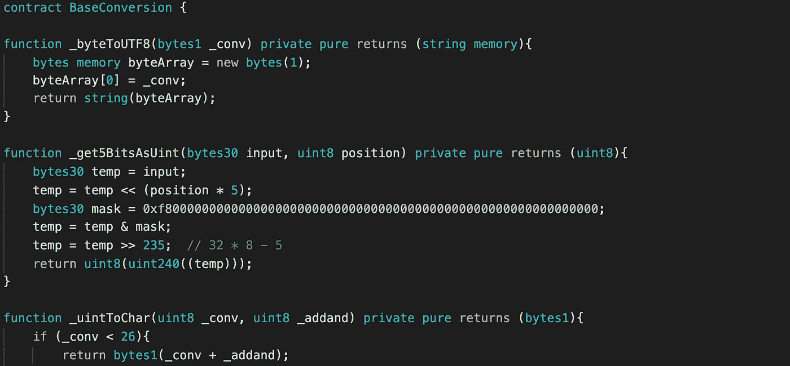

# 用存储的字节显示 IPFS 和 Arweave TxIDs

> 原文：<https://medium.com/coinmonks/displaying-ipfs-and-arweave-txids-with-stored-bytes-f9a40a8d2317?source=collection_archive---------14----------------------->

在我们的[上一篇文章](/@21MMPixels/efficiently-storing-ipfs-hashes-in-our-nft-2ff972590c8c)中，我介绍了[21 兆像素](https://21mmpixels.com)合同视图函数，这些函数将 [IPFS](https://ipfs.io) Base32 内容标识符(IPFS cidV1)和 [Arweave](https://arweave.org) Base64URL 事务 id 编码到我们用来存储 2100 万像素的 NFT 瓦片的图像链接的结构中。接下来，我将简要解释将存储的信息转换回人类可读格式的 contracts 视图函数。

21MMpixels[contract](https://etherscan.io/address/0x7dd7aa4b560692c882d982312c0b53b24c51523a#code)*token img*函数是查看组成 21 mmpixels 映像的任何 NFT 的映像集的入口点。该功能从读取给定图块的*赎回指令*开始。*resumed struct*的 bytes1 *multibase* 域决定了我们用来解码图像链接的函数。今天，我们将重点关注契约定义的*多基*的两种可能性，编码为 0x62 (Base32 大写)或 0x42 (Base32 小写)的 IPFS，以及编码为 0x01 的 Arweave 事务 id。

在 IPFS 图像链接的情况下，我们首先使用两个字节 30 摘要、*多库*和存储的*长度*来调用我们的*bytearraystobase 32 string*函数。如果使用的*长度*超过 240 位(30 字节* 8 位/字节)，我们将调用*_ bytes 30 torsing*两次，首先调用长度为 48 (240 位除以 5 位/字符)的第一个摘要和*多基址*，然后调用长度为(存储长度减去 240)除以 5 的第二个摘要和*多基址*。如果使用的长度小于 241 位，我们将简单地使用第一个摘要的*_ bytes 30 torting*的结果，长度*除以 5 的大小，以及*多基址*。*

用 3 个变量调用的*_ Bytes 30 transisting*函数返回一个字节数组，代表一个 UTF8 编码的字符串。该函数创建一个新的字节变量(*字节数组*)，其长度等于被调用的*长度*，表示字符数。对于 Base32，我们基于*多基*定义了 uint 8*add 和*，base 32 low 等于 65，Base32Upper 等于 97。然后，我们进入 for 循环，该循环利用两个功能，将 *i* 从 0 设置为*长度*。在每个循环中，我们首先调用函数 *_get5BitsAsUint* ，用 byes 30*输入*，用 *i* 。

*_get5BitsAsUint* 函数从字节 30 的输入( *temp* )创建一个临时变量，左移( *< <* )调用函数中的 *i* 生成 temp 变量，在该函数中被命名为 *position* ，乘以 5。然后，我们创建一个字节 30 掩码 0xf8，后跟 28 个零，在二进制中是 5 个 1，后跟 235 个零。我们使用按位“与”运算符( *&* )来组合掩码和 *temp* 变量。最后，我们将*>>*)*temp*右移 235°，并返回一个 uint8 与*uint 8(uint 240)((temp))*。

*_get5BitsAsUint* 函数的结果用于将结果和*add 及*一起调用 *_uintToChar* 。此 *_uintToChar* 函数返回一个代表 UTF8 字符代码的字节 1。如果转换后的 uint8 小于 26(代表一个字母)，则返回 uint8 加上*add 和*。如果转换后的 uint8 大于 25(代表一个数字)，它将返回 uint 8+24。 *_uintToChar* 返回的结果被添加到*by array*变量中的 *i* 字节位置。

使用函数*将*_ bytes 30 testing】返回的字节转换为 UTF8 字符串(bytes . concat(_ bytes 30 testing result))*。*

存储的 Arweave 交易 id 的转换功能与 IPFS 转换非常相似。我将简要介绍这些差异。

*bytearraytabase 64 string*函数使用了不同的*_ bytes30 thrusting*函数，这个函数与 bytes 30 摘要和*长度*一起调用。该函数用一个变量调用两个函数 *_get6BitsAsUint* 和 *_uintToChar* 。

*_get6BitsAsUint* 函数与 *_get5BitsAsUint* 函数的不同之处在于，它首先左移*位置*乘以 6 (Base64 使用每个字符 6 位)，字节 30 掩码以 0xfc 开始，代表 6 个 1，后跟 234 个 0，最后右移 234。

用于 Arweave Base64 转换的 *_uintToChar* 函数由 *_get6BitsAsUint* 的 uint8 结果( *_conv* )调用，没有*add 和*。该函数返回 *_conv* + 65 中的字节 1，代表 *_conv* < 26(字母字符“A”—“Z”)；返回 *_conv* + 71，代表 *_conv* < 52(字母字符“A”—“Z”)；返回 *_conv* — 4(数字“0”—“9”)；返回 *_conv* — 17，代表 *_conv*

由于 Base32 和 Base64 操作的 2100 万像素合约中使用的所有函数都是视图函数，因此我们没有必要对这些函数进行 gas 优化。我们很乐意回答任何问题，并欢迎任何反馈。

> 加入 Coinmonks [电报频道](https://t.me/coincodecap)和 [Youtube 频道](https://www.youtube.com/c/coinmonks/videos)了解加密交易和投资

## 也阅读

 [## BlockFi 评论:2022 年的利弊和利率

### 今天，我们提出了一个全面的 BlockFi 评论，这是一个成立于 2017 年的加密贷款平台，拥有其…

coincodecap.com](https://coincodecap.com/blockfi-review)  [## 如何在印度购买比特币？2021 年购买比特币的 7 款最佳应用[手机版]

### 如何使用移动应用程序购买比特币印度

medium.com](/coinmonks/buy-bitcoin-in-india-feb50ddfef94)  [## 加密税务软件——五大最佳比特币税务计算器[2021]

### 不管你是刚接触加密还是已经在这个领域呆了一段时间，你都需要交税。

medium.com](/coinmonks/best-crypto-tax-tool-for-my-money-72d4b430816b)  [## 9 个 2022 年最值得购买的密码| CoinCodeCap

### 9 个 2022 年最值得购买的加密产品阅读加密产品评论和比较，了解比特币交易和…

coincodecap.com](https://coincodecap.com/crypto-to-buy-in-2022)  [## 存储比特币的最佳加密硬件钱包 2022 | CoinCodeCap

### 硬件钱包是我们存储加密资产的唯一可靠选择。在本文中，我们将讨论 8 个…

coincodecap.com](https://coincodecap.com/best-hardware-wallet-bitcoin)  [## Pionex 评论 2021 |免费加密交易机器人和交换

### Pionex 是为交易自动化提供工具的后起之秀。Pionex 上提供了 9 个加密交易机器人…

medium.com](/coinmonks/pionex-review-exchange-with-crypto-trading-bot-1e459d0191ea)