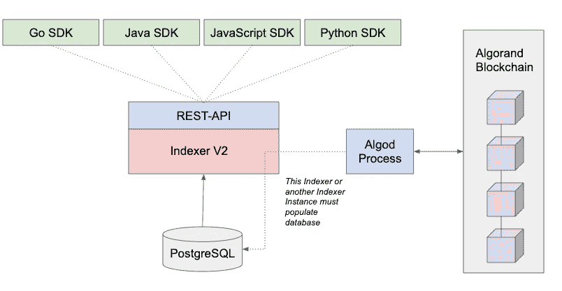

# 解剖算法

> 原文：<https://medium.com/coinmonks/dissecting-algorand-e962f48f8c72?source=collection_archive---------3----------------------->

# 使用 Algorand 的流行解决方案

一些使用 Algorand 的独立应用程序有 Republic、Securitize、萨尔瓦多的区块链基础设施、马绍尔群岛的数字货币、Orion 协议和 DUST Identity。


# 共识——利害关系的纯粹证明

纯赌注证明使用可验证的随机函数(VRF)作为加权彩票，其中权重取决于某人拥有的 ALGO 的数量。

## VRF(可验证随机函数)

VRF 执行加密排序来选择委员会运行共识协议。VRF 有三个部分，关键，评估和验证。


y，我们的随机串是唯一的，伪随机的，看起来是随机的，但是有了证明，你就可以用验证算法验证了。

在 Algorand 中，每个用户(Algo holder online)运行上述步骤。他们持有秘密密钥 SK(秘密密钥)和 VK(验证密钥)，VK 是众所周知的，所有处理带外。如果这些用户希望参与委员会来运行共识，那么他们需要执行以下操作:

1.  计算*评估(SK，Qr) → (Y，⍴)* 。在这里， *Qr* 是系统中每个人都可以使用的“神奇”种子字符串。
2.  检查 *Y* 是否在特定范围*【0，P】*内，该范围取决于用户在系统中的股份。

Algorand 与 lib 钠分享了他们的 VRF 算法，查看以下实现:

[](https://github.com/algorand/libsodium/tree/draft-irtf-cfrg-vrf-03/src/libsodium/crypto_vrf) [## lib 钠/src/lib 钠/crypto _ vrf at draft-irtf-cfrg-vrf-03 algrand/lib 钠

### 此时您不能执行该操作。您已使用另一个标签页或窗口登录。您已在另一个选项卡中注销，或者…

github.com](https://github.com/algorand/libsodium/tree/draft-irtf-cfrg-vrf-03/src/libsodium/crypto_vrf) 

以下是沙伦·戈德堡、莫尼·诺尔、迪米特里斯·帕帕多普洛斯、列昂尼德·雷津和扬·韦勒克对 VRF 的标准化:

 [## 草案-irtf-cfrg-vrf-03

### CFRG·s·戈德堡互联网-草案 l·雷津预定状态:标准跟踪波士顿大学到期日期:2019 年 3 月 18 日 D…

datatracker.ietf.org](https://datatracker.ietf.org/doc/html/draft-irtf-cfrg-vrf-03) 

## 不要和我叉！

Algorand 的一个有趣特性是它不可分叉。


**关于分叉的侧面注释**

> 如果两个节点同时获得一个有效数据块，而不同的用户无法就获取哪个数据块达成一致，或者无法决定升级，就会发生分叉。在这些情况下，链会一分为二，随着新的块添加到链中，其中一个块会比另一个块长。最终最长的会留下来，最短的会死去。当最短的链终止时，其中的所有块以及所有事务都将被视为无效。

**分叉不是坏事。**

Algorand 是为了防止叉子。这不一定是一个积极的特性，只是解决上限定理的另一种方式(一致性、可用性和分区容忍)。有了像索拉纳这样的区块链网络，分叉就被创造出来，以便快速轮换领导人。分流使网络能够快速处理交易，并在出现分歧时保持运转，但牺牲了过程的一致性。

这样做的好处是，一旦事务完成(大约 5 秒钟)，就可以保证事务达到终结。在可分叉的网络中，你需要等待一定数量的块(比特币推荐 6 个块，可能是一个小时)被添加到你的交易所在的块的顶部，才能知道它已经完成。

**阿尔格朗怎么会不招人待见**

Algorand 是不可避免的，因为两个块永远不会同时传播到链中，因为只有一个块可以具有所需的委员会投票阈值。

以下是阿尔格兰德共识协议中的步骤:

1.  **提案阶段**

每个节点循环通过具有有效参与密钥的在线账户，并选择一个账户。现在选择了一个帐户，其他节点验证是否选择了该帐户。


**2。软投票阶段**

提案的数量减少了，节点验证签名的消息并使用 VRF 证明验证选择。具有最低 VRF 散列的帐户被选择来提议下一个块。


**3。认证投票阶段**

一个由 1000 名核查员组成的委员会被随机选出，以接收有关新区块的信息。他们的工作是验证该块并将其标记为有效或无效。如果达到法定人数，该块将被添加到区块链中。

> **如果未达到法定人数—网络进入恢复模式，但不会分叉**
> 
> 网络将永远不会分叉，而是进入恢复模式。在恢复模式下，发送恢复消息。节点将发送这些消息以向网络发信号通知它应该继续处理最后已知的块提议或者提议新的块。
> 
> 当这些信息中的任何一条达到法定票数时，系统将恢复正常运行。
> 
> 在恶意行为的情况下，协议可以选择新的领导者。在网络中断的情况下，当前块将继续被处理，或者可能提出新的块。

查看下面的视频，了解更多关于纯股权证明的信息。

或者查看关于该协议的白皮书:

[https://www.algorand.com/Algorand%20Protocol.pdf](https://www.algorand.com/Algorand%20Protocol.pdf)

# 储存；储备

## 节点中的内部数据存储— SQLite

分类帐使用 SQLite 数据库作为其内部存储。这是 algod 进程读写数据的地方。

之所以选择 SQLite，是因为它提供了出色的存储性能、嵌入式、轻量级和容错性。其他数据库可能会提供更好的索引功能，但 algorand 节点不需要这些功能。

使用 SQLite 的一个缺点是从数据库的角度来看缺乏控制。例如，如果您想优化数据库，如添加索引等，您的灵活性将会受到限制。如果您正在为政府或金融项目考虑 Algorand，而该组织有其数据库管理策略，那么这不是一个交易破坏者，而是一个值得考虑的问题。

关系数据库在区块链领域很少见。规范是键值数据库(即比特币&以太坊使用 LevelDB，Solana & Polkadot 使用 RocksDB)。这些数据库是轻量级的，易于水平扩展。另一个使用关系数据库的平台是 Corda R3。

## 独立 REST API 数据存储—PostgreSQL

索引器是 Algorand 节点之外的一个独立的二进制文件，充当 REST API 接口。它从 PostgresSQL 数据库中检索区块链数据，并使用运行在存档 Algorand 节点上的 Algod 进程进行连接。



下面是一个查询示例，其中我们返回超过 10 个微藻类的最后 1000 个事务:

```
#/indexer/python/search_transactions_min_amount.pyresponse = myindexer.search_transactions(min_amount=10)# Pretty Printing JSON string
print(json.dumps(response, indent=2, sort_keys=True))
```

# P2P 通信

## 中继节点

帐户不直接交换消息；相反，它们将其消息传播到中继节点。中继节点是不可信的，因此为了解决这个问题，我们使用一种编码。需要记住的一点是，中继节点是被许可的节点。它们在阿尔格兰德基金会的 SRV 记录中注册。这将 Algorand 推向一个更集中的方法。

## 序列化—消息包

Algorand 中的所有消息都使用 MessagePack 编码，MessagePack 是一种二进制序列化格式，允许用 JSON 等语言进行交换。

[](https://msgpack.org/) [## 消息包

### Actionscript3 的 MessagePack(Flash、Flex 和 AIR)。as3-msgpack 被设计成与接口 IDataInput 一起工作…

msgpack.org](https://msgpack.org/) 

## 通信技术

该网络在使用基于 HTTP (TCP)的 WebSockets 的网状网络中运行。Algorand 可能选择了 TCP，因为它得到了普遍的支持，并且可以处理诸如对排队的消息进行优先级排序之类的任务。

# 事务池

事务池，在其他网络中也称为 mempool，是事务保存在内存中并添加到块建议中的地方。

事务池为建议准备有效的块，并缓存经过验证的事务组。

在任何时候，事务池都维护一个为建议指定的事务组队列。它检查事务是否正确签名，费用是否满足最低要求，以及状态变化是否与队列中先前的事务一致。它在一个期限内完成所有这些工作；如果它没有在截止日期前完成，它会得到一个缓冲期，它会将一个空的或部分的块放在一起。

# 费用

每笔交易的最低交易费是 1，000 个微藻或 0.001 个藻类。最重要的是，根据以字节为单位的事务的估计大小，每字节有一笔费用。如果此费用低于最低费用，则默认为最低费用。为了更好地理解费用，您可以使用 SDK 方法建议的每字节费用(fee)。


有关详细信息，请查看下面的费用文档:

[](https://developer.algorand.org/docs/get-details/transactions/?from_query=fee#fees) [## 结构— Algorand 开发者门户

### 本节着眼于事务是如何构造的，特别是如何阅读和理解底层的…

developer.algorand.org](https://developer.algorand.org/docs/get-details/transactions/?from_query=fee#fees) 

## 账户最低余额

在阿尔格兰德，要求最低余额为 100，000 只微藻(今天大约是 0.092373 美元)。如果您的交易余额低于这个最小值，它将失败。

## FeeSink 和 RewardsPool

FeeSink 是发送所有交易费用的地方。FeeSink 只能用于 RewardsPool 帐户。RewardsPool 帐户持有需要作为奖励分配给协议中的 Algorand 帐户的 Algos。正如您在下面的代码中看到的，有一个逻辑只允许 FeeSink 发送到 RewardPool。


Code from [https://github.com/algorand/go-algorand/blob/0e9cc6b0c2ddc43c3cfa751d61c1321d8707c0da/data/transactions/payment.go#L45](https://github.com/algorand/go-algorand/blob/0e9cc6b0c2ddc43c3cfa751d61c1321d8707c0da/data/transactions/payment.go#L45)

这种方法有点集中，奖励池只是 Algorand 网络上的一个地址。以下是 mainnet 的奖励池:


# 节点的流程

阿尔格兰德有两个过程，KMD 和阿尔戈德。

**KMD(密钥管理器守护进程)**处理所有与消费密钥的交互，包括签名交易。签名也可以是独立的。

**Algod** 负责处理协议，与 SQLite 交互写记录，实现 REST API 读。


# 阿尔格兰德的智能合同语言

Algorand 使用 TEAL(交易执行批准语言)和 REACH。

像以太坊智能合约这样的 Algorand 智能合约有一个 Algorand 地址，可以持有 Algorand 资产(ASA)和 Algos。

请参考文档以了解有关智能合同的更多信息:

[](https://developer.algorand.org/docs/get-details/dapps/smart-contracts/apps/) [## 智能合同详情——algrand 开发商门户

### 阿尔格兰德智能合约是位于阿尔格兰德区块链上的逻辑块，可以远程调用。这些…

developer.algorand.org](https://developer.algorand.org/docs/get-details/dapps/smart-contracts/apps/) 

## 蓝绿色和蓝色

TEAL 是一种在 AVM (Algorand 虚拟机)处理的类似汇编的语言。这是一种图灵完整的语言，支持循环，子例程有护栏，使用**动态操作码成本评估算法**来限制合同的执行时间。您可以编写 TEAL 或使用 pyTEAL 来生成 TEAL 代码。

在 pyTEAL 和 TEAL 程序中，总是有两个程序:批准程序**和清除程序**两个程序。批准程序包含大部分业务逻辑，清算程序处理关闭账户。

所有与 Algorand smart contracts 的通信都是通过**应用程序交易实现的。**以下是六种应用交易子类型。


**审批程序**

正如你在下面的 NFT 智能合同例子中看到的，所有的肉都在批准程序中。

**清除状态**

我从 Algo-Builder 的智能合同模板中提取了上面的智能合同:

[](https://github.com/scale-it/algo-builder/tree/master/examples) [## algo-builder/master scale-it 的示例/algo-builder

### Algo Builder 团队维护着这个经过验证的智能合同模板库，它将加速您的 dapp 设计…

github.com](https://github.com/scale-it/algo-builder/tree/master/examples) 

## Reach(。rsh)

Reach 是一个 DApp 框架，与 algrand 和 Ethereum 一起使用，最常用于 algrand。Reach 旨在处理整个体验，前端和后端。后端处理 index.rsh 这样的文件，前端处理 index.mjs。

通过浏览下面的教程，用 Reach 弄脏你的手:

[](https://developer.algorand.org/docs/get-started/dapps/reach/) [## 与 Reach 一起构建——algrand 开发者门户

### Alice 和 Bob 现在准备开始开发他们的 Algorand 动力拍卖 dApp！本指南将带您…

developer.algorand.org](https://developer.algorand.org/docs/get-started/dapps/reach/) 

# 它在区块链三难中处于什么位置

## 分散

站起来很简单。你甚至可以在笔记本电脑上跑步。让几个人更容易开始运行他们的 Algorand 节点。令人惊讶的是，今天运行的节点并不多，截至今天，1/31/21，只有 1427 个节点在运行。给这个数字一些背景，今天，1/31/21，有 2052 个节点运行以太坊。

中继节点必须向 Algorand 注册。在一个真正去中心化的区块链，每个人和他们的妈妈应该能够运行任何节点。尽管所有这些中继节点参与者都来自不同的公司和国家，但由于它们都是由同一组织批准的，因此存在集中化的问题。

阿尔格兰德没有最低参与证明股份，这使得任何人都可以参与证明股份。纯赌注证明(PPoS)(共识算法)中的每个 Algo 令牌都被视为一张彩票。有一个机会，共识会选择你只有一个算法，但被选中的机会随着你有更多的“彩票”或算法而增加。

## 可攀登的

由于 Algorand 的无分叉设计和 SQLite 的使用，我看不出它如何扩展。这种一次批准一个区块的方法，如果对提议的内容没有达成共识，交易可能会堆积起来，使网络停滞不前。

## 安全性

因为 Algorand 是不可饶恕的，所以它是高度安全的，并且交易的终结是关于政府和财务记录的一切。

他们将 algod 和 kmd 处理器分开的方式使读写变得安全。密钥管理应始终与其他区块链职责分开处理。

Algorand 不使用支出密钥参与共识的方法保证了网络安全。相反，参与者使用一个参与密钥和一组临时密钥来签署一致同意的活动，如阻止提案、投票等。这种方法可以防止双重签名，并保护开销密钥在节点受损的情况下不会受到危害。


# 速度笔记


Photo by [paolo candelo](https://unsplash.com/@paolocandelo?utm_source=medium&utm_medium=referral) on [Unsplash](https://unsplash.com?utm_source=medium&utm_medium=referral)

Algorand 目前的速度约为 1,000 TPS，比比特币和以太坊快，但不如 Solana 等其他第三代区块链网络快。Algorand 在他们的性能报告中提出，使用块流水线，他们可以达到 46，000 TPS，但我们需要等待该实现部署到 mainnet 上。

在终局性方面，阿尔格兰德获胜；它们的终结时间是 2.5 秒，因为交易一完成就终结了。我们不必等待添加更多的块来知道它是真正的最终版本，因为它没有分叉设计。

阿尔格兰德基金会从其 2021 年绩效报告中提取了这些绩效指标:

# 如果你喜欢这个帖子，那么你可以请我喝咖啡，先谢谢你了！

[](https://www.buymeacoffee.com/mindegg)

# 如果你现在痴迷于这些资源，那就投入其中吧。

**官方回购**

 [## GitHub-algo rand/go-algo rand:algo rand 在 Go 中的官方实现。

### rel/stable rel/beta rel/nightly algrand 在 Go 中的正式实现。阿尔格兰德是一个没有权限的，纯粹的…

github.com](https://github.com/algorand/go-algorand) 

**algrand Metrics 仪表盘**

[](https://metrics.algorand.org/) [## 阿尔格兰德开发者门户

### Algorand 开发人员文档、SDK、REST APIs、CLI 工具、生态系统项目、指标仪表板和示例代码、操作指南……

metrics.algorand.org](https://metrics.algorand.org/) 

**官方阿尔格兰德论坛**

[](https://forum.algorand.org/) [## 阿尔格兰德

### AlgoGlobal 社区的目标是建立一个安全、可扩展、分散的网络，作为…

forum.algorand.org](https://forum.algorand.org/) 

**CoMakery algrand 安全令牌**

[](https://github.com/CoMakery/algorand-security-token) [## GitHub-CoMakery/algrand-security-token:与 CoMakery 兼容的开源安全令牌…

### 这是一个与 CoMakery 兼容的开源 Algorand 安全令牌。虽然它是建立在阿尔格兰德上，但它…

github.com](https://github.com/CoMakery/algorand-security-token) 

**Algorand 智能合约架构**

**Android 上的原子传输教程**

[](https://github.com/gconnect/AlgorandPayrollContract) [## GitHub-gconnect/algorandpayroll contract:这是一款基于 Algorand 开发的 android 应用程序…

### 该解决方案将指导您使用阿尔格兰德区块链原子开发和部署 android 应用程序…

github.com](https://github.com/gconnect/AlgorandPayrollContract) 

> 交易新手？尝试[加密交易机器人](/coinmonks/crypto-trading-bot-c2ffce8acb2a)或[复制交易](/coinmonks/top-10-crypto-copy-trading-platforms-for-beginners-d0c37c7d698c)