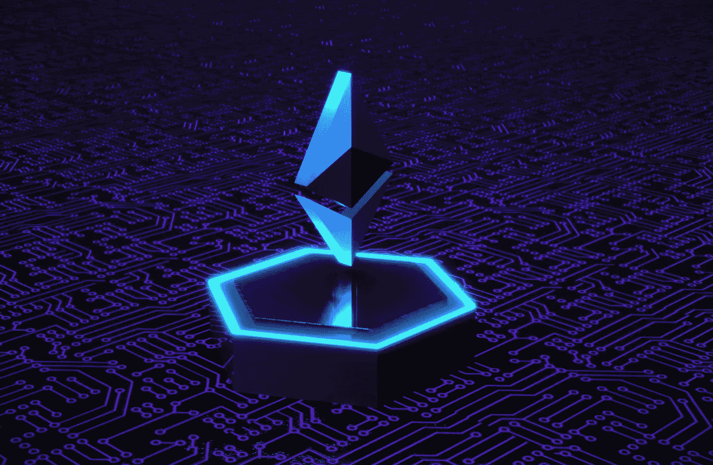
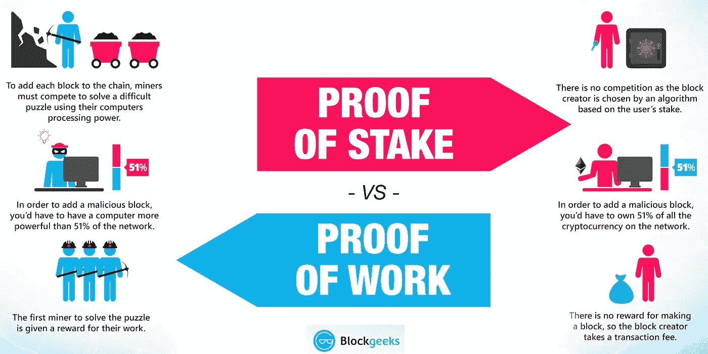

# 剖析区块链网络的可扩展性。

> 原文：<https://medium.com/coinmonks/dissecting-scalability-in-the-blockchain-network-4477a3d988a7?source=collection_archive---------14----------------------->

## 什么是可伸缩性？

**可伸缩性**与组织、系统、模型或功能在不断增加或扩大的工作量或范围下成功应对和运作的能力有关。即使受到更大运营需求的考验，有效扩展的系统也能够保持甚至提高其性能水平或效率。

**可扩展性 i** n [金融市场](https://www.investopedia.com/terms/f/financial-market.asp)是指金融机构处理不断增长的市场需求的能力；在企业界，一个可扩展的组织应该随着销售量的增长保持或增加利润率。

## 区块链中的可扩展性是什么？

**区块链网络的可扩展性**是指该平台支持不断增加的交易负载以及网络中不断增加的[节点](https://timesofindia.indiatimes.com/business/cryptocurrency/blockchain/what-are-blockchain-nodes/articleshow/88116308.cms)数量的能力。

自从这项未来派的技术发明问世以来，区块链科技公司的地位显著提高。由于庞大的学术界和行业创新，区块链技术应用已经显示出有希望的成功水平。另一方面，区块链技术是在考虑金融行业的情况下设计的，尽管区块链的许多应用已经出现。

以下是确定定义区块链可扩展性的**因素；**

*   **事务吞吐量:**在区块链空间中，事务吞吐量是指区块链处理事务的速度，通常用每秒事务数(TPS)来表示。使用时间戳，区块链系统可以跟踪跨时间间隔生成和添加了多少数据块。这些测试的结果用于评估区块链系统的性能和可扩展性。
*   **联网:**区块链上的每一个事务都被广播到网络中的所有节点。此后，无论何时挖掘出一个块，它都会再次发送到所有节点。因此，该过程可能会耗尽大量网络资源，同时还会增加传播延迟。因此，拥有可靠高效的数据传输系统至关重要。
*   **成本和容量:**可伸缩性中的成本和容量元素暗示了在区块链上存储大量数据的必要性。您必须存储从源块开始到最近事务结束的数据。然而，区块链网络中的每个节点都缺乏存储如此大量数据所需的资源和容量。

## **为什么可伸缩性在区块链如此重要且充满挑战？**

以比特币、以太坊和万事达卡为例，寻找理想的答案。它们都处理几乎 **7tps(每秒交易量)**和 **25tps(每秒交易量)**而万事达卡平均每秒处理几乎 **5000 笔交易** **。**你可以看到万事达卡和区块链技术在性能上的差异。

实际上，区块链对于有限数量用户来说运行良好。但是如果有广泛的包容会发生什么呢？以太坊和比特币目前拥有网络上最多的用户，可以肯定他们现在很难处理这个问题。

以下是**影响区块链可扩展性挑战的因素**；

*   **限制:**区块链可伸缩性最严重的问题是它的限制。当处理新交易时，每个[节点](https://timesofindia.indiatimes.com/business/cryptocurrency/blockchain/what-are-blockchain-nodes/articleshow/88116308.cms)将关于交易的信息添加到分类账中。因此，系统的总体稳定性可能会受到**不断增长的交易历史的影响。**为了保持高度信任，区块链网络必须保持所有数据的准确性。此外，区块链还有硬件限制。大多数区块链可扩展性挑战是由硬件限制引起的。随着区块链网络的增长，安装和维护操作[节点](https://timesofindia.indiatimes.com/business/cryptocurrency/blockchain/what-are-blockchain-nodes/articleshow/88116308.cms)所需的硬件变得越来越困难。
*   **交易费用:高昂的交易费用**是导致区块链出现严重可伸缩性问题的下一个重要方面。区块链网络越来越受欢迎，导致交易验证程序越来越复杂。为了验证他们的交易，用户必须付费。随着区块链网络的不断发展，用户愿意支付更多的交易费用来验证他们的交易。但是，许多其他事务在队列中停留了很长时间而没有得到处理。
*   **响应时间:**区块链网络上的每一笔交易都要通过一个验证过程。由于队列中有大量的事务，事务通常需要等待很长时间进行验证。例如，在比特币网络上建造一个新的[区块](https://en.wikipedia.org/wiki/Blockchain)需要将近 10 分钟。区块链可扩展性问题的主要原因表明**交易和用户数量的增加**给区块链网络带来了严重的困难。如果网络无法扩展容量以容纳更多的交易和用户，它们就有可能危及更广泛的采用机会。**因此，近年来对区块链可扩展性解决方案的需求激增。**
*   [**块大小:**](https://en.wikipedia.org/wiki/Block_size_(cryptography)) 随着区块链网络上交易数量的增加，执行交易的过程变得更加耗时。

## 区块链中的可扩展性解决方案

**共识机制的改进:**共识机制是一种**容错过程**，用于计算机和区块链系统中，以获得跨分布式进程或多代理系统的单个数据值或网络状态所需的一致，如加密货币。

> 我们可以看到双引擎飞机的容错能力，当一个引擎出现故障时，另一个引擎开始工作。

**工作证明**是目前区块链网络使用的共识技术，如比特币和以太坊。尽管**工作证明**共识技术是安全的，但它很慢，这使得区块链网络期待**利益证明**共识机制，该机制不需要矿工解决加密算法来生成散列函数，而是通过根据网络中的利益选择验证器来确保共识。这种采用将显著增加以太坊网络的容量，同时也提高了安全性和分散性。

PoW vs PoS

**分片:**分片涉及将交易分解成更小的数据集，这些数据集被称为“分片”。使用利益一致性算法证明，节点对其加密令牌进行利益相关，并负责事务验证。节点标记的令牌越多，标记持续的时间越长，该节点被分配事务验证责任的可能性就越大。在这种情况下，不能使用 POW 共识算法，因为它要求所有节点都参与事务验证，并且节点不能再访问整个区块链分类帐。

## **总结**

区块链的未来是光明的，因为它在不同部门的应用是可行的。解决区块链可伸缩性挑战的特定方法的可用性显示了处理可伸缩性三难问题的巨大可能性，即使有大量的研究要进行。

 [## 十大区块链采用挑战

### 区块链科技有多少挑战？它能克服这一切，并作为一种技术祝福而闪耀吗…

101blockchains.com](https://101blockchains.com/blockchain-adoption-challenges/)  [## 最快的区块链是什么，为什么？43 区块链分析

### 在创造最快区块链的竞赛中，似乎每个人都不清楚它的实际意义。让我们…

alephzero.org](https://alephzero.org/blog/what-is-the-fastest-blockchain-and-why-analysis-of-43-blockchains/) 

> 加入 Coinmonks [电报频道](https://t.me/coincodecap)和 [Youtube 频道](https://www.youtube.com/c/coinmonks/videos)了解加密交易和投资

# 另外，阅读

*   [Bookmap 评论](https://coincodecap.com/bookmap-review-2021-best-trading-software) | [美国 5 大最佳加密交易所](https://coincodecap.com/crypto-exchange-usa)
*   最佳加密[硬件钱包](/coinmonks/hardware-wallets-dfa1211730c6) | [Bitbns 评论](/coinmonks/bitbns-review-38256a07e161)
*   [新加坡十大最佳加密交易所](https://coincodecap.com/crypto-exchange-in-singapore) | [收购 AXS](https://coincodecap.com/buy-axs-token)
*   [红狗赌场评论](https://coincodecap.com/red-dog-casino-review) | [Swyftx 评论](https://coincodecap.com/swyftx-review) | [CoinGate 评论](https://coincodecap.com/coingate-review)
*   [投资印度的最佳加密软件](https://coincodecap.com/best-crypto-to-invest-in-india-in-2021)|[WazirX P2P](https://coincodecap.com/wazirx-p2p)|[Hi Dollar Review](https://coincodecap.com/hi-dollar-review)
*   [加拿大最佳加密交易机器人](https://coincodecap.com/5-best-crypto-trading-bots-in-canada) | [库币评论](https://coincodecap.com/kucoin-review)