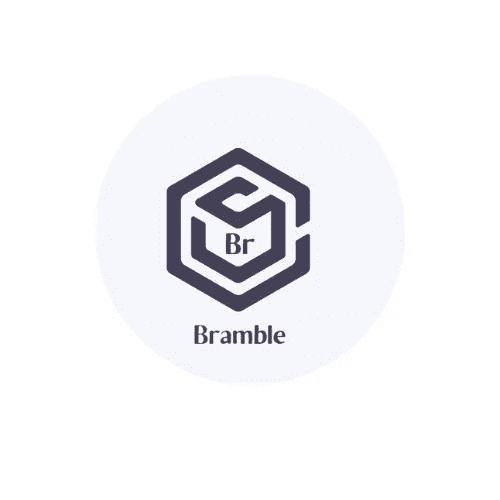
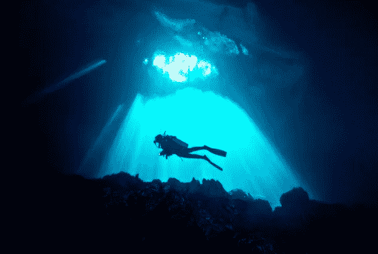

# 深入网络 3

> 原文：<https://medium.com/coinmonks/dive-intoweb3-a708eb31e573?source=collection_archive---------42----------------------->

我的故事是关于 web3 是一个十字路口，而我正在一个完全不同的市场领域工作，并希望提供一个更好的解决方案。

我从孟买大学的一名工程师开始了我的旅程，试图找到我的最终目标

有趣的是，我结束了 24*7 的工作，而不是传统的工作模式。

我是一个热情的人，虽然性格内向，但我总是让自己跟上周围一切可能的事物、创新和发展。我在 11 家不同的公司实习过，其中一家公司与之前的公司不同，有不同的角色，只是为了收集足够的数据，了解我未来想做什么，并可以追求更长的时间。

这一旅程在我体内孕育了一个光明而又创业的火花。我参加了多次会议、投资者聚会，以了解他们对投资、科技活动等的兴趣。我很幸运地遇到了一位有想法并热衷于寻找团队的投资者，我作为 EIR(常驻企业家)加入了他们，这是我们正在解决的一个房地产问题，并让自己沉溺于多种具有挑战性的角色，从市场研究、分析、记录、产品的线框化、发布最初的 MVP，做了 6 个月的试点工作等。这帮助我获得了从无到有，再到在市场上成功推出创意的经验。

因此，我的 web3 之旅是如何开始的，答案很常见，这就是比特币，一种无政府的货币，它正在增值，并呈指数增长。作为一个科学背景的人，我很难理解它的经济学，然而，我确实理解一个法令是如何实现它的价值的，但是这个数字货币/代币/密码是一个新的话题，让我有各种各样的问题和秘密等。

我开始研究它的来源，它被引入市场的原因，它的数学，经济部分，它彻底改变未来的力量 *hodl* 有一次我问自己，这枚硬币比世界上所有的政府都强大吗？这是我第一次真正理解去中心化的含义。这项自我研究有助于探索这一概念的其他领域。区块链、web3(新互联网)、加密货币、代币、代币组学、密码学、去中心化和好奇心是极限。

我的这种新的痴迷帮助我强调了房地产市场的一些问题，其中一些是购买/出售财产，新的注册方法，流动性不足等。我很快理解了激励在任何行业中的力量和影响。我开始记录区块链如何帮助改善这些过程。这个想法是为了能够表示实物资产的一个令牌化版本，这解决了资产清算的问题，并且是一个很长时间内的相关问题。这是在 2016 年，我意识到我所属的地区和行业对技术并不友好，在现实中尝试实施时面临着多重障碍。
因此，我决定深入了解这个主题，并有足够的能力在各个层面和各个市场实施它。

我决定成为一名自由职业者，一名区块链研究员，并开始给许多行业专家、第三方等写代笔文章。这有助于获得技能、洞察力和行业知识，但这一过程非常疯狂，因为这是一个快速发展的市场，每个小时都有新方法被发明出来，很难跟上步伐。

那么，我如何坚持、工作并成为这项新技术的一部分呢？。我和我的朋友碰巧遇到一个人，他激励每个用户植树，这是一个高尚的想法，但它涉及许多复杂的层次，主要关注的是如何识别和验证所做的工作？我..奖励用户的证明工作是否真的进行了？
然后，我们讨论并草草记下了多个市场，然后想出了在游戏行业工作的想法。
激励在线游戏市场，这正是我们的想法，现在我们正在一起创建 Bramble Hash Inc .

主要致力于 web2 的想法，实施策略，战略，在 web 3 行业有点困难。我积极主动地研究了这个话题、行业及其未来等。
但现在我面临的下一个挑战是将这一理论转化为可行的产品，并且是可销售的产品。

我不是一个社交媒体人，也没有办法理解如何创建一个品牌，尽管我理解它背后的潜在技术，但开发/探索它的想法是一个全新的挑战和水平。

因此，我在 web3 的接下来几天将是关于建立社区，设计荆棘哈希的令牌组学，深入了解吸血鬼攻击以及这对我们来说可能是一种新的营销策略，接触潜在的游戏客户、独立开发者并邀请他们利用该平台等。这是一个漫长的旅程，我们已经开始一点一点地采取措施，并且到目前为止已经取得了成功。我们在参加 NEAR acceleration 计划的前 15 名创业公司名单中，并加入了游戏，这是 2021 年的第一项成就，仅在这个想法启动 5 个月后。
在接下来的几天里，我会集中精力建立社区、制定营销计划、使用社交媒体、Twitter 来扩大我们的业务或在整个市场传播信息。

当我在 web2 行业工作时，我冒昧地设计了多个标志、活动议程&它们的设计、网站设计等等。设计是我喜欢的东西，也是我经常观察的东西，因为我看到周围的一切都是有图案的，我从中找到了意义。
我接受了为我的公司设计一个标志的挑战，这是你看到的我们的标志，

Building Bramble

带着他们头脑和灵魂中的激情，认识一下我的来自德国的联合创始人 Rahul、Nitesh 和 Suvom(我们在与客户联系时远程认识了他，他为我们的团队增加了价值)，他们帮助我们从 0 到 1。
每周都与我保持联系，现在我计划在区块链、NFT、元宇宙和 Bramble 的激励博彩业之旅中写下新的议程。

坚持下去，直到我们再次见面！

In search of….

> *加入 Coinmonks* [*电报频道*](https://t.me/coincodecap) *和* [*Youtube 频道*](https://www.youtube.com/c/coinmonks/videos) *了解加密交易和投资*

# 另外，阅读

*   [3 商业评论](/coinmonks/3commas-review-an-excellent-crypto-trading-bot-2020-1313a58bec92) | [Pionex 评论](https://coincodecap.com/pionex-review-exchange-with-crypto-trading-bot) | [Coinrule 评论](/coinmonks/coinrule-review-2021-a-beginner-friendly-crypto-trading-bot-daf0504848ba)
*   [莱杰 vs n rave](/coinmonks/ledger-vs-ngrave-zero-7e40f0c1d694)|[莱杰 nano s vs x](/coinmonks/ledger-nano-s-vs-x-battery-hardware-price-storage-59a6663fe3b0) | [币安评论](/coinmonks/binance-review-ee10d3bf3b6e)
*   [Bybit 交易所评论](/coinmonks/bybit-exchange-review-dbd570019b71) | [Bityard 评论](https://coincodecap.com/bityard-reivew) | [Jet-Bot 评论](https://coincodecap.com/jet-bot-review)
*   [3 commas vs crypto hopper](/coinmonks/3commas-vs-pionex-vs-cryptohopper-best-crypto-bot-6a98d2baa203)|[赚取加密利息](/coinmonks/earn-crypto-interest-b10b810fdda3)
*   最好的比特币[硬件钱包](/coinmonks/hardware-wallets-dfa1211730c6) | [BitBox02 回顾](/coinmonks/bitbox02-review-your-swiss-bitcoin-hardware-wallet-c36c88fff29)