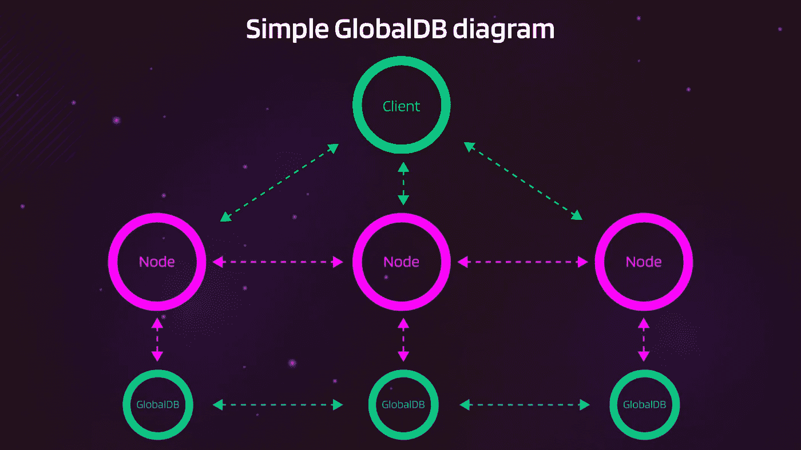
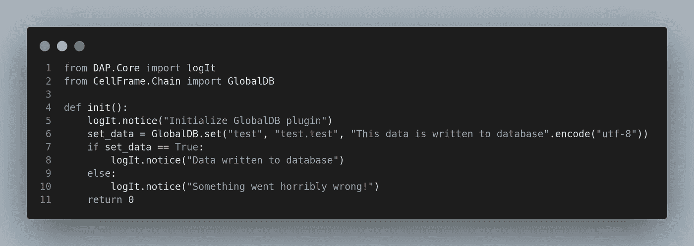
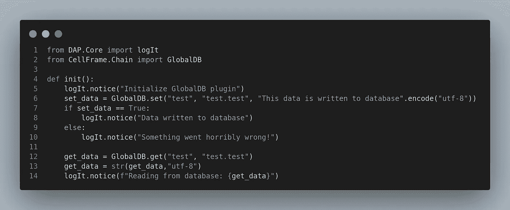
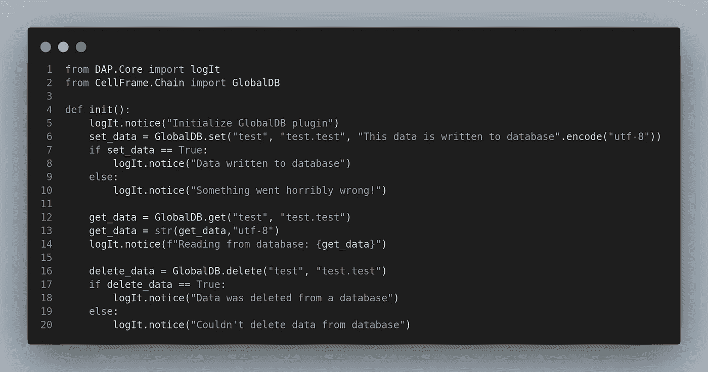

# 深入研究 Cellframe: GlobalDB

> 原文：<https://medium.com/coinmonks/diving-deeper-into-cellframe-globaldb-a5843fbb90a4?source=collection_archive---------7----------------------->


哦，天啊，我一直在努力找时间写这篇文章，终于来了！

Cellframe 内置了一些非常好的特性。其中一个特性是 GlobalDB(全局数据库)。

虽然 GlobalDB 目前处于不稳定状态(据我所知)，但在我看来这将是 Cellframe 生态系统未来的关键特征之一。

在这篇文章中，我试图分享我对 GlobalDB 的看法(例如，使用这种特性的可能性)。

我们走吧！

## 关于单元格框架

Cellframe 是一个雄心勃勃的第三代区块链项目，很少有人(包括我)已经开始谈论它是下一个波尔卡多特或草间弥生。

然而，这个项目更加面向服务，并且与 Polkadot/Kusama 相比具有一些优势(例如，后量子加密、2 级分片、P2P 跨链操作)。

Cellframe 是用 C 写的(这将使它快速和可移植)，目前它有一个 C 和 Python 的 SDK。将来会有更多受支持的语言出现。

我真的推荐访问他们的网站(【https://cellframe.net】T2)并阅读他们的白皮书！

## 首先，关于数据库

每个使用互联网的人可能都注册了某种类型的服务(脸书、Instagram 等)。).该服务通常有一个数据库，收集，例如，你的用户名和密码，这些凭据是从数据库中检查时，你登录到该服务。

显然，密码和用户名通常被加密存储在数据库中。因此，如果恶意用户可以访问数据库，该用户通常无法从中提取任何必要的登录详细信息。

最简单的数据库使用可能是安装 Wordpress CMS。它通常安装在 VPS 上，您必须手动创建数据库，然后为其运行安装过程。基本上你更新到你的网站的所有东西都被存储在数据库中，当用户浏览你的网站时，你可以从那里查询。

当然，这只是数据库使用的一种本地方法，如果有严格的权限，其他人就不能访问您的数据库。

数据库也可以有不同类型的数据。它可以是电影，音乐，游戏…任何真正的东西！

## 那么 GlobalDB 呢？

我向 Dmitriy(CEO @[cell frame Platform](https://medium.com/u/d42869e2593c?source=post_page-----a5843fbb90a4--------------------------------))简要询问了 GlobalDB 的特性，他是这样回答我的:

> GlobalDB 在全球范围内公开工作。如果 group 有一个前缀 scorpion，mileena，或者类似这样的前缀，那么它会进行全局和公开同步。
> 
> 如果没有，就是本地的。也可以有只与选定节点同步的私有 GlobalDB。

所以从技术上来说，如果你的数据库中有一个 testnet 前缀，它可以全局工作。如果您计划使用 Cellframe 节点运行封闭服务，也可以将它们保持为私有。

让我们看看在公共或私有环境中“如何实现”GlobalDB 的用法:



Messy diagram for GlobalDB

在本例中，我们有一个客户端，它连接到一个节点。显然，它可以连接到提供服务的任何节点。

这些节点将始终保持 GlobalDB 同步，因此客户端连接到哪个节点并不重要。

让我们举一个像网飞这样的服务类型的例子:

1.  客户端连接到节点(检查凭据和订阅)
2.  节点将请求的电影从全局数据库传递给用户
3.  用户开始观看电影

这显然是一个非常简单的例子，但这是你将来可以期待的特性！

## 与 Cellframe Python SDK 交互 GlobalDB

幸运的是，Cellframe Python SDK 有 4 种方法可以与全局数据库交互:

```
CellFrame.GlobalDB.get()-> Get data from GlobalDB
CellFrame.GlobalDB.set()-> Write data to GlobalDB
CellFrame.GlobalDB.delete() -> Delete data from GlobalDB
```

现在第四个方法是`CellFrame.GlobalDB.pin()`这个特性看起来还没有实现。也许是为了固定一些数据，使其不能被覆盖？只是猜测😏。

让我们看看现实世界中的这些方法。



嗯，这很容易理解这里发生了什么。我只是在写“这个数据写到数据库”…写到一个数据库！

顺便说一下:如果`GlobalDB.set()`方法返回 True，则写入成功。如果不是，将返回 False！

现在，在这个插件被设置在正确的目录中之后，查看日志，我们应该会看到类似这样的内容:

```
[05/24/22-20:13:08] [ * ] [libdap-python] Initialize GlobalDB plugin
[05/24/22-20:13:08] [ * ] [libdap-python] Data written to database
```

好了，让我们也添加一个用`GlobalDB.get()`方法从数据库中读取数据的特性:



将这部分代码添加到插件后，我们应该可以看到日志中的数据，这些数据是在代码的前面部分添加到数据库中的:

```
[05/26/22-08:58:45] [ * ] [libdap-python] Reading from database: This data is written to database
```

有用！现在让我们添加最后一个方法，使用`GlobalDB.delete()`方法从数据库中删除数据:



如果从数据库中删除数据成功，`GlobalDB.delete()`方法也返回 True，否则返回 False！

查看日志，我们应该会看到这样的内容:

```
[05/26/22-08:58:45] [ * ] [libdap-python] Data was deleted from a database
```

成功！

## 结论

现在所有这些对您来说可能听起来有点太简单了，向数据库添加一些文本，然后将其打印到日志输出中。但是想象一下这样的事情:

有数十亿部智能手机可以用来为像我这样的用户提供全球数据库。该数据库在技术上可以为最终用户提供任何东西，因此服务提供商不必将他们的数据库放在一个集中的位置。一切都将被分散，由每个人分享！

正如我之前在文章中提到的，如果/当有人创建了这样一个没有任何类型的中央服务器的服务，并且一切都可以在例如典型的智能手机上运行:

这将会改变现实世界的游戏规则。

## 有问题吗？推荐？

如果你想为区块链的未来做点什么，加入他们的发展[电报频道](https://t.me/cellframe_dev_en)！

你也可以通过[推特](https://twitter.com/CellGainz)或[电报](https://t.me/CELLgainz)联系我。

感谢您的阅读！

非常感谢我所有的推特粉丝鼓励我写更多的文章！

> 加入 Coinmonks [电报频道](https://t.me/coincodecap)和 [Youtube 频道](https://www.youtube.com/c/coinmonks/videos)了解加密交易和投资

# 另外，阅读

*   [Bookmap 评论](https://coincodecap.com/bookmap-review-2021-best-trading-software) | [美国 5 大最佳加密交易所](https://coincodecap.com/crypto-exchange-usa)
*   最佳加密[硬件钱包](/coinmonks/hardware-wallets-dfa1211730c6) | [Bitbns 评论](/coinmonks/bitbns-review-38256a07e161)
*   [新加坡十大最佳加密交易所](https://coincodecap.com/crypto-exchange-in-singapore) | [购买 AXS](https://coincodecap.com/buy-axs-token)
*   [红狗赌场评论](https://coincodecap.com/red-dog-casino-review) | [Swyftx 评论](https://coincodecap.com/swyftx-review) | [CoinGate 评论](https://coincodecap.com/coingate-review)
*   [投资印度的最佳密码](https://coincodecap.com/best-crypto-to-invest-in-india-in-2021)|[WazirX P2P](https://coincodecap.com/wazirx-p2p)|[Hi Dollar Review](https://coincodecap.com/hi-dollar-review)
*   [加拿大最佳加密交易机器人](https://coincodecap.com/5-best-crypto-trading-bots-in-canada) | [库币评论](https://coincodecap.com/kucoin-review)
*   [火币的加密交易信号](https://coincodecap.com/huobi-crypto-trading-signals) | [HitBTC 审核](/coinmonks/hitbtc-review-c5143c5d53c2)