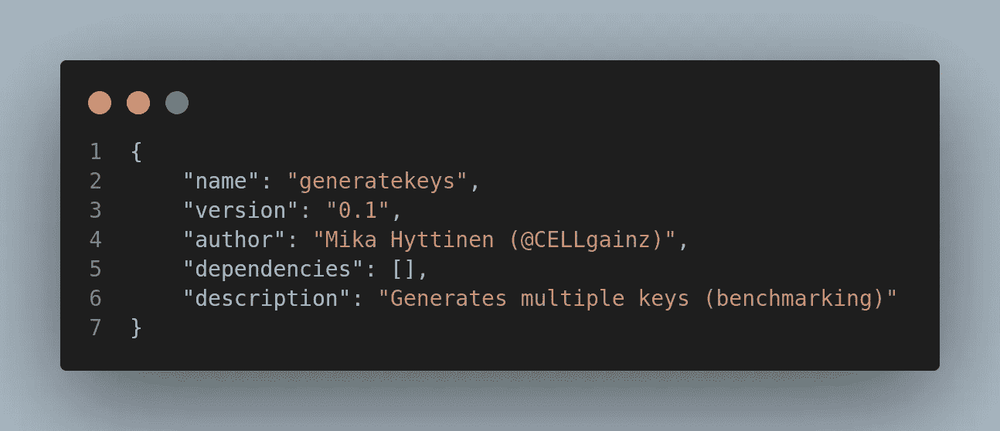
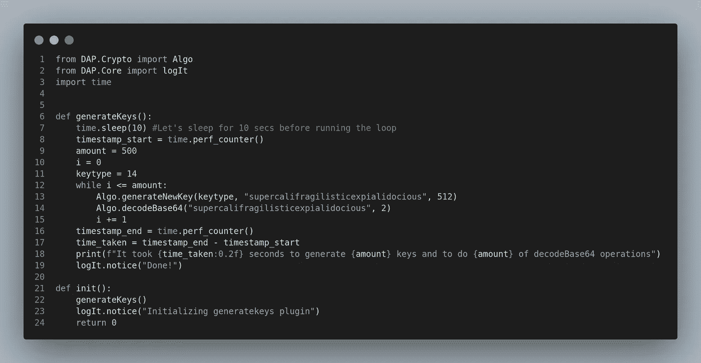
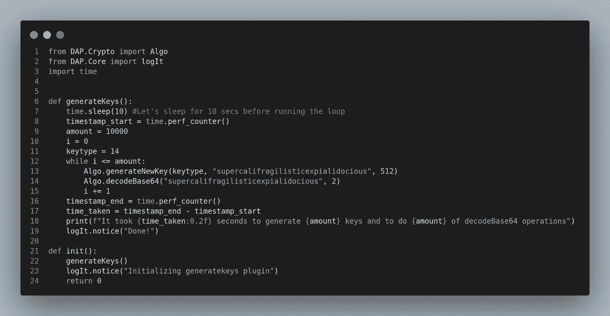
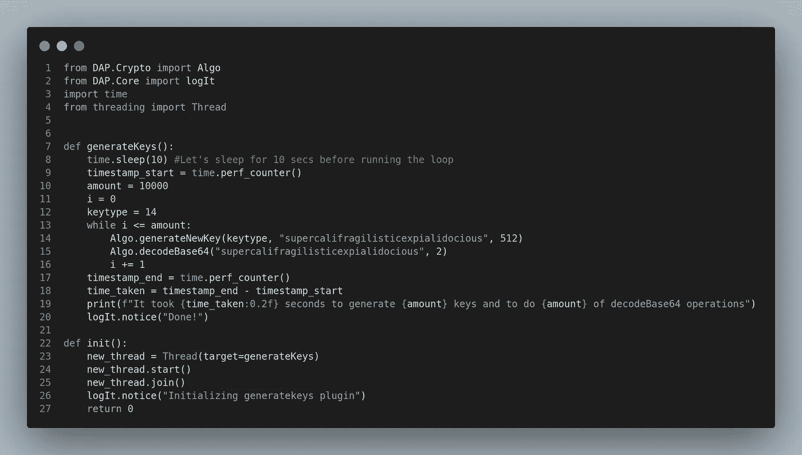
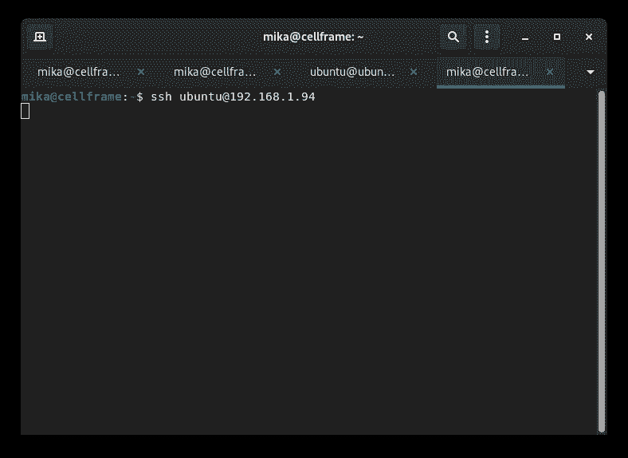

# 深入研究 Cellframe:关键一代性能

> 原文：<https://medium.com/coinmonks/diving-deeper-into-cellframe-key-generation-performance-36ed1efb0715?source=collection_archive---------18----------------------->


是时候写另一篇文章了！

我决定在 Cellframe 节点上对“现代”CPU 和 Raspberry Pi 3B+在密钥生成和 Base64 解码方面进行性能比较。

Cellframe 中的 Python SDK 使用对 C 函数的直接调用来生成密钥和进行 Base64 解码操作，因此它在任何 CPU 上都应该相对较快，但是 Raspberry Pi 如何处理这样的任务呢？

好吧，让我们试试这个，找出答案！

***本文仅用于测试目的，并未给出 Cellframe 节点真实性能的任何“真实”数据。***

我们走吧！

## 关于单元格框架

Cellframe 是一个雄心勃勃的第三代区块链项目，很少有人(包括我)已经开始谈论它是下一个波尔卡多特或草间弥生。

然而，这个项目更加面向服务，并且与 Polkadot/Kusama 相比具有一些优势(例如，后量子加密、2 级分片、P2P 跨链操作)。

Cellframe 是用 C 写的(这将使它快速和可移植)，目前它有一个 C 和 Python 的 SDK。将来会有更多受支持的语言出现。

我真的推荐访问他们的网站([https://cellframe.net](https://cellframe.net/))并阅读他们的白皮书！

## 密钥生成器插件

首先，我们显然想为 Cellframe 开发一个插件，它可以自动生成密钥并执行 Base64 解码操作。让我们做一个名为`generatekeys`的插件。



接下来我决定查看一下 [Cellframe Wiki](https://wiki.cellframe.net) ，看看有什么方法可以完成这样的任务。

`DAP.Crypto`模块看起来是一个复杂的选择。它有一个方法`Algo.generateNewKey()`和`Algo.decodeBase64()`那就是我要找的！

`generateNewKey()`方法允许我们从 0-16 的数字中选择我想要创建的键类型:

```
0 -> DAP.Crypto.CryptoKeyType.DAP_ENC_KEY_TYPE_IAES()1 -> DAP.Crypto.CryptoKeyType.DAP_ENC_KEY_TYPE_OAES()2 -> DAP.Crypto.CryptoKeyType.DAP_ENC_KEY_TYPE_RLWE_NEWHOPE()3 -> DAP.Crypto.CryptoKeyType.DAP_ENC_KEY_TYPE_SIDH_CLN16()4 -> DAP.Crypto.CryptoKeyType.DAP_ENC_KEY_TYPE_DEFEO()5 -> DAP.Crypto.CryptoKeyType.DAP_ENC_KEY_TYPE_MSRLN()6 -> DAP.Crypto.CryptoKeyType.DAP_ENC_KEY_TYPE_MSRLN16()7 -> DAP.Crypto.CryptoKeyType.DAP_ENC_KEY_TYPE_RLWE_BCNS15()8 -> DAP.Crypto.CryptoKeyType.DAP_ENC_KEY_TYPE_LWE_FRODO()9 -> DAP.Crypto.CryptoKeyType.DAP_ENC_KEY_TYPE_SIDH_IQC_REF()10 -> DAP.Crypto.CryptoKeyType.DAP_ENC_KEY_TYPE_CODE_MCBITS()11 -> DAP.Crypto.CryptoKeyType.DAP_ENC_KEY_TYPE_NTRU()12 -> DAP.Crypto.CryptoKeyType.DAP_ENC_KEY_TYPE_MLWE_KYBER()13 -> DAP.Crypto.CryptoKeyType.DAP_ENC_KEY_TYPE_SIG_PICNIC()14 -> DAP.Crypto.CryptoKeyType.DAP_ENC_KEY_TYPE_SIG_BLISS()15 -> DAP.Crypto.CryptoKeyType.DAP_ENC_KEY_TYPE_SIG_TESLA()16 -> DAP.Crypto.CryptoKeyType.DAP_ENC_KEY_TYPE_SIG_DILITHIUM()
```

从这个列表中，我决定用`DAP_ENC_KEY_TYPE_BLISS`。

对于 Base64 操作，`Algo.decodeBase64()`方法接受一个简单的字符串作为输入，所以我们将使用它进行测试。

所以经过一番思考，我想到了这个:



现在，我刚刚在笔记本电脑上启动了 Cellframe node，并检查了生成 500 个新的 BLISS key 对象和执行 500 次 Base64 解码操作需要多少毫秒:

```
It took 0.01 seconds to generate 500 keys and to do 500 of decodeBase64 operations
```

嗯，好吧。那这个数目太小了。让我们生成稍微多一点。10000 把钥匙应该足够了:



```
It took 0.30 seconds to generate 10000 keys and to do 10000 of decodeBase64 operations
```

现在看起来稍微好一点。0.30 秒在我的笔记本电脑上生成 10000 个新密钥。

现在我决定测试这个插件在 3B+上能运行多长时间。运行这个插件给了我以下结果:

```
It took 2.88 seconds to generate 10000 keys and to do 10000 of decodeBase64 operations
```

因此，在 Raspberry Pi 3B+上生成 10000 个关键对象的结果大约是 2.9 秒。这比我的旧笔记本电脑大约慢 10 倍😆。

实际上我很惊讶它“仅仅”慢了 10 倍。我本以为老款树莓派的性能会低得多。

## 那么穿线呢？

我还决定测试一下，如果我添加一个单独的线程来完成这项工作，是否会改善 Raspberry Pi 的结果:



在我的笔记本电脑上进行的第一次测试给出了以下结果:

```
It took 0.24 seconds to generate 10000 keys and to do 10000 of decodeBase64 operations
```

这比没有线程时快了 0.06 秒。让我们看看树莓派对此是怎么说的:

```
It took 2.63 seconds to generate 10000 keys and to do 10000 of decodeBase64 operations
```

快了 0.25 秒。我想不值得。

## 结论

正如我提到的，这篇文章只是为了测试，让我研究强大的 Cellframe Python SDK。

可能有多种更好的方法来进行这些测试，但我只向您展示了一种方法😉。

正如我在之前的基准测试文章中提到的:当我们让 Cellframe 节点运行在比树莓派快 4 倍的现代手机上时，它将改变整个区块链行业的游戏规则！

顺便说一下，我试图生成一百万个密钥，并进行一百万次 Base64 解码操作。当我在运行测试的同时写这篇文章时，我的 Raspberry Pi 仍然处于冻结状态(已经 15 分钟了)。



Can’t login 😢

## 对 Cellframe 上的建筑感兴趣吗？

加入他们的发展电报渠道:[https://t.me/cellframe_dev_en](https://t.me/cellframe_dev_en)

如果您有任何问题或对区块链的未来感兴趣，也可以联系我:

**电报:**@ CELLgainz
推特: @CELLgainz