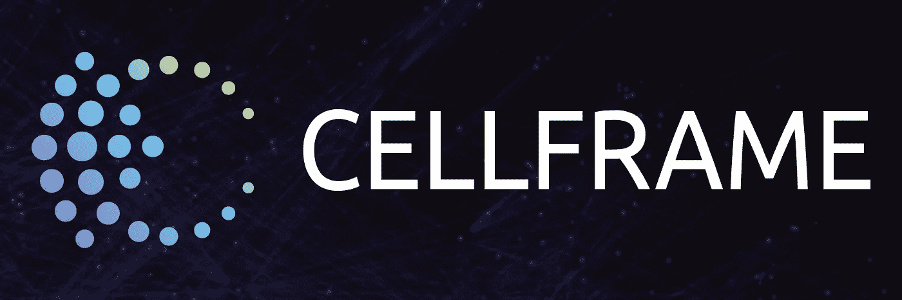
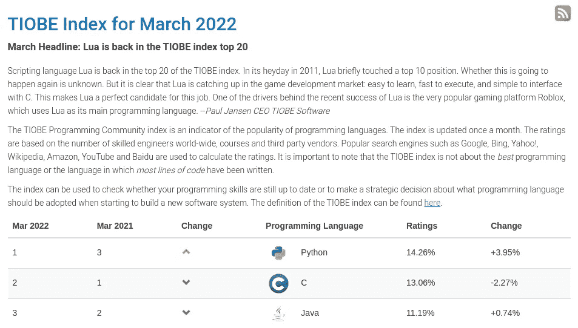
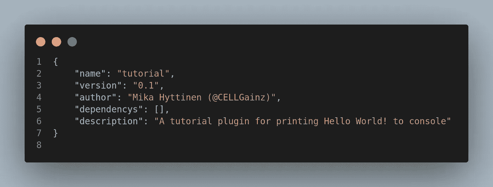
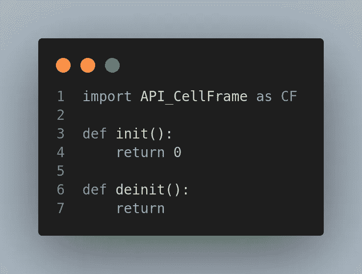
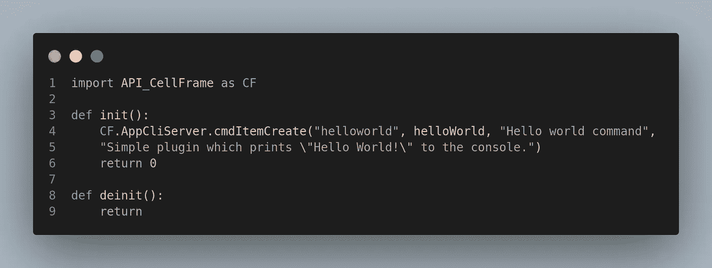
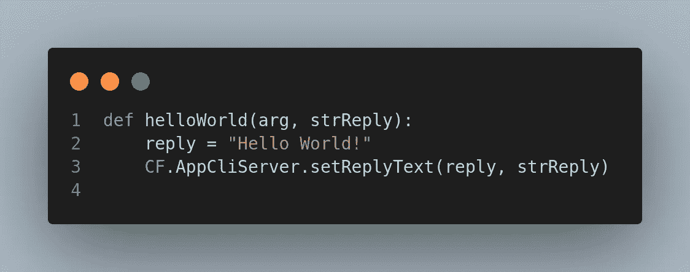
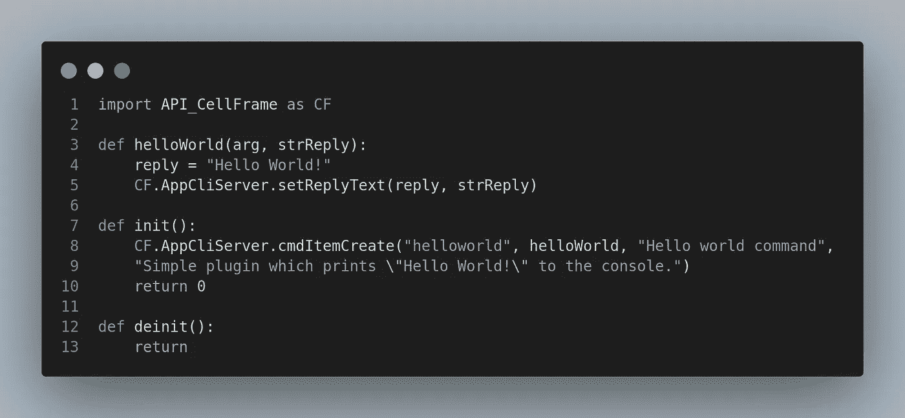
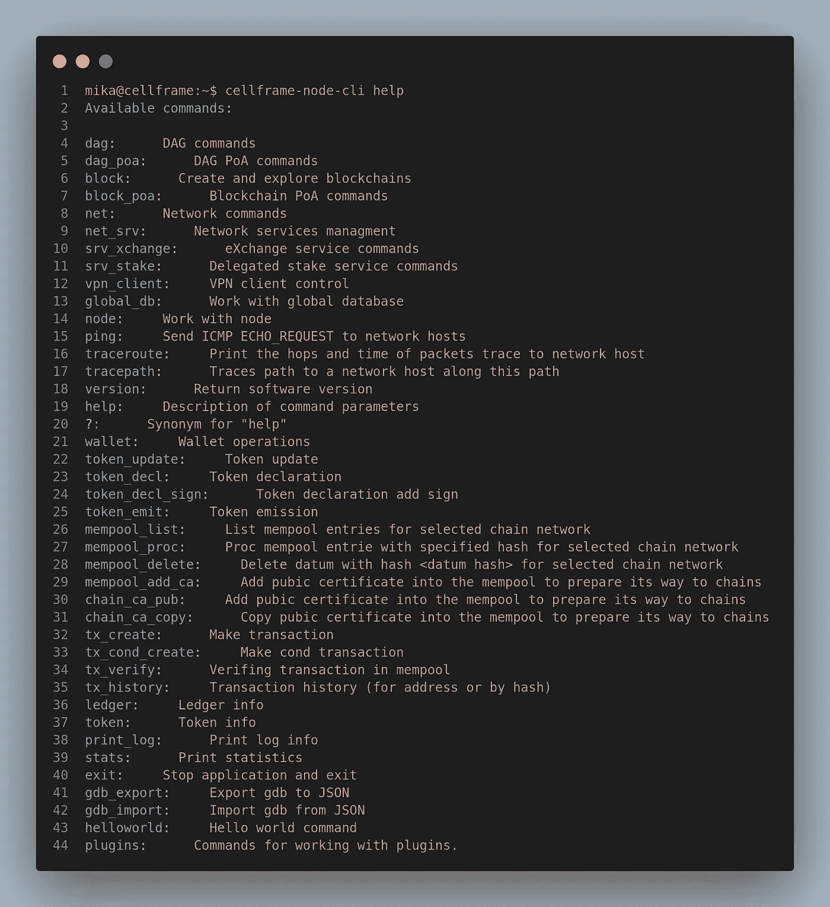

# 深入 Cellframe: Python SDK & Plugins pt。一

> 原文：<https://medium.com/coinmonks/diving-deeper-into-cellframe-python-sdk-plugins-pt-1-12eb7715d94b?source=collection_archive---------8----------------------->



随着 Cellframe 从投资者和开发者那里获得了一些吸引力(这是它应得的！)，我想写一些关于它的强大的 [Python SDK](https://wiki.cellframe.net/en/python) 。

如果我的一些读者还不知道这一点， [Cellframe](https://cellframe.net) 是第三代区块链平台，允许您使用其 SDK 创建区块链服务/解决方案。Cellframe 还包含一些有趣的核心特性:

*   两级分片
*   后量子密码术(来自 [NIST PQC 第三轮提交](https://csrc.nist.gov/Projects/post-quantum-cryptography/round-3-submissions))
*   P2P 跨链运营

还有更多。

Cellframe 及其 Python SDK 允许您为 Cellframe 生态系统编写 dapp，或者实际上是 t-dapp(真正去中心化的应用)。它还允许您为 Cellframe 节点编写简单的插件。

## 为什么是 Python？



Tiobe index: Popularity of programming languages, March 2022\. [https://tiobe.com/tiobe-index](https://tiobe.com/tiobe-index/)

Cellframe 选择 Python 作为其 SDK 的默认语言可能有很多原因，但我将在这里给出我个人认为他们做出这一选择的几个原因:

1.  简单来说，Python 是世界上最流行的编程语言。
2.  Python 简单易学，易于使用，并且有大量现成的库可以用 Python 包安装程序来安装。
3.  由于 Cellframe 是用 C 编写的，将 Python 集成到基于 C 的软件中是一个可靠的选择。

## 用 Cellframe Python SDK 构建简单的插件


Welcome to the Matrix.

尽管我的背景并不完全是编程领域的，但我还是决定举一个 Cellframe Python SDK 用法的例子，因为我在 Bash、PHP、C++、Javascript(和 HTML)等语言方面还是有一些经验的😆).

首先你要安装 Cellframe Python SDK。最简单的方法就是安装 Cellframe 节点。如果你有 Raspberry Pi 3/4 版本，你可以[使用我的 Raspberry Pi 教程](/coinmonks/running-your-own-cellframe-node-on-raspberry-pi-2-3-4-400-the-easy-way-c0b7cfc3dfd8)来安装你的节点。在那篇特别的教程中，我还解释了如何正确地让 Cellframe 节点加载插件，因为你需要在加载插件之前编辑配置文件。

如果您正在运行 Windows，您可以安装 Cellframe Dashboard，因为它内置了 Cellframe 节点。Windows 中配置文件的路径为**% system drive % \ Users \ Public \ Documents \ cell frame-node \ etc**

## 了解插件文件和文件夹的结构

如果你读过我之前的教程，插件的默认路径是`/opt/cellframe-node/var/lib/plugins`。默认情况下，该路径中缺少特定的目录，所以您可以自己创建目录`plugins`。

当你创建了插件目录后，是时候在插件中创建另一个目录了。在这个例子中，我们使用的是`tutorial`。

现在在`tutorial`里面，你需要有两个文件。一个文件是插件本身(在这个例子中我们将使用`tutorial.py`)，第二个文件是`manifest.json`。这是创建所有必要文件后的当前目录和文件结构:

```
├── plugins
│   └── tutorial
│       ├── manifest.json
│       └── tutorial.py
```

现在，使用`manifest.json`，您可以指定关于您的插件的基本元数据，比如名称、版本和描述。你也可以声明当前插件是否依赖于其他插件。典型的`manifest.json`看起来像这样:



Typical manifest.json file

> `*name*`、`*version*`、`*author*`和`*description*`键必须有一个字符串值。`*name*`值必须与插件名和目录名匹配。`*version*`和`*author*`值指定插件版本和插件作者。`*dependencys*`键必须有一个数组值，其中包含带有插件名称的字符串。如果指定的插件没有安装，那么这个插件将不会启动。`*description*`值指定了插件的简短描述。来源:https://wiki.cellframe.net/en/python/plugins[注:Dependencys 拼错了。应该会在以后的版本中修复。](https://wiki.cellframe.net/en/python/plugins)

`tutorial.py`(或者你想叫它什么)是当你启动 Cellframe 节点时运行的插件。Cellframe 节点插件的框架如下所示:



Typical Python plugin skeleton file.

启动节点服务时，会调用每个插件的 python 脚本的`init`函数。停止节点服务时，会调用`deinit`函数。

## 让我们创建一个简单的插件！

让我们以一句简单的“你好，世界！”外挂教程。

Cellframe Python SDK 允许您添加自己的命令，您可以使用`cellframe-node-cli`工具执行这些命令。

首先，我们需要研究所有这些是如何工作的，并查看他们的 [Wiki](https://wiki.cellframe.net/en/python/app_cli_server) 中的`AppCliServer.cmdItemCreate()`和`AppCliServer.setReplyText()`方法

***cmdItemCreate()方法有 4 个参数:***

```
name: Name of the command
callbackFunction: Runs a function when command is called
doc: Short description of the command
docEx: Long description of the command
```

***setReplyText()方法有两个参数:***

```
replyText: String that is returned when command is called
idStrReply: must be a parameter idStrReply passed to the callback function.
```

因此，在我们将它添加到插件后，它应该看起来像这样:



Adding cmdItemCreate()

由于第二个参数是 handler 函数，我们需要向插件添加一个函数，当您运行 helloworld -command 时会调用该函数:



Added the function helloWorld.

添加之后，完成的插件看起来像这样:



Finished plugin!

如果你还没有把插件放在你的插件文件夹里，你现在可以把它移到那里。之后，只需重启你的节点，启动你的终端/Powershell 等。并键入`cellframe-node-cli help`，您应该能够在命令列表中看到我们的 helloworld 命令:



Second from the bottom, our helloworld command!

所以要使用这个命令，只需输入`cellframe-node-cli helloworld`和:


Voilà!

所以你有它。你的 Cellframe 节点的第一个简单插件！

## 下一步是什么？

在下一篇文章中，我们将回到我们的节点安装系列，这一次我们将涵盖窗口(不同类型的安装，建议等。).

当我回到 SDK 的时候，我们将会开发一些更高级、更严肃的东西😉。

## 有问题吗？推荐？

如果你想在 Cellframe 上构建一些东西，加入他们的开发[电报频道](https://t.me/cellframe_dev_en)！

你也可以在推特上或者电报上联系我。
我的 [github](https://github.com/CELLgainz/Cellframe/tree/main/cellframe-plugins/medium_tutorial) 上也有这个教程的来源。

感谢您的阅读！

> 加入 Coinmonks [电报频道](https://t.me/coincodecap)和 [Youtube 频道](https://www.youtube.com/c/coinmonks/videos)了解加密交易和投资

# 另外，阅读

*   [Bookmap 点评](https://coincodecap.com/bookmap-review-2021-best-trading-software) | [美国 5 大最佳加密交易所](https://coincodecap.com/crypto-exchange-usa)
*   最佳加密[硬件钱包](/coinmonks/hardware-wallets-dfa1211730c6) | [Bitbns 评论](/coinmonks/bitbns-review-38256a07e161)
*   [新加坡十大最佳加密交易所](https://coincodecap.com/crypto-exchange-in-singapore) | [购买 AXS](https://coincodecap.com/buy-axs-token)
*   [红狗赌场评论](https://coincodecap.com/red-dog-casino-review) | [Swyftx 评论](https://coincodecap.com/swyftx-review) | [CoinGate 评论](https://coincodecap.com/coingate-review)
*   [投资印度的最佳密码](https://coincodecap.com/best-crypto-to-invest-in-india-in-2021)|[WazirX P2P](https://coincodecap.com/wazirx-p2p)|[Hi Dollar Review](https://coincodecap.com/hi-dollar-review)
*   [加拿大最佳加密交易机器人](https://coincodecap.com/5-best-crypto-trading-bots-in-canada) | [库币评论](https://coincodecap.com/kucoin-review)