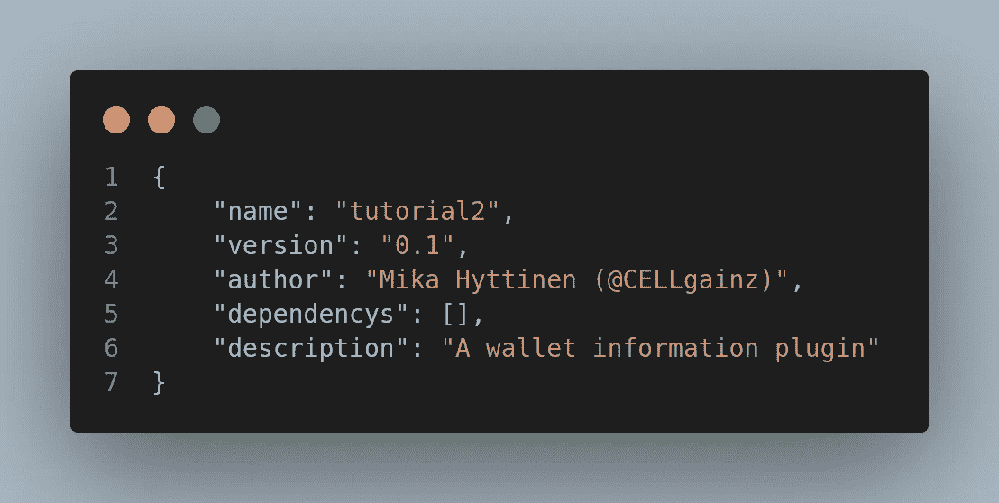
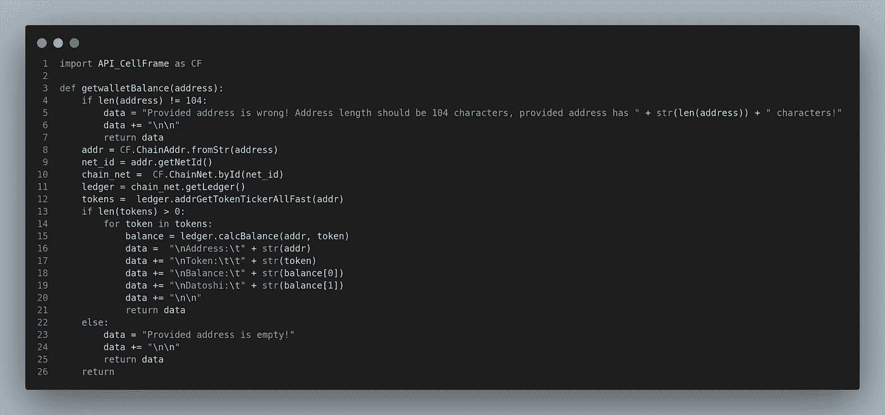
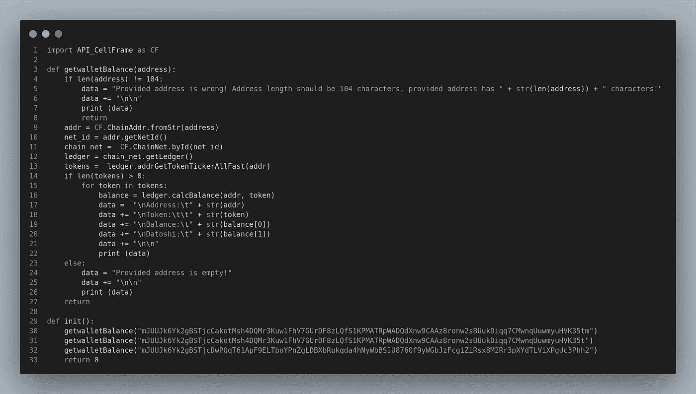
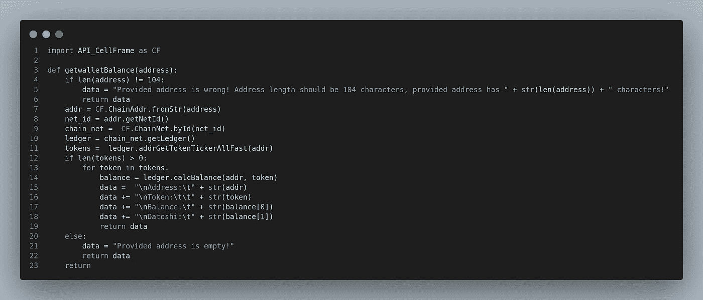
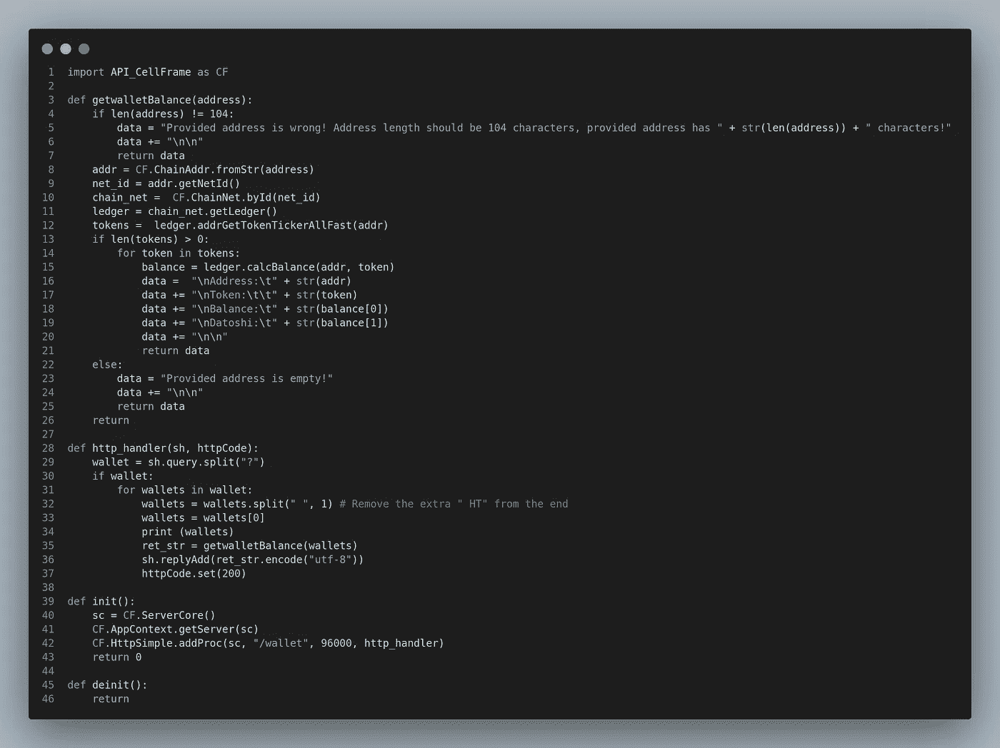

# 深入 Cellframe: Python SDK & Plugins pt。2

> 原文：<https://medium.com/coinmonks/diving-deeper-into-cellframe-python-sdk-plugins-pt-2-b809b4f5591f?source=collection_archive---------17----------------------->


嗨，又是我！

在本文中，我们将为 Cellframe 节点创建另一个简单的插件。老实说，我必须想一想什么类型的插件会很棒，所以我决定做一些事情来显示一些来自钱包的数据。

随着 Cellframe mainnet 现在(即将)发布，对于未来的节点所有者来说，不时检查一下他们的钱包可能会很有用。

我知道，我知道，Cellframe node 有一个命令行工具可以检查你的钱包。我甚至创建了一个小的 Python 脚本来通过电报机器人获取你的钱包信息。

但是这次让我们以不同的方式来做，我们将严格使用 Cellframe Python API 来实现这一点。我们会在您的网络浏览器上整齐地显示它，因此无需对您使用 SSH。

我们走吧！

## 关于单元格框架

[Cellframe](https://cellframe.net/) 是一个雄心勃勃的第三代区块链项目，很少有人(包括我)已经开始谈论它是下一个波尔卡多特或草间弥生。

然而，这个项目更加面向服务，并且与 Polkadot/Kusama 相比具有一些优势(例如，后量子加密、2 级分片、P2P 跨链操作)。

Cellframe 是用 C 写的(这会让它更快)，目前它有一个 C 和 Python 的 SDK。将来会有更多受支持的语言出现。

我真的推荐访问他们的网站(【https://cellframe.net】T4)并阅读他们的白皮书！

## 1.创建 manifest.json 和 Python 文件

所以你可能已经读过我的第一篇教程[如何为 Cellframe 节点创建一个简单的插件](/coinmonks/diving-deeper-into-cellframe-python-sdk-plugins-pt-1-12eb7715d94b)。如果您还没有，您应该查看这篇文章，看看插件文件/目录结构应该如何实现。

在本教程中，我们将使用这种类型的 manifest.json:



Good enough!

因此，我们还有一个名为`tutorial2`的目录和一个名为`tutorial2.py`的 Python 脚本，目录/文件结构如下所示:

```
└── tutorial2
    ├── manifest.json
    └── tutorial2.py
```

## 2.开始编码 tutorial2.py 文件

幸运的是 Cellframe gitlab 有一些示例插件([这里](https://gitlab.demlabs.net/cellframe/python-cellframe/-/tree/master/dists/examples/plugins)和[这里](https://gitlab.demlabs.net/cellframe/cellframe-node-plugin-explorer))，它们可能会给你一些关于如何从特定钱包中获取一些数据的线索。

他们的[维基页面](https://wiki.cellframe.net/en/home)也有很多资源供你探索。或者你有什么地方理解起来有困难，可以去看看他们的[电报开发频道！](https://t.me/cellframe_dev_en)

所以经过一些研究和测试，我想到了这个:



我们创建了一个函数`getwalletBalance()`，它将`address`作为输入字符串。

我试着让事情尽可能简单。首先，我们通过检查地址的长度来检查地址是否有效。应该是(AFAIK)始终 104 个字符。

```
addr = CF.ChainAddr.fromStr(address)
Converts our address to ChainAddr object.net_id = addr.getNetId()
Gets our NetID with our wallet addresschain_net =  CF.ChainNet.byId(net_id)
Gets ChainNet with our NetIDledger = chain_net.getLedger()
Gets ledger from our chaintokens =  ledger.addrGetTokenTickerAllFast(addr)
Gets all token tickers available in that ledger with provided address.
```

之后，我们循环遍历可用的令牌，并将数据转换成字符串后打印到我们的终端。如果没有可用的令牌，那么提供的地址是空的，我们把它打印到我们的终端上。很简单，对吧？(对，对！)

那么是时候测试一下了。我们将把`init`函数插入到我们的插件中，并用地址调用我们的函数:



我正在测试一个包含 tCELLs 的地址，一个是无效地址，另一个是我自己的地址，其中没有任何令牌。

然后，当我们用`/opt/cellframe-node/bin/cellframe-node`手动启动 Cellframe 节点时，我们应该会在终端中看到类似这样的内容。

```
Address:mJUUJk6Yk2gBSTjcCakotMsh4DQMr3Kuw1FhV7GUrDF8zLQfS1KPMATRpWADQdXnw9CAAz8ronw2sBUukDiqq7CMwnqUuwmyuHVK35tm
Token:          tCELL
Balance:        100.000000000
Datoshi:        100000000000Provided address is wrong! Address length should be 104 characters, provided address has 103 characters!Provided address is empty!
```

成功！现在我们需要稍微修改一下`getwalletBalance()`函数，因为我们不希望它将数据打印到控制台。我们希望它返回数据。所以修改后，应该是这样的:



Cellframe 节点有一个内置的 HTTP 服务器，所以让我们使用它在 web 浏览器上显示数据。我们需要添加一个进程`HttpSimple`到`init()` 函数，以及处理来自 web 浏览器的请求的处理函数。

修改后，文件的这一部分应该如下所示:


我在查询中使用`?`作为分隔符。使用时可以同时勾选多个钱包。

我还添加了一些日志，当有人从网络浏览器查询钱包地址时，这些日志会显示在日志中。

现在让我们看看整个插件文件，并用它实际运行一些测试！



Full plugin, ready to be tested.

好了，让我们用 curl 来测试一下(如果你愿意，可以用网页浏览器)。记得将您的 IP 地址更改为正确的主机！

```
mika@cellframe:~$ curl [http://192.168.1.10:8079/wallet?mJUUJk6Yk2gBSTjcCakotMsh4DQMr3Kuw1FhV7GUrDF8zLQfS1KPMATRpWADQdXnw9CAAz8ronw2sBUukDiqq7CMwnqUuwmyuHVK35tm](http://192.168.1.10:8079/wallet?mJUUJk6Yk2gBSTjcCakotMsh4DQMr3Kuw1FhV7GUrDF8zLQfS1KPMATRpWADQdXnw9CAAz8ronw2sBUukDiqq7CMwnqUuwmyuHVK35tm)Address: mJUUJk6Yk2gBSTjcCakotMsh4DQMr3Kuw1FhV7GUrDF8zLQfS1KPMATRpWADQdXnw9CAAz8ronw2sBUukDiqq7CMwnqUuwmyuHVK35tm
Token:  tCELL
Balance: 100.000000000
Datoshi: 100000000000
```

有用！多地址怎么样？

```
mika@cellframe:~$ curl [http://192.168.1.10:8079/wallet?mJUUJk6Yk2gBSTjcCakotMsh4DQMr3Kuw1FhV7GUrDF8zLQfS1KPMATRpWADQdXnw9CAAz8ronw2sBUukDiqq7CMwnqUuwmyuHVK35tm?mJUUJk6Yk2gBSTjcCakotMsh4DQMr3Kuw1FhV7GUrDF8zLQfS1KPMATRpWADQdXnw9CAAz8ronw2sBUukDiqq7CMwnqUuwmyuHVK35tm?mJUUJk6Yk2gBSTjcCakotMsh4DQMr3Kuw1FhV7GUrDF8zLQfS1KPMATRpWADQdXnw9CAAz8ronw2sBUukDiqq7CMwnqUuwmyuHVK35tm](http://192.168.1.10:8079/wallet?mJUUJk6Yk2gBSTjcCakotMsh4DQMr3Kuw1FhV7GUrDF8zLQfS1KPMATRpWADQdXnw9CAAz8ronw2sBUukDiqq7CMwnqUuwmyuHVK35tm?mJUUJk6Yk2gBSTjcCakotMsh4DQMr3Kuw1FhV7GUrDF8zLQfS1KPMATRpWADQdXnw9CAAz8ronw2sBUukDiqq7CMwnqUuwmyuHVK35tm?mJUUJk6Yk2gBSTjcCakotMsh4DQMr3Kuw1FhV7GUrDF8zLQfS1KPMATRpWADQdXnw9CAAz8ronw2sBUukDiqq7CMwnqUuwmyuHVK35tm)Address: mJUUJk6Yk2gBSTjcCakotMsh4DQMr3Kuw1FhV7GUrDF8zLQfS1KPMATRpWADQdXnw9CAAz8ronw2sBUukDiqq7CMwnqUuwmyuHVK35tm
Token:  tCELL
Balance: 100.000000000
Datoshi: 100000000000Address: mJUUJk6Yk2gBSTjcCakotMsh4DQMr3Kuw1FhV7GUrDF8zLQfS1KPMATRpWADQdXnw9CAAz8ronw2sBUukDiqq7CMwnqUuwmyuHVK35tm
Token:  tCELL
Balance: 100.000000000
Datoshi: 100000000000Address: mJUUJk6Yk2gBSTjcCakotMsh4DQMr3Kuw1FhV7GUrDF8zLQfS1KPMATRpWADQdXnw9CAAz8ronw2sBUukDiqq7CMwnqUuwmyuHVK35tm
Token:  tCELL
Balance: 100.000000000
Datoshi: 100000000000
```

我在这里使用相同的钱包地址进行所有的查询。让我们稍微改变一下，添加一个错误的和空的钱包:

```
curl [http://192.168.1.10:8079/wallet?mJUUJk6Yk2gBSTjcCakotMsh4DQMr3Kuw1FhV7GUrDF8zLQfS1KPMATRpWADQdXnw9CAAz8ronw2sBUukDiqq7CMwnqUuwmyuHVK35tm?mJUUJk6Yk2gBSTjcDwPQqT61ApF9ELT?mJUUJk6Yk2gBSTjcDwPQqT61ApF9ELTboYPnZgLDBXbRukqda4hNyWbBSJU876Qf9yWGbJzFcgiZiRsx8M2Rr3pXYdTLViXPgUc3Phh2](http://192.168.1.10:8079/wallet?mJUUJk6Yk2gBSTjcCakotMsh4DQMr3Kuw1FhV7GUrDF8zLQfS1KPMATRpWADQdXnw9CAAz8ronw2sBUukDiqq7CMwnqUuwmyuHVK35tm?mJUUJk6Yk2gBSTjcDwPQqT61ApF9ELT?mJUUJk6Yk2gBSTjcDwPQqT61ApF9ELTboYPnZgLDBXbRukqda4hNyWbBSJU876Qf9yWGbJzFcgiZiRsx8M2Rr3pXYdTLViXPgUc3Phh2)Address: mJUUJk6Yk2gBSTjcCakotMsh4DQMr3Kuw1FhV7GUrDF8zLQfS1KPMATRpWADQdXnw9CAAz8ronw2sBUukDiqq7CMwnqUuwmyuHVK35tm
Token:  tCELL
Balance: 100.000000000
Datoshi: 100000000000Provided address is wrong! Address length should be 104 characters, provided address has 31 characters!Provided address is empty!
```

在日志中:

```
[04/07/22-16:05:00] [ * ] [libdap-python] Getting wallet info for mJUUJk6Yk2gBSTjcCakotMsh4DQMr3Kuw1FhV7GUrDF8zLQfS1KPMATRpWADQdXnw9CAAz8ronw2sBUukDiqq7CMwnqUuwmyuHVK35tm
[04/07/22-16:05:00] [ * ] [libdap-python] Getting wallet info for mJUUJk6Yk2gBSTjcDwPQqT61ApF9ELT
[04/07/22-16:05:00] [ * ] [libdap-python] Getting wallet info for mJUUJk6Yk2gBSTjcDwPQqT61ApF9ELTboYPnZgLDBXbRukqda4hNyWbBSJU876Qf9yWGbJzFcgiZiRsx8M2Rr3pXYdTLViXPgUc3Phh2
```

成功！

## 结论

我不认为自己是一个专业的程序员，我的专长是硬件和网络问题😉。

也就是说，我真的希望看到真正的程序员探索 SDK，构建不同的插件和 t-dapp。Cellframe SDK 超级强大，使用起来很有趣！

如果您感兴趣，还可以运行一个节点！

您可以找到本教程的源代码@[https://github . com/CELLgainz/cell frame/tree/main/cell frame-plugins/tutoria L2](https://github.com/CELLgainz/Cellframe/tree/main/cellframe-plugins/tutorial2)

**注意:我也做了一个 5.1 API 的版本，可以和新版本的 Cellframe 节点一起工作。来源在这里:**[https://github . com/CELLgainz/cell frame/tree/main/cell frame-plugins/tutorial 2 _ 5.1](https://github.com/CELLgainz/Cellframe/tree/main/cellframe-plugins/tutorial2_5.1)

**如果你对区块链的未来有兴趣，加入他们的发展电报频道:**[**【https://t.me/cellframe_dev_en**](https://t.me/cellframe_dev_en)

您也可以联系我:

**电报:** @CELLgainz

推特: @CELLgainz

感谢您的阅读！

> *加入 Coinmonks* [*电报频道*](https://t.me/coincodecap) *和* [*Youtube 频道*](https://www.youtube.com/c/coinmonks/videos) *了解加密交易和投资*

# 另外，阅读

*   [有哪些交易信号？](https://coincodecap.com/trading-signal) | [Bitstamp vs 比特币基地](https://coincodecap.com/bitstamp-coinbase) | [买索拉纳](https://coincodecap.com/buy-solana)
*   [ProfitFarmers 回顾](https://coincodecap.com/profitfarmers-review) | [如何使用 Cornix Trading Bot](https://coincodecap.com/cornix-trading-bot)
*   [十大最佳加密货币博客](https://coincodecap.com/best-cryptocurrency-blogs) | [YouHodler 评论](https://coincodecap.com/youhodler-review)
*   [my constant Review](https://coincodecap.com/myconstant-review)|[8 款最佳摇摆交易机器人](https://coincodecap.com/best-swing-trading-bots)
*   [MXC 交易所评论](/coinmonks/mxc-exchange-review-3af0ec1cba8c) | [Pionex vs 币安](https://coincodecap.com/pionex-vs-binance) | [Pionex 套利机器人](https://coincodecap.com/pionex-arbitrage-bot)