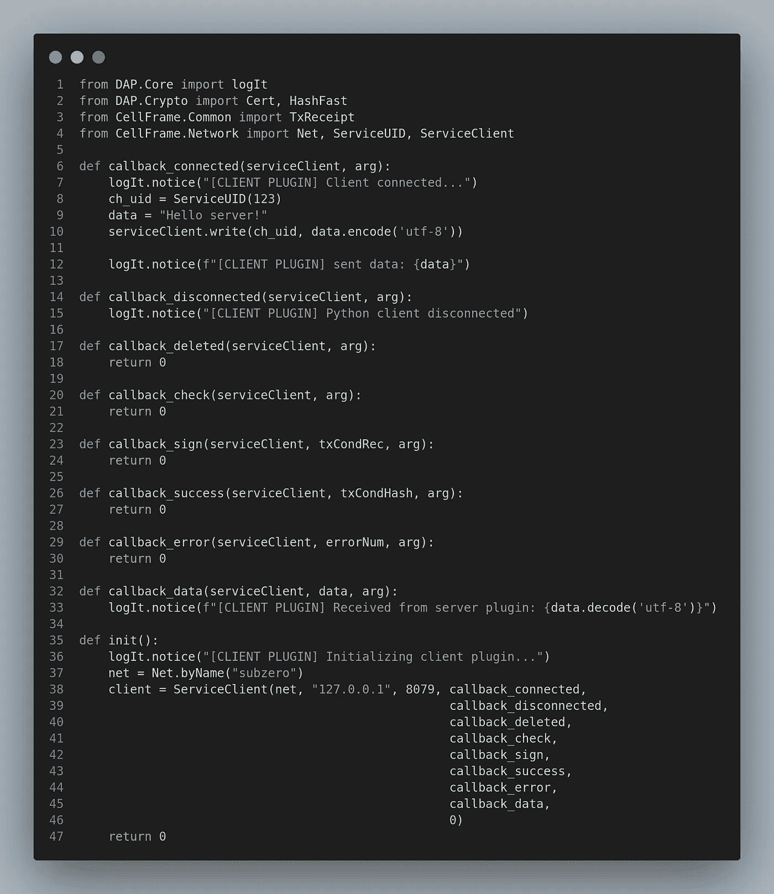
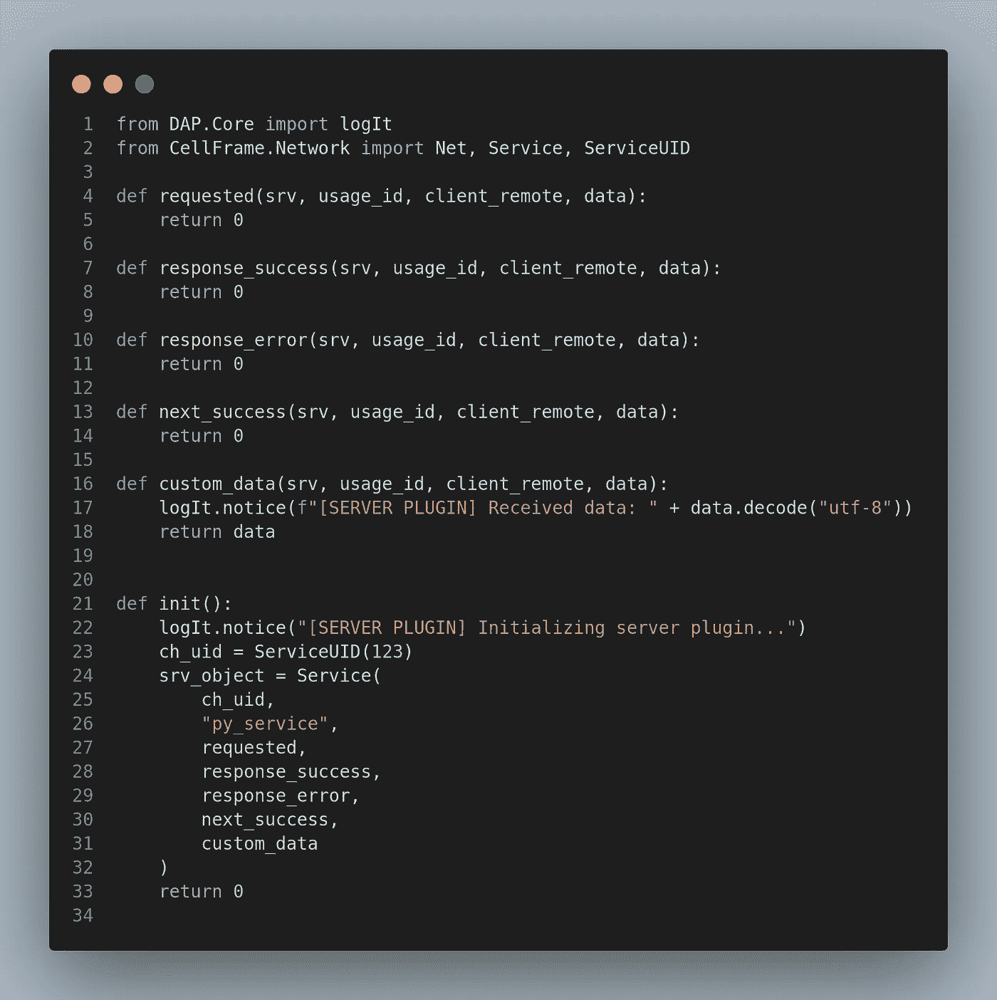
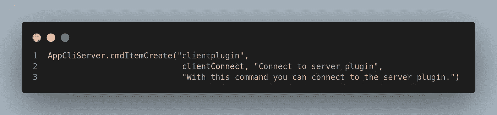
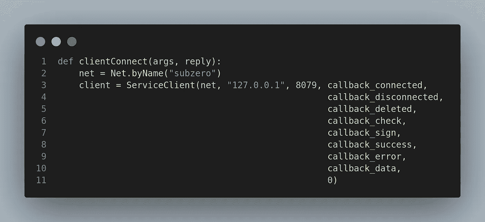
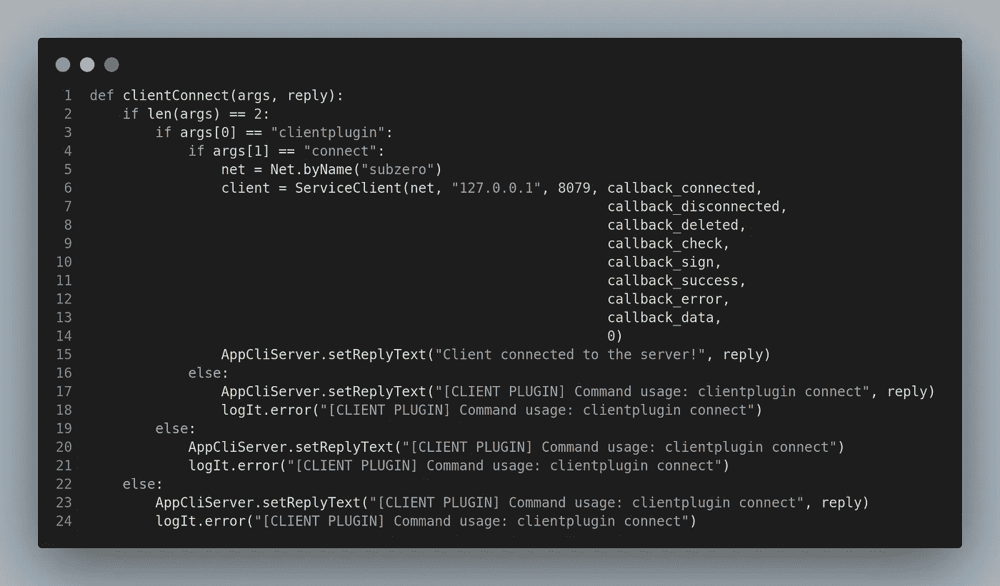
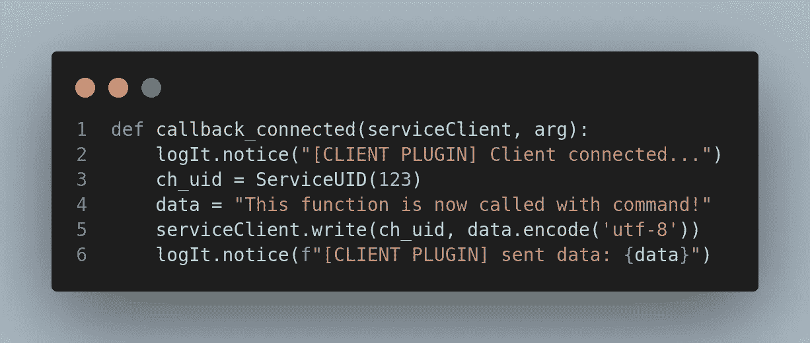
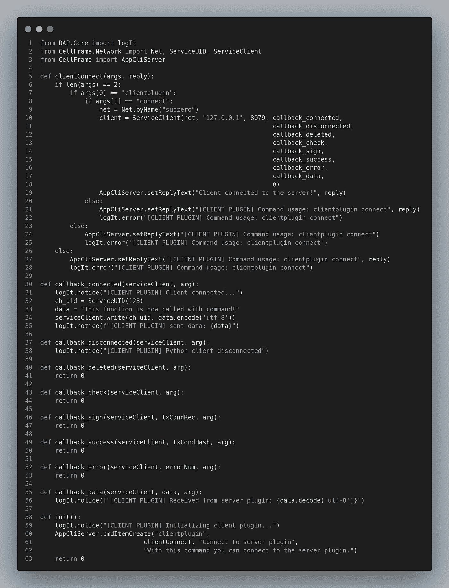
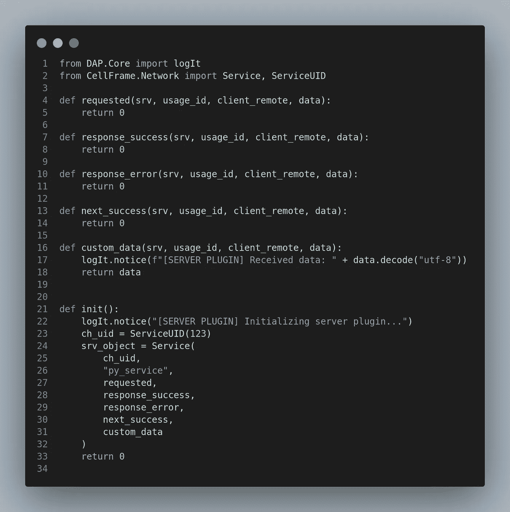

# 深入 Cellframe: Python SDK & Plugins pt。3

> 原文：<https://medium.com/coinmonks/diving-deeper-into-cellframe-python-sdk-plugins-pt-3-857fda7f8e7e?source=collection_archive---------10----------------------->


好了，伙计们，又到了“让我们在 Cellframe Python SDK 上做一些实验测试”的时候了。

你可能看过我的关于 t-dApps for Cellframe 生态系统的文章，所以在这篇文章中，我们将看看 Cellframe 节点的服务器端和客户端插件。

客户端和服务器插件可以以多种不同的方式使用。例如，您可以根据不同的条件从服务器端向用户提供一些数据(例如，钱包中的令牌数量、付费订阅等。)

顺便说一下，在 [Cellframe Gitlab](https://gitlab.demlabs.net/cellframe/python-cellframe/-/tree/master/dists/examples/plugins) 有一些关于客户端和服务器插件的例子，所以我们将把它们作为我们测试的基础。

我们走吧！

## 关于单元格框架

Cellframe 是一个雄心勃勃的第三代区块链项目，很少有人(包括我)已经开始谈论它是下一个波尔卡多特或草间弥生。

然而，这个项目更加面向服务，并且与 Polkadot/Kusama 相比具有一些优势(例如，后量子加密、2 级分片、P2P 跨链操作)。

Cellframe 是用 C 写的(这将使它快速和可移植)，目前它有一个 C 和 Python 的 SDK。将来会有更多受支持的语言出现。

我真的推荐访问他们的网站([https://cellframe.net](https://cellframe.net/))并阅读他们的白皮书！

## 客户端到服务器的连接

所以我们先来看看客户端插件。客户端插件可以以多种不同的方式用于建立到服务器端插件的连接，但是在这个例子中，我在本地 Cellframe 节点安装上运行所有的东西。



我添加了一些基本的日志来查看当这个客户端插件连接到服务器插件时在幕后发生了什么。如果我们查看 Cellframe 节点的日志文件，应该会看到类似这样的内容:

```
[05/07/22-07:35:45] [ * ] [libdap-python] [CLIENT PLUGIN] Client connected...
[05/07/22-07:35:45] [ * ] [libdap-python] [CLIENT PLUGIN] sent data: Hello server!
```

现在，让我们看看服务器插件部分:



我目前只修改了这个插件文件中的`custom_data()`函数部分。当我们从客户端插件接收到一些数据时，就会调用`custom_data()`。

因此，在这两个插件运行后查看日志，我们会看到这样的内容:

```
[05/07/22-07:36:58] [ * ] [libdap-python] [CLIENT PLUGIN] Client connected...
[05/07/22-07:36:58] [ * ] [libdap-python] [CLIENT PLUGIN] sent data: Hello server!
[05/07/22-07:36:58] [ * ] [libdap-python] [SERVER PLUGIN] Received data: Hello server!
[05/07/22-07:36:58] [ * ] [libdap-python] [CLIENT PLUGIN] Received from server plugin: Hello server!
```

因此，这些插件之间的基本数据流正常工作。

## 添加更多功能

好了，现在当`init()`函数被调用时，连接正在工作，我们可以稍微修改一下插件，添加一个命令，允许我们用`cellframe-node-cli`命令行工具连接到服务器插件。

我们将简单地使用方法`AppCliServer.cmdItemCreate()`，就像我在我的[早期教程](/coinmonks/diving-deeper-into-cellframe-python-sdk-plugins-pt-1-12eb7715d94b)中对简单插件所做的那样:



Command clientplugin calls function clientConnect().

之后，我们将`ServiceClient`的初始化转移到我们已经创建的`clientConnect()`函数中:



Function which is called when cellframe-node-cli is used.

现在我们可以用`cellframe-node-cli clientplugin`测试客户端连接。在终端中使用该命令后，我们的日志应该会打印出与之前客户端连接到服务器时日志中打印的内容完全相同的内容。

使用这样的命令太简单了。让我们给`clientConnect()`函数添加几个检查来检查这个命令实际上是否有效:



Checks for command validity.

现在，当您使用命令`cellframe-node-cli clientplugin connect`时，它会创建一个`ServiceClient`实例并连接到服务器插件。

我还修改了`callback_connected()`日志记录，以通知用户该命令已被使用:



现在在日志上我们可以看到:

```
[05/07/22-10:36:04] [ * ] [libdap-python] [CLIENT PLUGIN] Client connected...
[05/07/22-10:36:04] [ * ] [libdap-python] [CLIENT PLUGIN] sent data: This function is now called with command!
[05/07/22-10:36:04] [ * ] [libdap-python] [SERVER PLUGIN] Received data: This function is now called with command!
[05/07/22-10:36:04] [ * ] [libdap-python] [CLIENT PLUGIN] Received from server plugin: This function is now called with command!
```

而当我们使用命令`cellframe-node-cli clientplugin connect`时:

```
mika@cellframe:~$ cellframe-node-cli clientplugin connect
Client connected to the server!
```

正如我们所看到的，它应该是有效的。

经过一点清理后，这是两者的最终代码:

**客户端部分:**



**服务器部分:**



## 结论

在这一点上，我所能说的是，这篇文章只是皮毛。

借助 Cellframe 生态系统内置的强大 SDK，您可以做数百万件事情。你可以编写完整的程序来做在常规智能合同上不可能做的事情。

一旦我更好地理解了事情实际上是如何工作的，我将在这个平台上越来越深入。

顺便说一下，我希望我们很快也能看到一些 Cellframe 仪表板扩展的文档:Cellframe 生态系统的超级应用程序。

**既然这将是一个完全不同的系列文章，那么……**

## 有问题吗？推荐？

如果你想在区块链的未来上有所建树，加入他们的发展[电报频道](https://t.me/cellframe_dev_en)！

你也可以通过推特[或](https://twitter.com/CellGainz)[电报](https://t.me/CELLgainz)联系我。我的 github 上也有这个教程的资源。

感谢您的阅读！

非常感谢我所有的推特粉丝鼓励我写更多的文章！

> 加入 Coinmonks [电报频道](https://t.me/coincodecap)和 [Youtube 频道](https://www.youtube.com/c/coinmonks/videos)了解加密交易和投资

# 另外，阅读

*   [如何在 FTX 交易所交易期货](https://coincodecap.com/ftx-futures-trading) | [OKEx vs 币安](https://coincodecap.com/okex-vs-binance)
*   [OKEx vs KuCoin](https://coincodecap.com/okex-kucoin) | [摄氏替代品](https://coincodecap.com/celsius-alternatives) | [如何购买 VeChain](https://coincodecap.com/buy-vechain)
*   [ProfitFarmers 点评](https://coincodecap.com/profitfarmers-review) | [如何使用 Cornix Trading Bot](https://coincodecap.com/cornix-trading-bot)
*   [如何匿名购买比特币](https://coincodecap.com/buy-bitcoin-anonymously) | [比特币现金钱包](https://coincodecap.com/bitcoin-cash-wallets)
*   [瓦济里克斯 NFT 评论](https://coincodecap.com/wazirx-nft-review)|[Bitsgap vs Pionex](https://coincodecap.com/bitsgap-vs-pionex)|[Tangem 评论](https://coincodecap.com/tangem-wallet-review)