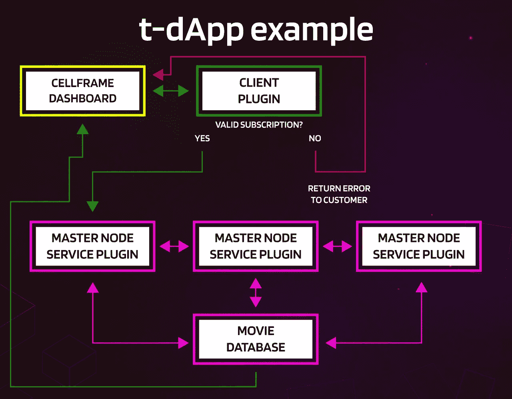

# 深入研究 Cellframe:(试图)解释 t-dApps

> 原文：<https://medium.com/coinmonks/diving-deeper-into-cellframe-trying-to-explain-t-dapps-baf5dd033f4a?source=collection_archive---------15----------------------->

各位，是时候了！t-dApps！

我认为开始讨论 Cellframe 生态系统是非常相关的，因为该项目正日益成熟，我认为很快我们将开始看到一些“真正的”t-dapp 流出。

在这篇文章中，我试图用通俗的语言解释 dApps 和 Cellframe 生态系统 t-dApps 之间的关键差异。

实际上，我甚至打算为 Cellframe 仪表板(它将是(或者已经是)管理您的钱包/节点 dApp 的关键元素之一)和 Cellframe 节点构建一个简单的 t-dApp。

不幸的是，我现在不得不跳过这一部分，因为(还)没有足够的关于仪表板扩展的文档。然而，当我们有了更好的文档后，我会再回到这个问题上来。

我们走吧！

## 关于单元格框架

Cellframe 是一个雄心勃勃的第三代区块链项目，很少有人(包括我)已经开始谈论它是下一个波尔卡多特或草间弥生。

然而，这个项目更加面向服务，并且与 Polkadot/Kusama 相比具有一些优势(例如，后量子加密、2 级分片、P2P 跨链操作)。

Cellframe 是用 C 写的(这将使它快速和可移植)，目前它有一个 C 和 Python 的 SDK。将来会有更多受支持的语言出现。

我真的推荐访问他们的网站(【https://cellframe.net】T2)并阅读他们的白皮书！

## dApps 和 t-dApps 的主要区别是什么？

很多人可能会同意我的观点，当我们现在谈论 dApps 时，我们指的是运行在以太网上的智能合约。该 dApp 通常由对其拥有完全控制权的一个人(或几个人)拥有。

如果一个流氓出于某种原因在以太网中获得了你的私钥，你的资金很可能会被盗。

在 t-dApps 中，这是完全不同的。在 Cellframe 生态系统中，t-dApp 没有私钥，因为所提供的 t-dApp 严格在系统内部运行，并且不依赖任何类型的智能合约。

t-dApp 实际上可以被认为是一个服务器和一个客户端插件的组合(对于 Cellframe 节点)。

如果一个节点选择运行一个插件，它把所有的利润都收给自己(不包括网费和作者费)。

一个真正重要的优势是，在 Cellframe 生态系统中，您可以访问主机系统上的全部硬件资源。当然，有一些网络已经建立起来，直接绕过这些问题(文件共享，cpu 能力等)。)但是，如果您可以在一个生态系统中构建所有这些功能，会怎么样呢？

## 那你怎么建造一个 t-dApp 呢？

这是一个简单的 t-dApp 数据流的图像。

t-dApp 的后端是 Cellframe 节点的插件。插件将通过主节点分发。每个插件在发布前都会被检查，正因为如此，所有这些插件都需要开源。

每个选择运行这个插件的主节点在这样做的时候应该得到奖励。

上图中绿色线条按钮是亮/全节点。该特定节点预计运行在客户自己的服务插件上，该插件将提供用于连接到主节点插件的协议。

这个光节点显然不依赖于任何特定的主节点，它可以连接到它们中的任何一个(就像在网状网络中一样)。

这张图片中的黄线按钮是用户/客户端。例如，该客户端可以使用网站、Cellframe 仪表板扩展、基于控制台的应用程序等。用于连接到客户端插件，然后为用户提供服务。

你也可以为 Cellframe 主节点开发某种类型的“社交”插件，这将是对用户的免费服务。它可能是 Twitter / Telegram / Discord 的小费机器人，甚至是某种钱包跟踪机器人。

## 示例:视频流服务

这是一个视频流平台数据流的图像。(老实说，这真的很简单，但你可能可以通过这张图片了解基本情况😉).

首先，对客户端插件进行检查:如果服务订阅有效(例如，进行了支付)，则连接到主节点上的服务插件部分。

如果用户没有有效的订阅，则向客户返回一个错误。在此之后，用户可以支付订阅，然后返回到验证部分。

主节点运行后端插件，该插件也可以有一个 GlobalDB(全局数据库)集。该特定的数据库可以具有关于用户最喜欢的电影/系列的信息，可能是用于推荐的一些电影等。

在这个例子中，客户端插件只是检查订阅的有效性。如果订阅有效，你可以访问电影数据库，并选择你想看的电影(也许有些爆米花？).

## 结论

我真的认为很快我们就会看到一些真正的 t-dapp 流出。我不确定我们会看到哪种类型的应用程序，但大胆猜测是:高级。

顺便说一下，我真的认为写这篇文章是一件容易的事情。“哎，写篇文章就完了。”

我大错特错了😆。

实际上很难做出这种类型的文章，让每个人都能理解像这样的系统是如何工作的。如果您理解有困难，您可以随时通过电报或 Twitter (@CELLgainz)与我联系。

如果你想参与建设区块链的未来，你可以随时加入 [Cellframe 开发电报频道](https://t.me/cellframe_dev_en)。

感谢您的阅读！

> 加入 Coinmonks [电报频道](https://t.me/coincodecap)和 [Youtube 频道](https://www.youtube.com/c/coinmonks/videos)了解加密交易和投资

# 另外，阅读

*   [比特币基地跑马圈地](https://coincodecap.com/coinbase-staking) | [Hotbit 点评](/coinmonks/hotbit-review-cd5bec41dafb) | [KuCoin 点评](https://coincodecap.com/kucoin-review)
*   [购买 Dogecoin 的 7 种最佳方式](https://coincodecap.com/ways-to-buy-dogecoin) | [ZebPay 评论](https://coincodecap.com/zebpay-review)
*   [iTop VPN 审查](https://coincodecap.com/itop-vpn-review) | [曼陀罗交易所审查](https://coincodecap.com/mandala-exchange-review)
*   [比特币基地 vs 瓦济克斯](https://coincodecap.com/coinbase-vs-wazirx) | [比特鲁点评](https://coincodecap.com/bitrue-review) | [波洛涅克斯 vs 比特鲁](https://coincodecap.com/poloniex-vs-bittrex)
*   [美国最佳加密交易机器人](https://coincodecap.com/crypto-trading-bots-in-the-us) | [经常性回顾](https://coincodecap.com/changelly-review)