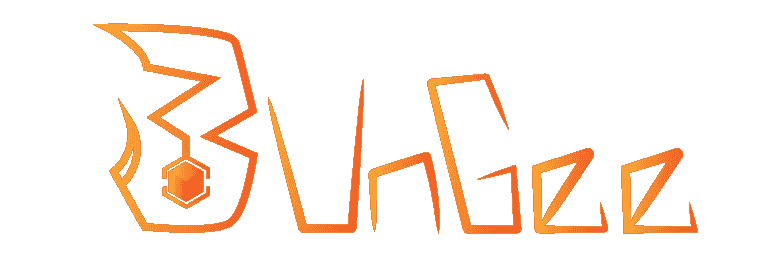
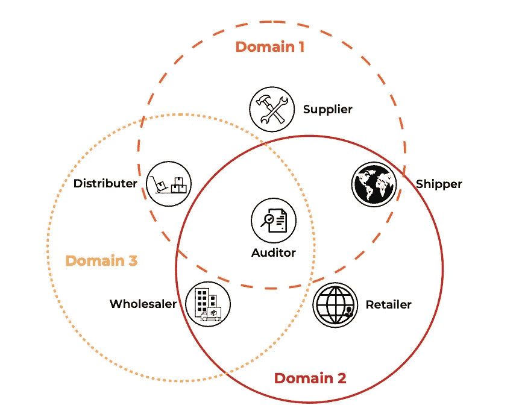
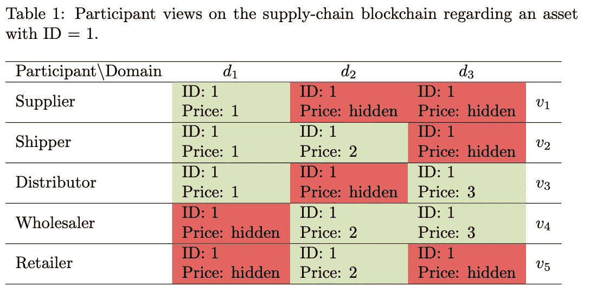
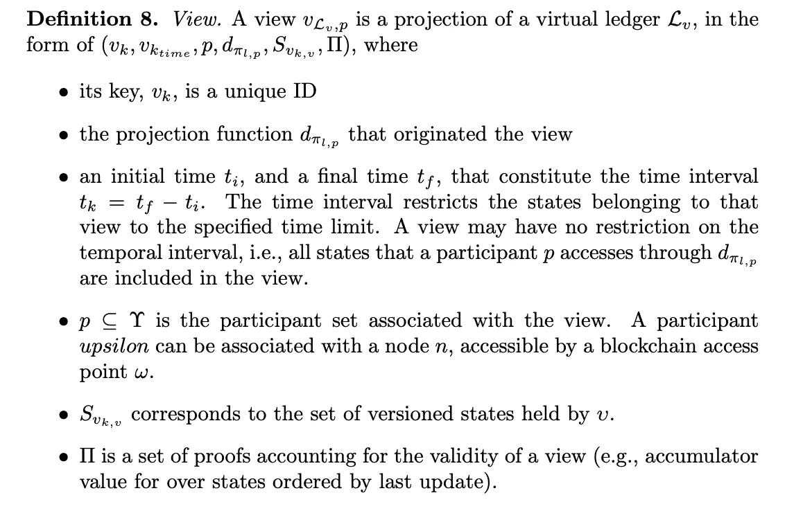
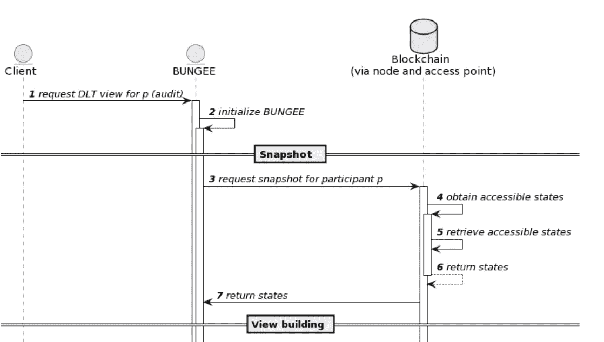
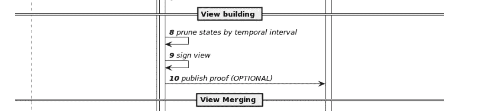
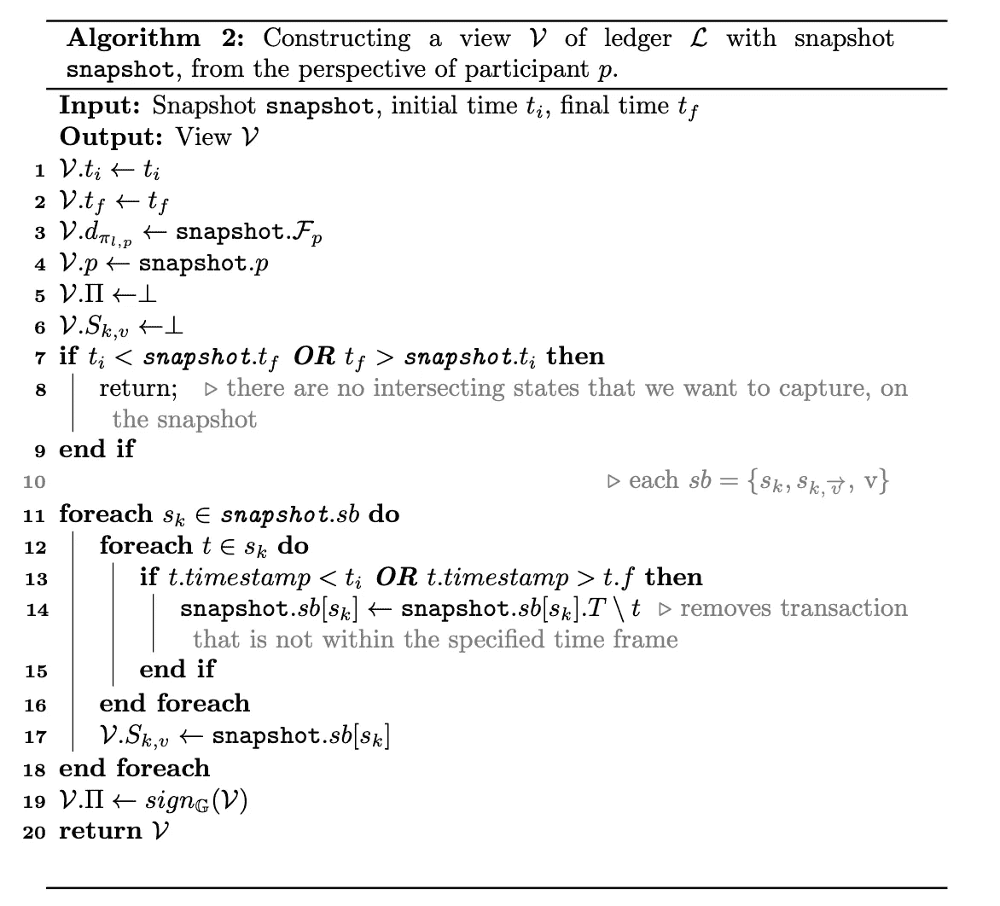
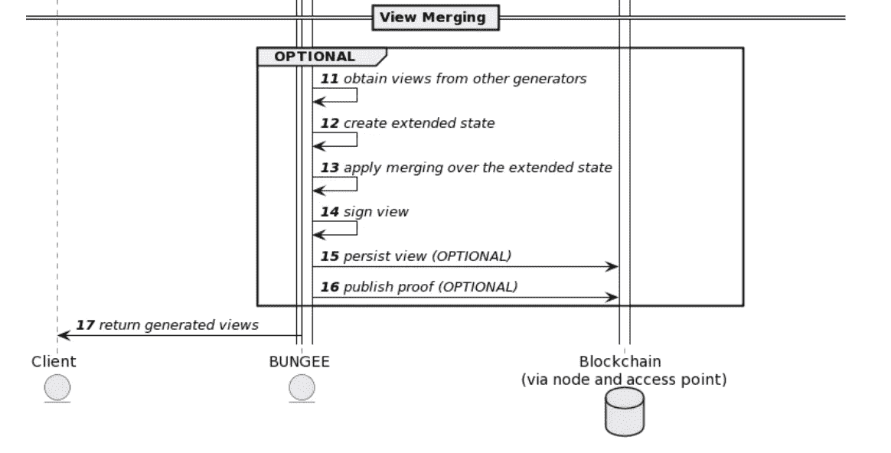
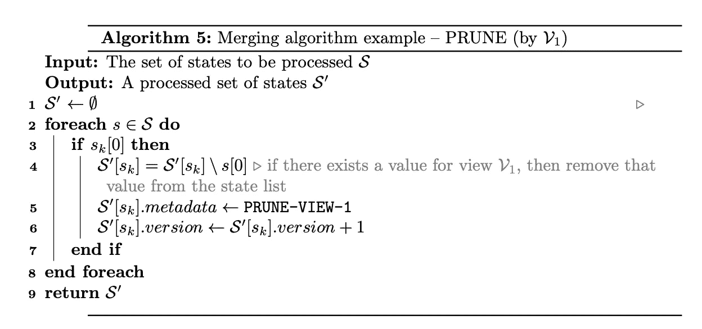

# DLT 互操作性和更多⛓️#6⛓️-特别版:蹦极一瞥

> 原文：<https://medium.com/coinmonks/dlt-interoperability-and-more-%EF%B8%8F-6-%EF%B8%8F-special-edition-a-peek-into-bungee-9d87d53dce8c?source=collection_archive---------53----------------------->

这是一个特别的版本，涵盖了我们的下一篇论文，蹦极的预览。

➡️:我的观点比你的好吗？与视图的区块链互操作性

➡️ **作者** : [拉斐尔·贝尔丘](https://www.techrxiv.org/authors/Rafael_Belchior/10174979)，利马里斯·托雷斯，乔纳斯·普法恩施密德，安德烈·瓦斯康塞洛斯，米盖尔·科雷亚

➡️ **来源:**[https://www . techrxiv . org/articles/preprint/is _ my _ perspective _ better _ than _ yours _ 区块链 _ inter operability _ with _ views/20025857](https://www.techrxiv.org/articles/preprint/Is_My_Perspective_Better_Than_Yours_Blockchain_Interoperability_with_Views/20025857)

在这一期，我们将解释什么是区块链观点，以及为什么它们很重要。

➡️ **背景:**

*   “一个问题自然会从多链生态系统中出现:由于参与者可能对链有不同的看法，从第三方区块链的角度来看，我们希望如何对链有一致的看法？”

这里有很多东西需要消化。一些区块链，即 private，提供部分一致性，以提供隐私保护功能。因此，其用户可能对同一分类账有不同的看法。在跨链方案中，即使分类帐 A 和 B 是公共的，A+B 的联合视图也不一定只有一个视图。区块链观点是允许我们对这种可组合性和异质性进行推理的人工制品。

*   创建和集成视图支持有趣的应用程序，例如以利益相关方为中心的审计快照、跨链分析、区块链迁移和数据分析

一个视图有多种应用。正如我们在论文中所述，

作为商业智能(例如，更好地理解某个协议)和审计(例如，监控协议)的工具，构建和分析视图对于准确理解每个时刻(包括在公共区块链[44])每个 DLT 的每个利益相关者的视图是重要的。视图直接支持区块链互操作性，因为现在跨异构 DLTs，42]共享所有参与者的观点更加容易，允许更好地表示业务生态系统。这可以实现跨区块链服务的复杂编排，并支持 DLT 互操作性的新研究领域，包括基于区块链网关的互操作性[11，8，13，26]。”

我们在论文的第 3.1 节提供了一个视图效用的实例。一座山峰:

source: our paper

在这个用例中，有多个不信任的实体对单个分类帐有不同的视图。审计员对分类账有一个全局的看法(域 1+2+3)。其他利益相关者被配对(例如，批发商和零售商分享对域 2 的看法)。

这个场景源自五个视图(加上审计员)，可以转化为以下内容:

➡️ **投稿:**

*   “本文介绍了 BUNGEE(区块链统一视图生成器)，第一个 DLT 视图生成器，允许捕捉 DLT 快照，构建视图，并对其执行任意操作，如集成视图。”

➡️ **什么是区块链观:**

我们在 3.2 节区块链视图集成框架中数学形式化了围绕区块链视图的所有概念。

形式上，一个

“DLT 视图对应于引用参与者可以访问的相同键的不同值的集合”，并且实际上是从快照创建的。根据涉众的观点，它基本上是分类帐的过滤(投影功能)快照，带有一组证据(例如，州内的验证者签名)。

➡️ **如何生成视图:**

我们提供了一个生成和合并视图的系统设计，我们称之为 BUNGEE。

首先，蹦极根据一个参与者创建了一个快照。

之后，视图被创建。虽然所有的细节都在论文中，但是我们指定了一个算法来构建一个视图:

或者，可以合并视图。有不同的方法来合并视图。其中一个介绍的是合并和修剪。合并视图是基于另一个概念，扩展状态。对于要合并的所有视图，扩展状态保存每个状态键的所有值。然后，我们迭代所有扩展状态，并应用定制算法，在本例中，修剪:

我们通过对关键问题的讨论来完成论文:

1.  视图提供完整性和责任保证吗？

2.有人能用区块链的观点来证明事实吗？

3.视图适合表示来自不同来源的链上数据吗？

我们相信这项工作为交叉链状态的更健壮的表示铺平了道路。

**🚀它与我们在 Técnico Lisboa、INESC-ID 和 Blockdaemon 的工作有何关系？(观点是我自己的，不一定反映我雇主的意见)**

*   实现安全、可扩展的互操作性是我们 Blockdaemon 工作的重要组成部分。研究表示交叉链状态的形式是推进当前知识的基本步骤。

🚀对我们的工作有什么启示？

*   给定一个高效的、标准化的跨链状态表示，跨链用例如跨链状态的可视化、区块链迁移和资产转移将被简化。

> 加入 Coinmonks [电报频道](https://t.me/coincodecap)和 [Youtube 频道](https://www.youtube.com/c/coinmonks/videos)了解加密交易和投资

# 另外，阅读

*   [氹欞侊贸易评论](https://coincodecap.com/anny-trade-review) | [火币保证金交易](/coinmonks/huobi-margin-trading-b3b06cdc1519)
*   [分散交易所](https://coincodecap.com/what-are-decentralized-exchanges) | [比特 FIP](https://coincodecap.com/bitbns-fip) | [Pionex 评论](https://coincodecap.com/pionex-review-exchange-with-crypto-trading-bot)
*   [用信用卡购买密码的 10 个最佳地点](https://coincodecap.com/buy-crypto-with-credit-card)
*   [最好的卡达诺钱包](https://coincodecap.com/best-cardano-wallets) | [Bingbon 副本交易](https://coincodecap.com/bingbon-copy-trading)
*   [印度最佳 P2P 加密交易所](https://coincodecap.com/p2p-crypto-exchanges-in-india) | [柴犬钱包](https://coincodecap.com/baby-shiba-inu-wallets)
*   [八大加密附属计划](https://coincodecap.com/crypto-affiliate-programs) | [eToro vs 比特币基地](https://coincodecap.com/etoro-vs-coinbase)