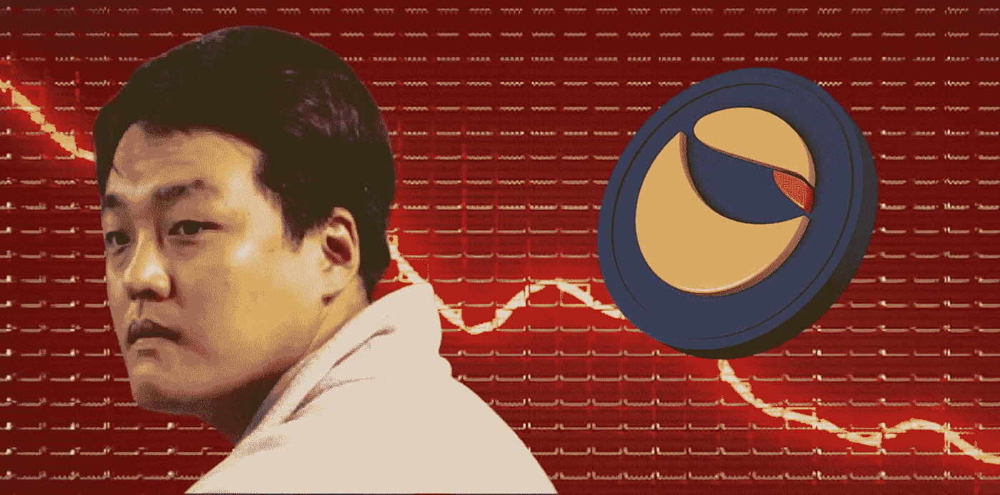

# 权道在证券诉讼中被指为韩国泰拉队

> 原文：<https://medium.com/coinmonks/do-kwon-named-in-securities-lawsuit-as-terra-team-held-in-south-korea-67389bb7c5ae?source=collection_archive---------50----------------------->

包括 Terraform Labs、Three Arrows Capital 和 Jump Crypto 在内的一系列加密公司，以及 Terra chief Do Kwon 都是最近提起的集体诉讼的目标，指控他们误导投资者，谎报代币的稳定性，并违反了联邦证券法。

伊利诺伊州投资者尼克·帕特森(Nick Patterson)在加州提起的诉讼称，被告(包括 DeFinance Capital、Republic Capital 和 Terra 的研究负责人尼古拉斯·普拉蒂亚斯)未能在美国证券交易委员会(SEC)注册 Terra 的卢娜和 UST 代币作为证券，从而欺骗了投资者。

*   被告对 UST 和卢娜做了一系列误导性的夸大其词的陈述，以哄抬价格引诱投资者购买。
*   Terraform Labs 给了 UST 和露娜稳定的错误印象——这些说法得到了图表的支持，图表显示上月代币分别暴跌 91%和 99.7%。
*   包括 Jump、Tribe Capital、DeFinance 和 Three Arrows 在内的一些被告与 TFL 合作，作为其所谓的 Luna Foundation Guard (LFG)的一部分，误导投资者相信其储备足以“捍卫联系汇率”并维持利息支付。

Luna Foundation Guard 由六家风险投资公司组成，旨在建立和提供储备，以帮助 Terra 生态系统度过特别艰难的时期，并防止脱钩。

尽管如此，卢娜和 UST 上个月的表现还是直线上升，从加密市场上抹去了数十亿美元。

点击这里，关注我们的更多故事[。](http://t.me/etellworld)

> 加入 Coinmonks [电报频道](https://t.me/coincodecap)和 [Youtube 频道](https://www.youtube.com/c/coinmonks/videos)了解加密交易和投资

# 另外，阅读

*   [5 款最佳加密交易终端](https://coincodecap.com/crypto-trading-terminals) | [最佳 DeFi 应用](https://coincodecap.com/best-defi-apps)
*   [比特币基地 vs 瓦济克斯](https://coincodecap.com/coinbase-vs-wazirx) | [比特鲁点评](https://coincodecap.com/bitrue-review) | [波洛涅克斯 vs 比特鲁](https://coincodecap.com/poloniex-vs-bittrex)
*   [德国最佳加密交易所](https://coincodecap.com/crypto-exchanges-in-germany) | [Arbitrum:第二层解决方案](https://coincodecap.com/arbitrum)
*   [币安交易机器人](/coinmonks/binance-trading-bots-d0d57bb62c4c) | [OKEx 审查](/coinmonks/okex-review-6b369304110f) | [阿塔尼审查](https://coincodecap.com/atani-review)
*   [最佳加密交易信号电报](/coinmonks/best-crypto-signals-telegram-5785cdbc4b2b) | [MoonXBT 评论](/coinmonks/moonxbt-review-6e4ab26d037)
*   [如何在 Bitbns 上购买柴犬(SHIB)币？](https://coincodecap.com/buy-shiba-bitbns) | [购买 Floki](https://coincodecap.com/buy-floki-inu-token)